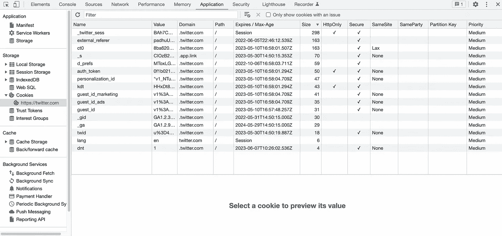
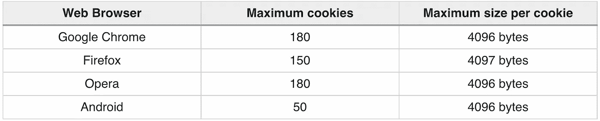
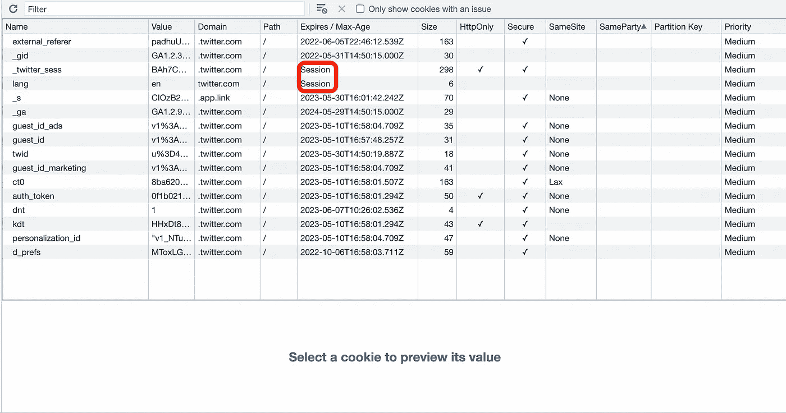

# 关于 HTTP Cookies 的 5 个常见面试问题

> 原文：<https://levelup.gitconnected.com/5-common-interview-questions-about-http-cookies-82ec64803f9c>

## 以及如何恰当地回答它们


图片来自[沃尔黑文](https://wallhaven.cc/w/43vrz3)

一个 web 开发人员应该对浏览器有一个全面的了解，其中一个最基本的概念就是 cookies。

从初创公司到科技巨头，关于 cookies 的问题是科技面试中常见的问题。这篇文章将解释 5 个关于 cookies 的问题，你必须能够准确地回答这些问题才能在面试中胜出。😎

# 1.Cookies 的使用场景有哪些？

这是一个基本问题，用来测试受访者是否有一些使用 cookies 的基本经验。

当 Netscape 在 1994 年发明 cookies 时，它的最初目的是在浏览器中存储一些信息，这些信息可能没有必要或很难存储在服务器上。

比如，一个网站要求用户在做某件事之前登录是很正常的。但是用户可能会频繁地登录和退出，因此将所有用户状态数据保存在数据库中可能效率不高，也没有必要。那么，如果没有服务器端记录，如何识别用户的登录状态呢？

答案是使用 cookies。事实上，这是几乎所有网站的常用方法。

只要你允许浏览器上有 cookies，你就不需要每次打开一个网站都登录，比如 Twitter、脸书和 Medium，它会在一定时期内保持你的登录状态。这种便利的诀窍在于使用 cookies。因为每个 HTTP 请求都会包含保存在浏览器中的相关 cookie，所以服务器可以根据 cookie 识别用户的状态。

总之，cookies 是用来在浏览器上存储临时信息的，不需要持久保存在服务器上。cookies 的一些常见用法包括:

*   会话管理(保持用户登录一段时间)
*   存储用户的自定义设置，如语言、主题等。
*   跟踪用户活动以提供广告或推荐算法

# 2.Cookies 包含哪些信息？

为了让一切都清楚，让我们来看看 Twitter 的 cookies:



Twitter 的 cookies 截图

如上所示，cookies 使用了一种键值样式的存储。一行代表一个 cookie 的信息，比如名称、值、域等等。没有必要在采访中描述一切，因为每个人都可以在浏览器上查看，很多栏目都非常清楚易懂。但是有两个关键属性你需要提一下:

*   属性指示浏览器只通过 HTTPS 发送 cookies。它使数据传输更加安全。
*   `HttpOnly`属性指示浏览器不要通过 HTTP(或 HTTPS)请求以外的渠道公开 cookies。它可以防止恶意脚本窃取带有敏感数据的 cookies。

# 3.如何设置 Cookie？

设置 cookie 是服务器端的工作。例如，用户登录的整个过程如下所示:

1.  浏览器向服务器发送 HTTP 请求，请求用户登录。
2.  确认用户名和密码后，服务器创建一个 cookie，并向浏览器发送一个包含 cookie 的 HTTP 响应。
3.  收到 cookie 后，只要它没有过期，来自同一个浏览器会话的每个后续 HTTP 请求都将包含同一个 cookie。因此，服务器可以通过 cookie 识别用户是否已经登录。

无论您使用哪种后端编程语言，您所需要做的就是给相应的 HTTP 响应一些`Set-Cookie`属性:

```
**HTTP**/1.0 200 **OK**
Content-type: text/html
Set-Cookie: lang=en
Set-Cookie: sessionToken=abc123; Expires=Sun, 07 Jul 2077 10:10:10 GMT
...
```

# 4.饼干的极限是什么？

cookies 的一个明显缺点是大小的限制。如下表所示，不同的浏览器可能有不同的限制:



来自[教程点](https://www.tutorialspoint.com/What-is-the-maximum-size-of-a-web-browser-s-cookies-value)的表格

由于 cookies 的局限性，现代浏览器引入了`localStorage`和`sessionStorage`功能来存储更大的文件。

# 5.Cookies 存储在哪里？

同样，不同的浏览器对此可能有不同的机制。

通常，现代浏览器使用 SQLite 数据库将 cookies 存储在磁盘上。但是有些 cookie，即所谓的会话 cookie，由于太过临时而无法存储在磁盘上。

正如下面 Twitter 的 cookies 截图，session cookies 的`Expires/Max-Age`属性就是`Session`。这意味着它们没有过期时间，所以它们存储在内存中，而不是磁盘中。当浏览器关闭时，会话 cookies 会立即被丢弃。



Twitter 的 cookies 截图

# 关键要点

正确处理 cookies 是 web 开发人员的必备技能。这就是为什么相关问题在科技面试中如此受欢迎。要在面试中胜出，你需要知道以下要点:

*   Cookies 用于在浏览器上存储临时信息。
*   Cookies 保存为键值样式。有些属性对数据安全很重要。
*   设置 cookie 是服务器端程序的工作。
*   由于其局限性，Cookies 不适合于大数据/文件存储。
*   cookie 保存在磁盘上，但会话 cookie 只是临时保存在内存中。

***感谢阅读。如果你喜欢，请关注***[***me***](https://yangzhou1993.medium.com/follow)***，成为*** [***中等会员***](https://yangzhou1993.medium.com/membership) ***欣赏更多精彩文章*** 🙂