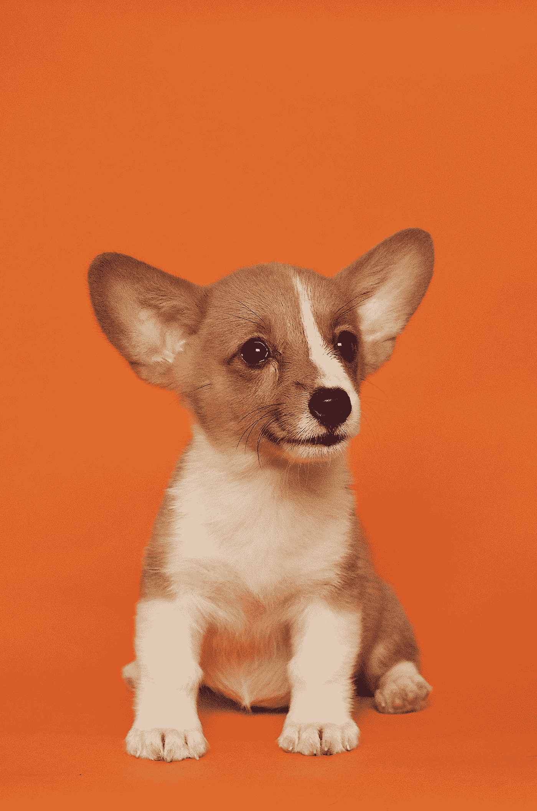

# 使用拥抱脸在一行代码中执行 5 个复杂的 ML 任务

> 原文：<https://levelup.gitconnected.com/5-complex-ml-tasks-performed-in-a-single-line-of-code-using-hugging-face-39a5e735ca44>

# 什么是抱脸？

它是一个平台，为开发人员提供广泛的数据集和最先进的模型，由机器学习中的参考开源提供支持。

[*抱脸*](https://huggingface.co/) 为我们提供了名为`pipelines`的对象，将大部分复杂的代码抽象成简单易用的 API。

[](https://huggingface.co/docs/transformers/main_classes/pipelines) [## 管道

### 管道是使用模型进行推理的一种伟大而简单的方式。这些管道是抽象大部分…

huggingface.co](https://huggingface.co/docs/transformers/main_classes/pipelines) 

首先，安装`pipeline`和标记器`sentencepiece`，如下所示:

```
pip install transformers[sentencepiece]
```

将其导入到您的项目中，如下所示:

```
from transformers import pipeline
```

太好了！

让我们学习如何使用它来使这 5 个复杂的 ML 任务变得简单！

# 语言翻译

让我们使用`Helsinki-NLP/opus-mt-en-hi`模型将英语翻译成印地语。

```
hindi_translator_model ="Helsinki-NLP/opus-mt-en-hi"translator = pipeline("translation", model=hindi_translator_model)
```

在上面的步骤中，我们实例化了语言翻译的管道。

```
translator("Stairway to Heaven")#Output: 
[{'translation_text': 'स्वर्ग की ओर सीढ़ी'}]
```

轻松点。

有数百种语言模型可以轻松地将所有流行语言翻译成其他语言。

# 情感分析

让我们将情感分析模型实例化如下:

```
sent_analyser = pipeline(“sentiment-analysis”)
```

我们的用法如下:

```
sent_analysis(“The food tasted amazing! What a lovely day!”)#Output:
[{'label': '**POSITIVE**', 'score': **0.9998866319656372**}]
```

分数表明了模型对其预测的信心程度。

# 语音识别

让我们实例化该模型，然后如下使用它:

```
speech_recog = pipeline(“automatic-speech-recognition”)speech_recog("location_of_audio_file/audio.mp4")#Output:
{'text': 'THESE HUGGING FACE MODELS WORK VERY WELL'}
```

管道使用了`facebook/wav2vec2-base-960h`模型，它给出了准确的结果！

# 图像分类

名为`google/vit-base-patch16–224`的图像分类默认模型可以实例化如下:

```
image_classifier = pipeline(“image-classification”)
```

让我们使用来自 *Unsplash* 的图像从模型中获得分类结果。



照片由 [Alvan Nee](https://unsplash.com/@alvannee?utm_source=medium&utm_medium=referral) 在 [Unsplash](https://unsplash.com?utm_source=medium&utm_medium=referral) 上拍摄

```
imageClassifier("https://images.unsplash.com/photo-1537151625747-768eb6cf92b2?ixlib=rb-4.0.3&ixid=MnwxMjA3fDB8MHxwaG90by1wYWdlfHx8fGVufDB8fHx8&auto=format&fit=crop&w=2568&q=80")#Output:[{'score': 0.36904239654541016, 'label': '**Pembroke, Pembroke Welsh corgi**'},  {'score': 0.2694929838180542, 'label': 'Cardigan, Cardigan Welsh corgi'},  {'score': 0.26063746213912964, 'label': 'Chihuahua'},  {'score': 0.04186752066016197, 'label': 'toy terrier'},  {'score': 0.015168835408985615, 'label': 'basenji'}]
```

看看这些结果有多准确！

# 视觉问答

这个很有意思！

实例化的模型将查看模型，然后回答我们所有的问题。

```
qa_model = pipeline(“visual-question-answering”)
```

让我们看一看下面的图片，看看它在我们的查询中表现如何！


照片由 [Alexander Redl](https://unsplash.com/@alexanderredl?utm_source=medium&utm_medium=referral) 在 [Unsplash](https://unsplash.com?utm_source=medium&utm_medium=referral) 上拍摄

```
image = “location_of_photo/photo.jpg”query = “**Who is in the photo?**”qa_model(image, query)
```

输出如下:

```
[{'score': **0.9391912221908569**, 'answer': '**man**'},  {'score': 0.2655457854270935, 'answer': 'skateboarder'},  {'score': 0.055595751851797104, 'answer': 'boy'},  {'score': 0.053267233073711395, 'answer': 'person'},  {'score': 0.014302995055913925, 'answer': 'yes'}]
```

难以置信！

看看下面的拥抱脸管道中其他有趣的模型，包括图像到文本，摘要，文本生成模型，等等！

[](https://huggingface.co/docs/transformers/main_classes/pipelines) [## 管道

### 管道是使用模型进行推理的一种伟大而简单的方式。这些管道是抽象大部分…

huggingface.co](https://huggingface.co/docs/transformers/main_classes/pipelines) 

*本文到此结束！感谢阅读！*

[](https://bamania-ashish.medium.com/membership) [## 通过我的推荐链接加入 Medium-Ashish Bama nia 博士

### 阅读 Ashish Bamania 博士(以及 Medium 上成千上万的其他作家)的每一个故事。您的会员费直接…

bamania-ashish.medium.com](https://bamania-ashish.medium.com/membership)