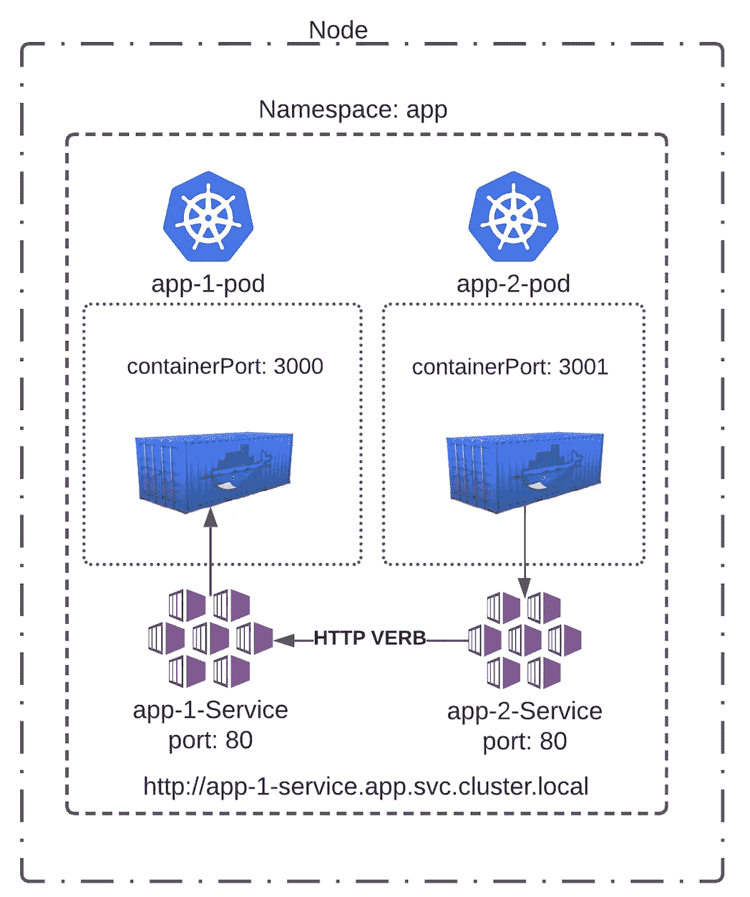

# 你需要知道的 Kubernetes 的 5 个组成部分

> 原文：<https://levelup.gitconnected.com/5-components-of-kubernetes-you-need-to-know-dbedc81641f7>

> *加入 Meetup.com 上的 AWSMeetupGroup:* [https://www.meetup.com/AWSMeetupGroup](https://www.meetup.com/AWSMeetupGroup/)

在设置 K8s 集群之前，理解 Kubernetes (K8s)的一些基本组件和概念至关重要。本指南分解了 Kubernetes 的 5 个关键组件，帮助您为部署第一个集群做好准备。


# **什么是 Kubernetes？**

首先，我们需要定义什么是 Kubernetes。Kubernetes 是一个可移植的开源平台，用于管理和编排容器化的工作负载。Kubernetes 的意思是舵手或领航员。

这意味着，如果您有一个微服务应用程序，其中有许多 Docker 容器运行多个服务和工作负载，随着应用程序的增长，管理起来会变得很困难。Kubernetes 通过提供一种管理所有容器的方法来帮助解决这个问题。因此，有了 K8s，您仍然可以使用 Docker，但不是管理正确的端口、服务之间的连接，以及确保可能有数百个服务的一切工作正常，您可以让 Kubernetes 承担负载并为您处理。

# **节点**:

节点可以是安装 Kubernetes 的物理机或虚拟机。每个节点都由控制平面(管理容器生命周期的编排层)管理，并包含运行 pod 所需的服务，然后 pod 运行容器。

# **吊舱:**

Pod 是一组容器，它们共享相同的存储、网络、资源以及如何执行容器的指令。pod 存在于节点中，节点是更高级别的组件。


如果在同一个 Pod 上运行多个容器，这些容器将通过 localhost 进行通信。这是由于 Pod 的共享上下文，它是一组 Linux 名称空间和组。就 Docker 概念而言，Pod 类似于一组具有共享名称空间和共享文件系统卷的 Docker 容器。

# **集群:**

简单地说，集群是一组节点，它们一起运行来承载您的容器化工作负载。如果你使用 AWS，它可以是一队 EC2 实例，或者是裸机上的一群 Raspberry Pis。

集群的挑战部分是集群管理。维护用于托管应用程序的活动节点和就绪节点。最近，我在一群树莓上创建了一个 Kubernetes 集群。建立自己的本地网络并正确安装和配置 Kubernetes 有许多挑战。当您使用云提供商时，所有这些挑战都会迎刃而解。

# **名称空间**:

我们刚刚谈到 Kubernetes 中的集群，它是一组一起运行的节点，用来托管您的工作负载。名称空间没有太大的不同。

名称空间是 Kubernetes 集群内部的一个虚拟集群。名称空间是在多个应用程序或用户之间划分集群资源的一种方式。您可以为应用程序创建多个自定义命名空间，也可以使用默认命名空间。名称空间不能相互嵌套，每个 Kubernetes 资源只能位于一个名称空间中。


# **服务**:

服务是公开在一组 pod 上运行的应用程序的一种方式。服务是 Kubernetes 网络的核心。

Kubernetes 会自动为您的 pod 分配一个 IP 地址。比方说，您有一个在端口 3000 上运行的带有容器的 pod。Kubernetes 将为您的 Pod 分配一个 IP 地址(10.0.0.1)。现在，您可以通过转到 10.0.0.1:3000 连接到容器。这很好，但是如果你的 Pod 改变了，这个 IP 地址也会改变。我们如何解决这个问题？

服务还将分配一个单一的 DNS 名称，该名称不会因一组 pod 而改变，并将在它们之间起到负载平衡的作用。默认情况下，服务的 DNS 名称将遵循以下模式:

```
http://<Service Name>.<Namespace>.svc.cluster.local
```

您可能想知道为什么在这个 Url 中没有定义端口，这是如何工作的。

下面是一个服务的代码片段:


该服务有两个端口。一个名为“port ”,监听端口 80；另一个名为“targetPort ”,监听端口 3000。“port”字段是服务在 Kubernetes 内部监听的内部端口。这就是为什么上面的域名不需要在末尾定义端口的原因。HTTP 侦听端口 80。

```
http://<Service Name>.<Namespace>.svc.cluster.local
```

现在来看看使用上述服务的 Pod 的代码片段:


如果您查看这段代码，您会看到我们有一个名为“containerPort”的端口，它正在侦听端口 3000。从上面可以看到服务上的“targetPort ”,您会看到它们都与端口 3000 对齐。这与 Kubernetes DNS 解析的工作方式有关。回到顶部，我们有“端口:80”，我们说过这是一个在 Kubernetes 内部开放的端口，“应用服务”正在侦听它。现在，服务能够处理对多个 pod 的请求(概述:pod 包含容器)。

因此，如果我有一个应用程序需要与另一个应用程序通信，或者如果我有一个来自公共互联网的外部请求，它会通过端口 80 上的服务路由到端口 3000，再到我的容器，并通过代码块“targetPort: 3000”。

从外部用户到端口 3000 上运行的容器进入集群的流量示例。


用户点击端点“app-1-load balancer-1234567890 . us-west-2 . elb . amazonaws . com”，该端点解析为服务，然后是 Pod，最后是端口 3000 上的容器。

下面是一个通过服务进行点对点通信的示例:



这个图表汇集了你需要了解的 Kubernetes 的 5 个组成部分。我们有一个包含 1 个节点的群集，在命名空间“app”中有 2 个单元。每个单元有一个容器。一个容器监听端口 3000，另一个监听端口 3001。然后我们有两个服务在端口 80 监听。

在图中，“app-2”正在向“app-1”发出 HTTP 请求。此流量通过端点为“http://app-1-Service . app . SVC . cluster . local”的服务进行路由。该服务解析为“targetPort: 3000 ”,并将流量从“app-2”路由到端口为 3000 的“app-1”。

# **总结**:

Kubernetes 是一个野兽，需要相当长的时间来学习的互通。如果你学到了什么，请按拍手按钮！

**Kubernetes** 树莓 Pis 上的集群:[https://awsmeetupgroup . medium . com/build-a-Kubernetes-Cluster-on-Raspberry-Pis-e 65 E1 e 49634 e](https://awsmeetupgroup.medium.com/build-a-kubernetes-cluster-on-raspberry-pis-e65e1e49634e)

**订阅**AWSMeetupGroup YouTube 频道:[https://www.youtube.com/channel/UCG3Si_vP2tijvvyE5xr7lbg](https://www.youtube.com/channel/UCG3Si_vP2tijvvyE5xr7lbg)