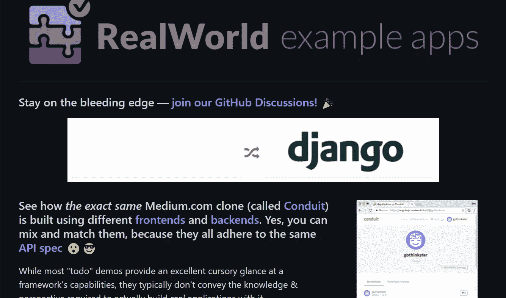
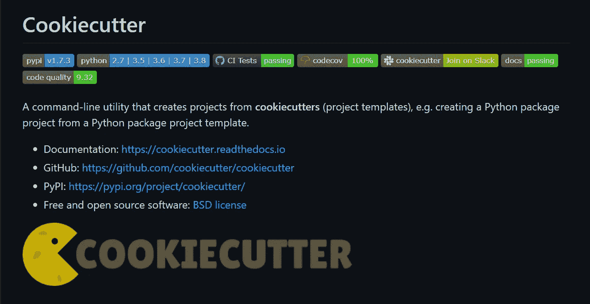
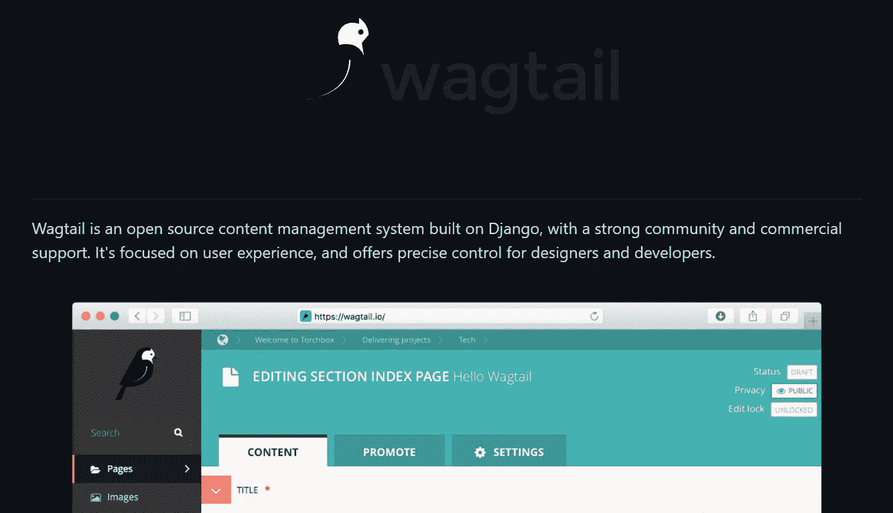
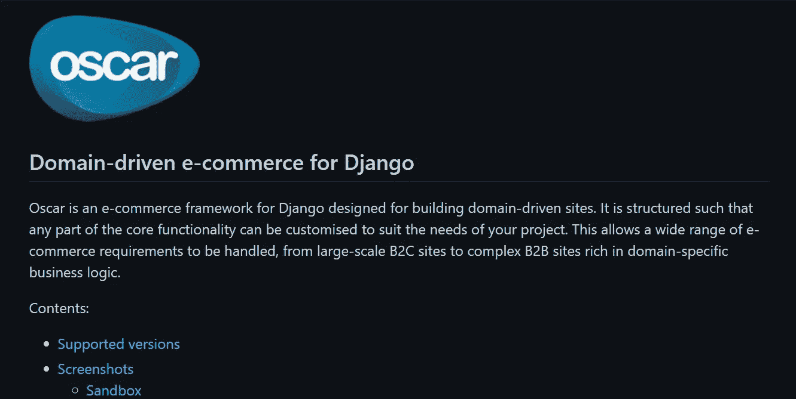
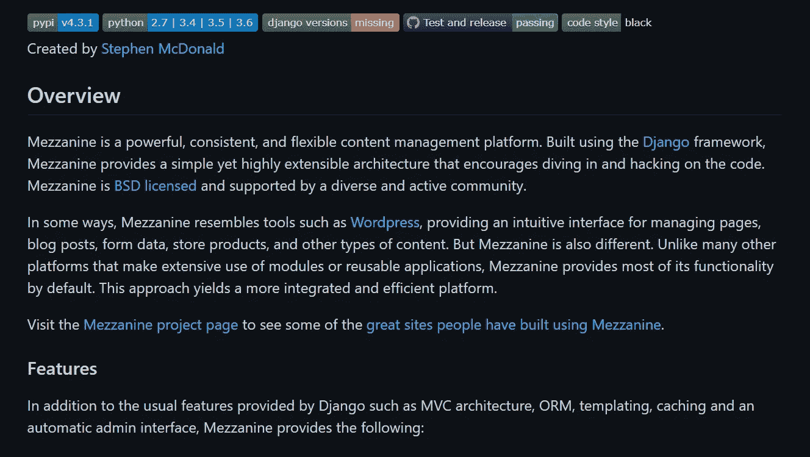

# 每个 Python 开发人员都必须知道的 5 个很酷的开源 Django 项目

> 原文：<https://levelup.gitconnected.com/5-cool-open-source-django-projects-every-python-developer-must-know-about-492d7e9633b2>

## 关于 Python 最流行的 web 开发框架的一切。

照片由[西格蒙德](https://unsplash.com/@sigmund?utm_source=unsplash&utm_medium=referral&utm_content=creditCopyText)在 [Unsplash](https://unsplash.com/s/photos/programmers?utm_source=unsplash&utm_medium=referral&utm_content=creditCopyText) 上拍摄

在过去的几年中，程序员和组织开发的编程语言和框架的数量有所增加。

谷歌开发了*围棋*。脸书开发了 *React* (JS 库)。微软开发了 *TypeScript* 。然而，在过去的几年中，非常流行的编程语言不是别人，正是 Python。

嗯，Python 编程语言并不新鲜。其实它其实比 Java 还要老。在 1991 年第一次发布后，它经历了几年的变化，但今天仍然用于相同的目的。

> “编写 Python 代码的乐趣应该在于看到短小、简洁、易读的类，这些类用少量清晰的代码表达了大量的动作，而不是大量让读者厌烦得要死的琐碎代码。”— *吉多·范·罗苏姆，Python 的创造者*

用于 web 开发的 *Django 框架*的使用增加促进了 Python 的增长，但它最终是理想的风暴——只是适量的开发者和官方支持，以及需求。

事实上，自 2006 年以来，Python 一直得到世界上最大的科技公司谷歌的支持。以至于他们有一个专门针对 Python 的[开发者页面，提供免费培训，包括练习、演讲视频等等。](https://developers.google.com/edu/python/)

我在我的应用程序中使用 Python 已经有一段时间了，我被它的简单性所吸引，但它足够强大，几乎可以做任何事情。在研究的时候，我在 GitHub 上发现了这些很酷的开发者开源 Django 项目。

# 真实世界示例应用程序

*回购环节:***[***https://github.com/gothinkster/realworld***](https://github.com/gothinkster/realworld)
*明星:****60.2k*** *分叉:* ***5.5k*****

**Django RealWorld 应用程序是一个名为“Conduit”的中型克隆，允许用户发布文章，通过标签组织文章，喜欢它们，并关注其他用户。该项目使用 JSON Web 令牌对用户进行身份验证，包含大量 CRUD 操作，并具有内置分页功能。**

# **烹饪刀具**

****

***回购环节:**[***https://github.com/cookiecutter/cookiecutter***](https://github.com/cookiecutter/cookiecutter)
*明星:****15.3k*** *分叉:* ***1.5k******

***Cookiecutter Django 旨在帮助您快速启动下一个 Django 项目。众多的软件包，例如用于社交认证的[*django-alluth*](https://www.intenct.nl/projects/django-allauth/)、用于电子邮件集成的 [*anymail*](https://anymail.readthedocs.io/en/stable/) 、通过亚马逊 S3 的媒体存储、定制用户模型，包括几个额外的优化，都已经就绪，可以帮助您开始使用。README 页面还提供了扩展项目的有用资源以及官方文档的链接，这些文档非常全面，包括许多部署选择。***

# ***鹞鹰***

******

****回购环节:**[***https://github.com/wagtail/wagtail***](https://github.com/wagtail/wagtail)
*明星:****11k*** *分叉:* ***2.3k*******

****Wagtail 是一个使用 Django 构建的内容管理系统。它有一个流线型的设计，被谷歌、Mozilla 和麻省理工学院使用。与这个列表中的其他项目相比，GitHub repo 上有更多最近的提交，并且每 3 个月发布一次。****

# ****奥斯卡金像奖****

********

*****回购环节:**[***https://github.com/django-oscar/django-oscar***](https://github.com/django-oscar/django-oscar)
*明星:****5.1k*** *分叉:* ***1.9k********

****Django Oscar 是 Django 的电子商务框架。只需从 GitHub 克隆该项目，并开始使用可配置的产品、定价、运输和许多其他功能定制您自己的电子商务网站。该文档内容全面，包含了一系列有用的信息，从如何为您的产品目录建模的建议，到团队的具体设计决策，例如实现抽象模型以尽可能定制 Django Oscar。****

# ****中层楼****

********

*****回购环节:**[***https://github.com/stephenmcd/mezzanine***](https://github.com/stephenmcd/mezzanine)
*明星:****4.3k*** *分叉:* ***1.5k********

****Mezzamine 是另一个基于 Django 的内容管理系统。用户可以使用类似 WordPress 的管理面板来处理博客文章、表单数据和各种网页。预定出版、[所见即所得](https://en.wikipedia.org/wiki/WYSIWYG)编辑、在 Disqus 和内置评论系统之间的选择，以及谷歌分析集成都是内置功能。****

****Python 是最流行的编程语言之一，被谷歌、优步、亚马逊、Reddit、网飞和其他一些组织使用。由于其更容易的学习曲线、大量的库集合、高可伸缩性和框架，包括快速开发和开发者友好性，已经被证明是企业接受它的令人信服的理由。****

****我希望您会发现这些 Django 资源库很有用，并加以利用。我相信你也可能遇到过其他一些不可思议的仓库。****

****如果你喜欢读这篇文章，你可能也会发现下面的文章值得你花时间去读。****

**** [## 每个软件开发人员都必须知道的设计模式

### 这些久经考验的解决方案提高了编程效率。

python .平原英语. io](https://python.plainenglish.io/design-patterns-that-every-software-developer-must-know-ac71f575e68)  [## Linux 30 岁了——这里有 16 个事实让 Linux 成为有史以来最重要的操作系统

### 今天，Linux 驱动了一切，包括智能手机、股票市场、潜水艇、电影《VFX》等等…

levelup.gitconnected.com](/linux-turns-30-here-are-16-facts-that-make-linux-the-most-important-os-ever-created-5c854455d06c) 

*如果你喜欢阅读有助于你更好地学习、生活和工作的故事，可以考虑* [*成为订阅者*](https://viveknaskar.medium.com/subscribe) *。成为会员后，你可以无限制地阅读 10000 篇故事、文章和作家。每月只要 5 美元。如果你用我的链接* *注册，我会赚一点佣金，帮助我写更多的文章。*****