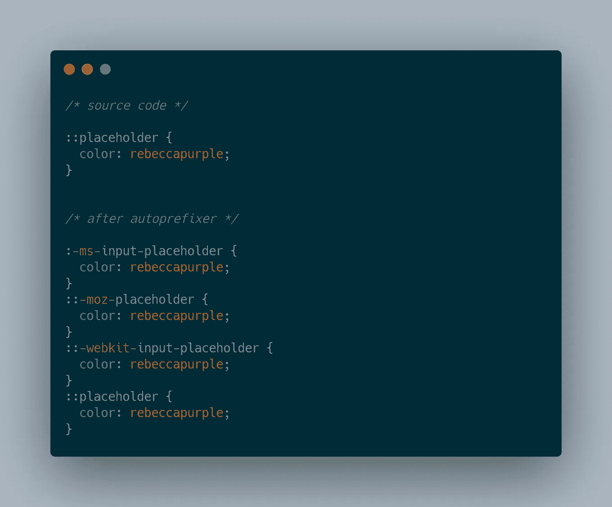

# 2021 年你应该知道的 5 个 CSS 构建工具

> 原文：<https://levelup.gitconnected.com/5-css-build-tools-that-you-should-know-in-2021-d662ab4ffebd>

## 以下是 2020 年 CSS 调查中提到的 CSS 构建工具列表

由 [Unsplash](https://unsplash.com/s/photos/tool?utm_source=unsplash&utm_medium=referral&utm_content=creditCopyText) 上的 [iMattSmart](https://unsplash.com/@imattsmart?utm_source=unsplash&utm_medium=referral&utm_content=creditCopyText) 拍摄的照片

前端开发发展迅速。随之而来的是，CSS 变得越来越有趣。诸如逻辑属性、内容可见性之类的新特性最近已经进入了 CSS。

[CSS 2020 现状调查](https://2020.stateofcss.com/en-US/other-tools/)列出了一些开发人员了解并经常使用的工具。根据调查结果，让我们花点时间列出一些您可能知道的工具。

# Stylelint

 [## stylelint/stylelint

### 一个强大的，现代的棉绒，帮助你避免错误，并加强你的风格公约。

github.com](https://github.com/stylelint/stylelint) 

Stylelint 是一个 CSS linter，有超过 170 个内置规则来捕捉错误、应用限制和强制执行样式约定。它允许您以一致且维护良好的风格与您的团队一起编码。

一个值得一提的配置是[stylelint-config-rational-order](https://github.com/constverum/stylelint-config-rational-order)，它演示了 stylelint 可以做什么。有了这个配置，您可以强制 CSS 中的属性顺序:

1.  配置
2.  箱式模型
3.  排印
4.  视觉的
5.  动画
6.  混杂的

# 较美丽

 [## 更漂亮/更漂亮

### JSX JSON CSS SCSS Less HTML Vue Angular graph QL Markdown YAML 你的…

github.com](https://github.com/prettier/prettier) 

使用构建工具格式化您的代码非常有用，因为无论是单独工作还是在团队中工作，您都可以在整个项目中保持一致的风格。漂亮是最流行的代码格式化程序。它通常与 Javascript 和 Typescript 一起使用，但也可以与 CSS 和 Sass 一起使用。

你可以设置更漂亮的 git 钩子来工作。当您将代码推送到存储库时，它会格式化您的代码。因此，当您审查来自拉请求的代码时，您可以保证没有与代码格式相关的错误。

如果你使用的是上面提到的 Stylelint，你可以停用格式规则，让 pretty 用 pretty 插件[Stylelint-pretty](https://github.com/prettier/stylelint-prettier)来处理这个部分。

# 采购

 [## 全人类/purgecss

### 当你在建立一个网站的时候，你可能会使用一个 CSS 框架，比如 Bootstrap，Materializecss…

github.com](https://github.com/FullHuman/purgecss) 

当你在建立一个网站时，你可能会决定使用一个 CSS 框架，如 TailwindCSS、Bootstrap、MaterializeCSS、Foundation 等。…但是你将只使用框架的一小部分，并且将包括许多未使用的 CSS 样式。

一种优化是删除不使用的 CSS。你可以通过 Chrome 开发者工具检查 CSS 的未使用字节。修剪你的 CSS 将使你的网站加载更快，因为浏览器将要求更少的代码，更少的 CSS 将被解析。

PurgeCSS 是一个移除未使用 CSS 的构建工具。它的工作原理是分析我们网站的内容，并将其与您的 CSS 进行比较。

# 自动预混合器

 [## post CSS/自动前缀

### 通过我可以使用- postcss/autoprefixer 来解析 CSS 并将供应商前缀添加到规则中吗

github.com](https://github.com/postcss/autoprefixer) 

如果您使用 vue-cli 或 create-react-app 工具引导您的项目，autoprefixer 将已经包含在您的项目中。下面的例子很好地展示了 autoprefixer 解决的问题。

在 CSS 中，选择器和属性通常需要一个供应商前缀才能在另一个浏览器中工作*。*在上面的例子中，`*:ms-input-placeholder*`用于 ie 浏览器，而`*::-moz-placeholder*` 用于 Firefox *。*

# cssnano

 [## cssnano/cssnano

### 一个模块化的迷你化器，建立在 PostCSS 生态系统之上。cssnano 是一个现代的、模块化的压缩工具，编写于…

github.com](https://github.com/cssnano/cssnano) 

缩减代码是一种常见的做法。您希望最大限度地减少发送给客户端的代码量，并且没有必要在代码中给编译器留空白。这个练习是在 Javascript 中使用 terser 完成的。

在 CSS 中，你会发现 cssnano，它被描述为一个模块化的迷你化器，构建在 PostCSS 生态系统之上。它不仅仅是去除空白，还有很多特性。

可以将其配置为丢弃重复的规则、空规则和注释。它会将颜色值转换为最节省空间的格式。白色在 CSS 中可以定义为`white`、`#ffffff`、`rgb(255, 255, 255)`，cssnano 会将其转换为`#fff`。

上面列出的工具允许您对 CSS 代码进行 lint、格式化、修改和精简，以改进您的代码和提供给用户的代码。如果您正在寻找 CSS 调查报告中提到的关于 CSS 布局特性的资源，请阅读下面的文章:

 [## CSS 2020 的状态:布局资源

### 学习 CSS 新特性的资源集合

medium.com](https://medium.com/full-human/state-of-css-2020-layout-resources-67d398f1def2)