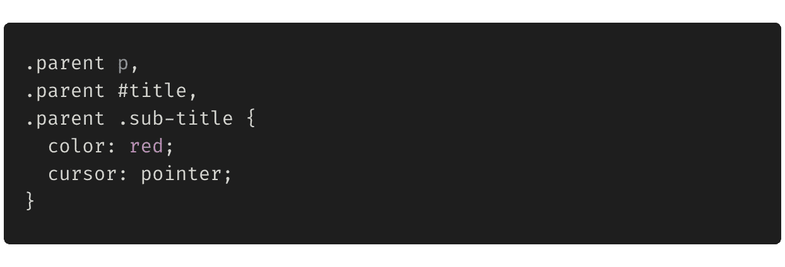
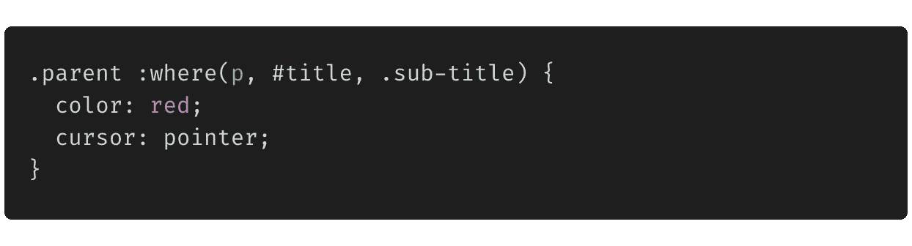
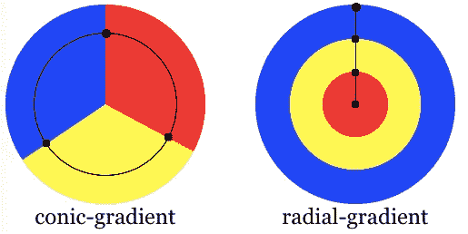
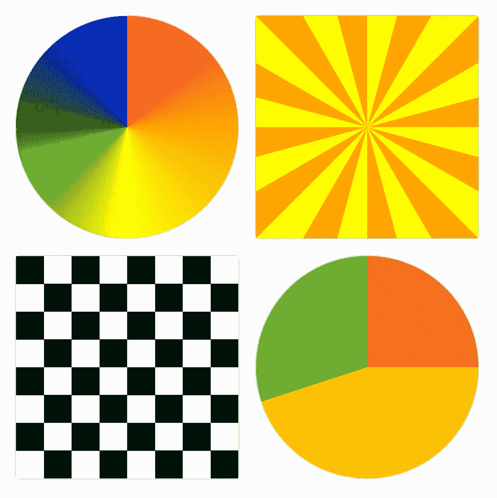
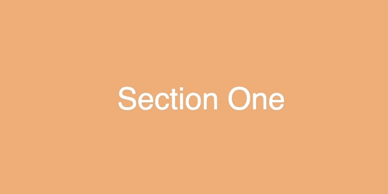
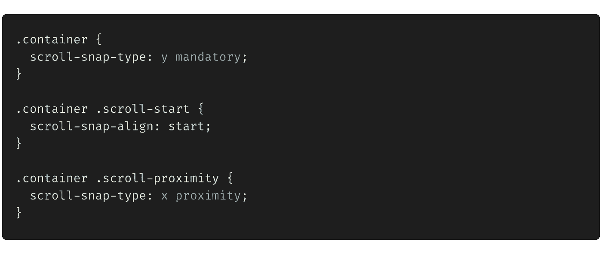
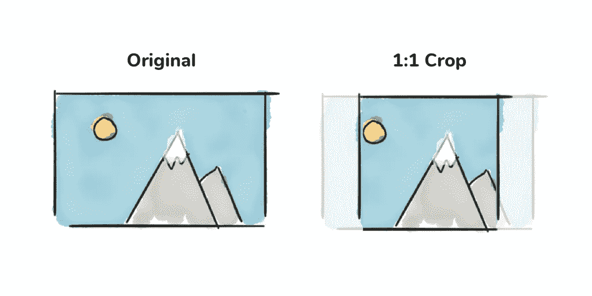
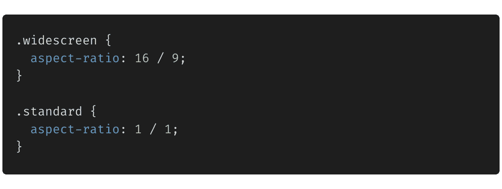
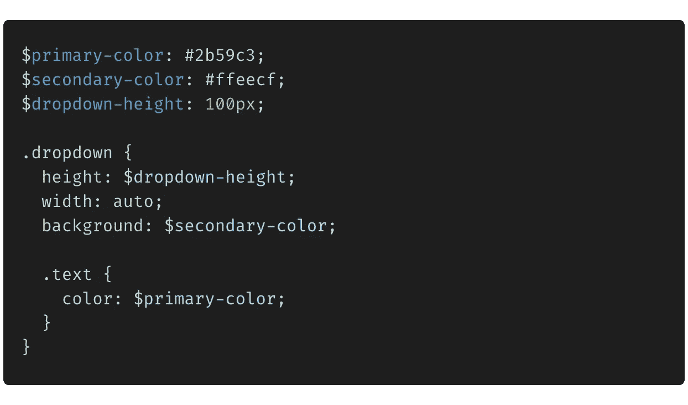
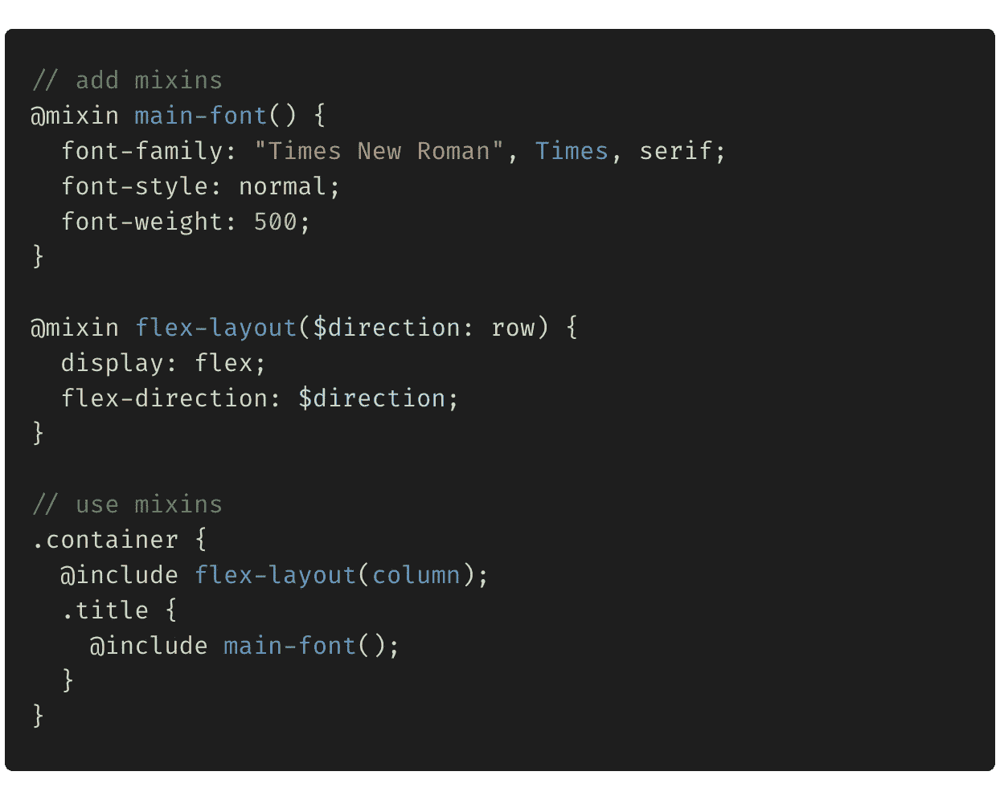

# 2021 年你不想错过的 5 个 CSS 技巧和窍门

> 原文：<https://levelup.gitconnected.com/5-css-tips-and-tricks-you-dont-want-to-miss-out-on-in-2021-4eb1438dee50>

照片由 [Ales Nesetril](https://unsplash.com/@alesnesetril?utm_source=medium&utm_medium=referral) 在 [Unsplash](https://unsplash.com?utm_source=medium&utm_medium=referral) 上拍摄

在谈论 2021 年的 CSS 趋势之前，让我带你回到 1994 年，那时网络开始被用作电子出版的平台。然而，发布平台缺少了一个重要的部分:无法对文档进行样式化。

与欧洲核子研究中心的[蒂姆·伯纳斯·李](https://en.wikipedia.org/wiki/Tim_Berners-Lee)(HTML 之父)一起工作的 hkon Wium Lie 看到了 Web 对样式表语言的需求，于是 CSS 诞生了！

我们已经走了很长的路，我们可以在 2021 年用 CSS 做杰出的事情。我整理了一个小的概念列表，我认为这些概念对更好地理解和编写 CSS 是有趣和有用的。我希望你会喜欢它。

# 1):where()pseudo-class 函数

当您想要对多个元素应用相同的样式时，您的 CSS 可能如下所示:

如果你对我说，这看起来不太可读！这就是`:where()`伪类函数的用处。

> `:where()` CSS 伪类函数将一个选择器列表作为它的参数，并选择列表中任何一个选择器可以选择的元素。

上述示例的等效 CSS 如下所示:

对`:where()`说好，对清洗 CSS 说好！

# 2)圆锥梯度

图片参考:developer.mozilla.org

CSS 渐变允许您显示两种或多种指定颜色之间的平滑过渡。

虽然大多数人已经知道了[线性渐变](https://www.w3schools.com/css/css3_gradients.asp)和[径向渐变](https://www.w3schools.com/css/css3_gradients_radial.asp)，但我们还是来谈谈新的[锥形渐变](https://developer.mozilla.org/en-US/docs/Web/CSS/conic-gradient())。

使用`conic-gradient()` CSS 函数可以实现锥形渐变。

> `***conic-gradient()***` CSS 函数创建一个由渐变组成的图像，颜色过渡围绕一个中心点旋转(而不是从中心辐射)。圆锥形渐变的例子包括饼图和色轮。

考虑下面的例子:

上述 CSS 的输出如下所示:

是不是很酷？我们可以只用一个 CSS 属性创建一个完整的棋盘。

完整的例子可以在[这里](https://codepen.io/satyam-dev/pen/KKaJzEp)找到。

# 3)滚动捕捉

还记得《复仇者联盟:无限战争》中的灭霸快照吗？这是史诗，对不对？

但是等等，我有更好的东西:

> 滚动捕捉允许您在滚动完成后，将滚动视口的边界定义和限制到特定位置或元素。

当你想把用户的注意力吸引到你网站的某些部分时，这是非常有用的。此外，它还可以帮助您创建很酷的滚动过渡。

点击 了解更多滚动捕捉

# *4)设置纵横比*

**

*谁不喜欢响应式设计呢！但是当你想让你的元素以特定的比例调整大小时，就变得非常棘手了，也就是说，宽度和高度应该以特定的比例增长和收缩。*

> *长宽比是宽度和高度的比例关系(一般表示为`width:height`)。*

*在 2021 年 1 月之前，保持长宽比相当具有挑战性。我们使用添加一个父容器和一个绝对放置的子容器。然后，可以计算纵横比的百分比，并将其设置为`padding-top`。例如:*

*   ***16:9** 纵横比= 9 / 16 = 0.5625 = `padding-top: 56.25%`*
*   ***1:1** 纵横比= 1 / 1 = 1 = `padding-top: 100%`*

*但是有了新的`aspect-ratio` [属性](https://developer.mozilla.org/en-US/docs/Web/CSS/aspect-ratio)，设置宽高比简直是天赐之福！*

**

# *5) Scss 变量和混合*

*虽然 Scss 变量和 mixins 并不新鲜，但它仍然是编写优雅的结构化 css 的最佳方式。*

*假设您有一个大型项目，到处都有很多样式，您的客户为您的应用程序提出了一个新的主题。在代码库中手动搜索和替换样式值将是一场噩梦。*

*通过定义定制的数据容器，通常被称为**变量**，你可以让你的生活变得更加容易！*

> *把**变量**看作是存储信息的一种方式，您希望在整个样式表中重用这些信息。您可以存储颜色、字体堆栈或任何您认为想要重用的 CSS 值。Scss 使用`$`符号使某物成为变量。*

**

*虽然变量用于存储一条信息，但是 mixins 可以用于存储多条信息。*

> *一个 **mixin** 允许你创建你想要在你的站点中重用的 CSS 声明组。您甚至可以传入值，使您的 mixin 更加灵活。*

**

*谢谢你花时间滚动到最后😊*

*关注我，了解更多精彩内容。我们连线一下——[Twitter](https://twitter.com/satyam_saluja)、 [LinkedIn](https://www.linkedin.com/in/satyam04/) ，或者 [Github](https://github.com/satyam-dev)*

# *参考资料:*

* [## MDN Web 文档

### 在 hacks.mozilla.org 阅读更多我们很高兴地宣布，Pyodide 已成为一个独立的和社区驱动的…

developer.mozilla.org](https://developer.mozilla.org/en-US/)  [## W3Schools 在线网络教程

### HTML 教程这是一个标题，这是一个段落。亲身体验身体{ background-color:浅蓝色；} h1 { color…

www.w3schools.com](https://www.w3schools.com/) 

## 查看我最近的其他文章:

 [## Web Vitals——提高 web 应用性能的 4 种方法

### 你有一个高性能的网络应用程序，是吗？如果我可以问的话，有多好？您拥有的衡量标准是什么…

levelup.gitconnected.com](/web-vitals-4-ways-to-make-your-web-apps-more-performant-9439906d1159)  [## 使用 CSS 居中 div 的 5 种方法。

### 让我告诉你一个叫钱德的家伙。钱德勒是一名优秀的程序员。他以前写的干净解耦…

levelup.gitconnected.com](/5-ways-to-center-a-div-using-css-fcd790524708)*