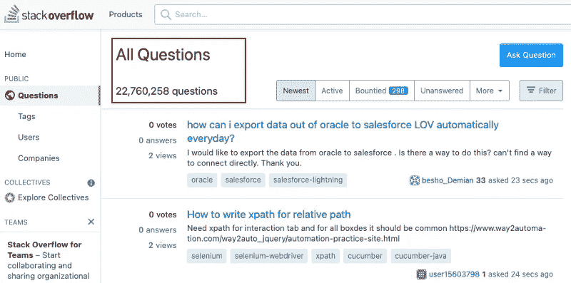

# 5 个使用设计模式并享受美好工作时光的好理由

> 原文：<https://levelup.gitconnected.com/5-damn-good-reasons-to-use-design-patterns-and-have-a-wonderful-time-at-work-831d0dc37810>

## 高质量和长寿软件的关键是设计模式


[作者](http://www.arnoldcode.com)和 Canva.com 制作的图片

你成功了！你完成了放在你办公桌上的新功能或需求，这些功能或需求本应在昨天之前完成。

*你怎么能跑得这么快？* *你拿了第一套试衣方案吗？你是否进行了一次仓促的糊状编码会议？*

> 最后，代码工作了，你可能会问自己“为什么我要浪费宝贵的时间去重构、测试和查找错误？”

这个问题的答案是:如果你正在开发一个不遵守下面列出的规则的代码库，你应该尽早辞职。

您是那种希望交付高质量代码或者对提高技能感兴趣的开发人员。*你想知道如何打破下半辈子都写同样底层实现的套路吗？继续读。*

## 1.使用第一种工作溶液

对 300 个用户有效的东西对 300 万用户无效。

不是每个第一解决方案都是长期关系。你可以从许多库中选择一个，但是有些库只能在特定的条件下工作。先评估一下你周围的环境，然后再选择你的搭配。

要构建持久可靠的解决方案，除了必须满足的要求之外，您还必须证明它的实用性。为此，设计要经过适当的功能、性能和负载测试。并不是每一个在 300 名用户中大放异彩的解决方案在 300 万用户中也能顺利运行。首先测试并记录它。

> 一旦系统高效运行，你无需额外努力就能学到这些经验。也许它甚至不能说服你的客户。在任何情况下，它保证会变得忙乱、紧张和冒险。

评估您的应用程序，并将给定的标准与可能使用的组件/库相匹配。如果不是:“用最艰难的方式学习它。”正如英国人所说。

## 2.为什么[设计模式](https://sourcemaking.com/design_patterns)？代码起作用了！

*如何管理包含一百万行源代码的复杂应用程序？*

> 现实的答案是:你无法以有意义的方式管理如此大规模的复杂性。

你最好的方法是把这种复杂性分成小块。组块处理部分方面，安全地忽略系统的其余部分。

分而治之只有在你的源代码中没有数据的情况下才有效。尤其是那种内部乱混的结构。这样的代码在今天有望快速成功。

从长远来看，你最终会在一个无限的、不可管理的隐藏依赖的沙漠中编码。另外，奇怪的副作用经常会导致难以发现的错误。

> 如果你仍然被“我们不需要设计模式，代码就这样工作”这样的感叹所说服。你会过得很糟糕。

使用设计模式来保持代码的形状。它还有助于给类起一个有意义的名字和更好的结构，并分离责任和关注点。

**找到合适的设计模式的核心问题是:**

*   *我如何给代码赋予结构？*
*   我想映射什么架构？
*   我在努力解决什么问题？
*   *哪种软件设计模式最能解决相同的问题？*
*   我需要额外的抽象吗？
*   这种模式是否过度设计了我的特殊问题？
*   *没有模式，问题能更简单/更有效地解决吗？*

## 3.整体结构

班级一点一点成长为真正的噩梦。

每一个新功能都增加了复杂性，你的噩梦也变成了现实。通过将结构分解成更小、更易管理的部分来驯服它。否则，你最终会得到一个不断增长的丛林。

对于每一个即将到来的重构，都有一个最佳的时间点，此时必要性变得足够明显。时间决定了工作的成本是否仍然在可管理的范围内，包括仍然需要完成的测试，以确保组件在重构前后正确运行。

> 如果错过了这个最佳点，重构将是不合理的。

在组件生命周期的某个时刻，完全重新开发是一个更具成本效益的选择。当然，每一个软件迟早都会被取代。但是额外缩短可能的寿命是致命的。

*想象一下，用接下来的 1-3 年时间，重新构建你在过去十年中创建的应用程序。*

## 4.自己做所有的事

POV 开发者:我生活在美好的时代。

你是一个海盗，互联网是一个巨大的百宝箱。一旦开放，它提供了工具、技术和样本代码来满足各种需求和预算。几秒钟之内，您就可以找到解决问题的正确方法。

如果您的要求更具体，像 Stack Overflow、特殊论坛、新闻组和邮件列表这样的平台就是您的位置。在那里你可以寻求帮助或者和志同道合的人讨论棘手的问题。

一个尚未解决的全新问题被称为 a🦄



我保证每个程序至少有一个设计模式的用例。如果你使用这样的标准，或者重新发明轮子，自己实施一个任意的更差的解决方案，那就是你的问题了。

> 令人吃惊的是，许多开发人员将他们宝贵的时间浪费在已经解决的任务的低级编程上。

## 5.我问写这段代码的人

文档？读代码！

确实是一个很大的声明。对于单个开发人员来说，独自深入应用程序的设计可能是一件好事。从开发人员不在时不得不介入的同事的角度来看，这就不那么令人愉快了。

代码应该支持这一点，以记录复杂或不寻常的问题。此外，该解决方案的架构是可访问的，但也有可能不断带来一些惊喜。

> 毕竟，你的目标不是解决文本冒险，而是高效安全地实现需求。

在这里，模式的优势再次发挥出来，因为它们实现了特定的标准，使得代码更易于维护。

如果只有一个人对代码负责，那么次优甚至有缺陷的实现仍然没有被发现。**最坏的情况发生了**当组件的圣杯守护者离开公司并带走秘密知识。

# 结论

“工作代码就够了”这句简单的话对于合适的环境来说是一个好的开始。但是不足以交付高质量的代码并保证软件的长寿命。

不管你怎么看，最后，你不可避免地回到复杂性及其控制的话题。

> 记住这句话:**降低复杂性是保持头脑清醒的关键，尤其是在较大和非常大的代码库中。**

因此，这是艾伦·凯提到的终极目标，严格封装和松散耦合的原则。

有必要在这个清单上加上专注于一项任务的原则和明确界定的责任。只有好的架构才能使这一点更加完美，好的架构形成了一个环境，在这个环境中，类被组织和组合成更大的模块，如程序集。

[***获得成功开发人员的 8 条永恒黄金法则，它们是你学习编码和攀登合作阶梯的指南。***](https://arnoldcodeacademy.ck.page/8rulesforsuccessfuldevelopers)

# 分级编码

```
Thanks for being a part of our community! More content in the [Level Up Coding publication](https://levelup.gitconnected.com/).Follow: [Twitter](https://twitter.com/gitconnected), [LinkedIn](https://www.linkedin.com/company/gitconnected), [Newsletter](https://newsletter.levelup.dev/)Level Up is transforming tech recruiting 👉 [**Join our talent collective**](https://jobs.levelup.dev/talent/welcome?referral=true)
```