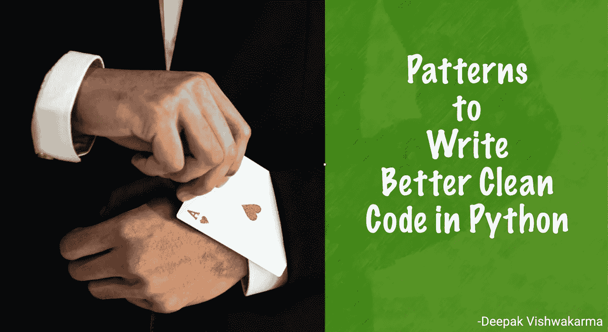

# 用 Python 编写更好的干净代码的 5 种模式——第 1 部分

> 原文：<https://levelup.gitconnected.com/5-design-patterns-to-write-better-clean-code-in-python-part-1-cd1f3d9deea4>



编写更好的代码在任何编程语言中都是一个挑战。在编写好的代码之前，你应该对编程语言有更好的理解。阅读整本书是很费时间的。同时，也很难记住模式。在本文中，我将重点介绍一些技巧和模式，以便用 Python 编写更好的代码。我还是 Python 新手，所以可能我的代码不如经验丰富的开发人员的代码性能好。

你可能正在为谷歌、脸书等公司的编码挑战做准备。为了成功通过这样的编码挑战，你必须解决 [Leetcode](https://leetcode.com/) 中的大量编码问题。在编码挑战中，你必须解决多个问题。就像脸书要求你在 40 分钟内解决两个问题。编程语言不受编码挑战的限制。你可以选择任何编程语言来解决这个问题。无论您选择哪种编程语言，您都需要一些技巧和调整来在有限的时间内解决问题。这篇文章也将帮助你解决 Leetcode 上的复杂问题。

## 目录

1.  索引循环
2.  可迭代的切片
3.  记忆化
4.  Varargs 和参数解包
5.  迭代器的映射


[万用眼](https://unsplash.com/@universaleye?utm_source=medium&utm_medium=referral)在 [Unsplash](https://unsplash.com?utm_source=medium&utm_medium=referral) 上拍照

## 1.索引循环

在处理像 [Two Sum](https://leetcode.com/problems/two-sum/) 这样的问题时，您需要迭代列表并获得项目的*索引*。你可以使用计数器或者使用 [*range*](https://docs.python.org/3.3/library/stdtypes.html?highlight=range#range) 迭代器*遍历*列表的长度来获得索引。还可以使用 [*枚举*](https://docs.python.org/3.3/library/functions.html#enumerate) 来迭代一个带有索引的可迭代对象。
**使用范围运算符**

**利用** [***枚举***](https://docs.python.org/3.3/library/functions.html#enumerate)

## **2。可迭代的切片**

可迭代对象可以使用循环进行迭代。 [slice](https://docs.python.org/3.3/library/functions.html?highlight=slice#slice) 函数返回一个 slice 对象，可以从 iterable 对象中提取一个子列表。因为**字符串**也是一个可迭代的对象。切片也可以用在字符串上。切片的语法是`slice(*start*, *stop*[, *step*]).`

上面的代码可以用方括号简化。您可以使用方括号访问子列表。

这里开始、停止和步骤都是可选的。*开始*、*停止*和*步骤*的默认值分别为 0、物体长度和 1。
您也可以使用负值来改变流量。为了理解负值，让我们举一个例子[回文数](https://leetcode.com/problems/palindrome-number/)的问题。有多种方法可以解决这个问题。解决这个问题的快速方法是，将一个整数转换成一个字符串，然后反转这个字符串并进行比较。

在上面的例子中，字符串 **num1** 的 ***反向*** 被赋值给 **num2** 。


照片由[布雷特·乔丹](https://unsplash.com/@brett_jordan?utm_source=medium&utm_medium=referral)在 [Unsplash](https://unsplash.com?utm_source=medium&utm_medium=referral) 上拍摄

## 3.记忆化

有些情况下，你需要写递归代码。记忆化确实可以提高代码的性能。记忆化对于解决动态编程编码问题也很有用。记忆可能很难实现。然而，使用 decorator 函数实现 memoize 代码太容易了。如果你想了解更多关于 Decorator 的知识，你可以阅读我的文章[使用 Decorator 在 Python 中进行验证。](/validations-in-python-using-metaprogramming-and-decorators-advanced-python-ee4d4278a6b3)
要解释这个题目，我们就从 Leetcode 来解决 [powx-n](https://leetcode.com/problems/powx-n) 问题。在这个问题中，我们必须实现一个计算`x`的`n`次方的函数。

**记忆装饰器代码**

现在实际解可以写成如下

## 4.Varargs 和参数解包

为了理解 Varargs，让我们以一个 **sum** 函数为例。sum 是一个函数，它返回传递给该函数的可变数字参数的总和。

这里的 **sum** 函数可以接受变量 args**args**。由于 **args 是**一个 tuple 是一个 iterable 对象(tuple)，我们也可以从 functools 中使用 **reduce** 。要了解更多关于函数式编程的知识，请阅读 Python 中的[函数式编程。](/functional-programming-in-python-easy-learning-b20207b2dd4e)

注意:在上面的例子中， **varargs** 是一个元组。所以我们可以打开它。

```
def divide(*args):
    num, den = args
    return num/denprint(divide(10, 2))
```

也可以使用名为 varargs 的**。named varargs** 是一个接受多个命名参数的字典。**名为**的 **varargs** 对于取选项字典非常有用。


阿瑟尼·托古列夫在 [Unsplash](https://unsplash.com?utm_source=medium&utm_medium=referral) 上的照片

## 5.迭代器的映射

可迭代对象的映射有助于转换可迭代对象。可以使用[映射](programiz.com/python-programming/methods/built-in/map)功能进行映射。

上面的例子使用了一个 **lambda** 函数。如果函数有多行语句，可以使用自定义函数。

可以在任何可迭代对象上进行映射，包括[集合](https://www.programiz.com/python-programming/set)、[列表](https://www.programiz.com/python-programming/list)、[元组](https://www.programiz.com/python-programming/tuple)等。

**注意:**有一个更好的方法来映射一个可迭代对象。它叫做[列表理解](https://www.programiz.com/python-programming/list-comprehension)。列表理解是映射可迭代对象的一种简洁而优雅的方式。

```
Celsius = [39.2, 36.5, 37.3, 37.8]
Fahrenheit = [((float(9)/5)*x + 32) for x in Celsius]
print(Fahrenheit) # [102.56, 97.7, 99.14, 100.03999999999999]
```

您还可以映射到字典、集合和元组。要了解更多信息，请阅读[数据结构](https://docs.python.org/3/tutorial/datastructures.html)

```
**>>>** a = {x **for** x **in** 'abracadabra' **if** x **not** **in** 'abc'}
**>>>** a
{'r', 'd'}
```

## 结论

在这篇文章中，我刚刚提到了一些技巧和模式。还有很多其他很酷的概念需要学习。为了保持文章的简洁，我将这篇文章分成了多个子文章。我稍后会发表这些。我在下面附上了所有的参考链接。

## 参考资料:

*   [https://docs.python.org/3/tutorial/datastructures.html](https://docs.python.org/3/tutorial/datastructures.html)
*   [https://www . programiz . com/python-programming/list-comprehension](https://www.programiz.com/python-programming/list-comprehension)
*   【https://www.programiz.com/python-programming 
*   [https://realpython.com/](https://realpython.com/)