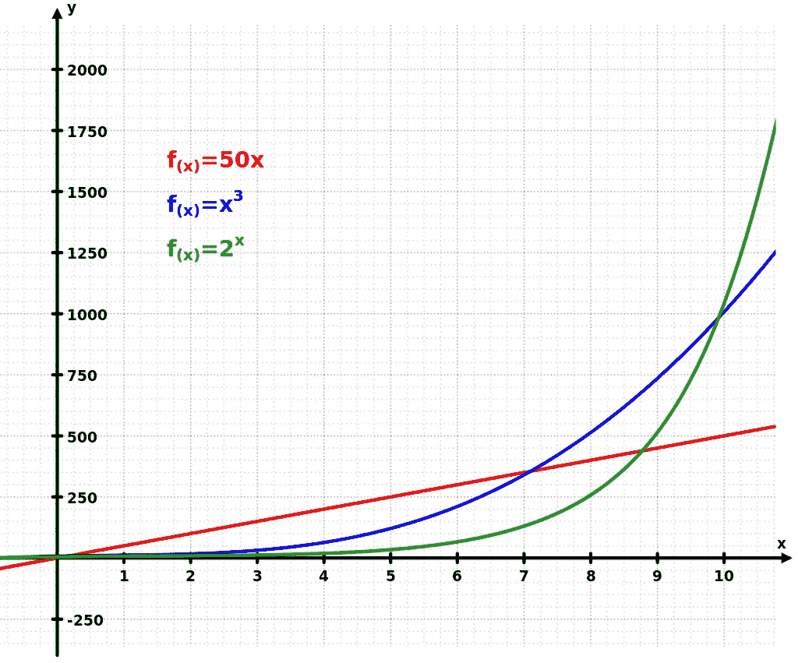

# 5 个在编程中有巨大回报的困难技能

> 原文：<https://levelup.gitconnected.com/5-difficult-skills-that-pay-off-exponentially-in-programming-702a599c636e>


照片由[你好我是尼克](https://unsplash.com/@helloimnik?utm_source=medium&utm_medium=referral)在 [Unsplash](https://unsplash.com?utm_source=medium&utm_medium=referral)

如果你是一个优秀的程序员，那太好了！你可以立刻给人留下深刻印象。你的职业生涯一定会非常出色。

但是古老的智慧告诉我们，生活中有些事情必须慢慢来。它们可能很难学。

但是当你掌握了它们，你就掌握了一个没人能夺走的位置。如果处理得当，这些事情会给你的生活带来巨大的积极变化。

请看下图:



指数曲线(来源:[维基百科](https://en.wikipedia.org/wiki/Exponential_growth))

我们在谈论绿线。

我描述了可以在你的编程生涯中创造指数增长的 5 件事。

# #1:摆弄玩具:

玩具(硬件小玩意)和编程有什么关系？

我 8 岁的时候把我的电子表(价格< $0.75) to see how time controls work. It took me 2 days to reassemble it. And still, I couldn’t figure out what was the connection between the circuitry and the digits on the LCD panel.

It made me rent magazines that showed device diagrams and circuit designs. That reading triggered me to understand the bigger concepts of **接口和架构**在工程上弄坏了。

这些道路引导我学习电子学，最终给了我编程生涯。从一家软件服务公司开始，我很快进入了产品公司。20 年后我还是程序员。

如果我不是从那个年龄开始就对数字机器感兴趣，我也不会对编码如此热爱。我不会害怕机器零件错误连接的每一个步骤中出现的故障。

我早就变成了一个卑鄙的经理(我的大多数朋友都变成了这样)。

也许我仍然是一个进步中的作品。但看看这个:今天几乎所有成功的科技企业家([埃隆·马斯克](https://en.wikipedia.org/wiki/Elon_Musk#Childhood_and_family)、[杰夫·贝索斯](https://en.wikipedia.org/wiki/Jeff_Bezos#Early_life)、[拉里·佩奇](https://en.wikipedia.org/wiki/Larry_Page#Early_life_and_education)、[史蒂夫·乔布斯](https://en.wikipedia.org/wiki/Steve_Jobs#Childhood)——你能想到的都有)在童年时不停地摆弄玩具。

这项活动的三大优点是:

*   不一定很难。
*   这必须是自愿的(所以[先不要把你的孩子推进编码学校](https://medium.com/an-idea/why-you-should-not-enroll-your-kids-to-coding-classes-3387d6688b20)。)虽然一个人可以创造/移动到一个环境中去给它加油。
*   **最重要的是:**必须坚持不懈。打破它，然后不修好它就不要停下来。坚持激发了对解决问题和建设的持久渴望。这种渴望是你在残酷的软件行业生存下来的最重要的资产。

如果你以前从未制作过小工具，试试参加小工具黑客马拉松。不要觉得被评价了。如果你不舒服，在家里订购一个 Arduino，并在家里建立传感器。选择一个同样渴望陪伴你的人(最好是一个小孩)。

# #2:挑战自我:

如果构建小工具可以建立持久性，那么你也需要利用这一优点。持续的挑战会帮你做到。

> 挑战自我就是在没有被告知的情况下，在处理复杂性方面领先一步。

挑战自我并不意味着应对编程挑战(算法难题)，但这是一种方法。虽然我通常建议不要进行[压力大的竞争性编程](/why-senior-devs-should-not-be-subject-to-whiteboard-interviews-c0de3316a000)，但如果算法是你的真正使命，那么你瞄准 FAAMG+才是务实的。这些挑战对游戏化你的旅程非常有帮助。

挑战自我并不等同于排除故障。因为当你在排除故障时，问题已经存在了。挑战自己是主动的一步。

挑战自我就是在没有被告知的情况下，在处理复杂性方面领先一步。

假设您编写了一个从预定义的配置文件中读取一组变量的函数。该实现将包括一个硬编码的文件名(例如“myfile.config”)。其界面如下:

```
func readParams()
```

为了挑战自己，在编写完这个函数之后，您可以将它参数化以接受配置文件名(带有硬编码文件名的默认参数)。

```
func readParams(filename: String="myfile.config")
```

想一想这个小小的改变带来了多少可能性:

*   您的客户端开发人员或最终用户可以在运行时更改配置参数。因此，您必须重新加载可执行代码。因此，您必须优化代码，并将其封装在 initialize()函数中，每次更改配置文件时，都会在开始时调用该函数。
*   假设配置文件与一个用户相关，那么同样的应用程序安装也有可能支持多个用户。
*   您可能还会想到创建一个 **export()** 函数，将读取的参数导出到磁盘、网络、数据库或外部消息系统(电子邮件等)。).您可以使用 **readParams()** 将它导入到其他地方。这样，应用程序可以跨机器移植。便携性=更好的价值主张=更多和持续的客户群。

如果你不挑战自己，用无参数签名来运送 V1，没有人会责怪你。也不会产生任何错误。

但是，想象一下，用户喜欢你的 V1，享受你的 5 星级免费试用，还想要更多。他们希望在 V2 的所有上述用例，否则他们将取消免费试用。

现在，既然你已经迈出了第一步，就不可能回头了。重构 **readParams()** 调用既耗时又容易出错。这意味着更多的测试用例也被更新。V2 可能会一片混乱。

挑战自我是任何领域对野心最真实的定义，不仅仅是编程。一个雄心勃勃的程序员在工作中不断挑战自己(以及在兼职项目中)，而不是追逐标签、晋升的小木屋以及随之而来的特权。

如果你观察任何一家成功的公司，你会发现他们都是技术联合创始人或首席技术官。

如果你需要时间，那就不要麻烦了。每个人学习的速度不同。重要的是在你打字或粘贴的每一行都要一步一步来。

不要把那些比你更快输入复杂代码的人浪漫化。他这样做是因为他以前做过，用一种更糟糕的方式，做过一千次。你也可以这样。

重要的是要记住，这不是目标，而是挑战自我的副作用。

# #3:语法:

加油！我们说的是编程，不是文学。真扫兴！

多年来，专家们一直说:大脑的左右半球控制着不同的功能。其中一个让你数学更好。另一个让你擅长艺术和语言。

这个理论现在被揭穿了。也可能还在讨论中。不管这是不是真的，这是一个严酷的事实:不学习语言，你就不能编程。不是词汇的问题。这是语法。

如果你擅长语法(尤其是英语)，你会更快地找到句型。框架和旧代码变得轻而易举。你可以从接口理解代码，有时甚至不需要文档。像*已完成*和*将刷新*之类的东西会在不深入内部的情况下宣布它们的目的。

变量和函数命名在高质量的软件制作中是神圣不可侵犯的。几乎所有的大公司都因为这个原因严格遵循命名惯例，语法专家也从中受益匪浅。

> 计算机科学只有两个硬东西:缓存失效和事物命名。
> 
> —菲尔·卡尔顿

良好的语法不仅是理解大量代码的生产力助推器，也是编写易于理解的代码的助推器。好的语法让开发人员也能写出简洁的规范和 bug 描述，从而减少来回的检查。

> 具有完美语法的错误代码比具有糟糕语法的完美代码更快地揭示其错误，从而揭示其功能。

具有完美语法的错误代码比具有糟糕语法的完美代码更快地揭示其错误，从而揭示其功能。考虑一下这句话，你就会明白为什么即使有足够多的优秀开发人员，你的团队也不能走得更快。

为什么我们把词汇放在语法之后？因为语法不过是作用于单词的规则。每个编译器也是语法。有了基本语法术语(时态、动词等)的知识，你可以很容易地找到更有效的同义词/合适的词。反过来是不可能的。

所以不要等了。刚[开始](https://english.stackexchange.com/?tags=grammar)。你很快就会成为团队中最聪明最清楚的人。

# #4:演示:

说到工作，程序员几乎不交流。他们要么说沉重的技术术语，要么简单地根据他们的最佳理解编写代码。

代码是两种东西的产物:商业和技术。程序员是技术知识的流动仓库。他主要从非技术人员那里学习商业。

从这两种成分产生代码的过程是**表示**。如果你是单干创业者，可能关系不大(复杂程度上升就有关系了)。一般来说，如果你想利用其他程序员的技能加倍努力，演示是至关重要的。

想象一个由两个程序员解释的登录场景:

**程序员 A** :用户进入登录界面。他输入用户名和密码，然后按下**登录**按钮。如果他在其中任何一个中输入#、&或*字符，输入将被拒绝。用户保持在同一页面上。之后，当他成功时，前端代码生成一个 API 请求。还是那句话，密码一定要散列，*别忘了！然后，API 将密码散列与存储在数据库中的散列进行匹配。如果用户名不匹配，就不会进行这种检查，所以必须先进行检查！两者匹配时，200 码返回前端。如果不是，则返回 401。在 200 的情况下，用户被重定向到个人资料页面。此外，还会发放一个有效期为两周的令牌。*

**程序员 B:**

(下面，每一个要点都是叙述中的停顿，粗体是讲话中的强调):

*   我们有两个过程:前端代码和后端 API。(画两个方框补充)
*   两者都通过这个 HTTP 网络调用进行通信。(用箭头连接它们)
*   前端必须接受用户的输入并验证它。
*   后端必须验证用户在数据库中的存在，以及密码散列的正确性。
*   **重要的部分来了:**如果响应成功，前端会从后端收到一个令牌，它会存储这个令牌长达 2 周。只要它是有效的，用户就被直接带到个人资料页面。显然，这个令牌检查逻辑在前端登录页面之前。
*   你可以在我发给大家/上传在云端的文档中查找 API 详情。

(此时，可能白板/记事本有许多箭头，每个箭头都标有序号)

谁的演讲会成功？程序员 A 的理解可能是 100%正确的，但他肯定无法实现传达想法的目标。大多数情况下，同事会因为他杂乱无章的展示方式和不必要的细节(HTTP 状态代码)而感到厌烦。

另一方面，程序员 B 会保持他的观众的注意力，并且会鼓励他们在演示结束后关注细节。

如果公司决定召开商业峰会，很可能会让程序员 B 担任首席布道者。

大多数程序员都很焦虑。他们不能长久地抓住分配给他们的东西。由于急于交付，他们最终只能通过代码来表达自己。如果需要做演示，他们会搞砸，就像上面的程序员 A 一样，整个团队都会遭殃。

演示的目的是清晰和简单。

> 简单是最复杂的。
> 
> [**杰夫·里奇**](https://www.brainyquote.com/authors/jeff-rich-quotes)

亚马逊已经意识到了这一点。这就是为什么它更喜欢 6 页的备忘录，而不是带项目符号的 PPT。如果你写不出 6 页来强调你的想法，它就不值得被听到。**简化，不惜任何代价！**

然而，大多数程序员确实不擅长表达。

如果你能简化你的表达技巧，你就是一个稀有品种。

# #5:上下文切换:

大多数程序员的大脑就像一块巨石。他们需要像微服务一样。

用一个例子来理解区别。

## 整体方法:

**API: /get/payments**

首先解析输入参数。

如果有一个非空的帐户参数，它将只返回该帐户的付款。否则，所有付款将被退回。

## 微服务方法:

微服务更具体，更关注实体。

**账户微服务(/get/payments)** 将只返回输入账户的付款。

**微支付服务(/get/payments)** 将返回系统内的所有支付。

有什么区别？解析部分——这是对拥有一个庞然大物的征税。换句话说，微服务已经知道它必须做什么。还有其他优势。它只对特定的使用计费。(成本更多是工程上的，但在某种程度上，这证明投资是值得的。)

微服务知道它们的范围。范围带来了背景。

没有适当的上下文，所有的演示都是无用的。在#4 给出的例子中，想象程序员 B(谁更好)向企业主描述登录功能。更糟糕的是，最终用户完全不是技术人员。

他对所有后端/前端的理解有多相关？

也许这是一个极端的例子。但是考虑一下:在敏捷时代，程序员被要求回答他们不太了解的问题。如果他们不能转换语境，他们可能会误导观众。

更糟糕的是，向外部利益相关者透露了过多的信息。

作为程序员，你的工作只要求你交付代码。其他的都是噪音。

我不建议学习多任务处理，因为多任务处理会扼杀注意力。我们需要的是在大脑处理输入之前决定其理想反应的能力——就像上面的微服务一样。

你的大脑里一定有隔间。每当一个问题出现在电子邮件/空闲消息/演示会议中时，你必须决定它属于哪个部分。是业务上的吗？是技术上的吗？是顾客送的吗？它存在于你的团队/部门内部吗？

*   决定你是否必须紧急回答这个问题。
*   如果是，在制定您的回应之前，请细化其范围(区间)。
*   所有非紧急的事情都可以等你上下班。
*   对于重复的任务，你也可以缓存你的回答，就像你的软件一样。对于那些不太可能让你被解雇的事情，尽量缩短你的反应时间。
*   更多的时候，你的代码是你的第一优先。这就是你需要关注的地方。不要浪费在其他地方。通过利用上下文切换来最小化分心时间。

最后但并非最不重要的一点是，你还必须为你的家庭时间准备一个精神空间。当你不在工作的时候，它必须是开着的。在家庭时间，所有工作间必须关闭。

如果你在家里[无法转换你的精神环境](https://betterprogramming.pub/how-to-handle-the-stress-of-becoming-an-obsolete-software-developer-41be0f0feb77)，一种致命的倦怠(可选地，痛苦的分手)将比预期更快地欢迎你。

# 结论:

许多计算机科学家认为编程是一门植根于形而上学的学科，因为它处理对现实世界事物的分类，以创建自动化的工作流。当他们想要构建一些东西时，他们不会因为工具链问题和诸如“为什么 framework X > framework Y”之类的事情而失眠。如果他们不能让它工作，他们就简单地建立一种新的适合他们需要的语言。

自然，他们很少考虑生产性编程。

在光谱的另一端是教程学习程序员，他们认为编程是有生产力的。更多代码，更短时间内获得更多门票是他们的座右铭。换公司也是出于经济和家庭原因。

这样的程序员认为，只有通过实践和从最佳资源复制粘贴，并遵循他们公司老板规定的东西，才能掌握编程。

真相介于两者之间。

清晰+技能培养先于编码是很自然的。同样正确的是，你必须通过弄脏你的手来快速失败。但是这些东西不一定存在于软件领域或行业中。软件毕竟是为现实世界服务的。

将这 5 个现实世界的学习技能应用到软件中，可以让你成为职业生涯中**最相关的程序员**。这可能需要时间，但当它实现的时候，它会让你指数级上升。

在一个数据比黄金还贵的时代，相关性是一座金矿。

*   如果您想在[笔磁](https://tipsnguts.medium.com/)发布的任何时候收到电子邮件，请 [**点击这里**](https://tipsnguts.medium.com/subscribe) 。
*   如果你还不是中会员，想成为中会员， [**点击这里**](https://tipsnguts.medium.com/membership) 。(您的部分订阅费可能会支付给[笔磁铁](https://tipsnguts.medium.com/)。)

# 关于成为更好的程序员的更多信息:

[](/robust-programmers-do-these-3-radical-things-a4dbcb544dbc) [## 健壮的程序员做这三件激进的事情

### #1 做坏事

levelup.gitconnected.com](/robust-programmers-do-these-3-radical-things-a4dbcb544dbc) [](https://medium.com/codex/how-to-turn-into-a-software-architect-c6f30ce91e33) [## 如何成为一名软件架构师

### 像毛毛虫一样

medium.com](https://medium.com/codex/how-to-turn-into-a-software-architect-c6f30ce91e33) [](https://betterprogramming.pub/3-habits-to-become-a-better-indie-developer-e8f4234f3f2d) [## 成为更好的独立开发者的 3 个习惯

### 单打独斗令人生畏，但有办法

better 编程. pub](https://betterprogramming.pub/3-habits-to-become-a-better-indie-developer-e8f4234f3f2d)