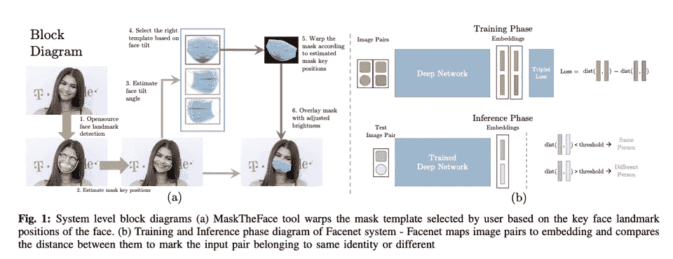
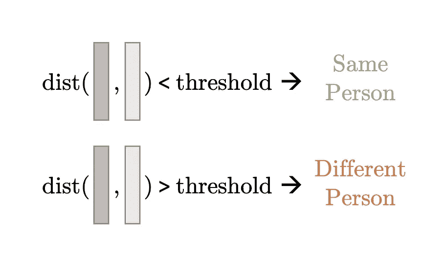

# 使用 LaTeX 撰写有效研究论文的 5 个基本提示和技巧

> 原文：<https://levelup.gitconnected.com/5-essential-tips-and-tricks-to-writing-effective-research-papers-using-latex-9ddc75d1be86>

由乔纳斯·亚采克 jonas.me，CC 由 4.0，[https://commons.wikimedia.org/w/index.php?curid=89012582](https://commons.wikimedia.org/w/index.php?curid=89012582)

LaTeX 是工程和科学社区在撰写论文、报告或研究论文等方面的事实标准。LaTeX 提供了各种功能，与其他文档处理工具(如 MS Word 或 LibreOffice)相比，它是更好的候选工具。它的一些主要特点是

1.  **文档看起来不错**——除了 LaTeX 的所有其他优点，在我看来，LaTeX 生成的最终文档看起来真的很不错，与其他文档处理工具相比，组织得很好，格式也更好。
2.  **没有奇怪的意外格式问题**——在 MS Word 中，你稍微改变一个图形的位置，整个文档的布局就会变得混乱。LaTeX **保留文档的布局和格式**。
3.  **伟大的引用方法** — LaTeX 在处理**参考文献和引用**方面占据上风。像其他文档处理工具一样，您不必担心维护您的引用。LaTeX 通过 BibTex 为您做到这一点。
4.  **免费** — LaTeX 是开源的，可以免费使用。你不必担心在某个时候它会开始要求你付费来继续使用它。

在本文中，我们将介绍 5 个提示和技巧，它们可以帮助您创建更好的 LaTeX 文档。

# 1.[工具] MathPix —从图像中复制数学方程式

图片来源:[https://mathpix.com/docs/snip/macos-installation](https://mathpix.com/docs/snip/macos-installation)

将手写笔记中的复杂校样复制到 LaTeX 中非常困难且耗时。MathPixs 可以在这个问题上给你很大的帮助。MathPixs 从相机图像生成 LaTeX 方程的源代码。对于更简单的方程，这个工具非常好用。对于更复杂的格式，源代码需要一点调整。然而，它给了你一个很好的起点。这可以方便地从您的手写笔记中复制您的数学推导，或将其他论文中的基本方程复制到您的 LaTeX 文档中。

MathPixs 在行动——作者图片

该工具是免费的，可以从这里下载。免费版每月提供 50 个片段。

**下载:**[https://mathpix.com](https://mathpix.com)

# 2.[编辑器]背面—协作式 Latex 编辑器

图片来源:Overleaf.com

Overleaf 是一个基于云的协作式 LaTeX 编辑器，用于编写、编辑和发布科学文档。您不必担心安装 MiKTeX 或所需的软件包。它甚至为各种期刊/出版物提供了一套很好的模板。背面最好的部分之一是作者协作功能。多个用户可以同时编辑同一个 LaTeX 文档。这使得合作者更容易完成研究论文的统一草稿。背页还维护文档的修订历史，并提供聊天功能，这在协作处理文档时非常方便。在过去的 4 年里，我尝试了各种 LaTeX 编辑器，在我看来，Overleaf 是最好的编辑器之一。

**网址:**【www.overleaf.com 

# 3.[提示]CMR 10-整个文档中一致的字体

Cmr10 Font —图片来源:[https://tex . stack exchange . com/questions/194304/Font-in-harv MAC-title](https://tex.stackexchange.com/questions/194304/font-in-harvmac-title)

数字是你研究论文的重要部分。虽然使用 LaTeX 的 tikz 包可以制作很多图形，但是需要大量的工作/时间，并且可能不会得到想要的图形。因此，大多数研究人员使用外部图形制作工具，如 MS Powerpoint、MS Visio 等。结果图通常是在 MS Excel、MATLAB 或 Python 的 matplotlib 上制作的。

当这些图形作为图形导入 LaTeX 时，LaTeX 的默认字体与图形中使用的字体不一致。

图形字体 y 轴标签和图例不同于 LaTeX 编辑的标题。—图片来源:[https://arxiv.org/pdf/1807.08241.pdf](https://arxiv.org/pdf/1807.08241.pdf)

这种不一致可以通过下载正确的字体来解决。你可以下载字体， [**cmr10**](https://ctan.org/tex-archive/fonts/cm/ps-type1/bakoma/ttf/) ，真的很像 LaTeX 用的那个，安装在你的操作系统里(Windows，Linux，macOS)。制作图形时，使用 cmr10 字体会导致图形和 LaTeX 正文之间的一致性。

图形字体(标题、x y 标签、图例、标记)和 LaTeX 字体一致—图片来源:[https://arxiv.org/pdf/2008.11104.pdf](https://arxiv.org/pdf/2008.11104.pdf)

**下载:**[https://ctan.org/tex-archive/fonts/cm/ps-type1/bakoma/ttf/](https://ctan.org/tex-archive/fonts/cm/ps-type1/bakoma/ttf/?lang=en)

# 4.[提示] PDF 图表—尽可能用 PDF 图表替换图像

在 MS Powerpoint 和 Excel 等工具上创建自己的框图和图形时，请确保将图形导出为 pdf 格式，而不是 image 格式。jpg，。png 等)。PDF 文件用于创建图形和框图时，放大时不会像素化。这类 PDF 文件包含在研究论文中有助于读者放大以正确查看数据。你可以看到下面的区别。

**左:**作为图像包含时的放大图(。jpg)【https://arxiv.org/pdf/2008.11104.pdf 右图:包含为 pdf 格式时放大的图像—图像来源:

**注意:**如果源文件已经是一幅图像，将其保存为 pdf 格式不会产生任何差异

# 5.[提示]颜色主题—图形中一致的颜色主题

从美学的角度来说，你可以通过在你的所有图片上保持一致的颜色主题来提高你的研究论文的质量。一致的颜色主题不仅看起来不错，还能让你的读者被你文档的内容所吸引。Microsoft office 工具允许您为整个文档选择主题。一旦选择了主题，就会有一个建议的颜色列表供您选择。确保在所有图片中选择相同的颜色将有助于您的文档在读者中脱颖而出。

MS Office 中的主题—按作者分类的图像

您可以从提供的主题列表中选择，也可以创建自己的主题。我个人更喜欢上面显示的“中值”主题。

# 摘要

LaTeX 是书写学术和研究文件的绝佳工具。在本文中，我们看了一些建议，它们可以帮助您的文档编写体验(工具、编辑器)和文档的整体美观。

1.  [工具]MathPixs:[https://mathpix.com](https://mathpix.com)
2.  [编辑]背页:[www.overleaf.com](http://www.overleaf.com)
3.  [提示] Cmr10 字体:[https://ctan.org/tex-archive/fonts/cm/ps-type1/bakoma/ttf/](https://ctan.org/tex-archive/fonts/cm/ps-type1/bakoma/ttf/)
4.  [提示] PDF 图表
5.  提示]颜色主题

如果这篇文章对你有帮助，欢迎鼓掌、分享和回复。如果你想了解更多关于机器学习和数据科学的知识，请关注我@[**Aqeel an war**](https://medium.com/u/a7cc4f201fb5?source=post_page-----9ddc75d1be86--------------------------------)**或者在**[***LinkedIn***](https://www.linkedin.com/in/aqeelanwarmalik/)***上与我联系。***