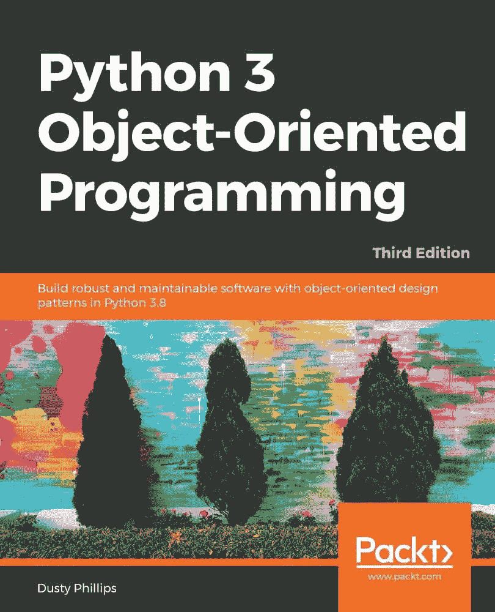

# 2020 年学习 Python 的 5 本优秀书籍

> 原文：<https://levelup.gitconnected.com/5-excellent-books-to-learn-python-in-2020-768614974ecc>

金伯利农民在 [Unsplash](https://unsplash.com?utm_source=medium&utm_medium=referral) 上拍摄的照片

在线学习比以往任何时候都容易。网上有上百种学习编程语言的方法，尤其是如果你想学 Python 的话。

但是我还是爱从书上学习。当我打开一本编程书的时候，我经常会断网，在一个泡泡里毫无杂念地编码。

有了书，我可以进入深度思考，帮助我真正理解材料。

这里是我推荐的五本书，可以让你在短短几个月内将 Python 技能从初级提升到高级。

# Python 速成班

[*Python 速成教程，作者 Eric Matthe*](https://www.amazon.com/dp/1593279280/ref=sspa_dk_detail_1?psc=1&spLa=ZW5jcnlwdGVkUXVhbGlmaWVyPUExUExBNjA1NkZOV0tMJmVuY3J5cHRlZElkPUEwMTQwMzcxMlZJSDg5UjFOVFkxTyZlbmNyeXB0ZWRBZElkPUEwOTg4NzY4MzNaNTBHTldXVzEyNCZ3aWRnZXROYW1lPXNwX2RldGFpbDImYWN0aW9uPWNsaWNrUmVkaXJlY3QmZG9Ob3RMb2dDbGljaz10cnVl) *s* ，是一本绝对初学者的绝佳书籍。

Python 速成班

这本书为您提供了 Python 基础的坚实基础，以及几个现实世界应用程序的实用代码示例，您可以立即开始使用。

它甚至带您一步一步地使用 Django 创建一个包含身份验证的简单 web 应用程序。这一章将指导你将你的应用程序部署到 Heroku 上，这很好。通常在教程中，你不知道如何将你的应用程序投入生产，但是这包括了这个步骤。

这本书读起来很有趣，可以帮助你拼凑出如何在实际应用的不同方面使用 Python。

# 有效的 Python

多年来，我一直在阅读“有效编程”的书籍。我从 2000 年代初的 [*有效 C++*](https://www.amazon.com/Effective-Specific-Improve-Programs-Designs/dp/0321334876/ref=sr_1_1?keywords=effective+c%2B%2B&qid=1579714852&sr=8-1) 开始，它把我在大学学过的编程更上一层楼。

Amazon.com 上的有效 Python

从此，我看了 [*有效 c#*](https://www.amazon.com/Effective-Covers-Content-Update-Program/dp/0672337878/ref=sr_1_2?keywords=effective+c%23&qid=1579715367&sr=8-2)[*更有效 c#*](https://www.amazon.com/More-Effective-Specific-Software-Development/dp/0672337886/ref=sr_1_1?keywords=effective+c%23&qid=1579715397&sr=8-1)[*有效 Python*](https://www.amazon.com/Effective-Python-Specific-Software-Development/dp/0134853989/ref=sr_1_3?keywords=effective+python&qid=1579712882&sr=8-3) 。所有这些书都有一个相似的主题。一旦你掌握了编程语言的基础知识，你就应该学习最佳实践，学习如何用这种语言编写干净、可读、可重用的代码。“有效编程”书籍在帮助你从初学者到高级程序员的旅程中做了一件了不起的工作。

[*有效的 Python，由布雷特·斯莱特金*](https://www.amazon.com/Effective-Python-Specific-Software-Development/dp/0134853989/ref=sr_1_3?keywords=effective+python&qid=1579712882&sr=8-3) 编写，也不例外。这本书你可以从头到尾读一遍，也可以放在你的桌子上，不时地参考一下，看看是否有什么东西适用于你目前正在从事的工作。

例如，一旦你有了几个脚本，有了几个函数，你就可以阅读本书的第 5 章“函数”,把你的函数写作技巧提高一个层次。

我在自己的学习中很喜欢这种模式。首先，弄清楚如何做某事，然后一旦你有了基本的东西，就专注于需要改进的地方。这就是你如何掌握一门编程语言。

# Python 3 面向对象编程

如果您正在编写一个全栈 web 应用程序或者有一个更大的数据科学项目，您很可能想要开始创建可重用的组件。

虽然没有必要以面向对象的方式编写 Python，但是这种模式很好地封装了您的代码，或者创建了封装的假象，并使它对其他开发人员来说更具可读性。

更不用说，它使您的应用程序更容易测试和维护。

Amazon.com 上的 Python 3 面向对象编程

由 Dusty Phillips 撰写的《Python 3 面向对象编程》深入探讨了如何开始用 Python 创建类以及围绕它们的最佳实践。它对于学习 Python 中使用的一些常见设计模式也很有帮助。其中一些模式在其他强类型语言中以不同的方式实现，所以如果您来自 C++、C#或 Java 背景，仍然值得一读，看看这些模式是如何在 Python 中实现的。它可能不总是你想的那样。

# Python 技巧书

当你准备好让你的 Python 编程更上一层楼时，由 Dan Bader 撰写的 [*Python 窍门一书是一个极好的选择。*](https://www.amazon.com/Python-Tricks-Buffet-Awesome-Features-ebook/dp/B0785Q7GSY/ref=sr_1_3?keywords=python+tricks&qid=1579712655&sr=8-3)

关于 Amazon.com 的书《蟒蛇的把戏》

我用 Python 编程已经很多年了，但是最近看了这本书，学到了很多。它采用 Python 中的常见构造，并以您可能想不到的方式使用它们。这本书对初学者和专家都是极好的。

你可以按任何顺序阅读这本书。每个部分都是独立的，所以浏览内容，找到你感兴趣的内容。

我爱这本书！

# 流畅的 Python

我不得不承认，我刚刚开始 [*通顺 Python，由卢西亚诺拉马尔霍*](https://www.amazon.com/Fluent-Python-Concise-Effective-Programming/dp/1491946008/ref=cm_cr_arp_d_product_top?ie=UTF8) ，因为这么多人推荐它作为专家级 Python 书籍。

这本书描述了 Python 高级特性的最佳实践，如生成器和何时使用它们，实现并发的各种方法，以及关于元编程的整个章节。

当我完成这本书的时候，我会对此做一个更彻底的回顾，但是它对于高级 Python 程序员来说获得了很好的评价，所以我有很高的期望。

随着你读的每一本新书或选修的每一门课程，你会开始发现你知识中的空白被填补，你的大脑会把以前没有的东西联系起来。

如果你想成为一名专业的程序员，尽可能多地学习不同的结构和模式是至关重要的。您可能无法凭记忆正确地实现它们，这没关系。然而，仅仅知道某些编程方法的存在，就可以让你在需要的时候查找它们，并拓展你编写伟大代码的能力。

编码快乐！