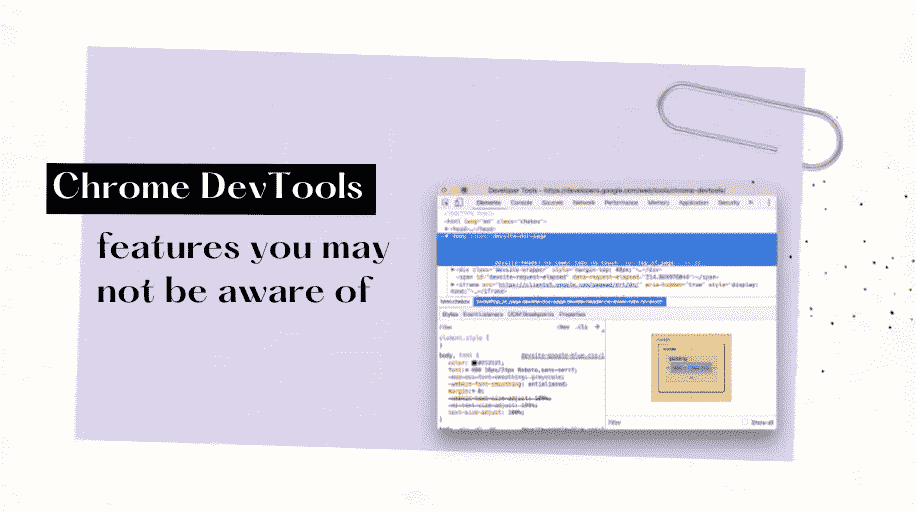

# Chrome DevTools 中隐藏的 5 个你可能不知道的功能

> 原文：<https://levelup.gitconnected.com/5-features-hidden-in-chrome-devtools-you-may-not-be-aware-of-26cee0f304ad>

Chrome 开发工具对开发者来说是一套超级有用和强大的工具——如果你一生中至少创建过一个页面，你可能知道这一点。几乎每个人都知道如何检查网页的 HTML 结构或 CSS 样式。但是你利用了隐藏在那里的全部潜力吗？让我们检查一下！下面我列出了开发工具中 5 个不明显的可用函数，我发现它们在我的日常工作中非常有用——希望你也会发现它们有用。

# 模拟位置

很久很久以前(在冠状病毒疫情出现之前)，人们在旅行。这可能很难相信，但乘坐汽车/火车/飞机去新的地方是很正常的。那时，我们的移动应用程序/网页中的地理定位是必要的。当然，这还不是全部——当我们向我们的家庭办公室订购食物时，地理定位仍然非常有用。作为开发人员，我们知道很多实现的方法——但是我们如何测试它是否正常工作呢？答案可能是——用你的浏览器就行了。怎么做呢？

1.  在你想要测试的页面上打开 Chrome DevTools*(Linux/Windows 上的 ctrl + shift + I 或者 Mac 上的 cmd+shift+I)*
2.  点击右侧的 3 个点。
3.  选择`More Tools`和`Sensors`
4.  检查`Geolocation`部分。

覆盖应用程序中 Chrome DevTools 显示空气质量级别的位置。

如你所见，这里有很多选项。您可以选择下拉菜单中定义的默认地点之一(如伦敦、柏林或上海)，或者定义您自己的纬度和经度。当您经常使用默认不可用的位置时，您可以点击`Manage`和`Add location`将您的自定义位置添加到预设中。您还可以检查网页在出现错误和数据不可用时的表现，只需从菜单中选择`Location unavailable`选项即可。瞧啊。就是管用！你不需要在城市里开着车，膝盖上放着笔记本电脑，或者安装一些第三方软件。很好——你不觉得吗？

# 油漆闪光

谁从来没有一个问题，重新渲染组件过于频繁，投下第一块石头。它发生了——这是事实。尤其是当你大三或者刚进入前端世界的时候。如果没有发现 bug 的经验——一切看起来都很好，但浏览器正在努力在页面上重画、重画和重画元素。幸运的是，Chrome DevTools 提供了一种容易找到它们的方法。你只需要遵循以下步骤:

1.  打开 Chrome 开发工具
2.  单击右侧的 3 个点
3.  选择`Rendering`
4.  选中标题为`Pain flashing`的第一个复选框。

油漆闪烁的示例-重新油漆的区域以绿色突出显示。

由于这一点，所有重新绘制的区域将以绿色突出显示，所以你可以与网页互动，并检查是否所有工作都是设计好的。小菜一碟！你现在不用担心你的网页有重画的问题了。

# 自动审计

我最喜欢的功能之一。我们经常在我们的网页上工作，并想测试它，以确认一切工作像一个魅力。但是我们不知道从哪里开始，什么是最重要的。此外，我们需要一些方法来量化它，以确保我们在不断更新。我们可以免费获得所有这些，不需要安装任何东西——只需使用浏览器。要采取的步骤？

1.  打开 Chrome DevTools 面板
2.  转到`Audits`选项卡
3.  检查您想要测试的设备(移动/桌面)和类别(性能/渐进式 Web 应用/最佳实践/可访问性/ SEO)。
4.  或者，通过单击右上角的设置图标并选择“模拟节流”复选框来添加互联网速度节流
5.  决定是否要在审计前清除存储(本地存储、索引数据库等)(也在单击右上角的设置图标后可见的附加菜单中)
6.  点击`Run audits`按钮开始测试。

Chrome DevTools 中的审计

一段时间后，在后台重新加载页面，你会收到计算的分数。它在 0-100 的范围内，100 代表完美的网页。但更重要的是，你还会收到详细的信息——哪些考试失败了，哪些考试通过了，以及你如何提高分数。网页上的失败元素将在报告中呈现，几乎所有部分都包含一篇文章的链接，以了解它为什么如此重要以及如何改进。该报告也可以保存在 JSON 或 HTML 文件中，这样您就可以向其他人展示您的分数，或者创建一个基础版本，并将最新版本与该版本进行比较。超级有用！但是你不必相信我——你自己试试吧！

# 模仿色彩缺陷

可访问性是最近前端世界最热门的话题之一。对此我真的很高兴。使网页更容易导航、理解，并且通常对患有不同疾病和问题的人更有用，会使互联网成为一个更好的地方。但有时可能很难理解视力有缺陷的用户是如何看待我们的产品的。现在容易多了。当然，这要感谢 Chrome DevTools 中的功能。怎么会？

1.  打开 Chrome DevTools 面板
2.  单击右侧的 3 个点
3.  选择`Rendering`
4.  找到一个名为“模拟视力缺陷”的下拉菜单
5.  从菜单中选择一个选项

模仿色彩缺陷

真的让人大开眼界不是吗？在许多不同的网页上测试该选项。世界看起来完全不一样了！有许多更好的选项和工具来检查页面的可访问性(包括前面描述的自动审计)。但是，除非你在开发或测试期间开始考虑它，否则什么都不会改变。我希望，这个练习能帮助你记住它有多重要。

# 截屏

这么小，这么有用。您知道吗，在浏览网页时，您不需要额外的软件来拍摄全尺寸或区域截图。这足以:

1.  打开 Chrome DevTools 面板
2.  在 Linux/Windows 上点击`ctrl + shift + p`或在 Mac 上点击`cmd + shift + p`
3.  开始打字`screenshot`
4.  选择您要拍摄的截图类型(普通、节点、全尺寸、区域)
5.  如果需要，选择该区域
6.  图片的保存方式与从互联网上下载的任何其他文件相同

Chrome DevTools 中的截图

都是！我知道它很小，但老实说，我喜欢这个简单的选项来截取整个页面的截图——不仅仅是可见的部分，而是所有内容，无需滚动或其他工具。

# 摘要

当然，这并不是 Chrome DevTools 所有可用功能的完整列表——如果你想了解更多，我强烈建议你查看谷歌的 [Chrome DevTools 页面或他们的](https://developers.google.com/web/tools/chrome-devtools) [Twitter 账户](https://twitter.com/chromedevtools)。打开面板，在标签和选项之间点击也是一个很好的方法——你可能会惊讶地发现有这么多了不起的技巧！我希望，那篇文章能激励你这样做，并改进你的日常工作。如果你觉得它有趣或有用，请点击下面的按钮。编码快乐！