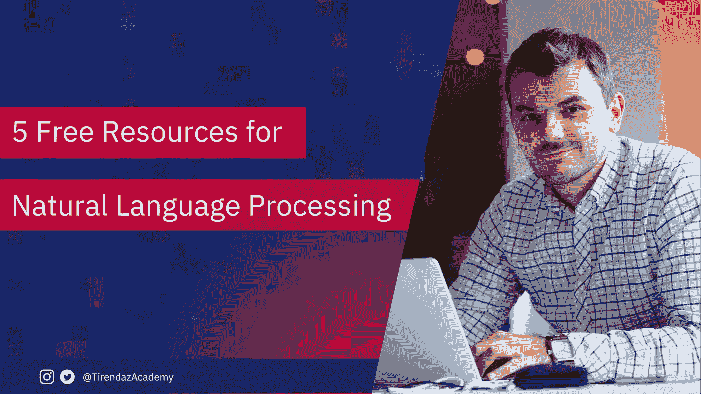

# 学习自然语言处理的 5 个免费资源

> 原文：<https://levelup.gitconnected.com/5-free-resources-for-learning-natural-language-processing-857cabbc6aa>

## 免费使用 GitHub 资源库学习 NLP。

作者图片

近年来，随着人工智能(AI)解决方案在商业上的采用，自然语言处理(NLP)得到了快速发展。NLP 是人工智能的一个子领域，涉及计算机和人类(自然)语言之间的交互，特别是如何对计算机进行编程以处理和分析大量自然语言数据。自然语言处理应用于许多领域，例如机器翻译、垃圾邮件过滤、问题回答、文本分类和情感分析。

你可以在网上找到很多学习 NLP 的免费资源。这篇文章将提到学习 NLP 的 5 个最好的 GitHub 库。

让我们开始吧！

# 1.自然语言处理教程

这个资源库是一个帮助使用 Pytorch 学习 NLP 的教程。本教程向您展示了如何用不到 100 行代码实现最先进的模型。

✨之星:11.5k

 [## GitHub - graykode/nlp-tutorial:面向深度学习研究者的自然语言处理教程

### nlp-tutorial 是为使用 Pytorch 学习 nlp(自然语言处理)的人提供的教程。大部分型号在…

github.com](https://github.com/graykode/nlp-tutorial) 

# 2.NLP 食谱

这个库包含了构建 NLP 系统的例子和最佳实践，以 Jupyter 笔记本和实用函数的形式提供。这个库主要关注 NLP 模型，这些模型在研究文本和语言问题的研究人员和从业人员中很流行。

✨之星:6k

 [## GitHub - microsoft/nlp-recipes:自然语言处理最佳实践和示例

### 近年来，自然语言处理(NLP)在质量和可用性方面取得了快速发展，这有助于…

github.com](https://github.com/microsoft/nlp-recipes) 

# 3.NLP 课程

本课程包括每周关于 NLP 的讲座和研讨会材料。在本教程中，您可以学习单词嵌入、文本分类、语言建模、Seq2seq 和注意力、迁移学习、领域适应等热门话题。

✨之星:8.1k

 [## GitHub-yandexdaschool/NLP _ course:YSDA 自然语言处理课程

### 这是 2021 年的版本。对于前几年的课程材料，去这个分支讲座和研讨会材料为每个…

github.com](https://github.com/yandexdataschool/nlp_course) 

# 4.Python 教程中的 NLP

该资源涵盖了 NLP 从“Hello World”到“Text Generation”的一步一步的内容，使用了几个 Jupyter 笔记本，并使用了几个数据科学库。

✨之星:1.6k

 [## GitHub-adashofdata/NLP-in-python-tutorial:使用自然语言比较单口相声演员…

### 我们将在教程中浏览几个 Jupyter 笔记本，并使用一些数据科学库…

github.com](https://github.com/adashofdata/nlp-in-python-tutorial) 

# 5.真棒 NLP

📌该资源包含一个专门用于自然语言处理的资源的精选列表。你可以在这个资源库中找到许多资源，如研究总结和趋势、著名的 NLP 研究实验室、教程、视频和在线课程、书籍和图书馆。

✨之星:13.7k

 [## GitHub - keon/awesome-nlp:一个致力于自然语言处理的精选资源列表…

### book:一个致力于自然语言处理(NLP)的精选资源列表

github.com](https://github.com/keon/awesome-nlp) 

# 结论

自然语言处理是人工智能中最热门的领域之一。近年来，已经开发了许多最新技术，例如 GPT-3 和 BERT，并且这些模型已经在许多商业领域中被采用。NLP 继续快速增长。在这篇文章中，我谈到了 NLP，并展示了 5 个免费学习 NLP 的 GitHub Repos。你可以在下面写下你可以建议的资源作为评论。

 [## 2022 年学习编程的 10 个最佳免费网站

### 不用上大学，使用这些免费网站就可以成为程序员。

medium.com](https://medium.com/geekculture/10-best-free-websites-to-learn-programming-in-2022-e636f4642a26) 

感谢阅读。我希望你喜欢它。别忘了在推特上关注我们😊

如果这篇文章有帮助，请点击拍手👏按钮几下，以示支持👇