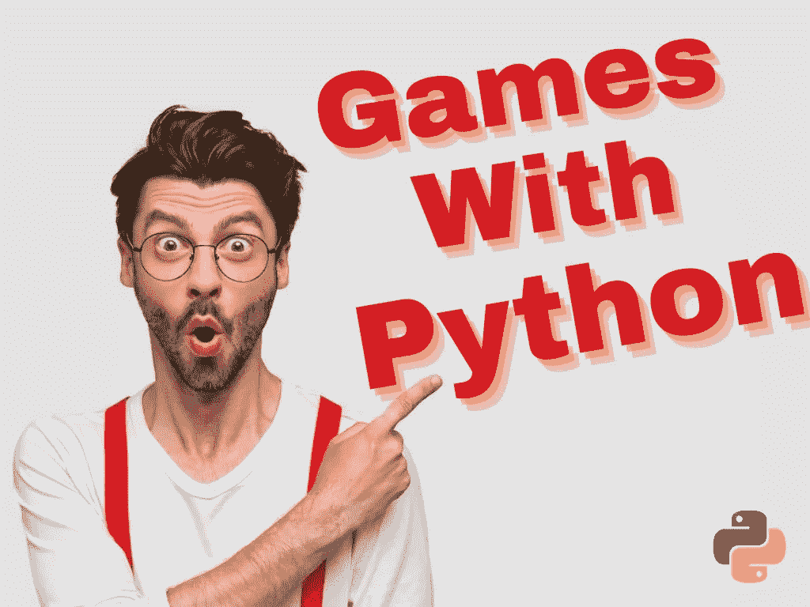
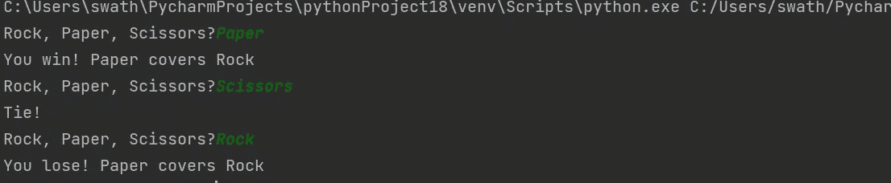
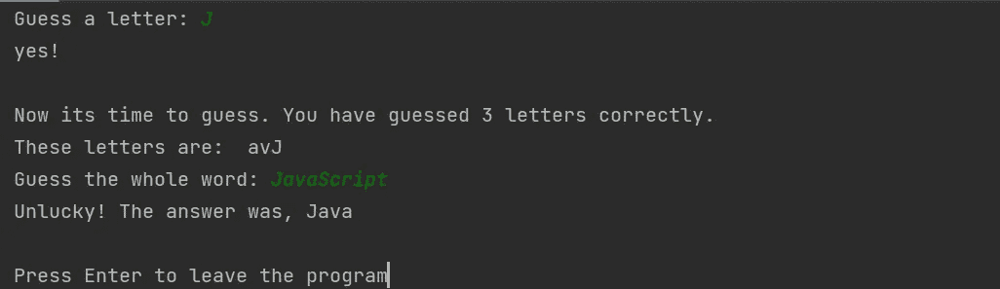
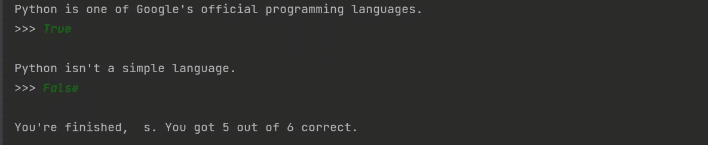

# 构建和学习 Python 的 5 个游戏

> 原文：<https://levelup.gitconnected.com/5-games-to-build-and-learn-python-2b83030ccef7>

## 让你思考和改进编码的精彩游戏

由使用 [canva](http://canva.com) 创建的 [Freepik](http://www.freepik.com/) 上的[waymhomestudio](https://www.freepik.com/free-photo/emotional-bearded-male-has-surprised-facial-expression-astonished-look-dressed-white-shirt-with-red-braces-points-with-index-finger-upper-right-corner_10421016.htm#query=wonder&position=13&from_view=search)拍摄的照片

# 1.石头、布、剪刀:

首先，理解逻辑并编写脚本，用计算机玩石头、布、剪刀。一个程序输入“石头”，“布”，“剪刀”对于这个程序，您将发现 if-else 循环的四种情况。

情况 1:如果播放器和你的程序有相同的输出，你必须打印平局。

案例 2:如果玩家选择了石头，你的程序选择了纸。打印玩家输了或者玩家赢了的声明。

案例三:如果玩家选择了纸，你的程序选择了剪刀。打印玩家输了或者玩家赢了的声明。

情况 4:如果玩家选择剪刀，而你选择石头。打印玩家输了或者玩家赢了的声明。

**输出**:

# 2.猜词游戏:

这个程序应该通过检查字母的对错来帮助用户猜测单词。这些字母将作为一个线索，然后用户可以思考整个单词。在我们的程序中，我们已经考虑了一系列可供猜测的编程语言。

**输出:**

# 3.掷骰子的时间:

为了实现上面显示的输出，我们使用了三个包。Tkinter 包创建了一个图形用户界面，PIL 使用了一些图像，Random 随机选择了一个结果。我们在程序中使用六个图像骰子，随机选择并显示。

# 4.井字游戏:

要为井字游戏编写一个片段，您需要一个由九个正方形组成的棋盘。这个游戏需要两个玩家的参与。然后，用户可以从九个正方形中选择一个单元格。如果输入形成一条三个输入的线，该玩家获胜，另一个玩家输掉游戏。

# 5 .Python 测试:

编写一个程序，在你的电脑上做一个判断题。我们已经编写了一个逻辑来进行检查并在程序中显示结果。有六个对或错问题，当你答对时，你分数会增加。问题之后，将显示输出。

**输出**:

## 这里有一个订阅链接，可以用 Medium 阅读数千篇文章。请考虑订阅并支持许多作者:

 [## 通过我的推荐链接加入媒体

### 作为一个媒体会员，你的会员费的一部分会给你阅读的作家，你可以完全接触到每一个故事…

swathiarun63.medium.com](https://swathiarun63.medium.com/membership)