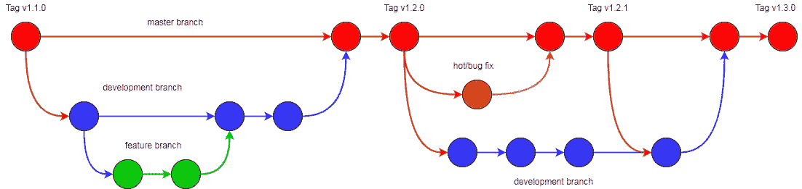

# 5 个 Git 最佳实践

> 原文：<https://levelup.gitconnected.com/5-git-best-practices-5617fcaada05>

Git 可以说是当前软件开发中最流行的源代码控制系统。一旦一个项目和团队开始成长，保存其代码的存储库的维护方式会开始影响开发的效率。


弗拉德·希利塔努在 [Unsplash](https://unsplash.com?utm_source=medium&utm_medium=referral) 上拍摄的照片

这些最佳实践将有助于保持存储库的整洁，有助于在问题出现之前解决问题，将项目的技术债务保持在最低限度，并且随着团队的成长，使项目跟踪更容易、更容易。

# 1 .使用变更日志进行标记和版本控制

一旦一个项目开始开发更多的特性，你需要开始标记你的发布。许多团队现在每两周发布一次新代码，一些更有雄心的团队将会有每日发布。随着代码的发布，拥有一个结构化的标签系统和一个变更日志会让每个人更容易知道项目中发生了什么变化。另一种方法是查看提交日志的历史记录。标记也让团队能够回滚到以前的版本。

有很多方法来标记代码。许多项目遵循的标准是永远版本化；更多详情[此处](https://semver.org/)。语义版本化是指为应用程序中的重大变更保留一个主版本号，为不希望破坏任何现有功能的小特性变更保留一个次版本号，为小变更和错误修复保留一个补丁版本号。

与 SemVer 一起，CHANGELOGS 帮助团队成员了解每个版本的最新变化。这使得团队成员更容易关闭一个项目几个月，然后回来并更快地进入状态。它也有助于任何可能在自己的工作中使用您的应用程序或项目的人。在这里可以找到保存变更日志的标准。

# 2 .使用分支策略

当小特性被推向生产时，特性开发开始跨越几个月和几个星期，拥有一个一致同意的开发分支策略变得至关重要。对于许多在持续集成模型下开发的团队来说，一个流行的策略是 Git Flow(文档[在这里](https://www.atlassian.com/git/tutorials/comparing-workflows/gitflow-workflow))。



Git 流程

Git Flow 在运行持续集成的团队中很受欢迎，他们需要在几周内不断开发新功能，同时处理需要立即上线的 bug 修复。你有一个主/主要分支代码保存在这是当开发工作完成。特性分支是从开发分支中分离出来的，一旦特性完成，就合并回开发分支。然后，当发布发生时，开发分支被合并到主环境中，标记并部署到测试环境中，然后部署到生产环境中。

当需要在生产中立即修补 bug 时，可以在主分支之外创建一个热修复分支，进行代码更改，合并回主分支，标记并部署到生产中。然后 master 被合并回开发分支。

# 3 .利用. gitattributes 文件

属性文件的一些优点是在更新图像文件时没有任何区别。另一个优点是，当一个团队的成员使用不同的操作系统时，文件结尾字符会有所不同。当在文件中做一个小的改变时，一个 diff 可以显示每一行都被改变了。

另一个优点是不跟踪图像或其他二进制文件的差异。下面是一个从 [GitHubs 帮助部分](https://docs.github.com/en/github/using-git/configuring-git-to-handle-line-endings)提取的. gitattributes 文件的例子。

```
# Set the default behavior, in case people don't have core.autocrlf set.
* text=auto

# Explicitly declare text files you want to always be normalized and converted
# to native line endings on checkout.
*.c text
*.h text

# Declare files that will always have CRLF line endings on checkout.
*.sln text eol=crlf

# Denote all files that are truly binary and should not be modified.
*.png binary
*.jpg binary
```

# 4 .利用. gitignore 文件

维护一个忽略文件的原因主要是为了确保您的存储库不是不需要的被污染的文件；构建文件、依赖项、日志文件以及您或您的团队通常不主动维护的文件。GitHub 维护着一个包含不同。gitignore 根据代码库和项目类型可以使用的模板，[这里](https://github.com/github/gitignore)。

# 5 .设定编码风格标准

编码风格对项目来说似乎无关紧要，可以被认为是一般的项目最佳实践，而不仅仅是 git 存储库最佳实践。不管怎样，随着团队的成长，风格差异开始变得更加明显。这些变化可能会出现在相同的文件中，使代码更难阅读。

> 项目中的所有代码应该看起来像是一个开发人员写的。

保持编码标准有几种不同的方法。一种是使用. editorconfig 文件。一个[编辑器配置](https://editorconfig.org/)使用带有各种 ide 的插件，以便在保存文件时自动应用代码样式。这些可以自动应用的样式规则可以是制表符的保存方式、制表符的空格数和最大行长度。

另一种方法是使用棉绒。linter 用于静态扫描您的代码库，寻找一组规则。可以设置这些规则来寻找特定的样式，比如如何将 if 语句的括号放在新的一行上。或者，规则可以设置编码最佳实践，比如不允许 switch 语句中出现错误。这里有一个列表，可以在 GitHub 上找到各种语言的 linters。

# 结论

这些最佳实践将帮助团队成长，以及项目和代码库的扩展。无论是使代码审查更清晰，还是更容易找到 bug 的来源，使用一些最佳实践可以帮助团队更快地前进，并避免技术债务。祝您实现这些最佳实践好运，并祝您编码愉快！