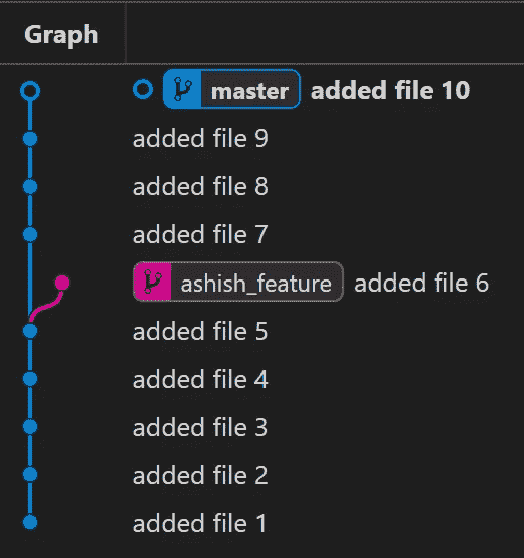
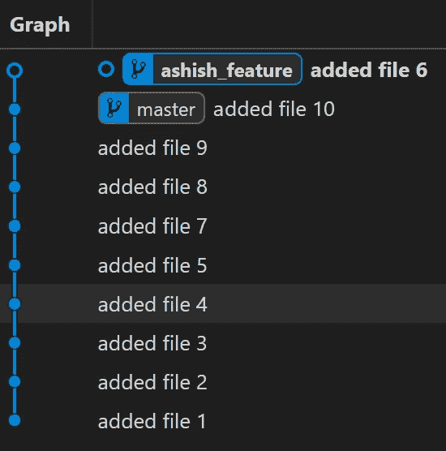
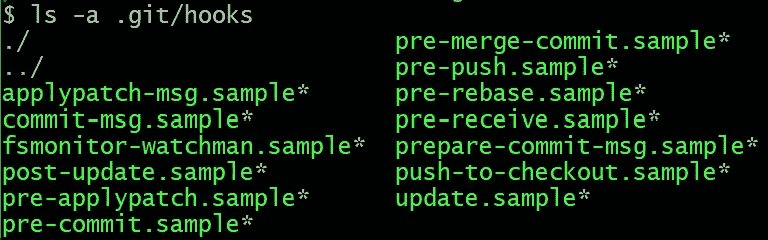
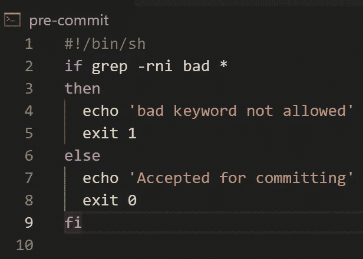

# 超越初级开发人员的 5 个 Git 概念

> 原文：<https://levelup.gitconnected.com/5-git-concepts-to-move-beyond-the-beginner-developer-7cc57e83d98f>

这里有 5 个概念可以帮助你提高开发人员的 Git 技能。

照片由 [Praveen Thirumurugan](https://unsplash.com/@praveentcom?utm_source=medium&utm_medium=referral) 在 [Unsplash](https://unsplash.com?utm_source=medium&utm_medium=referral) 上拍摄

# 1.git 精选

这类似于从树枝(也就是你的仓库的一个分支)上摘最好的樱桃(也就是提交)。

看看下面的例子，我们创建了一个存储库并将`file1`添加到`master`分支。

[Julia peretiako](https://unsplash.com/@julie_peretiatko?utm_source=medium&utm_medium=referral)在 [Unsplash](https://unsplash.com?utm_source=medium&utm_medium=referral) 上拍摄的照片

阅读下面更多关于`git cherry-pick`的内容:

 [## git-git-樱桃-pick 文档

### git cherry-pick master 在 master 分支的顶端应用由 commit 引入的更改，并创建一个新的…

git-scm.com](https://git-scm.com/docs/git-cherry-pick) 

# 2.git 标签

这个 git 命令帮助您在存储库中创建标签。

使用它，您可以在存储库历史中的特定提交处设置一个指针。

在下面的例子中，我创建了一个名为`new_feature`的新分支，向该分支提交了一个文件，向提交添加了一个名为`important_change`的标签，然后切换回`master`分支。

*   要查看所有标签，可以使用命令`git tag`
*   要查看特定的标签，可以使用命令`git show <tag_name>`
*   人们可以使用`git tag -a <tag_name> -m <tag_message>`来注释标签

照片由[安格尔·坎普](https://unsplash.com/@angelekamp?utm_source=medium&utm_medium=referral)在 [Unsplash](https://unsplash.com?utm_source=medium&utm_medium=referral) 拍摄

阅读下面关于`git tag`的更多信息:

 [## Git 标签

### 像大多数 VCS 一样，Git 能够将存储库历史中的特定点标记为重要点。通常情况下…

git-scm.com](https://git-scm.com/book/en/v2/Git-Basics-Tagging) 

# 3.git 贮藏

假设你正在做一个项目。

您已经编写了几行代码，但是还没有提交更改。

您决定从一个干净的工作目录开始，但不想放弃所有以前的工作。

没问题！

当您使用`git stash`时，您所有的更改都存储在一个**堆栈**中，并且您会得到一个干净的工作目录来继续工作。

默认情况下，库存被列为`WIP on <branchname> : <commit_details>`。

一旦你准备好返回，你可以使用`git stash pop`或`git stash apply`在当前工作目录的状态上“应用”你的工作。

在此之前，你可以随时使用`git stash list`来检查藏匿历史。

照片由[拉-Rel 复活节](https://unsplash.com/@lastnameeaster?utm_source=medium&utm_medium=referral)在 [Unsplash](https://unsplash.com?utm_source=medium&utm_medium=referral) 上拍摄

点击此处了解更多关于`git stash`的信息:

 [## Git - git-stash 文档

### 当您想要记录工作目录和索引的当前状态，但是想要回到…

git-scm.com](https://git-scm.com/docs/git-stash) 

# 4.git rebase

它是一个 git 命令，帮助将特定提交的位置更改为分支的尖端。

看看下面的例子。

接下来，存储库看起来如下所示:

重设基础前的存储库(图片由作者提供；在 VSCode 上使用 Git 图形扩展)

接下来，我们切换到`master`分支，并将`ashish_feature`重置为`master`的尖端。

现在，存储库如下所示:

重置后的存储库(图片由作者提供；在 VSCode 上使用 Git 图形扩展)

点击此处阅读更多关于`git rebase`的信息:

 [## Git - git-rebase 文档

### 移动到创建新提交的起始点。如果未指定- onto 选项，则起点是…

git-scm.com](https://git-scm.com/docs/git-rebase) 

# 5.Git 挂钩

Git 挂钩是在 git 存储库中发生动作时可以执行的定制脚本。

这些有两种类型:

*   **客户端钩子**:在提交、合并等操作之前运行
*   **服务器端钩子**:在网络操作期间运行，比如接收推送的提交

在存储库中，钩子位于`.git/hooks`目录中。

作者图片

再来说说`pre-commit`挂钩。

## 提交前挂钩

它是在文件提交到存储库之前执行的一个钩子。

在下面的例子中，我们用下面的 bash 脚本创建了一个`pre-commit`钩子文件并将其添加到`.git/hooks`目录中。

提交前挂钩(图片由作者提供)

如果我们创建一个内容中带有“bad”关键字的新文件，并尝试将其提交到存储库，这将抛出一个错误(`bad keyword not allowed`)，并且该文件将不会被提交。

阅读下面关于 Git 挂钩的更多信息:

 [## Git - Git 挂钩

### 像许多其他版本控制系统一样，Git 有办法在某些重要动作发生时触发定制脚本…

git-scm.com](https://git-scm.com/book/en/v2/Customizing-Git-Git-Hooks) 

*非常感谢你阅读这篇文章！*

 [## 通过我的推荐链接加入 Medium-Ashish Bama nia 博士

### 阅读 Ashish Bamania 博士(以及 Medium 上成千上万的其他作家)的每一个故事。您的会员费直接…

bamania-ashish.medium.com](https://bamania-ashish.medium.com/membership) 

*对了，你熟悉* `*git reflog*` *吗？*

 [## 有困难的时候，Git Reflog！

### 学习用 Git 恢复丢失的提交

levelup.gitconnected.com](/when-in-trouble-git-reflog-87341389f061) 

# 分级编码

感谢您成为我们社区的一员！在你离开之前:

*   👏为故事鼓掌，跟着作者走👉
*   📰查看[升级编码出版物](https://levelup.gitconnected.com/?utm_source=pub&utm_medium=post)中的更多内容
*   🔔关注我们:[Twitter](https://twitter.com/gitconnected)|[LinkedIn](https://www.linkedin.com/company/gitconnected)|[时事通讯](https://newsletter.levelup.dev)

🚀👉 [**加入升级人才集体，找到一份神奇的工作**](https://jobs.levelup.dev/talent/welcome?referral=true)