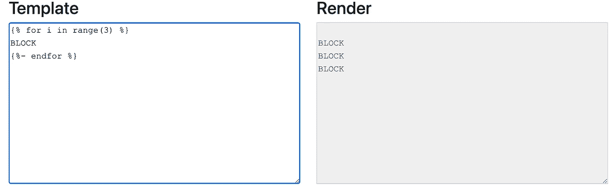

# 成为金贾大师的 5 招

> 原文：<https://levelup.gitconnected.com/5-hacks-to-become-a-jinja-master-c5d8c5606a96>


曼努埃尔·科森蒂诺在 [Unsplash](https://unsplash.com?utm_source=medium&utm_medium=referral) 上拍摄的照片

当我第一次听说 Jinja 时，我对能够在我的 SQL 查询和 HTML 文件中注入一些 Python 逻辑的想法感到非常兴奋。我终于要在字段列表中循环了！

但是这种纯粹的喜悦并没有持续很长时间，很快就导致了沮丧，因为我意识到很多 Python 内置函数在 Jinja 中并不工作。因此，经过一点研究和大量测试，这里有一些我在编写 Jinja 语法时使用的最有用的技巧！

# 黑客#1:用在线解析器测试


作者截图

隔离一段 Jinja 语法来找出问题所在通常很方便；你可以创建一个 Jinja 环境和模板，但是使用像[这样的在线解析器可能会更快！](http://jinja.quantprogramming.com/)

# 黑客#2:使用循环变量

```


{{loop.index}}.{{name}}

```

有时候，你想要迭代条目和索引，就像 python *enumerate* 函数一样。Jinja 给了我们一些循环变量，比如返回循环长度的 *loop.length* 或者返回 True 的 *loop.last* 如果这是列表的最后一项。

```
1.peter
2.michelle
3.richard
```

# 黑客#3:创建宏

```

Hello {{name}}!

{{greet("Javier")}}
```

如果你发现自己一遍又一遍地重复使用相同的 Jinja 语法，你应该创建一些宏。宏是你可以在模板中调用的 Jinja 函数。它们可以接受参数并返回一个字符串，甚至是本地 Python 对象，如列表。

# 黑客#4 拥抱设置块

嵌套 Jinja 时的转义括号不是小菜一碟。谢天谢地，设置块使它更容易！

```



Hello {{first_name}} {{last_name}}!

{{greeting}}
```

使用 set 块，您可以像在语句之外一样编写 Jinja 语法。

# 黑客#5 学习间距

所有那些烦人的白线…一劳永逸，让我们学习间距。

关键是 Jinja 不添加空格，*您*添加。您在代码中添加了这些空格，但不希望它们出现在编译后的文件中。


作者截图

这里，您跳过了开始语句后的一行。如果您只跳过了块后的一行，您将得到以下结果:


作者截图

如果你想让所有的块都在同一行，你可以把所有的东西都放在同一行。


作者截图

可读性不是很好，是吗？幸运的是，有一种比从代码中删除空格更好的方法。

在 beginning 语句的结束%之前添加减号会删除块开头的白线。


作者截图

在 ending 语句的开始%后面添加一个减号可以删除块末尾的白线。



作者截图

我希望这些提示对你的下一个模板有所帮助。如果你想了解更多关于 Jinja 的信息，你可以查看他们的文档。

感谢您的阅读！