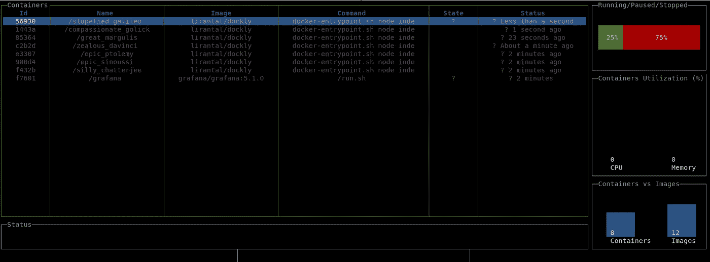
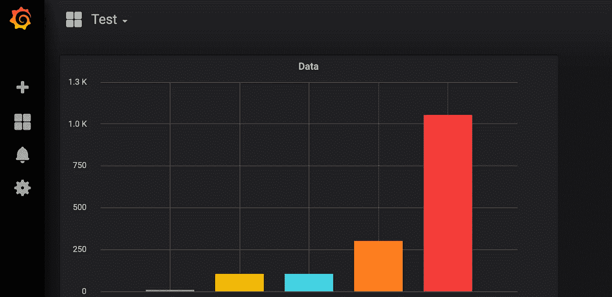
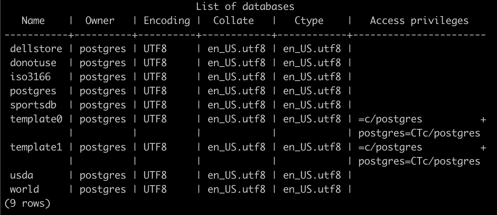
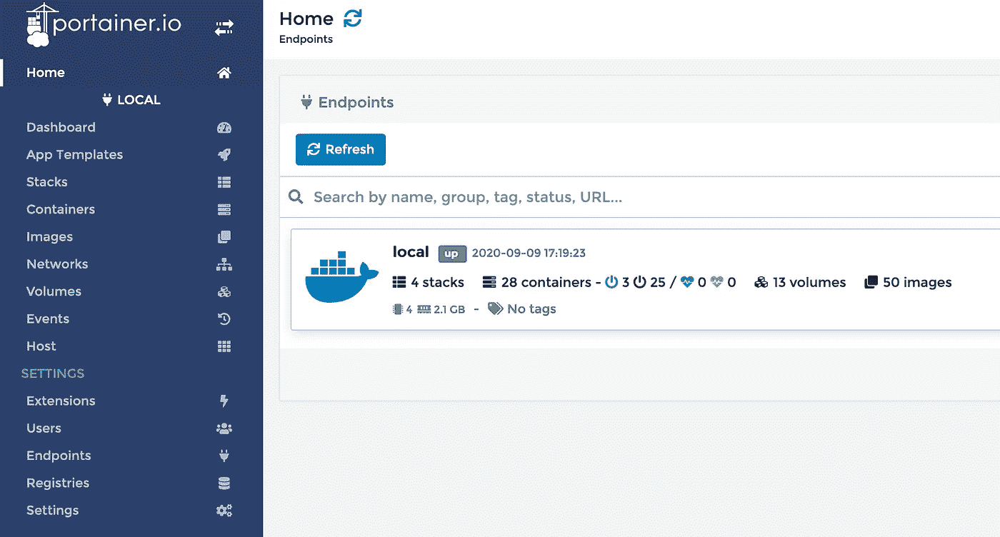

# 5 张适用于开发人员工作站的便捷 Docker 图片

> 原文：<https://levelup.gitconnected.com/5-handy-docker-images-for-developer-workstations-4e81fffa985b>


Guillaume Bolduc 在 [Unsplash](https://unsplash.com/s/photos/containers?utm_source=unsplash&utm_medium=referral&utm_content=creditCopyText) 上拍摄的照片

我们生活的容器化世界可以使我们作为开发人员的工作更简单、更简洁，或者通过使甚至最琐碎的任务复杂化而将我们推向疯狂的边缘。根据您在项目中实现 Docker 容器的方式，这可能是一个真正的摩擦点。

对于某些应用程序来说，Docker 有助于提高生产率。它允许您快速启动并运行，而无需安装大量的依赖项，也不会因为各种程序的不同版本而污染您的系统。对于依赖于特定版本的编程语言或库的包来说尤其如此。当你不使用隔离容器时，你可能会很快发现自己处于一个艰难的境地，不得不卸载和重新安装不同的东西，这些东西不能很好地一起使用。

如果您只是在容器中运行这些类型的应用程序，那么这些问题就会消失。容器拥有所有必需的依赖项，您不必担心在主机系统上安装任何东西。你只需要确保你有 Docker 可用，并能以稍微不同的方式将这些应用集成到你的工作流程中。

与其专注于在一个容器中运行整个应用程序，不如让我们来看看一些很棒的 Docker 容器图片，它们让开发应用程序本身对个人来说更容易、更快。这些都是在 Docker 中的本地机器上运行的很好的选择，因为它们允许您快速测试和部署东西，然后在没有大量剩余资源的情况下继续前进。其中一些图像还提供了对 Docker 在您的系统上的行为的深入了解，并可以让您更清楚地了解资源使用等情况。让我们开始吧。

## [AWS-CLI](https://hub.docker.com/r/amazon/aws-cli)

如果你在亚马逊 AWS 云中运行任何服务，那么你可能至少使用过 [AWS CLI](https://aws.amazon.com/cli/) 一次。这个命令行实用程序允许您在 AWS 中管理和部署资源，而无需离开舒适的控制台。安装 AWS CLI 并不是世界上最复杂的事情，您只需抓取安装包并遵循一些基本步骤即可。

那么在 Docker 内部运行它有什么好处呢？

当您在 Docker 中运行这样的实用程序时，您会得到抽象、隔离和可移植性等显而易见的东西，但您也会得到专用、安全的环境来运行您的管理任务。这个环境也非常容易更新，你只需从 Docker Hub 中指向一个不同的标签，就可以了。

在针对 AWS 基础设施使用强大的工具时，保持安全和最新是非常重要的。

以下是如何开始使用此图像的示例:

```
docker run --rm -it amazon/aws-cli <command>
```

## [码头区](https://hub.docker.com/r/lirantal/dockly)



使用 Dockly 管理一些本地容器。

管理 Docker 容器有多种方法。有大量不同的图形界面可以让你管理甚至创建容器。 [Dockly](https://lirantal.github.io/dockly/) 将成熟的网络用户界面和简单的命令行界面区分开来。Dockly 为您提供了一个交互式的 [ncurses](https://en.wikipedia.org/wiki/Ncurses) 风格的界面，用于管理容器、查看日志和监视系统资源。

您可以使用底部菜单中的箭头键和各种功能键在界面中导航。Dockly 让您无需离开窗口即可查看每个容器的日志。您还可以查看系统上资源和内存使用情况汇总统计数据。还有一些适用于所有容器的方便的命令，比如" *Stop All Containers* "，如果您对系统要求太高，这将很有帮助。

Dockly 的入门非常简单，以下是快速试用的方法:

```
docker run -it -v /var/run/docker.sock:/var/run/docker.sock lirantal/dockly
```

查看 Dockly 网站[了解更多选项和信息。](https://lirantal.github.io/dockly/)

## [格拉夫纳](https://hub.docker.com/r/grafana/grafana/)



在 Grafana 中绘制一些测试数据。

这种广受欢迎的数据可视化应用程序已经成为绘制和显示各种分析数据的普遍标准。虽然 Grafana 作为一个为团队和组织托管视觉效果的集中式平台非常受欢迎，但它也可以非常方便地在本地自行开发。当您需要在生产中做同样的事情时，在本地机器上从其他开发容器或数据库中绘制数据的能力为您的成功奠定了基础。

在一次性 Grafana 沙盒中测试您的查询和图表配置，使您不必担心破坏任何东西或控制访问。这也允许您将 Grafana 与其他本地运行的容器(如测试数据库)耦合在一起。一个很好的例子是将 Grafana 实例与我们下一个方便的图像 postgres-dataset 配对。

使用以下命令启动您自己的 Grafana 实例(*该命令不包括设置永久数据卷，* [*单击此处*](https://grafana.com/docs/grafana/latest/installation/docker/) *了解更多部署选项*):

```
docker run -d --name=grafana -p 3000:3000 grafana/grafana
```

## [Postgres-dataset](https://hub.docker.com/r/aa8y/postgres-dataset/)

在开发过程中，访问预先填充的测试数据数据库是非常宝贵的。毕竟，我们不想在真实的生产数据上测试我们的代码，不是吗？ [Postgres-dataset](https://hub.docker.com/r/aa8y/postgres-dataset/) 提供了一个现成的图像，其中包含大量数据集，您可以根据这些数据集进行查询。从国家人口数据到体育信息，数据集应有尽有。如果您只想包含特定的选择，甚至可以自定义数据集。



来自 [postgres-dataset](https://hub.docker.com/r/aa8y/postgres-dataset/) 的示例数据库。

当然，您可以用自定义数据构建自己的空数据库实例，但这可能很耗时。建立数据库并插入所有的测试数据可能是一个令人讨厌的过程，这只会让您无法进行实际的开发工作。如果你所需要的是在最后一行要查询的东西，那么这是一个非常棒的选择，可以节省很多时间。

如果您仍然不喜欢预先填充的数据，并对自己的种子感兴趣，那么 [*Seed Knex PostgreSQL 数据库与 JSON 数据*](http://Seed Knex PostgreSQL Database with JSON Data) 是由 [Robbie Jaeger](https://medium.com/u/85e5d73e066b?source=post_page-----4e81fffa985b--------------------------------) 撰写的一篇优秀文章。这将引导您使用 [Knex.js](http://knexjs.org/) 建立一个系统来播种您自己的数据。

使用以下命令对 postgres-dataset 进行测试:

```
docker run -d --name pg-ds-latest aa8y/postgres-dataset:latestdocker exec -it pg-ds-latest psql
```

## [搬运工](https://hub.docker.com/r/portainer/portainer)

你是否曾经厌倦了在命令行上管理你的 Docker 容器？达克利不太合适吗？你希望有一个时髦的网络界面让你可以查看事情的状态吗？Portainer 为您提供了*和一些*。这是一个您可以运行的映像，它将连接到您的本地 Docker 守护进程，并为您提供一个漂亮的 web 界面。



使用 [Portainer.io](https://www.portainer.io/) 管理本地集装箱。

您可以管理正在运行的容器，部署新的容器，甚至在浏览器中编写 docker 文件。这消除了必须记住一堆 Docker CLI 命令的挫折感，并让您可视化地管理您的容器。然而，Portainer 的功能并不止于此。这是一个用于管理 Docker 的功能丰富的系统，还可以让你管理底层主机，控制资源，甚至连接到远程机器的 Docker 守护进程。

通过查看 Portainer 的部署指南[，刷新 Portainer 的 Docker 界面。](https://www.portainer.io/documentation/deploy-portainer-docker-swarm/)

*感谢阅读！Docker 是容器化企业应用程序的强大工具，但也可以提高个人开发环境的生产率。利用我们讨论过的容器化实用程序，可以为您提供一个更加模块化、可扩展的工作环境，在您的系统中散布的依赖包要少得多。在*[*Twitter*](https://twitter.com/Tate_Galbraith)*上发布一些你自己喜欢的图片，让开发变得轻而易举。*