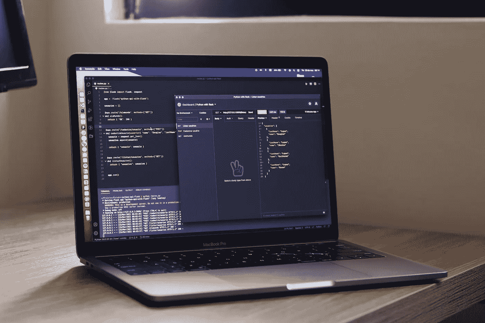
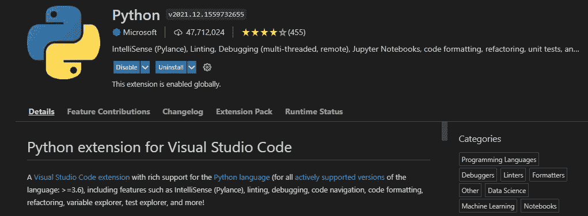
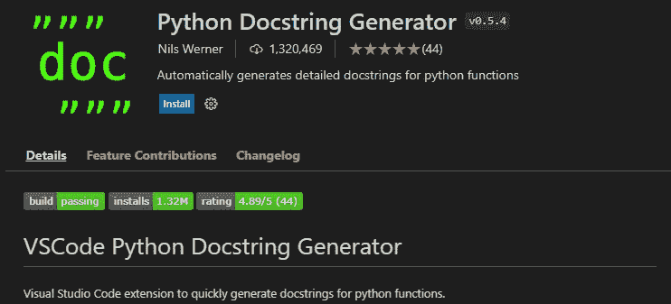
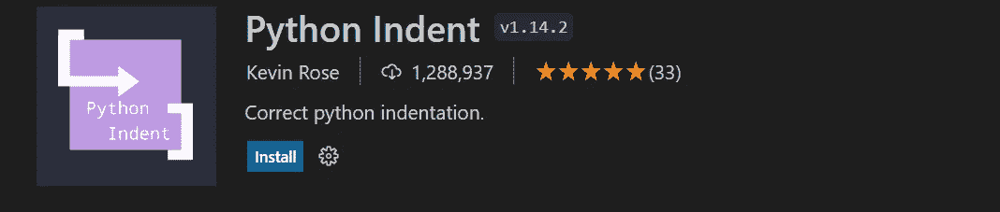
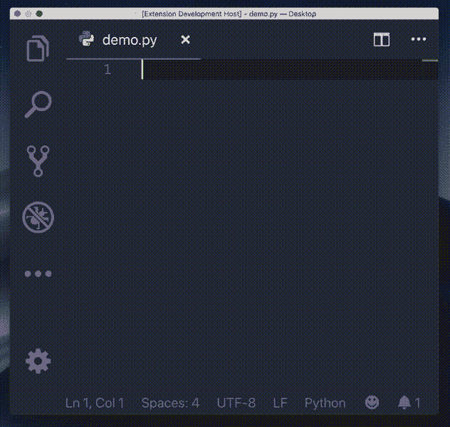
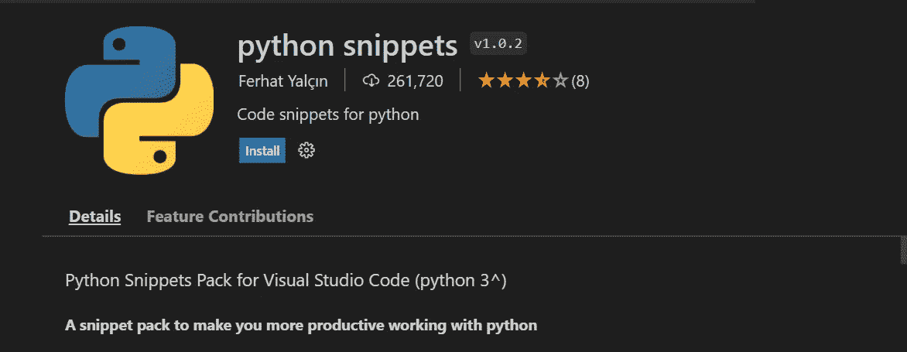
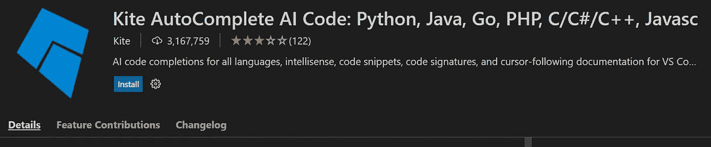
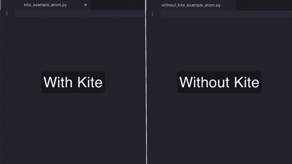

# 每个 Python 开发者都需要的 5 个重要的 VS 代码扩展

> 原文：<https://levelup.gitconnected.com/5-important-vs-code-extensions-every-python-developer-need-64259b9c4965>

## 优化 Python 开发和用 VS 代码编写更好代码的重要扩展

由[道格拉斯·洛佩斯](https://unsplash.com/@douglasamarelo?utm_source=unsplash&utm_medium=referral&utm_content=creditCopyText)在 [Unsplash](https://unsplash.com/s/photos/python-development-vscode?utm_source=unsplash&utm_medium=referral&utm_content=creditCopyText) 拍摄的照片

Visual Studio 代码是一个源代码编辑器，可以在 Windows、Linux 和 macOS 上使用。在其初始状态，它已经包括了调试、智能代码完成、代码片段、语法高亮、代码重构、GIT 和包管理器等特性。

有了包管理器，您就可以访问针对各种类型的开发人员和各种编程语言的大规模扩展数据库。无论您是前端、后端、JavaScript、Python 还是数据科学家，您都会找到一个可以依赖的有用扩展。

特别是对于 Python 开发人员，我收集了以下 5 个应该使用的扩展，因为它们将帮助您优化 Python 开发，并帮助您改进代码。

# 1.计算机编程语言

这个扩展是每个 Python 开发人员的必备工具。微软自己为它的编辑器开发的，如果你用 VSCode 创建你的第一个`py`文件，它会被推荐。

安装此扩展后，您可以访问许多功能，如:

*   自动完成代码的 Python 智能感知
*   专门针对 Python 文件的智能代码格式化
*   调试 Python 代码的工具
*   手动输入测试工具

如果您尚未安装扩展，请[访问此链接并安装](https://marketplace.visualstudio.com/items?itemName=ms-python.python)

# 2.Python 文档字符串生成器

*虽然经常不维护，但是*文档字符串是 Python 中代码的重要组成部分。它们用于帮助其他开发人员理解你写的代码，并更有效地维护它。

使用此扩展，您可以访问以下功能(从插件页面):

*   快速生成一个 docstring 片段，可以通过 tab 键切换。
*   在几种不同类型的 docstring 格式之间进行选择。
*   通过 pep484 类型提示、默认值和变量名称推断参数类型。
*   支持 args、kwargs、decorators、errors 和参数类型

这个扩展遵循 PEP8 准则，将产生任何标准的 docstring 格式。

安装后，您可以使用它，方法是将光标指向您想要记录的定义正下方的行，然后键入`"""`,这将生成整个文档，您可以使用 TAB 键进行导航:

源码 Python Docstring 生成器插件页面— [链接](https://raw.githubusercontent.com/NilsJPWerner/autoDocstring/master/images/demo.gif)

# 3.Python 缩进

使用 Python 缩进，VSCode 能够在编写 Python 代码时纠正 Python 缩进。

每当您在任何 Python 上下文中按下`Enter`时，这个扩展将解析您的 Python 文件并修复缩进问题。

请点击此处查看它的实际应用:

源代码 Python Ident 插件页面— [链接](https://raw.githubusercontent.com/kbrose/vsc-python-indent/master/static/demo.gif)

# 4.Python 片段

这个扩展提供了许多 Python 片段，对我来说，它是每个 Python 开发者的强制性扩展。

有了这个扩展，您将可以访问许多片段，如:

*   **所有 python 内置代码片段** +每个方法至少有一个例子
*   **所有 python 字符串片段** +每个方法至少有一个例子
*   **所有 python 列表片段** +每个方法至少一个示例
*   **所有 python 集合片段** +每个方法至少一个示例
*   **所有 python 元组片段** +每个方法至少一个示例
*   **所有 python 字典片段** +每个方法至少一个示例
*   **附加其他代码片段:** if/else，for，while，while/else，try/catch，file process
*   **附加类片段** +面向对象的类示例(多态性、封装、继承)

请点击此处查看它的实际应用:

源代码 Python 片段插件页面— [链接](https://marketplace.visualstudio.com/items?itemName=frhtylcn.pythonsnippets)

# 5.风筝

Kite 是一个 AI 驱动的编程助手，它可以帮助你在 Visual Studio 代码中更快地编写 Python 代码，因为它可以节省你的击键时间，并在正确的时间向你显示正确的信息。

此外，Kite 适用于所有主要的编程语言: **Python** 、 *Java、Go、PHP、C/C#/C++、Javascript、HTML/CSS、Typescript、React、Ruby、Scala、Kotlin、Bash、Vue 和 React。*

请点击此处查看它的实际应用:

源码风筝插件页面— [链接](https://marketplace.visualstudio.com/items?itemName=kiteco.kite.)

# 结束语

依我拙见，我认为对于 Python 开发者来说，这五个 VSCode 扩展真的很棒。如果您还没有在 VSCode 中安装它们，那么您现在应该考虑安装它们，因为它们可以帮助您提高 Python 开发。

我很想听听你的想法和想法。如果您能提供另一个重要的 VSCode 扩展，请不要犹豫，在这里发表评论。另外，如果你有任何问题，请写在下面。

*✍️写的*

***保罗·克努斯*** *丈夫，两个孩子的父亲，极客，终身学习者，科技爱好者&软件工程师*

***问好*** *🙌***:*[*推特*](https://www.twitter.com/paulknulst) *，*[*LinkedIn*](https://www.linkedin.com/in/paulknulst/)*，*[*GitHub*](https://github.com/paulknulst)*，* [*个人网站*](https://blog.knulst.de/)*