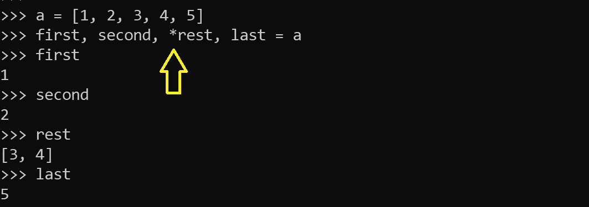

# 你可能不知道的 5 个中级 Python 技巧

> 原文：<https://levelup.gitconnected.com/5-intermediate-level-python-tricks-you-maybe-didnt-know-b0340ad33e7a>

让我们把 Python 代码做得更好！

这是一些有用的代码结构的集合，在某些情况下，这些代码结构可以帮助您使 Python 脚本看起来更整洁，可读性更好。这个集合的目的是比“反转一个字符串”、“交换两个数字”或类似的基本技巧更高级一点。

照片由 [Unsplash](https://unsplash.com?utm_source=medium&utm_medium=referral) 上的[尼克·费因斯](https://unsplash.com/@jannerboy62?utm_source=medium&utm_medium=referral)拍摄

## 高级拆包

假设我们有一个列表。我们想做的是，从列表的开始部分取出一些元素，从末尾部分取出一些元素。此外，我们希望有一个剩余的列表，没有我们已经采取的元素。这可以在如下一行中完成:

开箱(图片由作者提供)

为什么有效？这里的技巧隐藏在一个“rest”变量和它前面的一个星号中。在 Python 中，星号(或者有人更喜欢称之为星号)将序列或集合分解成单独的参数。这有时非常方便——例如，当我们需要将某个集合中的值作为函数的位置参数传递时。下面的例子应该给出一些关于如何使用它的基本直觉。

星形符号用法(图片由作者提供)

一旦我们理解了 Python 中解包的工作原理，第一个例子背后的逻辑就变得显而易见了。我们为变量“rest”分配了一些值，该变量处于“未打包”状态(有星号)，因此在“打包”状态(当访问时前面没有星号)下，它包含分配的值作为一个集合。

## 列表/字典理解中的嵌套 for 循环

让我们想象一下，我们想要一个包含其他两个列表项的所有组合的列表。让我们用一行程序来完成它。

列表理解(图片由作者提供)

很酷，对吧？如果需要，我们可以有更多的“for”循环，而不是只有两个。但是要小心这个。我见过这种代码风格的一些非常有趣的错误。考虑下面的例子:

字典理解(图片由作者提供)

乍一看，在 dict comprehension 中使用嵌套 for-loops 似乎是一个好主意，可以用两个给定列表中的键和值创建 dict。但是，观察上面例子中变量“b”的结果——得到的结果不是预期的结果，因为字典中的所有元素现在都有相同的值“C”。

为什么会这样？首先，值“A”被分配给所有的键。然后所有的值都被“B”覆盖了。而在最后一次迭代中它们都变成了“C”。

相反，期望的结果可能已经实现，例如通过使用“zip”函数，如在上面的例子中对于变量“c”所展示的。

## 自定义排序

我们可以使用“排序”功能对集合进行升序排序。这很简单。

然而，如果我们需要以某种特定的、非标准的顺序对项目进行排序，事情可能会变得有点复杂。假设我们有一个列表，我们想对它的条目进行排序，但是我们想让所有偶数条目排在奇数条目之前。为此，我们可以使用“排序”函数的“key”参数，如下所示:

自定义排序(图片由作者提供)

通过这种方式，可以指定一个自定义函数，该函数将在对列表项排序之前应用于所有列表项。

## 海象操作员

可能你是通过它的正式名称“赋值表达式运算符”知道这个的。在需要同时检查和分配某些东西的情况下，它会有所帮助。请考虑下面的代码示例:

功能重(图片由作者提供)

这个代码有什么问题？显然，heavy 函数会被不必要地调用两次，导致总共睡眠 20 秒而不是仅仅 10 秒。通常这种类型的代码是这样写的:

重构的代码(图片由作者提供)

我们现在已经消除了对我们的重函数的不必要的调用，所以从技术上来说，现在一切都好了。但是我们能做得更好吗？让我们试试:

海象运营商(图片由作者提供)

这里我们使用了 walrus 操作符(注意当我们分配 heavy 函数的结果时有“:=”)。使用它的主要好处是代码更短更简单。这是因为 walrus 运算符允许我们进行赋值并立即使用赋值(例如在 IF 语句检查中)。

请注意，walrus 操作符相对较新，仅在 Python 版本 3.8 之后才可用。

## 链接的比较运算符

需要检查某个值是否在给定的区间内是一个非常常见的用例。典型的检查方法如下:

检查区间值(图片由作者提供)

然而，在 Python 中，这可以通过链接比较运算符以更优雅的方式编写。

链式比较运算符(图片由作者提供)

我想你会同意这样的代码可读性更好。简单明了。

## 一些最后的话

我希望您在这个 Python 技巧列表中找到了一些有用的见解，并且至少有一个描述的代码构造对您来说是新的。

感谢阅读！