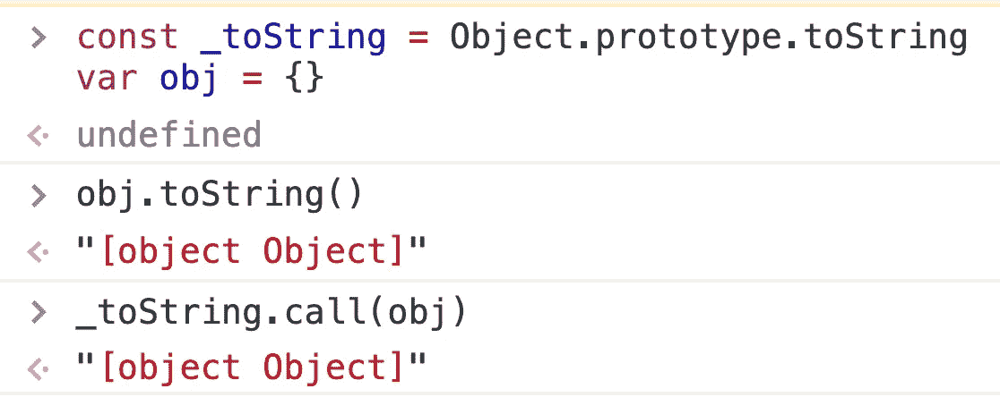
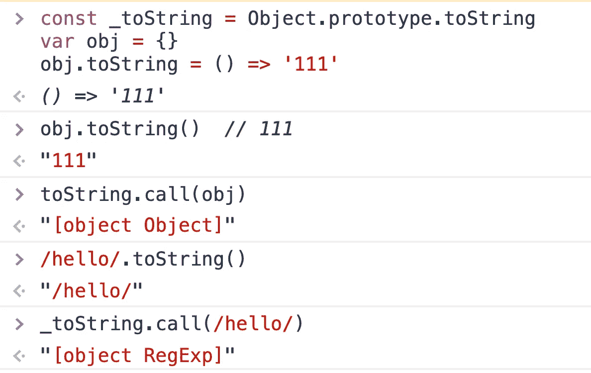
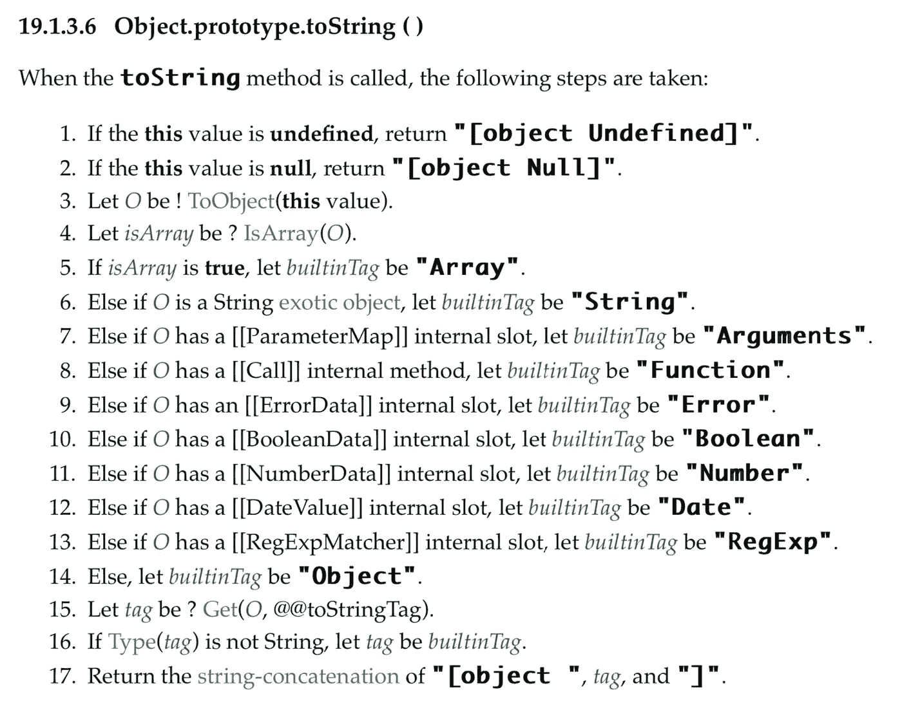
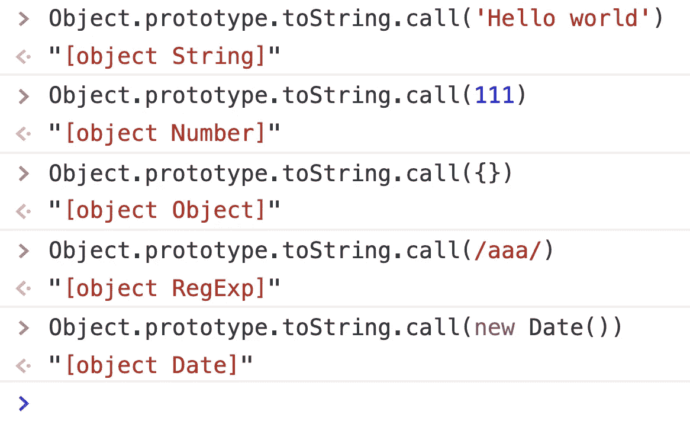
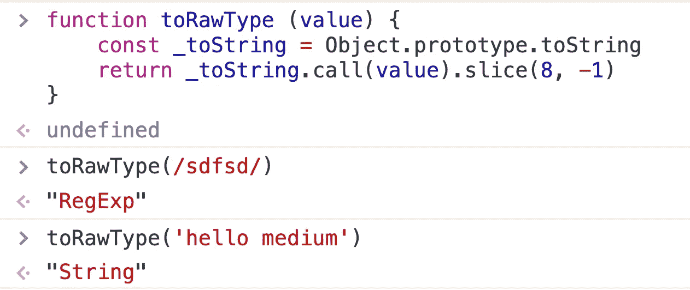
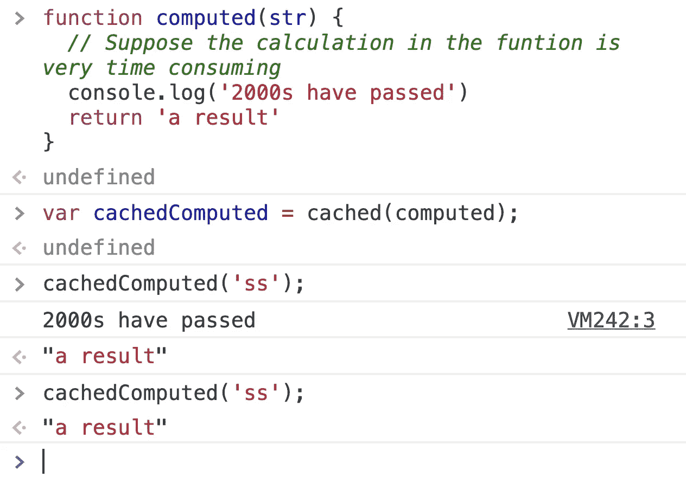
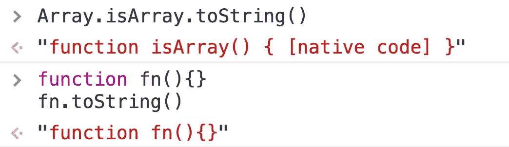

# 我从 Vue 源代码中学到的 5 个 JavaScript 技巧

> 原文：<https://levelup.gitconnected.com/5-javascript-tips-i-learned-from-vue-source-code-6095df4e9bc1>

## 从流行的 JS 框架的源代码中学习 JavaScript。


卡斯帕·卡米尔·鲁宾在 [Unsplash](https://unsplash.com?utm_source=medium&utm_medium=referral) 上拍摄的照片

我们知道，阅读知名框架的源代码可以有效提高编程水平。最近看了 vue2.x 源码，学到了很多 JS 相关的小技巧。然后我写了这篇文章，希望对你有帮助。

# 1.确定任何对象的具体类型

众所周知，JavaScript 中有六种原语数据类型(Boolean、Number、String、Null、Undefined、Symbol)和一种 object 数据类型。但是你知道对象数据类型可以细分成很多种子类型吗？对象可以是数组、函数、映射等。如果我们想得到对象的具体类型，应该怎么做？

在我们开始之前，让我们看看另一个问题:

> `Object.prototype.toString.call(arg)`和`String(arg)`有什么区别？

这两个表达式都试图将参数转换为字符串，但它们之间有所不同。

`String(arg)`会尝试调用`arg.toString()`或者`arg.valueOf()`，所以如果 arg 或者 arg 原型重写这两个方法，`Object.prototype.toString.call(arg)`和`String(arg)` 会得到不同的结果。

```
const _toString = Object.prototype.toString
var obj = {}obj.toString()  // [object Object]
_toString.call(obj) // [object Object]
```



在这种情况下，`String(arg)`和`Object.prototype.toString.call(arg)`的作用是一样的。

```
const _toString = Object.prototype.toString
var obj = {}obj.toString = () => '111'obj.toString()  // 111
_toString.call(obj) // [object Object]/hello/.toString() // /hello/
_toString.call(/hello/) // [object RegExp]
```



在这种情况下，`String(arg)`和`Object.prototype.toString.call(arg)`会有不同的结果。

ECMAScript 具有以下规则:



来自 EcmaScript

对于不同的对象，调用*object . prototype . tostring()*时会返回不同的结果。



而且*object . prototype . tostring()*的返回值始终是' ***【对象****'*+'***标签****'*+'***]***'。如果只想要中间的*标签*，可以通过正则表达式或者 *String.prototype.slice()删除两边的字符。*

```
function toRawType (value) {
    const _toString = Object.prototype.toString
    return _toString.call(value).slice(8, -1)
}toRawType(null) // "Null"
toRawType(/sdfsd/) //"RegExp"
```



通过上面的函数，我们可以得到一个 JavaScript 变量的类型。

您可以在以下位置找到该函数的 Vue 源代码:

[](https://github.com/vuejs/vue/blob/6fe07ebf5ab3fea1860c59fe7cdd2ec1b760f9b0/src/shared/util.js) [## vuejs/vue

### 🖖 Vue.js 是一个渐进的、可增量采用的 JavaScript 框架，用于在 web 上构建 UI。- vuejs/vue

github.com](https://github.com/vuejs/vue/blob/6fe07ebf5ab3fea1860c59fe7cdd2ec1b760f9b0/src/shared/util.js) 

(第 62 行)

# 2.缓存函数计算结果

如果有这样的功能:

```
function computed(str) {    
    // Suppose the calculation in the funtion is very time consuming        
    console.log('2000s have passed')
    return 'a result'
}
```

我们想要缓存函数操作的结果。以后调用时，如果参数相同，就不再执行该函数，而是直接返回缓存中的结果。我们能做什么？

我们可以写一个`cached`函数来包装我们的目标函数。这个缓存函数将目标函数作为参数，并返回一个新的包装函数。在`cached`函数中，我们可以用`Object`或`Map`缓存前一次函数调用的结果。

这里有一个例子:



您可以在以下位置找到该函数的 Vue 源代码:

[](https://github.com/vuejs/vue/blob/6fe07ebf5ab3fea1860c59fe7cdd2ec1b760f9b0/src/shared/util.js) [## vuejs/vue

### 🖖 Vue.js 是一个渐进的、可增量采用的 JavaScript 框架，用于在 web 上构建 UI。- vuejs/vue

github.com](https://github.com/vuejs/vue/blob/6fe07ebf5ab3fea1860c59fe7cdd2ec1b760f9b0/src/shared/util.js) 

(第 153 行)

# 3.将 hello-world 样式转换为 helloWorld 样式

当我们需要在大型项目上合作时，通用的代码风格是必要的。有些人可能习惯写`helloWorld`，有些人可能习惯写`hello-world`。为了解决这个问题，我们可以写一个将`hello-world`统一转换为`helloWorld`的函数。

```
const camelizeRE = /-(\w)/gconst camelize = cached((str) => {
  return str.replace(camelizeRE, (_, c) => c ? c.toUpperCase() : '')
})camelize('hello-world')
// "helloWorld"
```

[](https://github.com/vuejs/vue/blob/6fe07ebf5ab3fea1860c59fe7cdd2ec1b760f9b0/src/shared/util.js) [## vuejs/vue

### 🖖 Vue.js 是一个渐进的、可增量采用的 JavaScript 框架，用于在 web 上构建 UI。- vuejs/vue

github.com](https://github.com/vuejs/vue/blob/6fe07ebf5ab3fea1860c59fe7cdd2ec1b760f9b0/src/shared/util.js) 

(第 164 行)

# 4.确定 JS 运行环境

今天，随着前端的快速发展，我们的 JavaScript 代码可能会在不同的运行时环境中执行。为了更好地适应各种运行时环境，我们需要确定当前代码正在哪个运行时环境中执行。我们来看看 Vue 是如何决定运行环境的:

您可以在以下位置找到该函数的 Vue 源代码:

[](https://github.com/vuejs/vue/blob/dev/src/core/util/env.js) [## vuejs/vue

### 🖖 Vue.js 是一个渐进的、可增量采用的 JavaScript 框架，用于在 web 上构建 UI。- vuejs/vue

github.com](https://github.com/vuejs/vue/blob/dev/src/core/util/env.js) 

(第 6 行)

# 5.确定函数是本机的还是用户定义的

我们知道，JavaScript 中有两种类型的函数，一种由主机环境提供，另一种由用户自定义。这两个函数在转换为字符串时会有不同的结果。

```
Array.isArray.toString() // "function isArray() { [native code] }"**function** **fn**(){} 
fn.toString() // "function fn(){}"
```



本机函数 toString 的结果总是采用`function fnName() { [native code] }`格式。我们可以用这个来区分它们。

您可以在以下位置找到该函数的 Vue 源代码:

[](https://github.com/vuejs/vue/blob/a9a303009a4267b7f12b956741b4e34dfdc6566f/src/core/util/env.js) [## vuejs/vue

### 🖖 Vue.js 是一个渐进的、可增量采用的 JavaScript 框架，用于在 web 上构建 UI。- vuejs/vue

github.com](https://github.com/vuejs/vue/blob/a9a303009a4267b7f12b956741b4e34dfdc6566f/src/core/util/env.js) 

(第 58 行)

# 相关文章

[](https://medium.com/javascript-in-plain-english/learn-javascript-from-vue-source-code-d9d8516ea9c4) [## 从 Vue 源代码学习 JavaScript

### 阅读这篇文章不需要 Vue 的背景知识。

medium.com](https://medium.com/javascript-in-plain-english/learn-javascript-from-vue-source-code-d9d8516ea9c4)