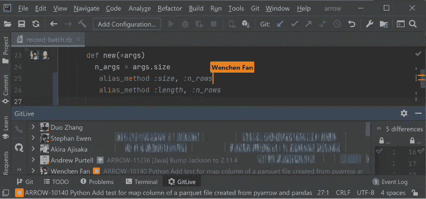
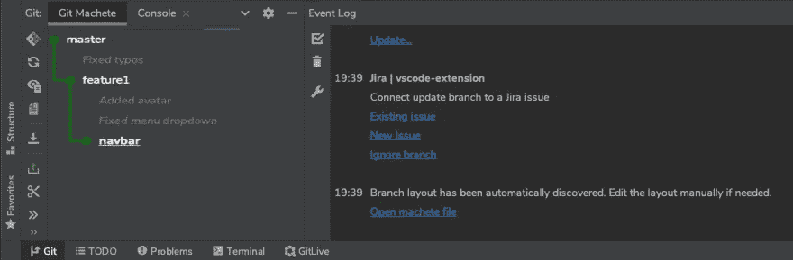
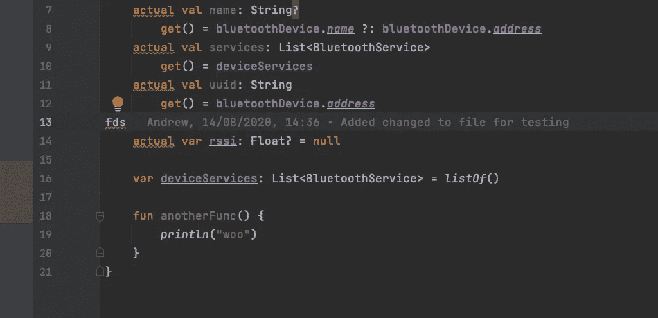
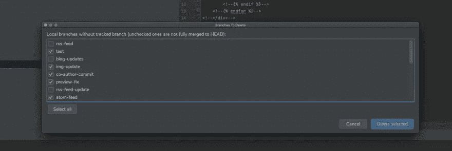
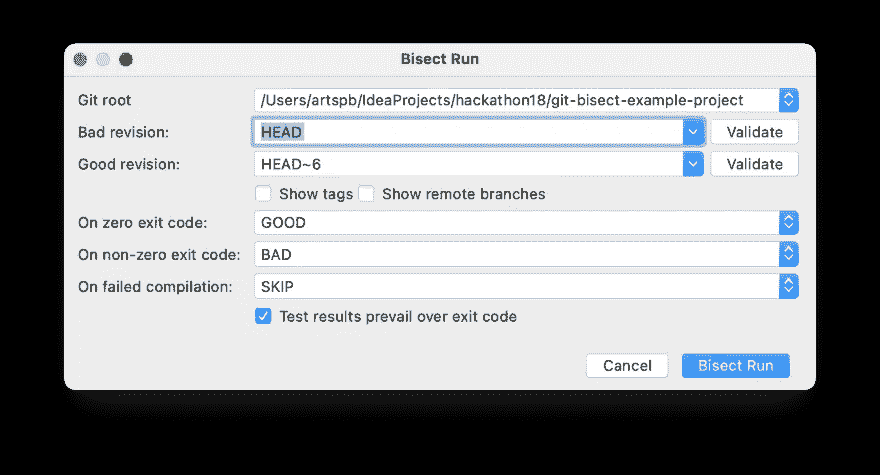

# 5 个 JetBrains 插件将内置的 Git 支持提升到一个新的水平！

> 原文：<https://levelup.gitconnected.com/5-jetbrains-plugins-to-upgrade-the-built-in-git-support-to-the-next-level-20397ef6f6f5>

Artem Sapegin 在 [Unsplash](https://unsplash.com/s/photos/jetbrains?utm_source=unsplash&utm_medium=referral&utm_content=creditCopyText) 上拍摄的照片

与所有 JetBrains IDEs 捆绑在一起的 Git 插件实际上非常令人印象深刻，它本身是一个成熟的 Git 客户端，几乎具有独立客户端(如 SourceTree、Tower 或 GitKraken)的所有功能，但内置于 IDE 中。

但是，你可以用更多的特性来增强你的 IDE 对 Git 的支持——请允许我向你展示 5 个构建在 Git 之上的插件，它们用超酷的新超能力为它增压！

# [GitLive](https://plugins.jetbrains.com/plugin/11955-gitlive)

这个插件是给所有团队成员的，GitLive 让 Git，嗯，活起来了。

它添加了一个工具窗口，您可以在其中查看来自存储库的协作者(如果他们在线)以及他们正在进行的所有工作(他们正在处理的尚未合并的分支/问题/PRs)，您可以在其中查看不同的文件更改，所有更改都是实时更新的。

他们的旗舰特性，即时合并冲突检测，提供了潜在合并冲突的早期警告。实时装订线指示器显示您的队友对您当前正在处理的文件进行了哪些更改，这非常有用，尤其是在较大的项目中。

最重要的是，GitLive 还支持通过一次点击(或键盘快捷键)与一个合作伙伴启动 Code With Me 会话，对于那些使用 VS 代码的讨厌的合作者，甚至还有跨 IDE 代码共享支持！

**尝试它的最佳理由:**
将团队内部的沟通和协作提升到一个新的水平！

# [饭桶弯刀](https://plugins.jetbrains.com/plugin/14221-git-machete)

产生小的 pr 肯定是一个好的实践，但是很容易迷失在多个分支和堆叠的 pr 中。Git Machete 是一个有用的插件，它可以帮助你跟踪所有的分支、它们之间的关系以及与远程存储库的关系。它还致力于 git 动作的自动化，并使 rebase/push/pull 变得简单(只需点击一下按钮！)，尤其是在有大量分支和 pr 的情况下。

这个插件自动发现分支布局并创建一个树形分支图(如果有任何变化或不准确，您也可以在中手动修改它。git/machete 文本文件)。该图提供了关于分支的有用信息:同步到父状态、同步到远程状态和自定义注释(还有一个切换分支的唯一提交的选项)。

右键单击图中选择的分支后，您可以在该分支上执行 git 操作，如 rebase/push/pull，而不需要从当前分支切换，这非常方便！

**试用的最佳理由:**
组织您的 Git 库并自动化您的工作流程！

# [GitToollBox](https://plugins.jetbrains.com/plugin/7499-gittoolbox)

该插件为默认的 IntelliJ Git 支持增加了额外的特性。只需一瞥，您就可以看到您的分支超前或滞后了多少次提交，跟踪未提交的更改或轻松执行分支清理。GitToolBox 还自动从上游存储库中获取变更，频率可配置。

使用该插件的最大好处是内嵌的责备注释，因为 IntelliJ 没有类似的特性。Git 责备显示将显示当前行的作者、日期和时间以及提交主题。此外，通过显示错误详细信息操作，您可以获得更详细的信息，如提交哈希或完整消息。

**尝试它的最大理由:**
用额外的特性扩展 Git，并受益于内联责备注释！

# [Git 分支清洁器](https://plugins.jetbrains.com/plugin/10059-git-branch-cleaner)

简单而有效的插件，删除你不再需要的分支。将列出所有没有跟踪遥控器的分支(除了当前分支),并检查它们是否完全合并到当前分支。默认情况下，不会选择未合并到 HEAD 的分支。

在最新的版本中，插件可以通过搜索工具找到:
导航>到处搜索>删除旧分支而不是 VCS > Git >删除旧分支。

**尝试的最佳理由:**
摆脱杂乱，让你的分支井井有条！

# [Git 等分运行](https://plugins.jetbrains.com/plugin/10874-git-bisect-run)

Git 二等分是 Git 的一个非常方便的特性，但是也很吓人。Git 二分运行是一个方便的插件，它自动化了这个过程，并使故障诊断更快。

该插件模拟 git 二分运行行为。只需点击一下，它就会根据测试调用结果执行等分运行和所有适当的 Git 命令，最大限度地减少我们的手动输入。一旦插件挑出了错误的提交，IDE 中将出现一个弹出通知(因为它是语言不可知的，所以它在所有 JetBrians IDEs 中都有效)。

**尝试它的最大理由:**
通过自动化流程，让寻找 bug 变得前所未有的简单！

我希望我在这篇文章中列出的一些很棒的插件能让你更容易、更流畅地使用 Git。黑客快乐！