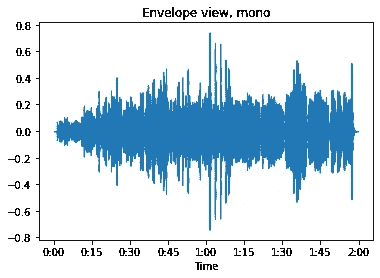

# 5 个用于音频处理的黑仔 Python 库

> 原文：<https://levelup.gitconnected.com/5-killer-python-libraries-for-audio-processing-ddef703e3d84>

## 数据科学项目、音乐创作以及更多…


托马斯·勒在 Unsplash[拍摄的照片](https://unsplash.com?utm_source=medium&utm_medium=referral)

有一点是肯定的，数百万人喜欢 Python 的简单性和易用性。它不仅用途广泛，而且是一种非常强大的编程语言。但是，您是否想过是否可以使用 python 对音频文件进行更改，在您的下一个数据科学项目中使用它，或者制作一个基于 Python 的音乐应用程序？

是的，您可以使用 python 来完成所有这些工作！

有许多令人惊叹的 Python 库可以帮助你做任何你能想到的关于音频文件的事情。无论是数据科学项目还是你的新音乐混音应用。

有了这些库，您可以使用它们来生成音乐、提取新的特征、识别音乐等等。

无论你想对音频做什么，你都不必学习一门新的编程语言，相反，我们可爱的 Python 将帮助你轻松做到这一切。

# 1.利布罗萨


librosa.org

`[**librosa**](https://librosa.org/doc/latest/core.html#module-librosa)`

Librosa 是一个用于音乐和音频分析的 python 包。它为创建音乐信息检索系统(MIR)提供了必要的构件。

这个库为我们提供了各种功能，使用各种图形(例如波形图、声谱图)来可视化音频文件，并且还具有特征分析功能。

这个库是一个很棒的包，不管你的兴趣是什么，我都建议你现在就去看看。不管怎样，你会需要它的。

这个库的一个强有力的特性是它的文档，构建良好且易于使用。很快您就可以设置这个库并开始一个演示项目。

这是来自演示项目的一个示例图。



Librosa 将音频文件存储在 NumPy 数组中。

此外，需要注意的一点是，Librosa 库是在考虑音乐的情况下创建的，因此你可以获得所有不同类型的与节拍、滴音和其他各种音乐相关的技术功能。这是你需要钻研音乐理论才能理解的事情。

只需进入库文档，加载一个示例项目笔记本，然后开始。这就是建立这个图书馆是多么容易。

# 2.听觉分析

这个库是你的数据科学项目所需要的。如果你的目标是使用音频格式制作一个机器学习模型，那么你必须探索这个库。

pyAudioAnlaysis 附带了音频特征提取、分类、分段和各种其他应用程序。

该库的一些显著特征是:

> 提取音频特征
> 
> *训练*，参数调整，*评估*音频片段的分类器
> 
> *归类*未知声音
> 
> *检测*音频事件，并从长录音中排除静默期
> 
> 训练和使用*音频回归*模型(示例应用:情感识别)

如果你的目标是制造一个机器学习模型，那么这个库就是你的首选。如果你知道什么更好的，请让我知道，这样其他人也可以从中受益。

# 3.播放声音

Playsound 是一个 Python 模块，用户可以通过它在一行代码中播放声音。它是一个跨平台的模块，是一个不依赖于声音和音频播放的单一功能。

这是一个相当简单的库，你可以用它快速播放任何音频文件。只要简单地导入它，你就可以开始了。

```
from playsound import playsound

playsound('soundFile.mp3')
```

playsound 模块还可以用于 WAV 文件和 MP3 文件格式的文件，也可以处理其他文件格式。

如果你的主要目的只是播放一些音频文件，那么这个库是去，简单而容易！

# 4.明戈斯

这是一个相当强大的 Python 库。许多程序员、音乐研究者和作曲家使用它来制作和检查音乐和歌曲。

Mingus 是跨平台的，具有非常先进的音乐功能，如 python 的音乐理论表示包以及乐器数字接口文件和播放支持。

Mingus 是一个高级的、跨平台的音乐理论和符号包，支持 MIDI 文件和回放。

它可以用来研究音乐理论，构建编辑器、教育工具和其他需要处理和/或播放音乐的应用程序。

这是程序员可以用来导入处理和播放音乐的功能的软件。包括音乐理论主题，如音阶、进度条、和弦和音程。

总的来说，这是一个非常强大和密集的图书馆，是了解音乐的人的首选。

# 5.Pydub

Pydub 是一个 Python 库，用于处理音频和添加效果。这个库是一个非常简单易用的高级接口。

这个库可以用来打开音频文件，不需要任何其他库的帮助。

以下是图书馆能为你做的一些事情。

要打开 WAV 文件

```
from pydub import AudioSegment
```

```
song = AudioSegment.from_wav("never_gonna_give_you_up.wav")
```

要打开 mp3 文件

```
song = AudioSegment.from_mp3("never_gonna_give_you_up.mp3")
```

打开其他格式文件

```
ogg_version = AudioSegment.from_ogg("never_gonna_give_you_up.ogg")
flv_version = AudioSegment.from_flv("never_gonna_give_you_up.flv")
```

你可以用这个库来分割音频，这就是它的简单之处。

```
# pydub does things in milliseconds
ten_seconds = 10 * 1000

first_10_seconds = song[:ten_seconds]
last_5_seconds = song[-5000:]
```

# 结论

在本文中，我们看到了一些流行且强大的 python 库，它们可以用来集成使用 Python 操作和提取音频文件的特性。

有了这些库，你可以制作一个机器学习模型，显示各种图表，还可以创建音频编辑器和音乐创作应用程序。