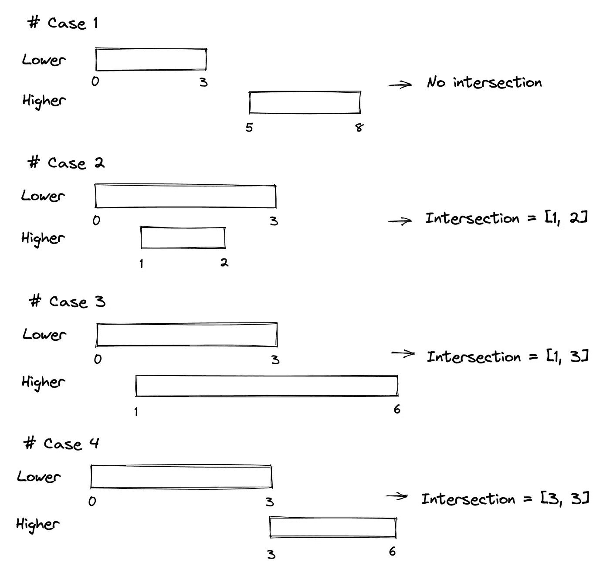

# 破解编码面试的 5 个 LeetCode 问题

> 原文：<https://levelup.gitconnected.com/5-leetcode-questions-to-crack-the-coding-interview-889b48f3879a>

## 我们讨论一些 LeetCode 问题的解决方案，为编码面试做准备

照片由[Unsplash](https://unsplash.com/@ourlifeinpixels?utm_source=medium&utm_medium=referral)上的我们的生活像素

编码面试是开发人员职位的关键部分。熟悉基本的算法和数据结构是我们一直期望你做的事情。在这里，我们将讨论 LeetCode 问题，这将有助于你为大型科技公司的编码面试做准备。在本文中，我们将讨论一些软件工程师职位要求的简单和中级问题:

*   汇总范围(简单)
*   给定时间内做作业的学生人数(简单)
*   区间列表交叉点(中等)
*   删除一个元素后 1 的最长子数组(中)
*   字符串压缩(中等)

几个简单的热身问题:

## 1.汇总范围

 [## 汇总范围— LeetCode

### 提高你的编码技能，迅速找到工作。这是扩展你的知识和做好准备的最好地方…

leetcode.com](https://leetcode.com/problems/summary-ranges/) 

给你一个**排序的唯一的**整数数组`nums`。

一个**范围** `[a,b]`是从`a`到`b`(含)的所有整数的集合。

返回****最小排序的*** *范围列表，即* ***正好覆盖数组中的所有数字*** 。也就是说，`nums`的每个元素恰好被其中一个范围覆盖，不存在整数`x`使得`x`在其中一个范围内而不在`nums`内。*

*列表中的每个范围`[a,b]`应输出为:*

*   *`"a->b"`如果`a != b`*
*   *`"a"`如果`a == b`*

*解决方案:*

*   *我们可以迭代`nums`数组中的每个元素，并检查它们是否相差 1。如果是这种情况，将一个元素追加到当前范围元组中。如果不是这种情况，在`ranges`中创建一个新的范围。*
*   *数据结构:除了输入列表`nums`之外，我们正在使用`ranges`列表。*
*   *复杂度:线性的`O(n)`，因为我们迭代输入`nums`和`ranges`数组。*

*这里还有一个类似于合并间隔的解决方案。我觉得看起来更简洁，更有 pythonic 的味道。*

## *2.给定时间内做作业的学生人数*

* [## 给定时间内做作业的学生数量— LeetCode

### 给定两个整数数组 startTime 和 endTime，并给定一个整数 queryTime。第 I 个学生开始做他们的…

leetcode.com](https://leetcode.com/problems/number-of-students-doing-homework-at-a-given-time/) 

给定两个整数数组`startTime`和`endTime`，给定一个整数`queryTime`。

`ith`学生在`startTime[i]`时间开始做作业，在`endTime[i]`时间完成作业。

返回在时间`queryTime`做作业的学生数量。更正式的说法是，返回`queryTime`位于区间`[startTime[i], endTime[i]]`内的学生人数。

解决方案:

*   相当简单的解决方案。只需迭代数组`startTime`和`endTime`并计算`queryTime`位于`startTime[i], endTime[i]`之间的次数。
*   数据结构:我们没有使用任何额外的集合，只是输入列表和 int `queryTime`。
*   复杂度:`O(n)`当我们迭代输入`startTime`和`endTime`时。

现在让我们来解决中级问题。但首先，让我们来看看可爱的柯基放松一下。

照片由[萨曼莎·让](https://unsplash.com/@samanthadeestudio?utm_source=medium&utm_medium=referral)在 [Unsplash](https://unsplash.com?utm_source=medium&utm_medium=referral) 上拍摄

## 3.区间列表交集

 [## 区间列表交叉点 LeetCode

### 给你两个闭区间列表，firstList 和 secondList，其中 firstList[i] = [starti，迪恩]和…

leetcode.com](https://leetcode.com/problems/interval-list-intersections/) 

给你两个封闭区间列表，`firstList`和`secondList`，其中`firstList[i] = [starti, endi]`和`secondList[j] = [startj, endj]`。每个区间列表是成对的**不相交的**并且按照**排序的**。

返回这两个区间列表的交集。

一个**闭区间** `[a, b]`(带`a <= b`)表示一组带`a <= x <= b`的实数`x`。

两个闭区间的**交集**是一组实数，要么为空，要么表示为闭区间。比如`[1, 3]`和`[2, 4]`的交点就是`[2, 3]`。

解决方案:

*   在这个任务中，我们同时迭代`firstList`和`secondList`。在每一步中，我们在两个范围之间进行选择，一个是左边界的`lower`(我们称之为`lower`)，另一个是左边界的`higher`(我们称之为`higher`)。
*   首先，我们需要定义重叠范围。两个范围相互重叠的条件是:`lower`范围的右边界应该大于等于`higher`范围的左边界。
*   然后，为了传递到下一对范围，我们应该从输入列表`firstList`或`secondList`中删除具有最小右边界的范围。
*   数据结构:输入列表`firstList`、`secondList`和元组`lower`、`higher`。
*   复杂性:并行迭代两个输入列表花费的时间最多`O(n+m)`。在每次迭代结束时，我们搜索并删除`O(log(n))`中右边界最低的范围。所以总时间是`O((n+m)log(n))`。

交叉案例(图片由作者提供)

更快和更简洁的[解决方案](https://leetcode.com/problems/interval-list-intersections/discuss/647482/Python-Two-Pointer-Approach-%2B-Thinking-Process-Diagrams)可以是使用两个指针来跟踪两个列表中的范围，而无需移除它们。

*   与前面的解决方案一样，我们跟踪重叠范围的开始和结束。
*   为了识别重叠，我们同样检查具有较低左边界的范围的右边界是否高于另一个范围的左边界。
*   然后从一个范围移动到另一个范围，我们增加指针。

## 4.删除一个元素后 1 的最长子数组

 [## 删除一个元素后 1 的最长子数组— LeetCode

### 给定一个二进制数组 nums，你应该从中删除一个元素。返回最长的非空子数组的大小…

leetcode.com](https://leetcode.com/problems/longest-subarray-of-1s-after-deleting-one-element/) 

给定一个二进制数组`nums`，你应该从中删除一个元素。

返回*结果数组*中只包含 `1` *的最长非空子数组的大小。如果没有这样的子阵，返回`0`。*

解决方案:

*   我们创建元组的空列表`ones`来存储输入数组`nums`中一序列的起始索引和长度。所以`nums : list[(start_id, seq_len)]`。
*   如果`nums`的两个连续元素为 1，我们增加`ones`中当前序列的长度。否则，如果前一个元素是 1，下一个元素是 0，我们将一个新的元组追加到`ones`。这意味着我们传递到新的序列。
*   下一步是找出`nums`中最长的 1 序列的长度。为此，我们对`ones`进行迭代，并寻找两个连续元组的总长度的最大值。我们还考虑了 1 的序列被一个以上的 0 分开的情况。这里我们应该检查单个序列的长度，如果它大于任何两个连续序列的总和。
*   我们需要检查拐角情况，以防`nums`中只有 1 或 0。这种情况下，答案分别是`len(nums)-1`和`0`。
*   数据结构:输入列表`nums`，元组列表`ones`，int `maxlen`。
*   复杂性:当我们在`nums`上迭代两次，然后在`ones`上迭代两次时，时间最多是`O(2n)`。

在讨论中提出的一个[更快的解决方案](https://leetcode.com/problems/longest-subarray-of-1s-after-deleting-one-element/discuss/708731/Python-3-Faster-than-100-Explanation)是使用列表`ones`只存储序列的长度。这里，我们以与上一个解决方案相同的方式检查序列之间的过渡，并处理拐角情况。

## 5.字符串压缩

 [## 字符串压缩— LeetCode

### 给定一个字符 chars 的数组，使用下面的算法压缩它:以一个空字符串 s 开始。

leetcode.com](https://leetcode.com/problems/string-compression/) 

给定一个字符数组`chars`，使用以下算法压缩它:

以空字符串`s`开始。对于`chars`中的每组**连续重复字符**:

*   如果组的长度为`1`，则将字符追加到`s`。
*   否则，在字符后面加上组的长度。

压缩后的字符串`s` **不应该单独返回**，而是存储**在输入字符数组** `**chars**`中。注意，`10`或更长的组长度将在`chars`中被分割成多个字符。

在你完成**修改输入数组后，**返回*数组的新长度*。

您必须编写一个只使用常量额外空间的算法。

解决方案:

*   我们开始迭代`chars`并寻找相同字符序列之间的转换。我们传递到下一个序列，并将计数器`count`设置为 1，否则，我们将其递增 1。
*   我们创建一个空字符串`s`,在一个新序列开始后，如果它大于 1，我们追加`count`。
*   最后，我们将字符串`s`转换成一个字符列表，并将其分配给`chars`。
*   数据结构:除了输入列表`chars`之外，我们还使用一个字符串`s`和一个计数器。
*   复杂性:因为我们在`chars`上迭代一次，所以时间是线性的`O(n)`。

## 最后的想法

如果你对这些解决方案有什么意见和反馈，请在下面的评论区告诉我。Leetcoding 快乐！

如果你喜欢☕️的文章，请不要犹豫，支持我的写作。它帮助我在 ML 和数据科学上产生更多有趣和有用的内容:)

 [## 用 MLflow 在 Azure Databricks 上进行日志机器学习实验

### 在 Databricks 中获取远程 MLflow tracking 服务器上记录的模型、指标和工件

better 编程. pub](https://betterprogramming.pub/log-machine-learning-experiments-with-mlflow-on-azure-databricks-5a85955c9d3a)  [## 使用 MLflow 自动化您的机器学习实验

### 少花钱多办事的简要指南

better 编程. pub](https://betterprogramming.pub/automate-your-machine-learning-experiments-with-mlflow-8c9e42df421)  [## GPS 信号中的多径误差

### GPS 信号经常受到不同类型的事件的影响，导致定位质量下降。在许多情况下…

medium.com](https://medium.com/@evgeniimunin47/multipath-errors-in-gps-signals-de3a20440cf9) 

# 分级编码

感谢您成为我们社区的一员！更多内容见[级编码出版物](https://levelup.gitconnected.com/)。
跟随:[推特](https://twitter.com/gitconnected)，[领英](https://www.linkedin.com/company/gitconnected)，[通迅](https://newsletter.levelup.dev/)
**升一级正在改造理工大招聘➡️** [**加入我们的人才集体**](https://jobs.levelup.dev/talent/welcome?referral=true)*