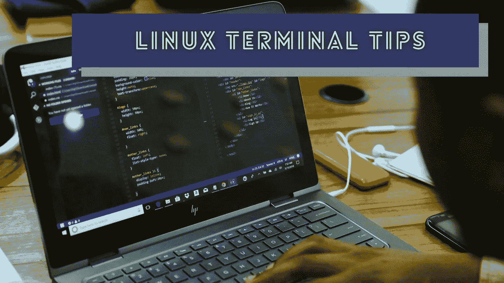
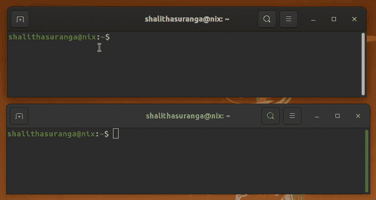
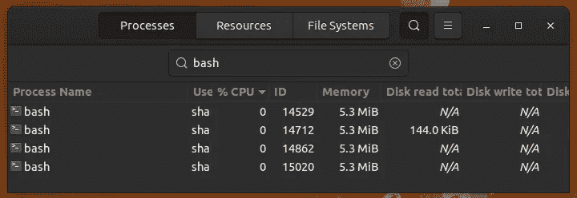
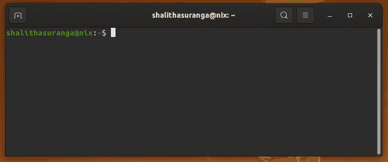

# 5 个鲜为人知的 Linux 终端技巧和实验

> 原文：<https://levelup.gitconnected.com/5-lesser-known-linux-terminal-tips-and-experiments-f14ac5739ea8>

## 开始试验您的终端，并找到新的方法来提高您的编程效率



[火星](https://unsplash.com/@heylagostechie?utm_source=unsplash&utm_medium=referral&utm_content=creditCopyText)在 [Unsplash](https://unsplash.com/s/photos/programming-keyboard?utm_source=unsplash&utm_medium=referral&utm_content=creditCopyText) 上拍摄的照片，用 Canva 编辑

程序员通常倾向于使用命令行界面而不是图形界面来进行编程相关的活动。尽管大多数图形用户界面都提供了键盘快捷键，但在使用图形用户界面时，我们经常需要多次点击和移动鼠标。另一方面，CLI 交互通过让手始终放在键盘上，激励开发人员用命令和脚本语法做几乎任何事情。此外，我们甚至可以通过组合多个命令来提高开发活动的效率。

作为程序员，我们已经使用 Unix 或 Linux 命令来完成各种操作，如文件处理、配置操作系统和网络请求处理。此外，我们经常通过命令行使用现代框架和开发工具(例如， [Create React App](https://github.com/facebook/create-react-app) 程序)。

如果您不局限于已知的 CLI 命令，而是更多地了解终端内部，那么您可以学习更多独特的方法来提高终端界面的效率和信心。我将在这个故事中用实际实验来解释几个鲜为人知的终端相关概念。

# 将内容发送到另一个终端窗口

程序员在他们的计算机上使用多个物理屏幕来同时进行几个开发活动。一些程序员在这些屏幕上打开多个终端窗口。同时，一些程序员通常在同一个物理屏幕上使用多个终端窗口。如果我们需要将特定命令的输出发送到另一个现有的终端窗口，该怎么办？

每个 GUI 终端程序实例都连接到一个称为伪终端文件的设备文件。这些伪终端文件帮助 GUI 终端发送和捕获来自子进程的 I/O 数据。打开终端窗口，输入以下命令查看所有可用的伪终端设备:

```
ls /dev/pts
```

如果你只打开了一个终端窗口，你会看到两个设备文件:`ptmx`和`0`。当前终端使用`/dev/pts/0`文件通过进程处理 I/O 数据——你可以通过`tty`找到当前的伪终端。例如，如果当前终端的伪终端是`/dev/pts/0`，以下命令将一些文本打印到当前终端本身:

```
echo "Hello" > /dev/pts/0
```

使用这个实验概念，现在您可以将命令输出直接发送到另一个现有的终端窗口，反之亦然，如下所示。



在两个终端窗口之间发送命令输出，由作者录制屏幕

我在下面的故事中进一步解释了 Unix 设备文件:

[](/unix-internal-concepts-that-every-developer-should-know-374c3fb78b2e) [## 每个开发人员都应该知道的 Unix 内部概念

### 从程序员喜欢的操作系统中理解有趣的概念

levelup.gitconnected.com](/unix-internal-concepts-that-every-developer-should-know-374c3fb78b2e) 

# 重装子弹。bashrc 有效地定义

如果我们通过终端 [REPL](https://en.wikipedia.org/wiki/Read%E2%80%93eval%E2%80%93print_loop) 定义别名和环境变量，当我们退出终端时，这些配置会被删除。因此，Bash 解释器提供了`.bashrc`文件来添加所有启动脚本定义。每当您用 Bash 打开一个新的终端窗口时，就会执行`.bashrc`脚本——因此我们可以在那里添加永久别名、环境变量和全局函数。

在开发工具配置期间，我们经常需要更新这个启动脚本。您通常如何用新的启动脚本版本更新您的终端？一些程序员经常输入`bash`来打开一个新的 Bash 解释器实例，但是它会创建一个资源密集型的进程链，如下所示:



GNOME 系统监视器上的一个 Bash 进程链，作者截图。

有两种方法可以有效地重新加载`.bashrc`文件。第一种方法是使用内置的`source`命令，如下所示。

```
source ~/.bashrc
```

上面的命令再次执行`.bashrc`脚本。第二种方法是用内置的`exec`命令替换当前的 shell 实例。

```
exec bash
```

以上两种方式都比手动输入`bash`或打开一个新的终端窗口更好、更有效率。

# 通过铃声和警报了解任务完成情况

程序员在终端窗口中运行各种命令。有时，他们输入类似`ls`和`pwd`的即时命令。但是，有时，他们必须用终端命令启动长时间运行的任务。例如，React app 或 React Native app 创建命令通常会因深度依赖项安装而花费更多时间。

一些程序员通常输入这些长时间运行的命令，并一直等到完成。同时，一些程序员从事另一项活动，并经常检查长时间运行的命令的状态。让我们找到一种更高效的方法来管理长时间运行的任务。

如果您总是戴着耳机或使用扬声器，播放哔哔声是识别长时间运行的命令完成的好方法。请看下面的命令:

```
sleep 5; printf "\a"
```

上述命令在`sleep`命令完成后会发出嘟嘟声。但是，如果有多个长时间运行的命令，并且您的扬声器静音了，该怎么办呢？然后，我们可以使用预定义的`alert`别名，如下所示。

```
sleep 5; alert
```

上面的命令显示了使用前面输入的命令片段完成的任务。


警报`alias`在 Ubuntu 上通知命令完成，作者截图

大多数 GNU/Linux 发行版中都有`alert`别名，但是如果它不适合您，您可以将下面的代码片段添加到您的`.bashrc`文件中来激活它:

`notify-send`命令有助于创建现代 Bash 脚本，如下文所述:

[](/5-modern-bash-scripting-techniques-that-only-a-few-programmers-know-4abb58ddadad) [## 只有少数程序员知道的 5 种现代 Bash 脚本技术

### 使用这些技巧让您的 Bash 脚本更具交互性和未来感。

levelup.gitconnected.com](/5-modern-bash-scripting-techniques-that-only-a-few-programmers-know-4abb58ddadad) 

# 将终端用作计算器

除了终端、代码编辑器和 web 浏览器，程序员不经常使用许多 GUI 应用程序。然而，在某些场景中，web 开发人员倾向于使用 Postman 这样的 GUI 工具来测试 web APIs，而不是使用`curl`这样的命令行工具。

每个 GNU/Linux 操作系统都提供了一个 GUI 计算器程序，但是大多数程序员不倾向于用它来进行日常计算。如果我们需要进行单位换算或货币换算，我们可以在谷歌搜索中输入来寻找答案。当我们用算法解决问题时，我们经常要做各种各样的计算。如果你需要计算一个数学表达式——当你处理一个编程任务时，该怎么办？

我们可以用`bc -l`命令打开一个命令行计算器(`-l`支持浮点计算)。看下面的预告:



GNOME 终端上的命令行计算器程序，作者录制的屏幕

尽管程序名是基本计算器(也称为`bc`)，但它支持变量定义、复杂表达式和数学函数。如果需要使用现代语言语法执行数学运算，还可以将 Python REPL 用作简单的计算器。例如，以下 Python 表达式计算了半径为 7 个单位的圆的周长:

```
2 * math.pi * 7
```

# 子外壳、命令组合和大括号扩展

Bash 是一种命令语言，因此它提供了许多特性来高效地编写命令和更好的自动化脚本。Bash 提供了一种创建子 shells 的方法，我们可以用它来初始化独立的脚本执行环境。例如，我们可以更改特定命令的当前工作目录，而不会影响终端上的当前工作目录，如下所示。

```
(cd backend; npm i)
```

Bash 还允许您更改流程的环境变量。请看下面的例子:

```
PORT=5000 ./myscript.py
```

上面的命令只为 Python 脚本执行环境设置了`PORT`环境变量，而没有更新原来的 shell 实例。

有时，我们可以组合几个命令来更快地完成任务。我们可以使用 Bash 操作符将几个命令连接成一个命令，比如`&&`、`||`、`|`和`;`。命令替换功能还可以帮助我们组合多个命令。例如，通过使用以下命令，我们可以只将当前目录的文本文件作为参数发送给脚本:

```
./yourscript.py `find . -name "*.txt"`
```

大括号扩展功能有助于根据范围定义生成字符串。例如，`{1..5}`扩展定义生成一个从`1`到`5`的空格分隔的整数列表。另外，`/path/{bin,src}`返回以下输出:

```
/path/bin /path/src
```

现在我们可以结合使用`mkdir`命令和大括号替换来一次创建多个子目录。

```
mkdir project/{bin,src,lib}
```

感谢阅读

# 分级编码

感谢您成为我们社区的一员！**在** [**平台上雇佣不可思议的软件工程师**](https://jobs.levelup.dev/) **。**

[](https://jobs.levelup.dev) [## 提升就业平台

### 软件工程师、数据科学家、经理、设计师、建设者和程序员的最佳角色

作业. levelup.dev](https://jobs.levelup.dev)