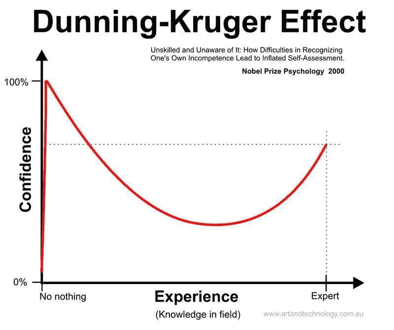

# 作为一名新晋升的软件工程师，我在第一年学到的 5 个教训

> 原文：<https://levelup.gitconnected.com/5-lessons-i-learned-in-my-first-year-as-a-newly-promoted-software-engineer-aa33ab6584>

## 跟我学，成为更好的员工

抓住，在接下来的八分钟里，我花了一年才学会的东西。

我一毕业就被聘为 Jr .网站开发员。在这个职位上工作、成长和学习了近两年后，我有机会转换角色，填补了我们团队最近空缺的职位，成为(当时)我们唯一的 Android 工程师。

我一头扎进完全无知的冰冷海水中，在过去的一年里，慢慢地爬上来呼吸。在这个过程中获得了晋升，我现在坐在一艘小船上(不再溺水)，俯视着本来可能是我黑暗的坟墓。在我的手里，有五颗智慧的珍珠，我现在想送给任何游泳者。

(比喻太多？可能…无论如何，我学到了一些东西，我想和你分享这些东西…)

作者的道歉:虽然我学到的这些经验来自我在软件工程行业的经历，但我相信它们的核心与任何领域的任何人都相关。读者，如果你来自与我不同的背景，请接受我的鼓励，以开放的心态继续下去，并原谅我的工程实例。

***TL；DR；*** *如果你什么都不知道也没关系，尤其是当你承认的时候。小的(代码)变化会产生不成比例的大影响。如果冒名顶替综合症促使你谦卑自己并向他人学习，它可能是一件好事。激情、动力和学习能力是成功的关键。导师是成长的倍增器；找到一个并向他们学习。*

照片由[蒂莫·瓦格纳](https://unsplash.com/@timovaknar?utm_source=medium&utm_medium=referral)在 [Unsplash](https://unsplash.com?utm_source=medium&utm_medium=referral) 上拍摄

# 1.你不知道你不知道什么，这没关系

我学的越多，我就越明白我还有很多要学的…

我有时发现有些人在修复 bug 或添加新功能的过程中试图理解他们看到的每一段代码。这可能是一个值得称赞的特点，但在实践中，对于一个巨大的代码库(我们的应用程序有 300，000 多行)，这是不实际的(也不理智)。

如果我等到理解了应用程序的每一部分是如何工作的，才开始修复错误和添加功能，我将一事无成。我会淹死的。比溺水更糟糕的是，我不会学到很多东西。一年后的现在，我对自己对整个应用程序的了解感到满意，我知道有些时候我会处理以前从未处理过的代码。我必须学会现在不知道也没关系👍。

下面这句话:“我不确定…我得去看一看，然后再回来找你！”对于我负责的项目，这是我一贯的回答。如果这也是你对类似问题的回答，那也没关系！

虽然你不能等到什么都知道了才开始写代码，但是你不应该盲目地做出改变。尽最大努力理解每个代码变更的背景，以及它将如何影响应用程序的其余部分。希望你也有更有经验的人为你做代码审查。尽最大努力理解代码变更的背景，不仅有助于您编写更少的 bug，还能帮助您更多地了解整个代码库。这就引出了我的下一个观点。

# 2.*小的(代码)变化会产生不成比例的大影响*

看着一星评论从一行代码更改中滚滚而来

我仍然惊讶于一行代码是如何创造或破坏整个特性的。这种用少量代码产生巨大影响的能力是一把双刃剑。好的一面是，有时小的代码更改会带来巨大的投资回报:20 分钟的投资最终会改变应用程序参与的轨迹。另一方面，一个小的代码变化更容易被忽略，最终会破坏用户最喜欢的特性。

你去过那里，对吗？也许你收到了一个建议，心想，“是啊，好主意”，修改了一行代码，然后很快就把它忘了。如果你没有，至少我可以告诉你我曾经有过的经历…

有一天，我在查看我们的用户反馈单，看到有人建议对我们的一个应用程序小部件的工作方式做一个小小的改变。我很快认为这是一个好主意，没有询问代码创建者的意见，很快修改了一两行代码来实现它，并很快转移到我预定程序的其余部分。注意到什么了吗？提示:它和*病态押韵。*显然，快速移动本身并不是一件坏事，但我没有停下来思考这种变化会如何影响其他用例。*我甚至没有花时间去想其他的用例。这是我最大的错误。*

在大量愤怒的用户说我从未想到的用例不再工作后，我最终恢复了更改。好的一面是:我为我正在锻造的智慧链带走了另一颗珍珠…

# 3.冒名顶替综合症可能是件好事

[Natalya Letunova](https://unsplash.com/@naletu?utm_source=medium&utm_medium=referral) 在 [Unsplash](https://unsplash.com?utm_source=medium&utm_medium=referral) 上拍摄的照片

不安全感可以帮助你变得更好。你可能会想，“不！你的想法确实偏离了真理——甚至荒谬的！”

对此我想说:我理解(还有，不错的用词)。我只要求你忍受🐻和我呆一会儿。

对于那些不知道的人来说，[冒名顶替综合症](https://en.wikipedia.org/wiki/Impostor_syndrome#:~:text=Impostor%20syndrome%20(also%20known%20as,exposed%20as%20a%20%22fraud%22.)是一种感觉，你觉得自己不属于这里，觉得自己不够好，觉得自己被发现是个骗子只是时间问题。现在，我知道这听起来很糟糕，但我的观点是:*如果你以积极的方式回应，冒名顶替综合症可能是一件好事。*

如果这些感觉驱使你变得谦逊、坚定，并渴望从别人那里学到更多，这可能是一件好事。当然，我不认为在冒名顶替者镇开店对我们的感情是健康的，但偶尔快速漫步可能是一件好事。

> 保持谦逊，承认自己并非无所不知，并被驱使向他人学习，只会让自己变得更好。

对我来说，冒名顶替的感觉提醒我重新调整我的心灵和头脑，让我相信是真实的。然而，无论你相信什么，保持谦逊，承认自己并非无所不知，并被驱使向他人学习，只会让你变得更好。

# 4.激情、动力和学习能力是成功的关键

肖恩·艾弗里在 [Unsplash](https://unsplash.com?utm_source=medium&utm_medium=referral) 上拍摄的照片

激情、动力和学习能力每次都会胜过纯粹的智力。

我离开学校时，缺乏新角色所需的知识，进入了一个有很多成长机会的职位，身边有一位优秀的导师/同事。这一点，加上对学习的渴望和对我所做的事情的热情，导致了爆炸性的增长。一个良好的工作环境就像火种，激情、动力和学习能力是点燃你工作场所成功之火所需的火花。

我在学校学到的最有价值的东西是如何学习。有了学习的能力，曾经关闭的门就会打开。有了学习的能力，你就可以被安排在任何地方，并应付自如。然而，没有行动，能力是死的，这就是激情和动力的来源。激情和动力的合力将学习能力的势能转化为实际学习的动能。

对于我的最后一点，让我们回到关于导师的部分…

# 5.导师是成长的倍增器；找一个

普里西拉·杜·普里兹在 [Unsplash](https://unsplash.com?utm_source=medium&utm_medium=referral) 上的照片

如果没有甘道夫的指引和鼓励，弗罗多会变成什么样？我们都应该寻找一个甘道夫来引导我们通过软件谷的危险直道。

我感到非常幸运的是，我们 Android 应用程序的前所有者/维护者在他离开我们 Android 开发人员的职位时仍然留在我们的团队中。这意味着当我在学习 Android，特别是我们的项目时，我可以向他提问，从他那里获得代码评审，并从他留下的所有代码中学习(当我不理解时，经常会有解释)。在最初的六个月里，我经常要求解释我不懂的代码。

我开始发现，在过早地提出问题和花上几天时间讨论队友本可以用一句话回答的事情之间，存在着一种[的微妙平衡。当你开始一个新的角色时，希望你的队友和经理会给你很多恩惠，让你了解新代码库的来龙去脉。他们知道你不知道，你会花很多时间去学习。谢天谢地，因为这是我的团队的情况，而且我在实践中学习得最好，所以在寻求帮助之前，我经常在事情上多花一点时间。对你有用的东西可能会因你的团队和你的学习方式而异，但我总是建议你尽最大努力找出一种尽可能高效地提问的方法，用可重复的步骤来尊重你导师的时间😄。](https://www.google.com/search?q=gollum+gif+tricksy&tbm=isch&ved=2ahUKEwip7PKXnJHqAhUByawKHc0nATgQ2-cCegQIABAA&oq=gollum+gif+tricksy&gs_lcp=CgNpbWcQAzIGCAAQCBAeMgYIABAIEB46AggAOgQIABAeOgYIABAFEB5Q8p0BWLyoAWDwrAFoAHAAeACAAViIAdkDkgEBOJgBAKABAaoBC2d3cy13aXotaW1n&sclient=img&ei=5m_uXqnhNYGSswXNz4TAAw&bih=830&biw=1680#imgrc=f0qm1To_r35N3M)

如果你没有一个同事/导师能像我一样帮助你，不要绝望！值得庆幸的是，有很多方法可以让你成长，学习你新角色需要的东西。我最喜欢的提示是… **读作**！看别人的/开源的代码。阅读媒体上的文章。阅读文档。看书。阅读指南。阅读演练。阅读 StackOverflow。再看一本书，只是为了更好地衡量。

> "对于那些寻求超越平凡的人来说，阅读是必不可少的。"—吉米·罗恩

最后，把你所读到的付诸实践！

概括地说，我们已经讲述了我作为一名新晋升的软件工程师在第一年学到的 5 课。无论你是否在软件领域，我挑战你将一个教训应用到你的工作中，看看它如何让你成长😄。

1.  如果你不知道所有的事情也没关系，尤其是当你承认的时候
2.  你很难想象一个小的(代码)变化会对人们产生什么样的影响
3.  冒名顶替综合症*会是一件好事吗*
4.  *激情、动力和学习能力是成功的关键*
5.  *导师是成长的倍增器；找到一个并向他们学习*

*你学到了什么？*

* [## 编写面试问题

### 编码面试课程

技术开发](https://skilled.dev)*