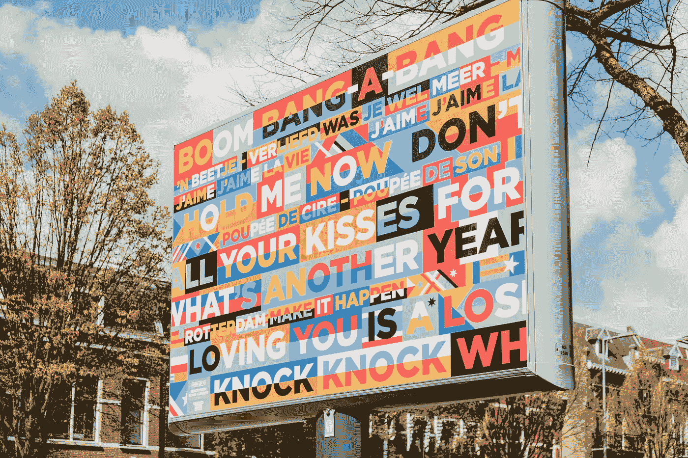

# 设计 Web 开发组合的 5 个经验教训

> 原文：<https://levelup.gitconnected.com/5-lessons-learned-designing-a-web-development-portfolio-4a740da044ab>

照片由[https://unsplash.com/@micheile](https://unsplash.com/@micheile)拍摄

设计更多的是实用的用户体验，而不是艺术表现。当然，创意和设计有很多交集，但是对于那些想要制作好看的作品集的非设计师来说，将设计视为一个可理解性的问题更有价值。一方面，创造力努力被视为与众不同，它通过挑战假设和模糊预期来划分航程。然而，另一方面，设计是一种服务，并寻求通过清晰可见。作为达到目的的手段，设计甚至可能显得“自然”或明显。[UABC 大学工业设计教授、建筑师亚历杭德罗·穆尔加](https://www.researchgate.net/profile/Alejandro-Murga-Gonzalez)解释了设计与艺术的区别:

“…设计(作为一门学科)是一种工具，它让我们行动起来，改造社会，满足人类的需求。”

对我来说，满足人类需求是设计的核心。考虑到这一点:

1.字体很重要

[纪录片《Helvetica》](https://www.youtube.com/watch?v=wkoX0pEwSCw)(关于字体)编织了一系列对设计师的采访，讲述了他们对 Helvetica 和字体的总体看法。Helvetica 标志着从 20 世纪早期高度装饰和喧闹的字体到今天最常用的更简朴和“现代”的字体的过渡。这种转变在 Helvetica 提出的无衬线字体的普遍存在中最为显著。然而，衬线字体看起来仍然很棒，尤其是对于较大的文本。对于作品集的标题[，我选择使用无衬线字体](https://alberto-duarte-portfolio-outline-altcademy-bootcamp.netlify.app/) [Chivo。对于较大的正文，我使用了 serif 字体](https://www.omnibus-type.com/fonts/chivo/) [Manuale，来自同一来源](https://www.omnibus-type.com/fonts/manuale/)。

对标题使用无衬线字体，对较长的多行文本使用有衬线字体，这样可以使作品集多样化，同时不会分散对内容的注意力。

2.关于太空的一切

Bootstrap 有非常方便的类名来立即改变元素的边距和填充，这是有充分理由的。在上面提到的同一部纪录片中，意大利著名设计师、长期居住在纽约市的马西莫·维格内利(Massimo Vignelli)说，印刷术就像音乐一样，[更多的是关于字符之间的空间(或音符之间的空间)](https://www.youtube.com/watch?v=9g3Ogtgleyg)，这赋予了整个项目以凝聚力。举例来说，如果你看一个像海报一样的图形公告，大多数危及海报的东西通常只是空间。即使是单个字符，以字母“O”为例，也大多是空格。所以根据 Vignelli 的说法，一个好的印刷工人总是意识到空间的重要性，这个想法我成功地应用到了网页设计中。在元素之间增加更多的空间使得文件夹读起来更舒服，因此更容易理解和吸引人。即使是很小的变化也很重要，比如我在下图的导航栏中使用的字母间距 1px 和单词间距 3px。

其效果是一种微妙但确定的现代感。

3.很少使用线条

当通过改变整个元素的背景色或者通过增加填充来指定更多的空间来暗示时，边框是最有效的。想要将每个元素的边界可视化地表示为网格的倾向只会导致项目看起来像一个 excel 电子表格。例如，在[文件夹](https://alberto-duarte-portfolio-outline-altcademy-bootcamp.netlify.app/)中，我通过改变背景颜色来表示文本块的区域。这将建立并指定一个区域，而不会将其封闭。如果你环顾四周，你会看到到处都是线。栏杆、栅栏、百叶窗、框架、边缘、街道和小巷，所有这些都是线。文明的大部分结构是基于线条和直角。因此，让设计看起来容易理解、开放和自然的部分原因就是没有线条。为了达到这种效果，甚至网页上图像的边角也使用了边框半径 css 属性。

当然，这并不意味着一个人应该完全避免线条。我的[样本作品集](https://alberto-duarte-portfolio-outline-altcademy-bootcamp.netlify.app/)用两条线标出我觉得需要更多强调的地方。

4.大照片

如今，大型高质量图片是在媒体波上传递任何有效信息的关键。如果你认为我在夸大其词，只要打开任何一个新闻故事，每一个都有一个大的高质量的图片标题，给读者一个视觉的钩子和背景。我在样本文件夹中使用了来自 [Unsplash](https://unsplash.com/) 的随机图片来表示项目的链接按钮。我也有一个主要形象的顶部。理想情况下，这些图像应该用实际项目的真实截图来代替，但即使是一些松散的相关内容也可以。

当处理图像时，我发现 CSS 属性[纵横比](https://developer.mozilla.org/en-US/docs/Web/CSS/aspect-ratio)对于标准化尺寸非常有用。在建立了维度之后，使用 Bootstraps responsive grid 来快速制定组织项目的有效布局是非常容易的。

5.自举棒极了

Bootstrap 使响应式网页设计变得非常容易。值得通读布局图上的[文档，以复习和检查更新。断点特别棒，因为它可以根据屏幕大小有条件地在任何元素上添加 CSS 选择器属性。Bootstrap 的断点通过这些条件为 CSS 代码提供逻辑，使动态网站成为可能，而无需使用 JavaScript。这意味着应用程序代码的所有样式方面都可以保留在 CSS 和 HTML 页面上，包括用于响应的代码。对于大多数断点，我使用最小宽度规范，但是我确实发现最大宽度指示器对于至少一个变化是有用的。除了断点，Bootstrap 还提供了一个完全集成的行和列系统](https://getbootstrap.com/docs/5.1/layout/breakpoints/),可以直接在 HTML 页面上的元素的类名中设计。