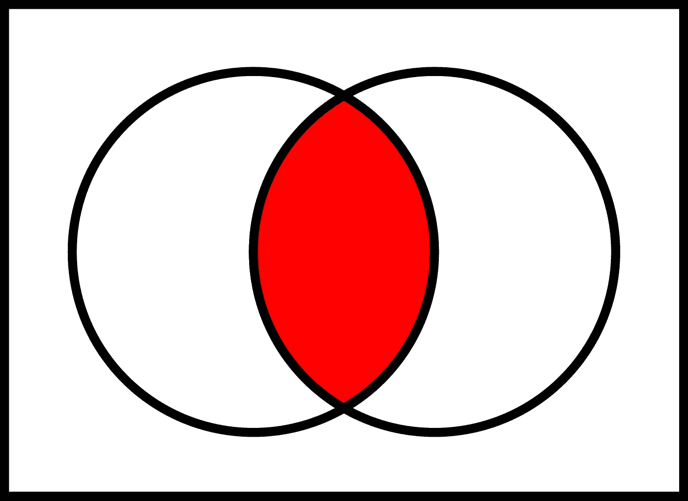

# 更好编程的 50 个数学概念(第 1 部分)

> 原文：<https://levelup.gitconnected.com/5-mathematical-concepts-for-better-programming-d26005932656>

Freepik 上故事集的图像

*看看我下面的书:*

 [## 人工智能学习指南

### 你好。你是想学习人工智能却不知道从哪里开始的人吗？

bamaniaashish.gumroad.com](https://bamaniaashish.gumroad.com/l/ai_book)  [## 学习 Python 的无牛指南

### 你是一个正在考虑学习编程却不知道从哪里开始的人吗？我有适合你的解决方案…

bamaniaashish.gumroad.com](https://bamaniaashish.gumroad.com/l/python-book) 

# 1.设置

集合是对象的集合。

德国数学家格奥尔格·康托尔开创了集合论的发展。

集合在数学上由花括号(`{}`)内的项目表示。

例如:

*   一组***【N】***:`{1, 2, 3, … ∞}`
*   一组 ***整数*** : `{0,1, 2, 3, … ∞}`
*   一组 ***整数(Z) :*** `{-∞,… 0,1, 2, 3, … ∞}`
*   一组 ***有理数:*** 可以表示为两个**整数**之比的数。比如:`{…, 5/2, 4/3, 0.76,...}`
*   一组 ***无理数:*** 不能表示为两个整数之比的数。例如:`{…, √2, √5, π, *e, …*}`
*   一组 ***实数(R):*** 由一组有理数和无理数组成
*   一组 ***虚数/复数******【C】***:数字表示为`a+bi`其中 *a & b 为*实数 *i =* `√-1`
*   一组 ***所有数字*** :由一组实数和复数组成

乔安娜·科辛斯卡在 [Unsplash](https://unsplash.com?utm_source=medium&utm_medium=referral) 上拍摄的照片

## 记号

*   是一个**空集**，即没有任何元素的集合。
*   μ 是**通用集合**，即集合运算所考虑的所有集合的所有元素的集合
*   A' **是集合 **:** 的补集**，该集合包括所有不属于泛集合的元素，即(A' = μ — A)
*   x **∈** A 表示 x ***是*** A 的成员
    例如，法国(A)的人口集合中的一个人(x)。
*   A **⊂** B 表示 A ***是*** B 的子集
    例如，法国人口(a)的集合是欧洲人口(b)的集合的子集。
*   ∨**代表两个集合的**并**即两个集合的所有元素组合成一个集合**
*   ****∩** 表示两个集合的**交集**，即将两个集合的公共元素组合成一个新集合**

****

****一套邮票(**照片由 [kevs](https://unsplash.com/@akevsery?utm_source=medium&utm_medium=referral) 在 [Unsplash](https://unsplash.com?utm_source=medium&utm_medium=referral) 上拍摄)**

# **2.venn 图表**

**这是一个用图解法表示集合及其运算的方案。**

## **两个集合的交集**

****

****两个集合的交集(A ∩ B)** (图片来自维基百科)**

## **两个集合的并**

****

****两个集合的并集(A ∪ B)** (图片来自维基百科)**

# **3.素数&黎曼假设**

**质数是任何大于 1 的自然数，它只能被自身或 1 整除。**

**一组素数可以表示为`{2,3,5,7,11,13,17,...}`。**

## **黎曼假设**

**这是一个假设，表明素数的分布是可以预测的，素数的频率与 ***赖曼泽塔函数*** 的行为密切相关。**

****

**雷曼泽塔函数**

**准确的说，这个猜想告诉我们 ***黎曼泽塔函数*** 只有在:**

*   **负的偶数整数(平凡的零)和**
*   **具有实部 1/2 的复数(非平凡零)**

**这是数学中尚未解决的千年问题之一，第一个提供可接受的证明的人将由克莱数学研究所给予 100 万美元的奖励。**

** [## 千年问题

### 如果检查一个问题的解决方案是否正确很容易，那么解决问题是否也很容易？这是…

www.claymath.org](https://www.claymath.org/millennium-problems) 

# 4.可能性

它是一个数学分支，研究事件发生的可能性。

数学上用 **P，**表示，事件 X 发生的概率为 **P(X)** 。

> p(X)= X 发生的事件数/可能结果总数

例如，掷硬币时正面朝上的概率是 1/2 或 50%。

## 概率规则

*   事件的概率只能在 0 到 1 之间。
*   如果两个事件相互独立发生，那么这两个事件发生的概率是由 T21 乘以它们各自的概率给出的。

> P (X 和 Y) = P (X) * P (Y)

*   如果两个事件是**互斥的**，那么其中一个事件发生的概率是通过将它们各自的概率相加而得到的。

> P (X 或 Y) = P (X) + P (Y)

照片由 [Alois Komenda](https://unsplash.com/@aloisk?utm_source=medium&utm_medium=referral) 在 [Unsplash](https://unsplash.com?utm_source=medium&utm_medium=referral) 上拍摄

# 5.结石

它是一个数学分支，关注连续变化的量。

它的两个主要分支处理:

*   一个量的变化率/梯度(*)*
*   *无穷多个小的量求和来计算整体(*)**

## **区别**

**用于计算数学曲线的**梯度/斜率/切线**。**

**也可以用来求一个函数的最小值( ***、极小值*** )和最大值( ***、最大值*** *)* 。**

**对于方程为`y= x^n`的曲线，y 相对于 x 的梯度(`dy/dx`)由`n * x^(n-1)`给出。**

## **微分法则**

*   **`d(n)/dx = 0`**
*   **`d(x)/dx = 1`**
*   **`d(x^n)/dx = n * x^(n-1)`**
*   **`d(e^x)/dx = e^x`**
*   **`d(ln x)/dx = 1/x`**
*   **`d(n^x)/dx = n^x * ln(x)`**
*   **`d(sin x)/dx = cos x`**
*   **`d(cos x)/dx = — sin x`**

## **综合**

**这是微分的逆运算。**

**它通常用于计算形状的面积和体积。**

**对于方程`y = x^n`，y 的积分由下式给出:**

> **∫y dx =∫(x^n)dx =(1/n+1)*(x^n+1)+c**

**其中 C 是一个数值常数。**

****

**丹·克里斯蒂安·pădureț在 [Unsplash](https://unsplash.com?utm_source=medium&utm_medium=referral) 上拍摄的照片**** 

*****看看下面这个系列的下一部分:*****

**** [## 更好编程的 50 个数学概念(第二部分)

### 让我们学习构成计算机科学基础的数学

bamania-ashish.medium.com](https://bamania-ashish.medium.com/50-mathematical-concepts-for-better-programming-part-2-f0dc13a8c05)  [## 更好编程的 50 个数学概念(第 3 部分)

### 让我们学习构成计算机科学基础的数学

levelup.gitconnected.com](/50-mathematical-concepts-for-better-programming-part-3-ea60e4c30531)  [## 更好编程的 50 个数学概念(第 4 部分)

### 让我们学习构成计算机科学基础的数学

levelup.gitconnected.com](/50-mathematical-concepts-for-better-programming-part-4-e44e3b7f3c55)  [## 更好编程的 50 个数学概念(第 5 部分)

### 让我们学习构成计算机科学基础的数学

bamania-ashish.medium.com](https://bamania-ashish.medium.com/50-mathematical-concepts-for-better-programming-part-5-b3624c2227ad)  [## 更好编程的 50 个数学概念(第 6 部分)

### 让我们学习构成计算机科学基础的数学

bamania-ashish.medium.com](https://bamania-ashish.medium.com/50-mathematical-concepts-for-better-programming-part-6-29a04f55edec)  [## 更好编程的 50 个数学概念(第 7 部分)

### 让我们学习构成计算机科学基础的数学

bamania-ashish.medium.com](https://bamania-ashish.medium.com/50-mathematical-concepts-for-better-programming-part-7-90cf3cb3d1f2)  [## 更好编程的 50 个数学概念(第 8 部分)

### 让我们学习构成计算机科学基础的数学

bamania-ashish.medium.com](https://bamania-ashish.medium.com/50-mathematical-concepts-for-better-programming-part-8-ddc977cb4e0e)  [## 更好编程的 50 个数学概念(第 9 部分)

### 让我们来理解构成计算机科学基础的数学

bamania-ashish.medium.com](https://bamania-ashish.medium.com/50-mathematical-concepts-for-better-programming-part-9-1e2c7ff52770)  [## 更好编程的 50 个数学概念(第 10 部分)

### 让我们学习构成计算机科学基础的数学

bamania-ashish.medium.com](https://bamania-ashish.medium.com/50-mathematical-concepts-for-better-programming-part-10-694e5bddade8)  [## 更好编程的 50 个数学概念(第 11 部分)

### 让我们学习构成计算机科学基础的数学

levelup.gitconnected.com](/50-mathematical-concepts-for-better-programming-part-11-606debbb19fa)  [## 更好编程的 50 个数学概念(第 12 部分)

### 让我们学习构成计算机科学基础的数学

bamania-ashish.medium.com](https://bamania-ashish.medium.com/50-mathematical-concepts-for-better-programming-part-12-5ddb98bd7398)  [## 更好编程的 50 个数学概念(第 13 部分)

### 让我们学习构成计算机科学基础的数学

bamania-ashish.medium.com](https://bamania-ashish.medium.com/50-mathematical-concepts-for-better-programming-part-13-ecc6484cdcdc)  [## 更好编程的 50 个数学概念(第 14 部分)

### 让我们学习构成计算机科学基础的数学

bamania-ashish.medium.com](https://bamania-ashish.medium.com/50-mathematical-concepts-for-better-programming-part-14-2e56f3c5a8ae) 

*这就是本文的全部内容。感谢阅读！*

 [## 通过我的推荐链接加入 Medium-Ashish Bama nia 博士

### 阅读 Ashish Bamania 博士(以及 Medium 上成千上万的其他作家)的每一个故事。您的会员费直接…

bamania-ashish.medium.com](https://bamania-ashish.medium.com/membership)****