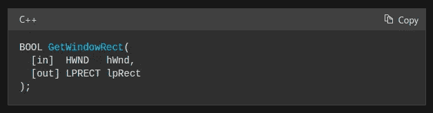

# 每个程序员都应该知道的 5 个数学概念

> 原文：<https://levelup.gitconnected.com/5-mathematical-concepts-that-every-programmer-should-know-b8e1813751ef>

## 使用数学知识用任何编程语言编写干净高效的代码


Emile Perron 在 [Unsplash](https://unsplash.com/s/photos/maths-coding?utm_source=unsplash&utm_medium=referral&utm_content=creditCopyText) 上拍摄的照片，由 Canva 编辑

作为程序员，我们设计、开发、测试和维护软件系统。我们在开发阶段根据用例和个人喜好用各种编程语言编写代码。比如现在的程序员用 JavaScript 或者 Dart 来构建移动应用。同时，一些程序员使用 C/C++开发性能优先的软件组件。

通用源代码由特定于编程语言的语法、预实现的函数调用、数学运算符(即算术运算符、关系运算符等)组成。)，以及控制语句。我们不需要成为伟大的数学家来成为伟大的程序员，但一些数学概念有助于我们提高编程和一般解决问题的技能。

我们都知道如何在编程中使用基本的数学知识，如构造公式和使用关系运算符(也称为比较运算符)，并且我们通常会在日常任务中频繁使用这些概念。如果我们超越这些数学语法，我们会看到离散数学领域的一些有趣的概念。在这个故事中，我将为所有程序员解释一些必须知道的数学概念。您可以掌握这些概念，为任何软件工程问题编写干净高效的代码。

# 数学表达式和内置数学函数

源代码有两种数学形式:一种是只使用 API 中的预建函数，另一种是只包含数学算法。我们编写的每一个源代码通常都存在于这两端之间。如果您编写代码从 RESTful 服务中获取一些 JSON 数据，您将调用一个 HTTP 客户端，并且不会在那里做任何数学计算——这是第一个结束。如果你写一个函数来计算一个圆的面积，那么你主要是在那里做数学计算——这是第二个目的。

当您的源代码变得更加数学化时，您将不得不用内置的数学函数来构造数学表达式。因此，每种编程语言都提供了内置的数学模块和语法数学运算符。[优秀的程序员](/good-habits-that-every-programmer-should-have-333154658535)总是会考虑代码的可读性，所以我们应该学习如何为任何复杂的问题构造可读的数学表达式。

了解 Linux 内核项目如何使用简洁的数学表达式:


[Linux 代码库](https://github.com/torvalds/linux/blob/5bfc75d92efd494db37f5c4c173d3639d4772966/drivers/hwmon/hih6130.c#L50)中的一个数学表达式/公式，作者截图

有时，我们可以使用内置的`max`和`min`数学函数来减少冗长的 if 语句:


在 [Neutralinojs](https://github.com/neutralinojs/neutralinojs/blob/d350d382c7880ebeeb724b955941109a12af7311/api/filesystem/filesystem.cpp#L101) 中用 min 函数减少一个冗长的嵌套 if，作者截图

如果我们需要计算显示一些已知数据记录所需的页数呢？对于这样的用例，`ceil`函数确实是一个常用的数学函数:

```
import math as mresults = 102
items_per_page = 10 
pages = m.ceil(results / items_per_page)print(pages)
```

善于构建最小的、可读的、高效的数学表达式！

# 在算法中使用组合学

在数学中，组合学理论指的是计数、选择和排列数字或对象。首先，想一想我们在日常编程活动中经常会想到的这些问题。四位数的 PIN 码有多安全？所有的可能性是什么？如果我们添加一个英文字母作为 PIN 的前缀会怎么样？如何求两个十进制数组所有可能的数对？

这些问题都是组合学问题。在软件工程任务中，我们经常要通过计算元素来解决现实世界中需要解决的问题。组合学是关于计数元素，而不是一个一个地计数，或者用其他冗长的方法计数，所以知道组合学有助于我们为现实世界的问题提供最小和有效的解决方案。组合学知识帮助我们形成准确的决策检查，而不会丢失哪怕是一个微小的边缘案例。例如，试着写一个程序来检查你是否能从给定的三个输入中做出一个三角形。我经常在软件工程面试中问这个问题，并期待如下回答:

```
def can_form_a_triangle(a, b, c):
    if a + b > c and a + c > b and b + c > a:
        return True
    return False
```

图论是与组合学密切相关的领域——或者，我们可以将图论定义为组合学的一个子领域。我们都知道计算机化的路线图和社交媒体应用程序使用图论来处理联系。

# 理解几何和对数

几何是指研究形状、角度和尺寸。笛卡尔几何子字段告诉我们如何在多维平面中表示几何对象。几何知识在很多方面帮助我们编程。例如，您可以使用笛卡尔几何知识来处理矢量图形、游戏开发和低级计算机图形任务。此外，我们可以通过将 2D 和 3D 阵列视为几何平面轴来轻松处理它们。

了解 Windows GUI SDK 如何通过`GetWindowRect`函数提供几何对象:



GetWindowRect 输出一个 LPRECT 几何对象，作者截图

如您所见，高级 GUI SDKs 和库也使用几何概念，如坐标、尺寸和形状，因此了解几何有助于我们更快地使用计算机图形相关的 API。

我们在计算算法中经常要用到幂运算，那么它的反函数呢？对数是特定指数的反函数。在编程中，对数知识帮助我们找到高效的算法，解决计算问题。例如，找到一种具有对数时间复杂度的算法是编写高效代码的好方法。这就是为什么大多数程序员努力做二分搜索法(`O (log n)`)而不是传统的线性搜索(`O(n)`)。看看 Git 源代码如何定义一个`O (log n)`函数:


[Git 代码库](https://github.com/git/git/blob/9bf691b78cf906751e65d65ba0c6ffdcd9a5a12c/pack-revindex.h#L78)定义了一个对数时间复杂度的函数，作者截图

对数也帮助我们在编程中进行数学计算。例如，查看 Meta 的 Watchman 项目如何实现基于对数的效用函数，以找到下一个最接近的 2 的幂:


一个使用 ceil 的[实用函数，作者截图](https://github.com/facebook/watchman/blob/76bd924b1169dae9cb9f5371845ab44ea1f836bf/watchman/node/bser/index.js#L20)

# 使用数学数据结构

数据结构知识对所有程序员来说无疑是必不可少的，因为选择正确的数据结构有助于编写高效、简洁的源代码。大多数众所周知的数据结构，如堆栈、队列和散列表，都来自计算机科学基础。集合和图形数据结构直接来自离散数学领域。大多数编程语言都提供集合结构作为内置的数据结构来存储唯一的数据记录。另一方面，在几乎所有的编程语言中，我们可以用相邻列表或对象来表示图。

集合数据结构实现也支持迭代器，因此使用集合作为去重列表无疑是强大的。将 WebSocket 连接存储在一个集合中而不是存储在传统的列表(或数组)中怎么样？

```
typedef set<websocketpp::connection_hdl, owner_less<websocketpp::connection_hdl>> wsclientsSet;
```

大多数面试官通常倾向于问与图论相关的问题，但所有现代软件工程师通常不练习图论算法。结果，图论挑战成了顶尖科技公司面试的必选部分。下面的故事解释了几个有助于识别顶级开发人员的软件工程问题:

[](https://medium.com/swlh/5-software-engineering-interview-questions-to-identify-outstanding-developers-6d8c95b46d64) [## 识别优秀程序员的 5 个软件工程面试问题

### 问这些分析性的问题是为了从精英中雇佣精英。

medium.com](https://medium.com/swlh/5-software-engineering-interview-questions-to-identify-outstanding-developers-6d8c95b46d64) 

# 理解递归及其应用

编程中的函数通常将一大块语句隔离到一个有输入和输出的地方。有人可能会认为编程的函数概念来自数学函数理论。编程函数和数学函数并不相同，但有一些很强的相似性。但是，这两种函数类型通常都接受输入值并返回值。

递归就是在特定的函数实现中调用同一个函数。例如，您将在其实现中调用 [Fibonacci](https://en.wikipedia.org/wiki/Fibonacci_number) 序列函数。递归帮助我们用分而治之的方法解决软件工程问题，避免代码重复。例如，我最近编写了以下递归 Dart 方法，以在 Flutter 移动应用程序中呈现多深度可扩展列表 UI:

考虑递归无疑有些困难，因为递归不是解决问题的自然线性方式。但是，当你用基本情况和递归函数调用写下一个数学函数定义时，一切都变得可以理解了。

# 结论

每个代码库通常都使用数学语法，比如算术运算符、关系运算符和表达式。我们经常要用到内置的数学函数，比如`log`、`ceil`、`floor`、`min`、`max`等。，来构造数学表达式。此外，组合学、几何学、数学数据结构和递归知识帮助我们实现各种算法。您可能不会在日常编程任务中使用微积分、极限和其他高级数学领域，除非您使用纯数学领域(例如，游戏引擎)。但是，我们在这个故事中讨论的上述概念对于日常编程任务是必不可少的。

掌握上面的数学概念——你会学到新的技巧来编写干净高效的源代码。下面的故事解释了编写更好代码的非数学方法:

[](https://betterprogramming.pub/5-clean-code-practices-for-every-software-project-479443b31c3c) [## 每个软件项目的 5 个干净代码实践

### 提高前端、后端、CLI、桌面或移动应用程序代码库质量的想法

better 编程. pub](https://betterprogramming.pub/5-clean-code-practices-for-every-software-project-479443b31c3c) 

感谢阅读。

# 分级编码

感谢您成为我们社区的一员！在你离开之前:

*   👏为故事鼓掌，跟着作者走👉
*   📰查看[升级编码出版物](https://levelup.gitconnected.com/?utm_source=pub&utm_medium=post)中的更多内容
*   🔔关注我们:[Twitter](https://twitter.com/gitconnected)|[LinkedIn](https://www.linkedin.com/company/gitconnected)|[时事通讯](https://newsletter.levelup.dev)

🚀👉 [**加入升级达人集体，找到一份惊艳的工作**](https://jobs.levelup.dev/talent/welcome?referral=true)