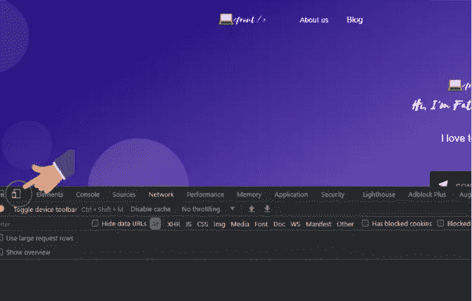
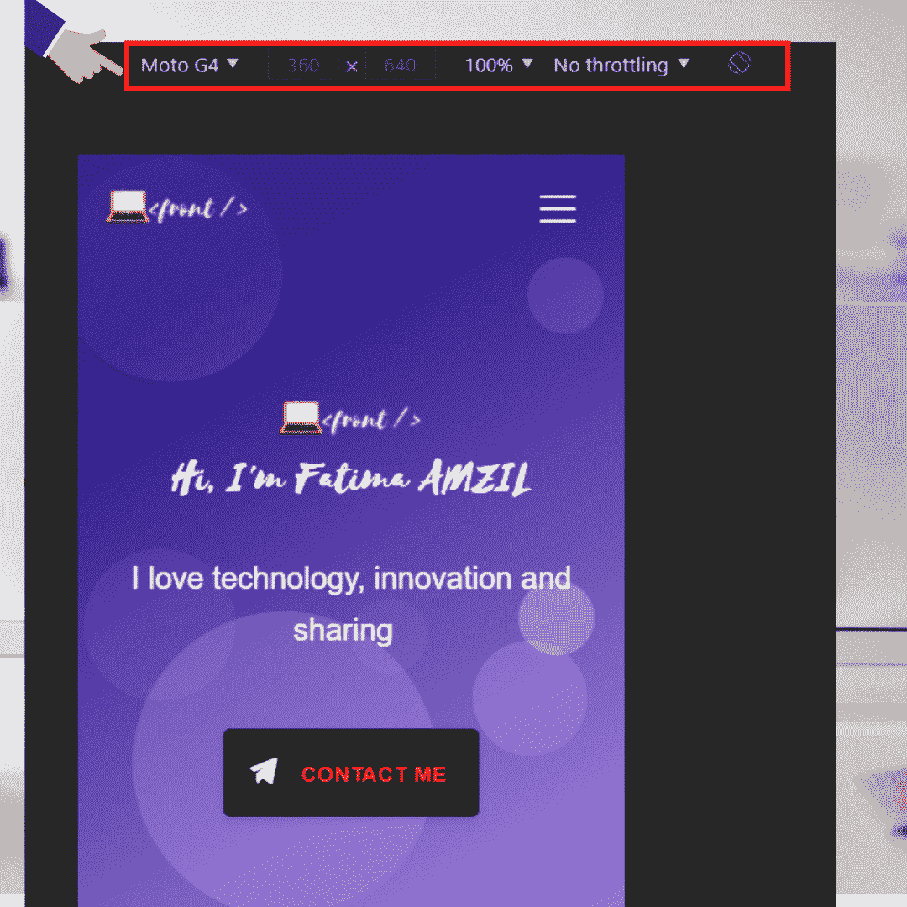
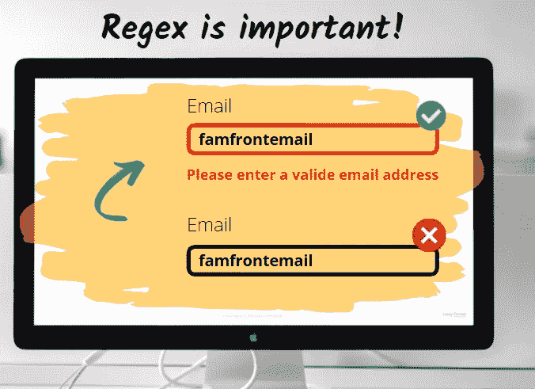

# 开发人员在创建网站时应该避免的 5 个错误

> 原文：<https://levelup.gitconnected.com/5-mistakes-developers-should-avoid-when-creating-a-website-e6738bba5d22>

## 如果你想创建一个专业网站，要避免的 5 件事

作者:FAM

创建一个网站是一回事，但让它活起来并在巨大的数字大脑上可用是另一回事。这篇文章是关于初级开发人员在创建他们的第一个网站时犯的 5 个错误，他们没有检查这些关键点就把网站上线了！

这些错误是常见的。了解它们以及如何避免它们肯定会有所不同，让你的网站在互联网上脱颖而出。

激动吗？让我们开始吧😃

# 第一——不是 Responsive⁣

你知道手机用户占所有互联网用户的多少吗？嗯，超过 53%。很大，不是吗？全世界超过一半的互联网用户，想象一下！确保你的网站可以在所有设备上运行，这将使你的网站可靠、可信，并让移动用户了解你。

要检查网站响应性:

1.  在**的**谷歌 Chrome 标签中打开**你想要**测试**的网站**。
2.  右键点击**网站**的**登陆页面**，打开**菜单**。
3.  **打开**菜单后，点击`inspect`。
4.  然后点击**`Toggle device toolbar`如下图所示:**

****

**使用 Chrome 开发工具测试响应能力**

**点击按钮后，您可以选择不同的设备:**

****

**移动模式**

****还有其他工具如:****

*   **[谷歌缩放器](https://material.io/resources/resizer/)**
*   **[跨浏览器测试](https://crossbrowsertesting.com/)**
*   **[响应式设计检查器](https://responsivedesignchecker.com/)**
*   **[浏览器堆栈](https://www.browserstack.com/)**
*   **[屏蝇](https://screenfly.org/)**
*   **[视口缩放器](https://chrome.google.com/webstore/detail/viewport-resizer-%E2%80%93-respon/kapnjjcfcncngkadhpmijlkblpibdcgm?hl=en)**
*   **[责任人](http://www.responsinator.com/)**
*   **[仿真器](https://www.browserstack.com/live/features?campaignid=10028073288&adgroupid=103863232507&adid=434390274129&gclid=EAIaIQobChMIg5fep__k6QIVh6gYCh2poQD7EAAYASAAEgLscPD_BwE)**

# **#2-可怜的韦伯·accessibility⁣**

**如果你能看到和听到声音，那对你有好处。全世界都没有这个机会！所以，做一个有礼貌的 web 开发者，考虑所有的用户，尽管他们有残疾。**

**所以，不要忘记检查你的网站的可访问性得分！如果你不知道怎么做，这里有一篇关于它的好文章:**

** [## 如何让你的网站在可访问性上排名 100%

### 一个好的网站应该是每个人都可以访问的！

levelup.gitconnected.com](/how-to-make-your-website-rank-100-on-its-accessibility-83036422ae9a)** 

# **#3-糟糕的搜索引擎优化**

**SEO 至关重要。一个合适的 SEO 会让你的网站在互联网上排名靠前，从而得到频繁使用和 quickly⁣.这有时被认为是一个不重要的步骤或一个复杂的话题，不幸的是，被放在一边，而 SEO 是一个优先事项！**

**这是一个必须完成的步骤，所以一定要选中这个框！你想知道如何检查吗？以下是你可以在几分钟内做的事情，让你的网站成为一个 SEO 友好的网站！**

** [## 搜索引擎优化最重要的 HTML 标签

### 如何让你的网站 SEO 友好？

medium.com](https://medium.com/geekculture/the-top-important-html-tag-for-seo-b3e915e15ede)** 

# **#4-可怜的 Performance⁣**

**如果你检查了所有以前的案例，你已经很好了！尽管有一件事可以让你的访客逃跑！你拿到了吗？没错，就是你的网站表现。**

> **等待漫长的网站回复真的很让人沮丧😣**

**有一些工具可以从不同的方面来衡量你的网站，让你的生活更轻松，并告诉你需要改变什么才能排名更高。如果你想了解更多，请查看这些出色的 Chrome 扩展:**

** [## Web 开发者的 5 个最佳 Chrome 扩展

### 我最喜欢的 Chrome 扩展

medium.com](https://medium.com/geekculture/5-best-chrome-extensions-for-web-developers-2b2b54b056d0)** 

# **#5-没有来自 Regex⁣**

**这是典型的初学者错误。表单验证很重要。说明你的网站是专业的，提交的数据是正确的，是可以接受的。**

****

**作者:FAM**

**了解有关正则表达式的更多信息:**

** [## 正则表达式- JavaScript | MDN

### 正则表达式是用于匹配字符串中字符组合的模式。在 JavaScript 中，正则表达式…

developer.mozilla.org](https://developer.mozilla.org/en-US/docs/Web/JavaScript/Guide/Regular_Expressions)** 

> **你犯了多少这样的错误？就我而言，这些都是我在初级开发人员时做的😆…但是学习永无止境，所以继续学习，享受你所做的事情😜**

**要了解更多技巧，请查看@ [ishahasan](https://ishahasan.com/top-10-mistakes-that-web-developers-make/) 撰写的这篇文章**

** [## 网站开发者最常犯的 10 个错误——伊莎·哈桑

### Web 前端自从 WWW(万维网)在 1990 年诞生以来，静态的 HTML 页面已经转变成完全动态的…

ishahasan.com](https://ishahasan.com/top-10-mistakes-that-web-developers-make/) 

**尽情享受吧！**** 

# **亲爱的读者，我希望这是明确和有用的。**

***我希望你和你的家人无论在哪里都平安无事！坚持住。明天会更好！***

****联系一下** [**中**](https://medium.com/@famzil/)**[**Linkedin**](https://www.linkedin.com/in/fatima-amzil-9031ba95/)**[**脸书**](https://www.facebook.com/The-Front-End-World)**[**insta gram**](https://www.instagram.com/the_frontend_world/)**，或者**[**Twitter**](https://twitter.com/FatimaAMZIL9)**。**********

****🔗[www.fatimaamzil.com](http://www.fam-front.com/)****

******FAM******

****⁣****