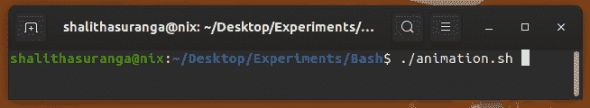

# 只有少数程序员知道的 5 种现代 Bash 脚本技术

> 原文：<https://levelup.gitconnected.com/5-modern-bash-scripting-techniques-that-only-a-few-programmers-know-4abb58ddadad>

## 使用这些技巧让您的 Bash 脚本更具交互性和未来感。


由[马克斯韦尔·尼尔森](https://unsplash.com/@maxcodes?utm_source=unsplash&utm_medium=referral&utm_content=creditCopyText)在 [Unsplash](https://unsplash.com/s/photos/programming?utm_source=unsplash&utm_medium=referral&utm_content=creditCopyText) 上拍摄，由 Canva 编辑

程序员经常使用 Bash 命令语言创建 shell 脚本来自动化手动任务。例如，他们为各种配置、文件操作、生成构建工件以及各种与 DevOps 相关的活动创建 Bash 脚本。几乎所有类 Unix 或基于 Unix 的操作系统都为用户提供了预安装的 Bash 解释器——因此我们可以用 Bash 编写更多可移植的自动化脚本。

我们已经知道，Bash 脚本是指通过使用 Bash 命令语言的语法、内置的 Bash 命令和核心操作系统 CLI 程序(如 GNU 核心实用程序)编写一系列命令。标准的和老式的 Bash 脚本通常执行一些命令，并在终端上显示纯文本输出。

然而，我们可以通过几个独特的概念使我们的 Bash 脚本更具未来感和用户友好性。以下概念用一些不太为人所知的现代 Bash 脚本技术使您的自动化脚本现代化。

# 显示动画以指示长时间运行的任务

在某些场景中，我们必须从 Bash 脚本中执行长时间运行的命令。有几种方法可以指示长时间运行的任务。最简单和最容易的方法是使用`echo`命令显示带有三个尾随点(也称为[省略号](https://en.wikipedia.org/wiki/Ellipsis))的消息。但是，这种方法会产生静态消息，对于用户和开发人员来说，这种消息的交互性和友好性都不是很好。

我们可以使用核心 Unix 操作系统命令和 Bash 内置命令轻松显示 ASCII 动画。请看下面这个只有两个动画帧的简单动画:

```
#!/bin/bashwhile true;
do
    # Frame #1
    printf "\r< Loading..." 
    sleep 0.5
    # Frame #2 
    printf "\r> Loading..." 
    sleep 0.5 
done
```

上面的 Bash 脚本显示了终端上无休止的两帧动画。`printf`语句使用`\r`转义字符来重置当前行的终端光标。以上脚本呈现了以下基于文本的动画:


一个简单的带有 Bash 的双帧文本动画，由作者截图

我们可以用下面的 Bash 脚本向动画添加更多的帧并显示它，直到一个特定的耗时任务完成。

```
#!/bin/bashsleep 5 &
pid=$!frames="/ | \\ -"while kill -0 $pid 2&>1 > /dev/null;
do
    for frame in $frames;
    do
        printf "\r$frame Loading..." 
        sleep 0.5
    done
done
printf "\n"
```

上面的脚本显示了一个基于文本的微调器动画，直到`sleep 5`命令完成执行。类似地，我们可以为任何长时间运行的任务显示 spinner 动画，而不是用`echo`显示静态消息。看下面的预告。



一个带有 Bash 的旋转器文本动画，由作者截图

这些基于文本的动画使 CLI 程序更具用户友好性和交互性，因此大多数现代 CLI 程序都显示这些 ASCII 动画。现在，您知道了如何用动画来更新 Bash 脚本——尝试通过改变`frames`角色列表来创建不同的动画。

# 显示来自 Bash 的本机 GUI 通知

Bash 脚本和 CLI 程序通常为经常使用终端接口的开发人员提供工具。例如， [Flutter 框架](https://medium.com/swlh/goodbye-electron-welcome-flutter-22b3dc10d2f3)为开发人员提供了`flutter`命令行程序，用于管理 Flutter 应用程序和配置 Flutter 应用程序开发环境。假设您正在用 Bash 脚本开发一个长时间运行的命令。当用户不看终端输出时，如何显示一条重要消息？

所有类 Unix 和基于 Unix 的操作系统都有特殊的命令来显示 GUI 通知。我们可以从 Bash 脚本中调用这些命令来显示本机通知。例如，您可以在基于 GNU/Linux 的操作系统上使用`notify-send`命令，如下所示。

```
#!/bin/bashsleep 10
notify-send "notify.sh" "Task #1 was completed successfully"
```

一些 GNU/Linux 发行版通常提供预装版本的`notify-send`工具。上面的 Bash 脚本显示了十秒钟后的本机通知。看下面的预告:


Ubuntu 上的一个原生通知，作者截图

macOS 用户可以从 Bash 执行 [AppleScript](https://en.wikipedia.org/wiki/AppleScript) 解释器来显示本机通知，如下所示:

```
#!/bin/bash
sleep 10osascript -e "display notification \"Task #1 was completed successfully\" with title \"notify.sh\""
```

GUI 通知非常有助于通过长时间运行的脚本或永远运行的后台脚本向用户通知重要事件。

# Bash 脚本中的多重处理

程序员通常用他们的 Bash 脚本按顺序运行命令。因此，Bash 解释器逐个执行每个语句，直到到达源文件或 exit 语句的末尾。我们确实可以将这种顺序执行方法改为并行执行，并加快自动化脚本的速度。

首先，我们可以将整个 Bash 脚本分解成几个可以异步运行的独立函数。接下来，我们可以将所有 Bash 函数作为后台任务运行。最后，我们可以使用内置的`wait`命令来保持脚本执行进程活动，直到所有异步进程结束执行。

请看下面的示例代码:

```
#!/bin/bashfunction task1() {
    echo "Running task1..."
    sleep 5
}function task2() {
    echo "Running task2..."
    sleep 5
}task1 &
task2 &waitecho "All done!"
```

这里我们运行两个并行函数作为后台作业:`task1`和`task2`。此外，我们使用`wait`内置来保持脚本实例活动，直到后台作业完成它们的执行。如果您检查脚本的执行时间，您将看到两个函数都在大约五秒钟内结束——而不是十秒钟。


一个支持多重处理的 Bash 脚本，由作者截图

# 用 Bash 显示 GUI 组件

前面，我们讨论了如何通过长时间运行的 Bash 脚本显示 GUI 通知。类似地，我们可以显示其他 GUI 组件，如消息框、输入框和文件选择对话框。有时，我们必须为非技术计算机用户构建基于 GUI 的自动化程序。如果您已经了解 Bash 脚本，那么您不需要使用其他 GUI 开发工具来创建简单的 GUI 应用程序——因为我们可以用 Bash 显示 GUI 元素。

`zenity`程序提供了几个命令来显示来自 GNU/Linux 命令行环境的各种 GUI 元素。例如，我们可以用下面的命令打开一个文件选择对话框。

```
zenity --file-selection
```

大多数基于 GNOME 的 GNU/Linux 操作系统发行版都预装了 Zenity 版本。此外，或者，您可以在基于 KDE 的 GNU/Linux 发行版上使用`kdialog`命令。

macOS 用户可以像往常一样调用 AppleScript 解释器。例如，他们可以使用以下命令通过 Bash 脚本显示文件选择对话框。

```
osascript -e "POSIX path of (choose file)"
```

您还可以像 Zenity 一样构建自己的二进制文件，并显示 Bash 脚本中的任何 GUI 组件。此外，可以使用 [Neutralinojs](https://github.com/neutralinojs/neutralinojs) 通过 Bash 脚本在本地窗口中显示交互式本地/远程 HTML 界面。

# 用文本样式使终端输出现代化

我们经常使用`echo`命令从脚本中输出消息。默认情况下，`echo`命令根据默认的终端文本样式打印给定的文本。但是，在某些情况下，我们可以通过使用基本的用户体验原则，根据当前的上下文来改进文本样式。例如，我们可以用红色显示一条错误消息。此外，你可以用粗体来强调段落中的一些关键细节。

Unix 程序提供了控制当前终端屏幕的命令。它提供了更改终端光标位置、检索终端信息和更改文本样式的命令。我们可以用`echo`命令调用`tput`命令，在所有类 Unix 和基于 Unix 的操作系统上打印各种文本样式。

请看以下打印不同文本样式的示例:

```
#!/bin/bashbold=$(tput bold)
underline=$(tput smul)
italic=$(tput sitm)
info=$(tput setaf 2)
error=$(tput setaf 160)
warn=$(tput setaf 214)
reset=$(tput sgr0)echo "${info}INFO${reset}: This is an ${bold}info${reset} message"
echo "${error}ERROR${reset}: This is an ${underline}error${reset} message"
echo "${warn}WARN${reset}: This is a ${italic}warning${reset} message"
```

这里，我们使用`tput`命令为每种文本样式定义了一些变量。最后，我们用`echo`命令执行临时保存的命令来显示不同的文本样式，如下所示。


Bash 中的文本样式，预览，作者截图

使用上述方法，您可以为 Bash 脚本构建自己的个性化配色方案。上面的示例脚本使用空设备文件(`/dev/null`)来隐藏来自`kill`命令的错误消息。您可以从下面的故事中了解关于所有特殊 Unix 设备文件的更多信息:

[](/unix-internal-concepts-that-every-developer-should-know-374c3fb78b2e) [## 每个开发人员都应该知道的 Unix 内部概念

### 从程序员喜欢的操作系统中理解有趣的概念

levelup.gitconnected.com](/unix-internal-concepts-that-every-developer-should-know-374c3fb78b2e) 

感谢阅读。

# 分级编码

感谢您成为我们社区的一员！升级正在改变技术招聘。 [**在最好的公司**找到你的完美工作](https://jobs.levelup.dev/talent) **，而不仅仅是你的*下一份工作*。**

[](https://jobs.levelup.dev/talent) [## 提升——改变招聘流程

### 🔥让软件工程师找到他们热爱的完美角色🧠招聘人才是最痛苦的部分…

作业. levelup.dev](https://jobs.levelup.dev/talent)