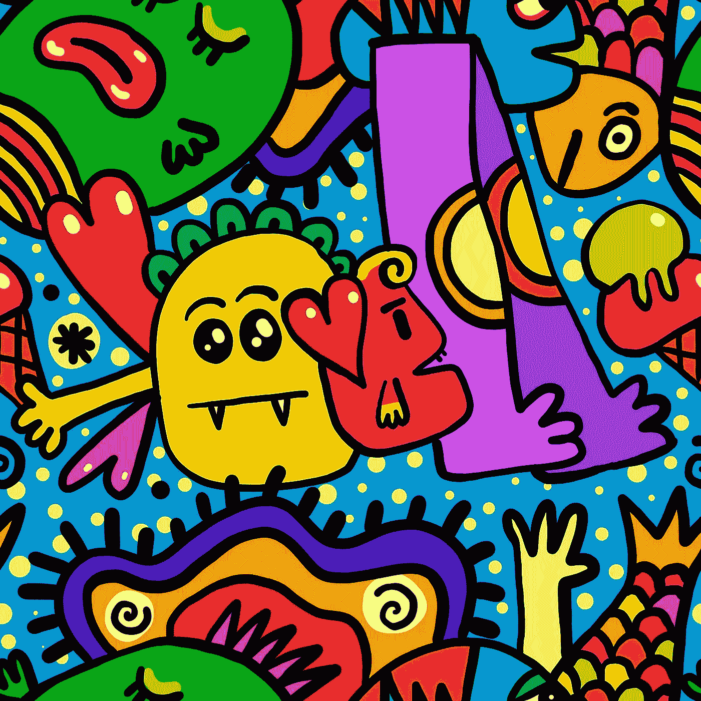
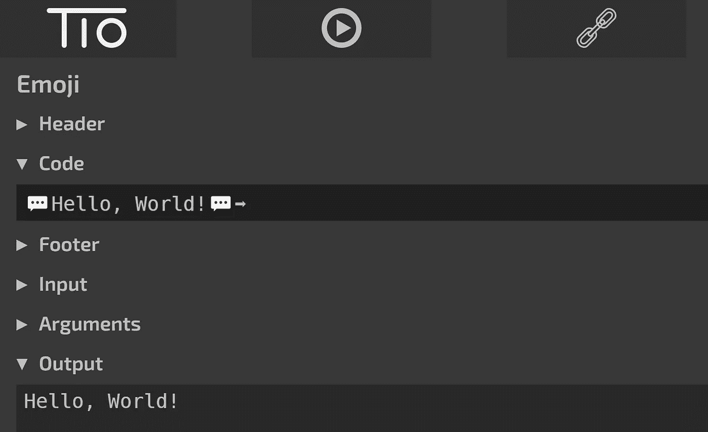
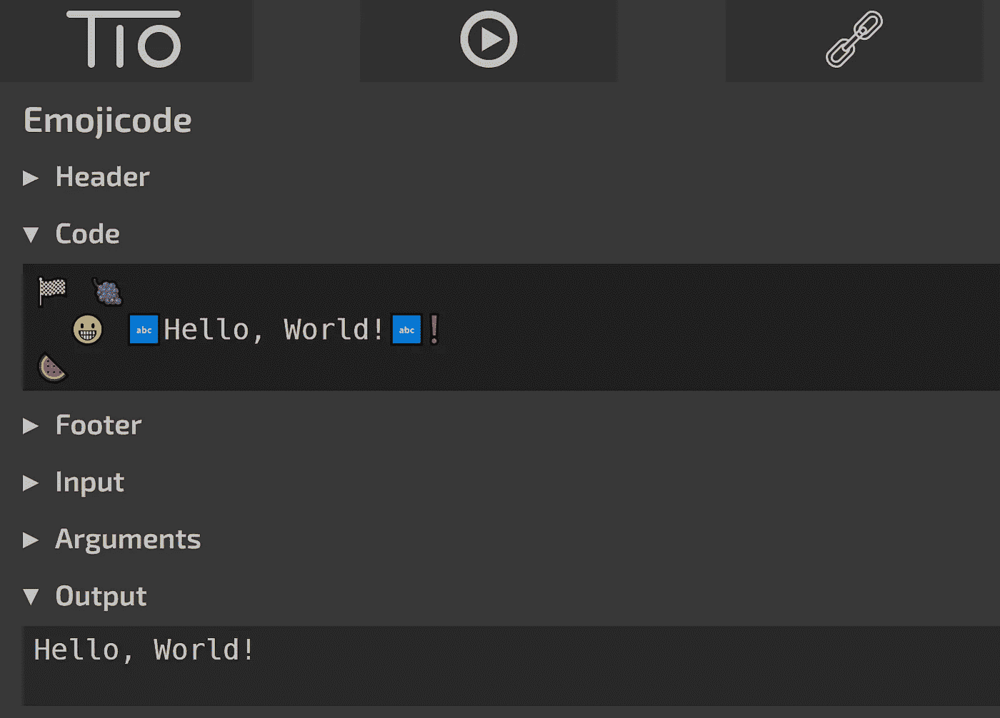
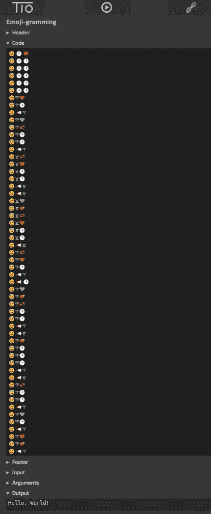
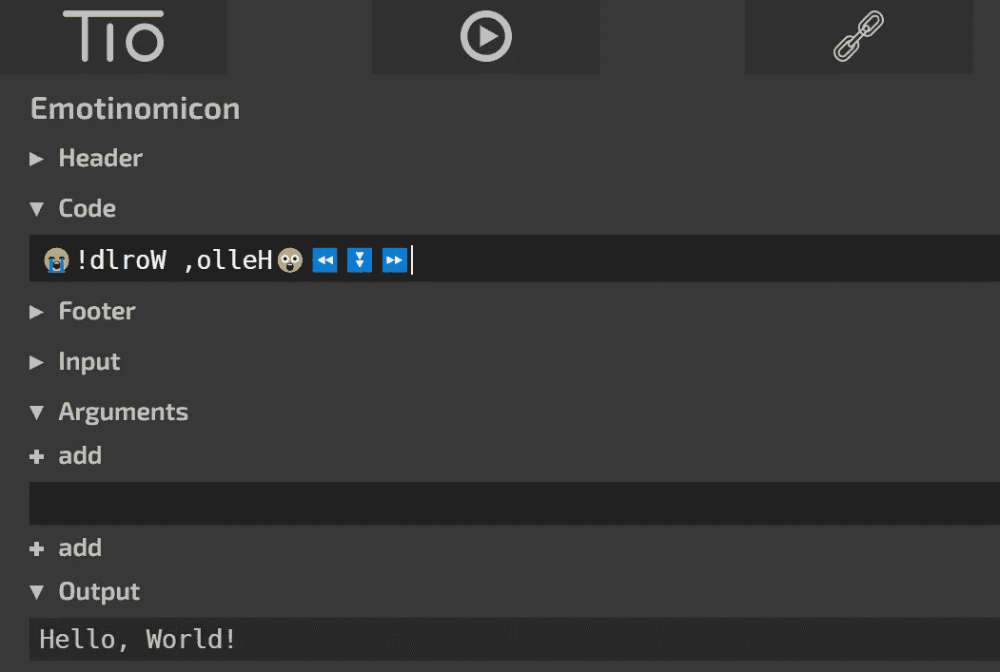

# 你可以用表情符号编写 5 种实用的编程语言

> 原文：<https://levelup.gitconnected.com/5-most-amusing-programming-languages-you-can-code-using-emojis-4bfd43bc7614>

## 找出其中有多少你以前听说过。



图片来自 [Pixabay](https://pixabay.com/?utm_source=link-attribution&utm_medium=referral&utm_campaign=image&utm_content=1657835) 的 [Prawny](https://pixabay.com/users/prawny-162579/?utm_source=link-attribution&utm_medium=referral&utm_campaign=image&utm_content=1657835)

谁会想到我们最喜欢的表情符号可以用来设计新的编程语言？

嗯，聪明而有才华的人已经想象并开发出了成熟的编程语言，我们可以用这些语言用**表情符号**和**表情符号**进行编码。

这些基于表情符号的语言大多是**深奥的编程语言**(或者 ***esolang*** )。然而，这些语言相对来说比其他语言更容易理解。

如果你还不知道什么是 esolang，下面是它的定义:

> esolang 不是为普通的软件开发目的而设计的。它们旨在证明概念或作为一个笑话。

如果你想了解世界上最难的*，你可以查看我的另一篇文章[**。**](/5-most-difficult-programming-languages-in-the-world-549c3cf91b23)*

*让我们找出五种可以用*表情符号*和*表情符号*编码的编程语言。*

```
*1\. Emoji
2\. Emojicode
3\. Emoji-gramming
4\. EmojiCoder
5\. Emotinomicon*
```

# *表情符号*

****表情符号*** 使用预定义的表情符号列表来形成语言的命令。这些表情符号起到了象征的作用。*表情符号*是一个基于堆栈的 esolang。在这种语言中，表情符号用于操纵堆栈。*

**除表情符号外，所有其他字符都不被视为标记。**

*下面是打印' *Hello World！*表情符号*中的*。*

```
*💬Hello, World!💬➡*
```

*以下是输出:*

**

*作者—用 tio.run 执行的代码*

*我知道开发人员喜欢自己摆弄代码。所以，这里是*表情符号的令牌文档。**

*在这里 尝试一下语言，运行自己的代码 [*。*](https://tio.run/#emoji)*

*[作者的公共要旨](https://gist.github.com/Lokajit/06c52f6adbac032a9652a13f75de02c9)*

# *表情代码*

****表情代码*** 是一种面向对象的编程语言，我们可以用表情符号进行编码。表情符号的使用使得用表情代码编程变得很有趣。*

**它是一种强类型编程语言，对类有一流的支持。**

*该语言的作者讨厌随机的空指针异常。因此，在 *Emojicode 中，*所有的实例变量都需要初始化，否则会抛出编译错误。*

*你可以在这里 找到*表情代码* [*的文档。*](https://www.emojicode.org/docs/)*

*下面是打印' *Hello World！*表情代码*中的*。*

```
*🏁 🍇
  😀 🔤Hello, World!🔤❗️
🍉* 
```

*以下是输出:*

**

*作者—用 tio.run 执行的代码*

*试试这里的表情代码[](https://tio.run/#emojicode6)**，玩得开心。***

# ***表情符号-语法***

***表情符号是一种基于表情符号的深奥的编程语言。***

***这种语言总共有 25 个变量和四个命令，都由特定的表情符号表示。***

***表情符号使用心形作为常数。例如:***

```
***💔 is 0
💜 is 1
💕 is 2
💞 is 4
💖 is 8***
```

***麦克风(🎤)符号代表输入，扬声器(📢)符号代表打印输出。嗯，对我来说有道理。😃***

***下面是打印' *Hello，World！*表情符号*中的*。点击*查看原始数据*选项，获取正确的语法，以便复制执行。***

*[作者的公开要旨](https://gist.github.com/Lokajit/72e4fa62883e2b1a0db0d1a1090304ab)*

*以下是输出:*

**

*作者—用 tio.run 执行的代码*

# *表情编码器*

**杰瑞米*和*莎拉·纳森* 专编 ***表情编码*** 。这是一种表情符号，其中命令和参数由特定的表情符号表示。*

**二进制值 0 和 1 在 Emojicoder 中定义了各自的表情符号。**

```
*🌚=0
🌝=1
Ex: 🌚🌝🌚🌚🌝🌚🌚🌚 = 01001000 = H*
```

*Emojicoders 中有两个修饰符，如下所示:*

```
*🔡: Ascii Character 0-255🔢: Integer Number 0-255*
```

*为了打印参数，该语言使用手波表情符号(👋)作为输出命令。每个命令都需要在新的一行。*

*现在，让我们利用以上知识，打印出'*你好，世界！*表情编码中的*。**

```
*👋🔡🌚🌝🌚🌚🌝🌚🌚🌚 //Output H
👋🔡🌚🌝🌝🌚🌚🌝🌚🌝 //Output e
👋🔡🌚🌝🌝🌚🌝🌝🌚🌚 //Output l
👋🔡🌚🌝🌝🌚🌝🌝🌚🌚 //Output l
👋🔡🌚🌝🌝🌚🌝🌝🌝🌝 //Output o
👋🔡🌚🌚🌝🌚🌝🌝🌚🌚 //Output ,
👋🔡🌚🌚🌝🌚🌚🌚🌚🌚 //Output space
👋🔡🌚🌝🌝🌝🌚🌝🌝🌝 //Output w
👋🔡🌚🌝🌝🌚🌝🌝🌝🌝 //Output o
👋🔡🌚🌝🌝🌝🌚🌚🌝🌚 //Output r
👋🔡🌚🌝🌝🌚🌝🌝🌚🌚 //Output l
👋🔡🌚🌝🌝🌚🌚🌝🌚🌚 //Output d
👋🔡🌚🌚🌝🌚🌚🌚🌚🌝 //Output !*
```

*以下是输出:*

**

*作者—用 tio.run 执行的代码*

*在本文的参考资料部分可以找到一个链接，链接到 *EmojiCoder* esolang 中的完整命令列表。*

# *情绪图标*

****Emotinomicon*** 由 [*康纳·奥布莱恩*](http://conorobrien-foxx.github.io/) 设计创作。这是一个基于堆叠的 esolang。 *Emotinomicon* 使用表情符号进行编码，而不是表情符号。*

*下面是打印' *Hello，World！*表情图标*中的*。*

```
*😭!dlroW ,olleH😲⏪⏬⏩*
```

*下面是对上述代码片段的解释。它可以帮助你尝试你想执行的任何其他字符串，并从中获得乐趣。*

```
*😭begin quote string
!dlroW ,olleH
😲end quote string
⏪open loop
⏬pops and outputs top of stack as character
⏩close loop*
```

*以下是输出:*

**

*作者—用 tio.run 执行的代码*

*[*使用此链接*](http://conorobrien-foxx.github.io/Emotinomicon/int.html) 获得一种无需复制粘贴正确表情符号的简单方法。*

*我们不都喜欢一点点奖金吗？我将给你们留下一个 esolang，这是一种基于表情符号的语言。*

# *情绪化*

**Emotifuck* 写成*Rust b*y[Romulus 10](https://github.com/Romulus10)和 [Insipx](https://github.com/insipx) 。它使用八个表情符号作为命令。根据该语言的设计者，它是完全内存安全的。*

*下面是命令列表和它们的 *Brainfuck* 等效符号。*

```
*🔥 - Move Right (>)
💯 - Move Left (<)
💩 - Decrement (-)[*might have been better as output command ;)]*
😂 - Increment (+)
💞 - Output (.)
🙏 - Input (,)
🌚 - Jump Forward ([)
🐸 - Jump Backward (])*
```

**你好世界！*脑操*中的*代码如下*。**

```
*++++++++++[>+++++++>++++++++++>+++>+<<<<-]>++.>+.+++++++..+++.>++.<<+++++++++++++++.>.+++.------.--------.>+.>.*
```

*让我们使用命令，并翻译大脑他妈的'*您好世界！*代码到其 *Emotifuck* 的等价物。这里是' *HelloWorld 的最后代码！*’。*

```
*😂😂😂😂😂😂😂😂🌚🔥😂😂😂😂🌚🔥😂😂🔥😂😂😂🔥😂😂😂🔥😂💯💯💯💯💩🐸🔥😂🔥😂🔥💩🔥🔥😂🌚💯🐸💯💩🐸🔥🔥💞🔥💩💩💩💞😂😂😂😂😂😂😂💞💞😂😂😂💞🔥🔥💞💯💩💞💯💞😂😂😂💞💩💩💩💩💩💩💞💩💩💩💩💩💩💩💩💞🔥🔥😂💞🔥😂😂💞*
```

***快乐编码！***

****感谢阅读文章。你可能也喜欢阅读:****

*[](/software-developers-guide-how-to-achieve-an-extraordinary-career-growth-8b9952f3d163) [## 作为程序员，如何实现非凡的职业发展

### #1.你的职业是你的责任。

levelup.gitconnected.com](/software-developers-guide-how-to-achieve-an-extraordinary-career-growth-8b9952f3d163) [](/greatest-myths-about-coding-among-software-developers-e578b7556171) [## 软件开发人员关于编码的最大误区

### 摆脱这些误解，在软件开发中有一个加速的职业生涯。

levelup.gitconnected.com](/greatest-myths-about-coding-among-software-developers-e578b7556171) 

**参考文献:**

埃索朗维基:[https://esolangs.org/wiki](https://en.wikipedia.org/wiki/Esoteric_programming_language)

表情符号列表:[https://esolangs.org/wiki/Emoji](https://esolangs.org/wiki/Emoji)

表情代码:[https://www.emojicode.org/](https://www.emojicode.org/)

表情符号:https://esolangs.org/wiki/Emoji-gramming

表情编码员:[https://esolangs.org/wiki/EmojiCoder](https://esolangs.org/wiki/EmojiCoder)

https://github.com/ConorOBrien-Foxx/Emotinomicon

https://github.com/Romulus10/emotif___*