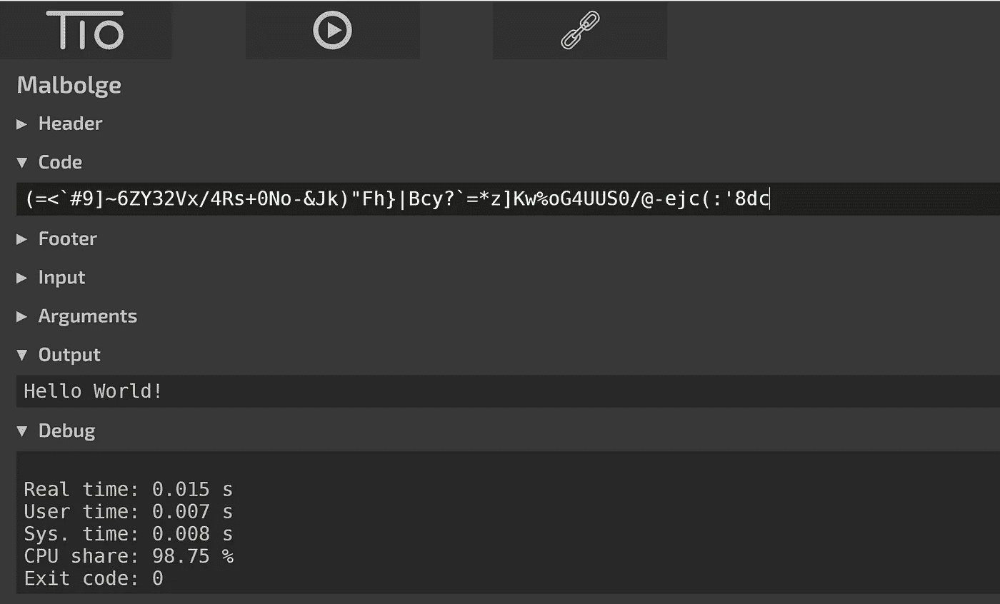
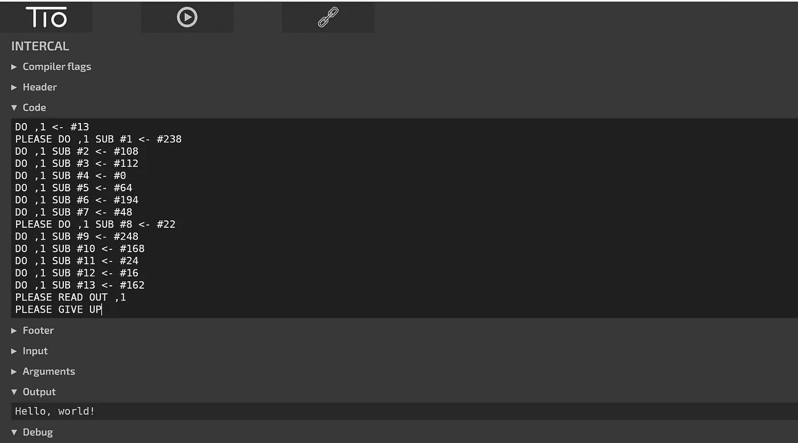
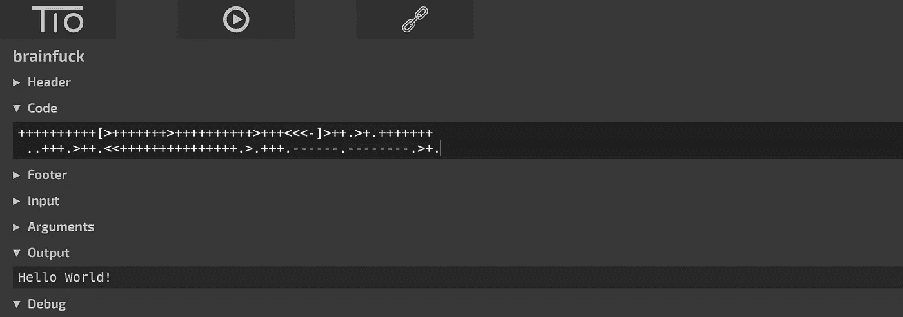
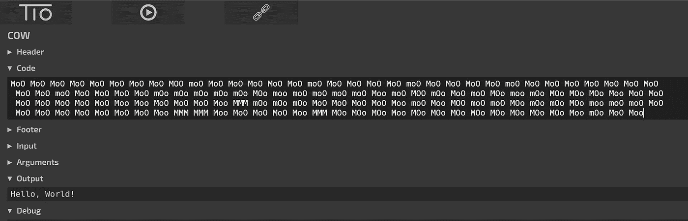
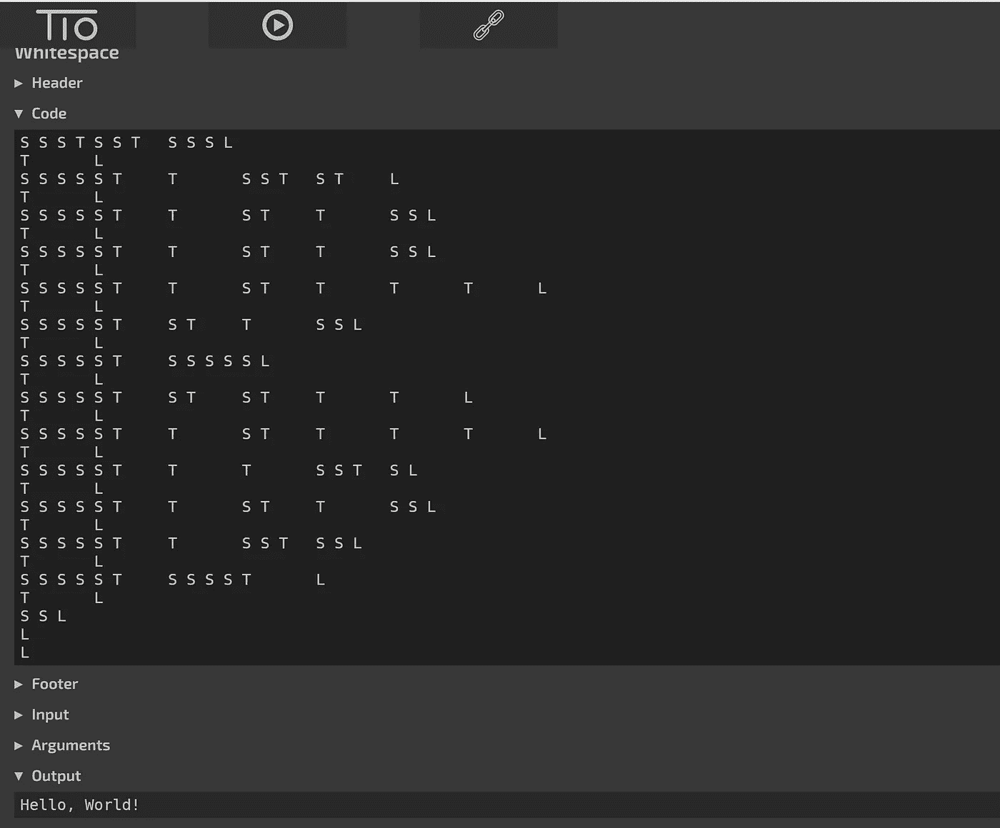

# 世界上最难的 5 种编程语言

> 原文：<https://levelup.gitconnected.com/5-most-difficult-programming-languages-in-the-world-549c3cf91b23>

## 你以前听说过多少？


图片来自 [Pixabay](https://pixabay.com/?utm_source=link-attribution&utm_medium=referral&utm_campaign=image&utm_content=1535345) 的 [Prawny](https://pixabay.com/users/prawny-162579/?utm_source=link-attribution&utm_medium=referral&utm_campaign=image&utm_content=1535345)

当我们都在谈论 c、c++、Java、Python 等的时候。对于大多数软件开发人员来说，有些语言不仅难懂，而且几乎无法理解。

这些语言被称为**深奥的编程语言**(或 ***esolang*** )。

> esolang 不是为普通的软件开发目的而设计的。它们旨在证明概念或作为一个笑话。

这里列出了五种最难的深奥语言。我尝试执行' *Hello World！每种语言的程序都很有趣。*

# 马尔博尔格

马尔堡是本·奥姆斯特德在 1998 年发明的。这种 esolang 被认为是最复杂的编程语言。

据说 Malbolge 编程语言的作者从未使用该语言编写过任何程序。在奥姆斯特德发明这种语言大约两年后，马尔堡语中的 hello world 代码出现了。

下面是打印' *Hello World！*在*马尔博尔格*中。

```
(=<`#9]~6ZY32Vx/4Rs+0No-&Jk)"Fh}|Bcy?`=*z]Kw%oG4UUS0/@-ejc(:'8dc
```

以下是输出:



作者—使用 tio.run 执行的代码

# **嵌入**

吉姆·里昂和唐·伍兹于 1972 年开发了 INTERCAL，作为对各种编程语言的模仿。

它最初的名字是——‘没有发音缩写的编译器语言*’*’。

INTERCAL 有许多特性让程序员感到沮丧。

> 例句:它使用了“请”这样的修饰语。如果代码中不经常使用“PLEASE ”,编译器可以拒绝该代码。它认为程序'*不够礼貌'*。如果修饰符“PLEASE”使用次数过多，编译器会拒绝代码，声明它是“*过度礼貌的*”。

下面是打印' *Hello，World！*中的*插入*。

```
**DO** ,1 <- #13
PLEASE **DO** ,1 **SUB** #1 <- #238
**DO** ,1 **SUB** #2 <- #108
**DO** ,1 **SUB** #3 <- #112
**DO** ,1 **SUB** #4 <- #0
**DO** ,1 **SUB** #5 <- #64
**DO** ,1 **SUB** #6 <- #194
**DO** ,1 **SUB** #7 <- #48
PLEASE **DO** ,1 **SUB** #8 <- #22
**DO** ,1 **SUB** #9 <- #248
**DO** ,1 **SUB** #10 <- #168
**DO** ,1 **SUB** #11 <- #24
**DO** ,1 **SUB** #12 <- #16
**DO** ,1 **SUB** #13 <- #162
PLEASE **READ** **OUT** ,1
PLEASE GIVE UP
```

以下是输出:



作者—使用 tio.run 执行的代码

# 脑残

Brainfuck 是由 *Urban Muller* 在 1993 年开发的。这种语言是作为程序员的一种娱乐而发明的。

这个名字本身就表明这种语言对于任何程序员来说都是非常难以理解的。

整个语言仅由八个不同的字符组成，用于任何代码的实现。Muller 开发的原始编译器只用了 296 个字节。

下面是打印' *Hello World！*中的**脑残。

```
++++++++++[>+++++++>++++++++++>+++<<<-]>++.>+.+++++++
 ..+++.>++.<<+++++++++++++++.>.+++.------.--------.>+.
```

以下是输出:



作者—使用 tio.run 执行的代码

# 母牛

奶牛是在 2003 年由*肖恩·希伯*开发的。一旦你看到 hello world 代码，你就会明白为什么这种语言被命名为“COW”。

COW 和 Brainfuck 在难度级别上差不多。与 Brainfuck 相比，它多了四个命令，即整个语言中有 12 个命令。

下面是打印' *Hello，World！*中的*牛*。

```
MoO MoO MoO MoO MoO MoO MoO MoO MOO moO MoO MoO MoO MoO MoO moO MoO MoO MoO MoO moO MoO MoO MoO MoO moO MoO MoO MoO MoO MoO MoO MoO
 MoO MoO moO MoO MoO MoO MoO mOo mOo mOo mOo mOo MOo moo moO moO moO moO Moo moO MOO mOo MoO moO MOo moo mOo MOo MOo MOo Moo MoO MoO 
 MoO MoO MoO MoO MoO Moo Moo MoO MoO MoO Moo MMM mOo mOo mOo MoO MoO MoO MoO Moo moO Moo MOO moO moO MOo mOo mOo MOo moo moO moO MoO 
 MoO MoO MoO MoO MoO MoO MoO Moo MMM MMM Moo MoO MoO MoO Moo MMM MOo MOo MOo Moo MOo MOo MOo MOo MOo MOo MOo MOo Moo mOo MoO Moo
```

以下是输出:



作者—使用 tio.run 执行的代码

# 空白

空白是由杜伦大学的克里斯·莫里斯和埃德温·布雷迪开发的。这种语言发布于 2003 年的愚人节。

整个语言依赖于*空格*、*制表符*和*换行*来编写任何程序。空白解释器忽略非空白字符，并将它们视为代码注释。

下面是打印' *Hello，World！*空格*中的*。

在下面的代码中，每个*空格*、*制表符*或*换行符*前面分别有一个注释‘S’、‘T’或‘L’。

```
S S S T	S S T	S S S L
T	L
S S S S S T	T	S S T	S T	L
T	L
S S S S S T	T	S T	T	S S L
T	L
S S S S S T	T	S T	T	S S L
T	L
S S S S S T	T	S T	T	T	T	L
T	L
S S S S S T	S T	T	S S L
T	L
S S S S S T	S S S S S L
T	L
S S S S S T	S T	S T	T	T	L
T	L
S S S S S T	T	S T	T	T	T	L
T	L
S S S S S T	T	T	S S T	S L
T	L
S S S S S T	T	S T	T	S S L
T	L
S S S S S T	T	S S T	S S L
T	L
S S S S S T	S S S S T	L
T	L
S S L
L
L
```

以下是输出:



作者—使用 tio.run 执行的代码

# 疯狂吧

类似的*秘传语言*还有很多。您可以访问本文的参考资料部分并对其进行研究。

使用 [*下面的*](https://tio.run/#) *，*站点，它提供了几乎所有语言的编译器和解释器。从参考页面中复制代码，并从中获得乐趣。

***感谢您阅读文章。你可能也喜欢阅读:***

[](/humorous-list-of-things-a-toxic-boss-does-at-workplace-21947df6a565) [## 有毒老板在工作场所做的幽默清单

### 如果你从未面对过这些，你应该感到幸运。

levelup.gitconnected.com](/humorous-list-of-things-a-toxic-boss-does-at-workplace-21947df6a565) [](/10-programming-jokes-for-programmers-b9c436f3e023) [## 程序员的 10 个编程笑话

### 不是程序员也不用担心。这些笑话仍然会逗得你捧腹大笑。

levelup.gitconnected.com](/10-programming-jokes-for-programmers-b9c436f3e023) [](/greatest-myths-about-coding-among-software-developers-e578b7556171) [## 软件开发人员关于编码的最大误区

### 摆脱这些误解，在软件开发中有一个加速的职业生涯。

levelup.gitconnected.com](/greatest-myths-about-coding-among-software-developers-e578b7556171) 

**参考文献:**

埃索朗维基:[https://esolangs.org/wiki](https://en.wikipedia.org/wiki/Esoteric_programming_language)

马尔博尔格:[https://esolangs.org/wiki/malbolge](https://esolangs.org/wiki/malbolge)

嵌入:[https://en.wikipedia.org/wiki/INTERCAL](https://en.wikipedia.org/wiki/INTERCAL)

脑残:[https://en.wikipedia.org/wiki/Brainfuck](https://en.wikipedia.org/wiki/Brainfuck)

牛:【https://esolangs.org/wiki/COW】T2

空白:【https://esolanga.org/wiki/whitespace 

# 分级编码

感谢您成为我们社区的一员！ [**订阅我们的 YouTube 频道**](https://www.youtube.com/channel/UC3v9kBR_ab4UHXXdknz8Fbg?sub_confirmation=1) 或者加入 [**Skilled.dev 编码面试课程**](https://skilled.dev/) 。

[](https://skilled.dev) [## 编写面试问题+获得开发工作

### 掌握编码面试的过程

技术开发](https://skilled.dev)