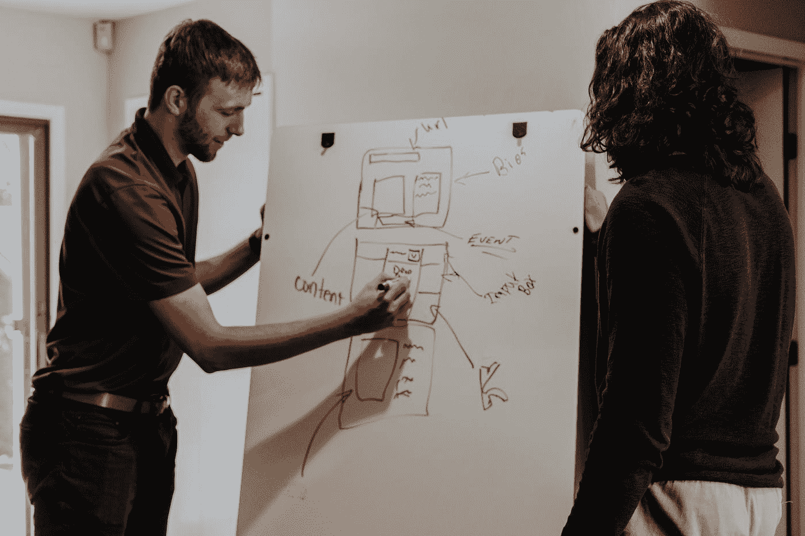

# 当我雇佣开发人员时，我寻找的 5 个最重要的特征

> 原文：<https://levelup.gitconnected.com/5-most-important-traits-i-look-for-when-i-hire-a-developer-7aa557bc4410>

## 我对招聘过程的看法

[Clem Onojeghuo](https://unsplash.com/@clemono?utm_source=medium&utm_medium=referral) 在 [Unsplash](https://unsplash.com?utm_source=medium&utm_medium=referral) 上拍摄的照片

我已经采访开发商很多年了。我最重要的经验教训来自三种类型的人:

*   优秀员工
*   我后悔雇佣的人
*   被拒绝的候选人

我更加关注那些糟糕的员工，并分析我在雇用他们时错过了什么。

> 我相信，如果候选人是一个优秀的软件开发人员和团队合作者，他可以学习任何语言，也可能学习任何领域的软件。

当你面试一个人时，了解他并不容易。所以现在我的招聘过程更有条理，而不是临时的。我在我想为我的团队雇用的人身上寻找某些特质。

# 思考第一

[胡安·鲁米姆普努](https://unsplash.com/@earbiscuits?utm_source=medium&utm_medium=referral)在 [Unsplash](https://unsplash.com?utm_source=medium&utm_medium=referral) 上的照片

思考先于编程。计算思维是编程的第一步。最关键的部分是逻辑思维，将问题分解成几个步骤来寻找解决方案。

在第一轮面试中，我试图找出候选人的计算思维是如何的。我给了他们与数据结构、动态编程等相关的问题。我不会限制他们想使用的语言。

> 如果你能思考和解决问题，任何语言都可以学习

*我见过许多有经验的候选人在你开始讨论二分搜索法树和图表时放弃。*

# 基本概念和经验

由[万花筒](https://unsplash.com/@kaleidico?utm_source=medium&utm_medium=referral)在[解锁](https://unsplash.com?utm_source=medium&utm_medium=referral)时拍摄

另一个重要的属性是计算机科学的基本概念。

我们讨论伪解决方案中涉及的各种子系统的功能，并尝试衡量候选人对整个系统如何工作的理解。与操作系统、数据结构以及特定领域的理论和观点相关的概念。

接下来是候选人的经历。讨论过去的项目、候选人面临的问题以及如何解决这些问题。

这使您能够深入了解这些功能，并帮助您做出决定。

# 问题解决

艾伦·德·拉·克鲁兹在 [Unsplash](https://unsplash.com?utm_source=medium&utm_medium=referral) 上的照片

解决问题涉及许多步骤:

*   定义问题
*   分析问题的原因
*   生成替代方法
*   评估和选择备选方案
*   实施解决方案

我向候选人抛出几个众所周知的非常规问题。目标是看候选人在解决问题时对上述步骤的掌握程度。

我经常给他们提示，看他们怎么进行。

> 我只看方法，不看解决方案

# 设计概念

Firmbee.com 在 [Unsplash](https://unsplash.com?utm_source=medium&utm_medium=referral) 上[拍照](https://unsplash.com/@firmbee?utm_source=medium&utm_medium=referral)

设计和编码一样重要。我们做一些讨论来了解候选人的设计思想。

想法是看一看他/她设计解决方案的方式。我寻求的关键方面是解决方案的简单性。我对用例做了一些修改，然后看候选人如何适应它们。

# 态度

[Alex Iby](https://unsplash.com/@alexiby?utm_source=medium&utm_medium=referral) 在 [Unsplash](https://unsplash.com?utm_source=medium&utm_medium=referral) 上拍摄的照片

正确的态度是一个好队友最重要的品质之一。

> 一次错误的雇佣会改变团队的动态，让每个人都效率低下。

你希望雇佣一个与团队融合得很好，并且在技能方面与团队互补的人。

在我的职业生涯中，我见过糟糕的员工造成的伤害。全队掷硬币决定胜负。

# 包装它

几年前，当我为我的团队招聘员工时，我花了很多时间。面试了 4-5 名候选人后，我开始思考。所以我想出了这些我希望队友具备的品质。我的团队的招聘流程围绕着我上面列出的品质。

*喜欢自己体验媒介？考虑通过注册会员* *来支持我和其他作家* [***。会员每月只需 5 美元，它支持我们，作家，没有额外的费用。如果你这样做，我会收到一部分费用，不会多花你多少钱。谢谢大家！***](https://singhamrit.medium.com/membership)