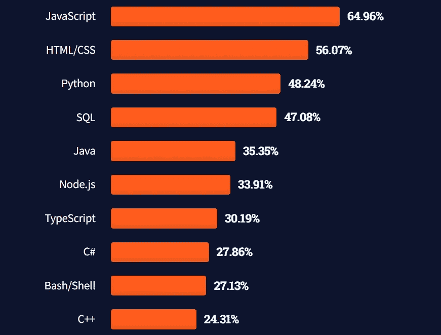

# 顶级组织使用的 5 种最常用的编程语言

> 原文：<https://levelup.gitconnected.com/5-most-used-programming-languages-that-the-top-organizations-are-using-7f242968cced>

## …或许你也应该学习它们。

穆罕默德·拉赫马尼在 [Unsplash](https://unsplash.com/@afgprogrammer?utm_source=unsplash&utm_medium=referral&utm_content=creditCopyText) 上的照片

几乎每个星期左右，我都会听到*****编程语言已死，我们必须学习这个和那个，或者说现在*****正在流行，所以我们必须也应该成为早期采用者。

然而，软件开发的现实与互联网上重复出现的情况大相径庭。当组织开发应用程序时，他们希望它们是可伸缩的、安全的，最重要的是，易于维护。

今天，我看到很多初学者在选择他们的第一门编程语言时感到困惑。现在，在公司工作时选择编程语言将不是取决于你，而是取决于你的组织。

当我开始时，我致力于开发可定制的电子商务网站，为此，我使用了 WooCommerce 和 Magento 等电子商务平台，它们都是基于 PHP 的 CMS。

当我转到一个不同的组织时，我有机会为医疗保健和银行部门的不同组织工作。我发现 Java 是我的项目中最受欢迎的编程语言，因此，我学习了 Java 及其框架。但是，我也以各种身份使用过 JavaScript 和 Python。

有一天，一个初级开发人员问我大公司使用哪种编程语言。我很好奇，做了些调查。

因此，根据 StackOverflow 进行的 [*年度开发者调查，以下是最常用的五种编程语言，以及哪些组织使用它们。*](https://insights.stackoverflow.com/survey/2021)

# StackOverflow 中最流行的技术

告诉你一个秘密:每年，我都很期待调查的结果。事实上，我积极参与了开发者调查。

根据调查，他们拥有最流行的技术，可能包括编程语言、脚本语言、框架，甚至库。

最流行技术的快照。点击查看完整报告[。](https://insights.stackoverflow.com/survey/2021#technology-most-popular-technologies)

对于这个列表，我排除了库、框架，甚至 SQL 或 HTML/CSS，尽管它们被认为是一种语言，几乎每个公司的组织都在使用它们。

因此，包含在下面的列表中是没有意义的。无论如何，你必须知道一些。真的，无意冒犯打算使用这些的开发者。

# Java Script 语言

JavaScript 第九次登上排行榜榜首。我确信这不会很快改变。我的意思是，自从开源、跨平台、后端 JavaScript 运行时环境 *Node.js* 发布以来，这种编程语言已经成为网络语言。

根据调查，64.96%的开发者在他们的软件开发中使用 JavaScript。

**基于此的框架/库:** *jQuery，Angular，React，Next.js，Vue.js，Deno.js，Node.js，Ember.js，Backbone.js，*等等等等。

**热门 IDE/编辑器** : *Visual Studio 代码，Sublime Text，Atom，Webstorm，括号，ActiveState 的 Komodo IDE，*甚至 *Notepad++* 。

**组织:** *脸书、网飞、谷歌、优步、PayPal、LinkedIn、微软、沃尔玛、Groupon、*等等。

# 计算机编程语言

Python 的巅峰之旅就是这样一个有趣的经历。开始时，它是一种简单的脚本语言，被认为是 Perl 的替代语言。这些年来，这种编程语言在新程序员中获得了巨大的欢迎和吸引力。

Python 的易学性、庞大的库数量以及在各种领域的广泛使用使其成为当今最流行的编程语言。事实上，[根据 Tiobe 的排名，Python 超过了 Java、JavaScript 和 C 成为最受欢迎的语言](https://www.tiobe.com/tiobe-index/)。然而，Tiobe 是根据网络搜索来计算结果的。

由于 Python 是机器学习的首选编程语言，它已经获得了巨大的流行。根据 StackOverflow 的开发者调查，48.24%的开发者选择 Python 作为他们的编程语言。

**基于此的框架:** *Django，Flask，Bottle，web2py，FastAPI，*等等。

**热门 IDEs 编辑器** : *PyCharm，Visual Studio Code，Sublime Text，Atom，Thonny，Vim，Spyder，Jupyter Notebook，* *等。*

组织: *Spotify、NASA、脸书、谷歌、英特尔、Instagram、Reddit、Pixar、Pinterest、*等等。

# Java 语言(一种计算机语言，尤用于创建网站)

世界上最流行的编程语言之一是 Java。在过去的 25 年中，它一直排在前 3 位，因为如果没有这种语言，开发高度可伸缩和安全的软件，尤其是在金融领域，总是很困难。

[Java 被评为开发人员用于云计算](https://www.oracle.com/java/moved-by-java/timeline/)的最佳编程语言，据甲骨文称，它运行在超过 55 亿台设备上。调查表明，35.35%的开发者在他们的软件开发中使用 Java。

**基于此的框架:** *Spring，Spring boot，Micronaut，Hibernate，Grails，Vaadin，Play，Dropwizard 等。*

**热门 ide**:*IntelliJ Idea，Eclipse，Netbeans，BlueJ，DrJava，MyEclipse，Oracle JDeveloper 等。*

**组织:** *Airbnb、谷歌、易贝、网飞、亚马逊、Spotify、Instagram、优步、*等等。

# C#

C#是由微软开发的。NET 框架来开发他们的软件产品。当时，它是封闭的源代码。最初被吹捧为与 Java 竞争的语言，然而，这种语言在设计上更接近 C++。

2014 年，C#编译器被开源，多年来，它成为 GitHub 上的顶级编程语言之一。它在 27.86%的开发者中很受欢迎。

**基于此的框架:** *。网，。NET Core、Blazor Server、Xamarin Forms 或 Xamarin Native、Blazor Hybrid、ASP.NET Web Forms、Mono 等。*

**热门 ide**:*VS Code，Visual Studio，Rider，Atom，DevExpress 等。*

**组织:** *微软、StackOverflow、通用汽车、Delivery Hero、西联、默克等。*

# C++

OG 编程语言在规模上。作为一种静态编写的语言，C++通常比大多数现代动态编写的语言更具性能。

尽管这种语言对于低级编程非常有用，对于一般用途也非常有效，但它被广泛用于各种行业，如金融、应用程序开发、游戏开发和虚拟现实。

C++是竞争编程最受欢迎的编程语言，其他语言只有 Java。超过 24.31%的开发者在他们的开发中使用 C++。

**基于此的框架/库/游戏引擎:** *Qt 框架、boost、虚幻引擎、Esenthel 引擎、Godot 引擎等。*

**热门 ide**:*VS Code，Visual Studio，Rider，Atom，DevExpress 等。*

**组织:** *微软、StackOverflow、通用汽车、Delivery Hero、西联、默克等。*

# 最后

尽管一种语言在首次发布时是为特定的用例而设计的，但每种编程语言都是随着时间的推移而发展的。现在由开发者或组织来决定哪种编程语言适合他们的应用程序开发。

开始编写代码的人可以从任何编程语言开始。因此，上面列出的所有语言都有一个成熟的社区，因此，当初学者遇到问题时，寻求帮助不会有任何问题。

我想补充的一个荣誉奖是 PHP。虽然它已经失去了前五名的位置，但它仍然是脸书、Slack、WordPress、Tumblr 等组织使用最广泛的语言之一。

学习哪种编程语言并不重要，因为这种语言可能会被更大的组织使用。还有，公司不依赖一种编程语言或技术；他们使用任何适合他们的应用程序开发。

如果你喜欢读这篇文章，你可能也会发现下面的文章值得你花时间去读。

 [## 每个开发者都应该收藏的 9 个不可思议的网站

### 这些网站不仅会帮助你的软件开发之旅，还会帮助你的内容…

levelup.gitconnected.com](/9-incredible-websites-that-every-developer-should-bookmark-1534d52f3f7d)  [## 如何一次取消订阅所有 YouTube 频道

### 逐步摆脱你订阅的所有 YouTube 频道的指南。

levelup.gitconnected.com](/how-to-unsubscribe-from-all-youtube-channels-at-once-d516b3669325) 

*如果你喜欢阅读有助于你更好地学习、生活和工作的故事，可以考虑* [*成为订阅者*](https://viveknaskar.medium.com/subscribe) *。成为会员后，你可以无限制地阅读 10000 篇故事、文章和作家。每月只要 5 美元。* [*如果你使用我的链接*](https://viveknaskar.medium.com/membership) *注册，我将获得一点佣金，帮助我写更多的文章。*

感谢您成为我们社区的一员！在你离开之前:

*   👏为故事鼓掌，跟着作者走👉
*   📰查看[升级编码出版物](https://levelup.gitconnected.com/?utm_source=pub&utm_medium=post)中的更多内容
*   🔔关注我们:[Twitter](https://twitter.com/gitconnected)|[LinkedIn](https://www.linkedin.com/company/gitconnected)|[时事通讯](https://newsletter.levelup.dev)

🚀👉 [**加入升级人才集体，找到一份惊艳的工作**](https://jobs.levelup.dev/talent/welcome?referral=true)