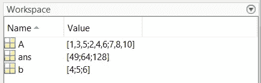
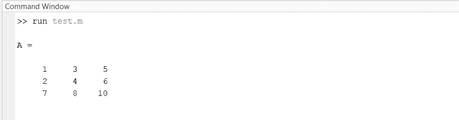
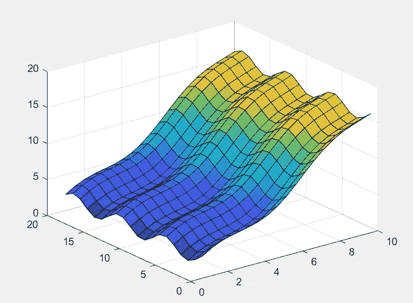

# 5 必须了解数据科学和机器学习的语言

> 原文：<https://levelup.gitconnected.com/5-must-know-languages-for-data-science-and-machine-learning-c909692e4a96>


作者图片

## 初学者指南。

```
**Table of Contents****1\. Python
2\. MATLAB
3\. R
4\. SQL
5\. Bash**
```

# 1.计算机编程语言

很多程序员的第一语言是 Python。它是一种高级的通用编程语言，有成千上万个开源包。Python 用于游戏开发、数据分析、机器学习、金融，以及你能想到的几乎所有应用。Pythonic 风格的特点是列表理解和各种句法糖。

## 列表理解和句法糖

要创建由前 10 个整数的平方组成的数组，我们可以这样做:

```
>>> [x**2 for x in range(1, 11)]
```

要快速反转一个数组，我们可以这样做

```
>>> x[::-1]
```

我们还有一行 if-else 语句:

```
>>> x = true if condition else false
```

## 包装

一些最常用的 Python 包是 NumPy、Pandas、Keras、PyTorch、Scikit-learn 和 Matplotlib，它们都常用于数据科学应用程序，如时间序列分析和数据可视化。

## NumPy

NumPy 对张量和向量化操作有很多支持(使它们更快)。要从 Python 列表创建 Numpy 数组，我们可以使用 np.array:

```
>>> import numpy as np
>>> x = np.array([1, 2, 3, 4])
array([1, 2, 3, 4])
```

我们还可以使用 np.reshape 将数组整形为 2x2 的形状。

```
>>> np.reshape(x, (2, 2))
array([[1, 2],
       [3, 4]])
```

下面创建一个 3x3x3 的零立方体。

```
>>> np.zeros((3, 3, 3))array([[[0., 0., 0.],
        [0., 0., 0.],
        [0., 0., 0.]],[[0., 0., 0.],
        [0., 0., 0.],
        [0., 0., 0.]],[[0., 0., 0.],
        [0., 0., 0.],
        [0., 0., 0.]]])
```

我们也可以创建一个网格网格如下。

```
>>> x = np.linspace(-2, 1, 2)
>>> y = np.linspace(-2, 1, 2)
>>> A, B= np.meshgrid(x, y)
>>> A
array([[-2.,  1.],
       [-2.,  1.]])
>>> B
array([[-2., -2.],
       [ 1.,  1.]])
```

在这个例子中，网格的(I，j)-元素的坐标由(A[i][j]，B[i][j])给出。

## 熊猫

Pandas 广泛用于数据科学和时间序列分析。Pandas dataframe 是一个存储表格数据的对象，包括时间序列和多维时间序列。

```
>>> import pandas as pd
>>> d = {'col1': [3, 6], 'col2': [2, 1]}
>>> df = pd.DataFrame(data=d)
>>> df
   col1  col2
0     3    2
1     6    1
```

熊猫/NumPy 是金融界数量惊人的数据分析师和程序员角色的先决条件。

## sci kit-学习

Scikit-learn 是一个工具箱，带有许多 ML 算法实现，如决策树、支持向量机和聚类算法。

## 包管理器

两个常用的 Python 包管理器为 [Pip](https://pypi.org/project/pip/) 和[poem](https://python-poetry.org/)，后者让我想起了 npm。

# 2.矩阵实验室

MATLAB 也是一种很棒的多用途语言，对于处理数据表和矩阵、解决数学问题以及绘制和可视化数据非常有用。MATLAB 脚本可以用来快速原型化问题的解决方案。



内存中的变量显示在工作区中。



命令窗口可用于运行脚本。

## 数学

[MATLAB](https://en.wikipedia.org/wiki/MATLAB) 自带对许多对象及其操作的支持，包括向量和矩阵。还有内置的基本函数，如指数、正弦和余弦。

要做矩阵乘法，我们可以做如下。

```
>> A = [1 3 5; 2 4 6; 7 8 10]
>> b = [4;5;6]
>> A*bans = 49
    64
   128
```

为了求解线性系统，我们可以使用反斜杠语法。

```
>> A\b
```

这将解返回到系统 A*x = b。

进行入口式操作的一个有用技巧是在操作前加一个句点。在下面的例子中，我们可以看到上面定义的矩阵 A 的每个元素都是立方的。

```
>> A.^3
ans = 1          27         125
8          64         216
343        512        1000
```

## 功能

MATLAB 支持单输出和多输出功能。

```
function [a, b] = myfun(x)
    a = length(x);
    b = avg(x);
end
```

## 绘图和可视化

为了演示 MATLAB 的绘图功能，我们可以使用以下代码绘制一个 SUNCHIPS 芯片

```
[X,Y] = meshgrid(1:0.5:10,1:20);
Z = sin(X) + cos(Y);
surf(X,Y,Z)
```



类似太阳芯片的形状。


一袋薯片。

## 工具箱

MATLAB 附带了各种用途的工具箱，包括统计和机器学习、信号处理、金融分析和图像处理。

例如，[优化工具箱](https://www.mathworks.com/products/optimization.html)提供了线性规划和多目标优化的算法。

MATLAB 的一个缺点是它是商业软件，所以你需要许可证才能使用它。教育机构和公司通常会为学生或员工购买许可证。

# 3.稀有

R 编程语言通常用于数据挖掘和统计，经常被比作 [SAS](https://en.wikipedia.org/wiki/SAS_language) 和 [Stata](https://en.wikipedia.org/wiki/Stata) 。我认为你只需要 MATLAB 和 R 中的一个:选择权在你。两者都有活跃的开发者社区，并有广泛的软件包。一个显著的区别是，与 MATLAB 不同，R 是开源的，所以你不必为它付费。

## R 中的函数

R 中的函数语法与 MATLAB 略有不同。

```
f <- function(x, y) {
  z <- x + y
  return(z) 
}> f(1, 2)
[1] 3
```

## 集成开发环境

用于编写 R 脚本的 IDE 是 RStudio(现在是 Posit)。

[](https://posit.co/) [## 假定

### 我们正在拥抱多语言数据科学，为 R、Python 和其他语言创建开源和商业软件。我们…

posit.co](https://posit.co/) 

# 4.结构化查询语言

SQL(结构化查询语言)用于在关系数据库中执行各种数据操作。可以使用连接操作合并表，使用 select 语句查找表中的某些值，或者计算表中数据的聚合统计信息，如计数、平均值和总和。SQL 现在无处不在——几乎所有的公司都用它来管理他们的数据库。

## 挑选

Select 几乎是不言自明的:它用于从数据库中选择列。下面的代码返回一个由*记录*(行)组成的表，其条目对应于 col1、col2 和 col3。

```
SELECT *col1*, *col2, col3*
FROM *table*;
```

## 加入

有各种联接，包括左联接、右联接、内联接和外联接。这些操作用于合并多个表中的数据记录。下面的 *left join* 示例通过从 table1 和 table2(仅当记录与 table1 匹配时)获取数据来创建一个包含 col1、col2 和 col3 列的表。

```
SELECT *col1, col2, col3*
FROM *table1*
LEFT JOIN *table2* ON *table1.col_name* = *table2.col_name*;
```

有时候考虑连接是一件令人头疼的事情，但是可以用维恩图来描述它们，我一直觉得这很有帮助。

# 5.尝试

Bash 是 GNU 操作系统(基本上是 Linux)的外壳，对于在 MacOS 和 Linux 系统上创建数据管道、自动化脚本、管理进程和操作文件非常有用。

我听说过一次系统管理员职位的面试，其中一个问题是列出尽可能多的 Bash 命令。要通过考试，你必须说出至少 15 个左右的名字。如果你问我，这是一个非常有趣的面试问题…

下面我们来看看一些更常用的 Bash 命令。

ls 列出一个目录中的所有文件和目录。

```
$ ls
```

pwd 是当前工作目录的缩写，它告诉你你在 OS 文件系统中的位置。

```
$ pwd 
```

触摸用于创建新文件或文件夹。

```
$ touch myfile.txt 
```

mkdir 用于创建新目录。

```
$ mkdir new_directory
```

cat 命令显示您查看文件的内容。

```
$ cat myfile.txt
```

带有递归标志的 grep 在目录中搜索正则表达式模式。如果您正在查找某个特定的文件，但忘记了它的位置，这将非常有用。

```
$ grep -r tree mydirectory
```

我们还可以使用>操作符将标准输出重定向到文件中。例如，我们可以执行以下操作，将 pwd 保存在文件 pwd.txt 中。

```
$ pwd > pwd.txt 
```

如果 pwd.txt 已经存在，我们不想覆盖它的内容，我们可以使用 append 操作符>>，如下所示。

```
$ pwd >> pwd.txt
```

还有很多其他有用的命令。在上面的例子中，我们仅仅触及了表面。Bash 脚本被低估了，无论您是否对数据科学感兴趣，我都建议您学习它！

## 进一步阅读

如果你喜欢这篇文章，你可能也会喜欢这些！

[](/7-must-know-python-built-in-libraries-c03b06c7fb8d) [## 7 个必须知道的 Python 内置库

### Python 标准库通过提供广泛的功能，使我们程序员的生活变得更加轻松。我们…

levelup.gitconnected.com](/7-must-know-python-built-in-libraries-c03b06c7fb8d) 

感谢阅读！