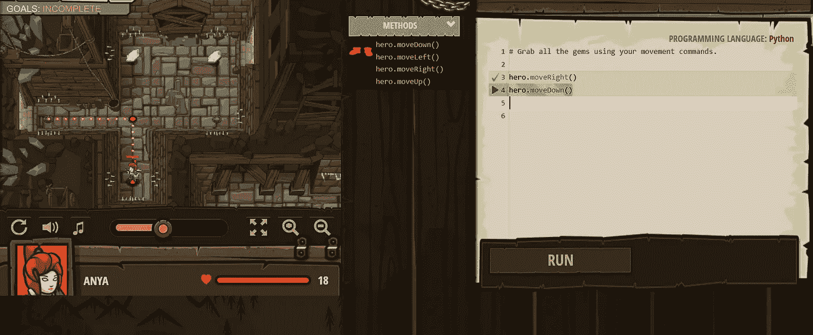
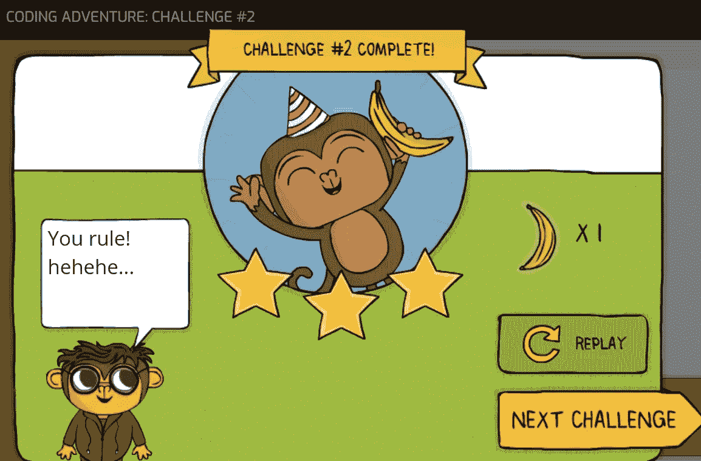
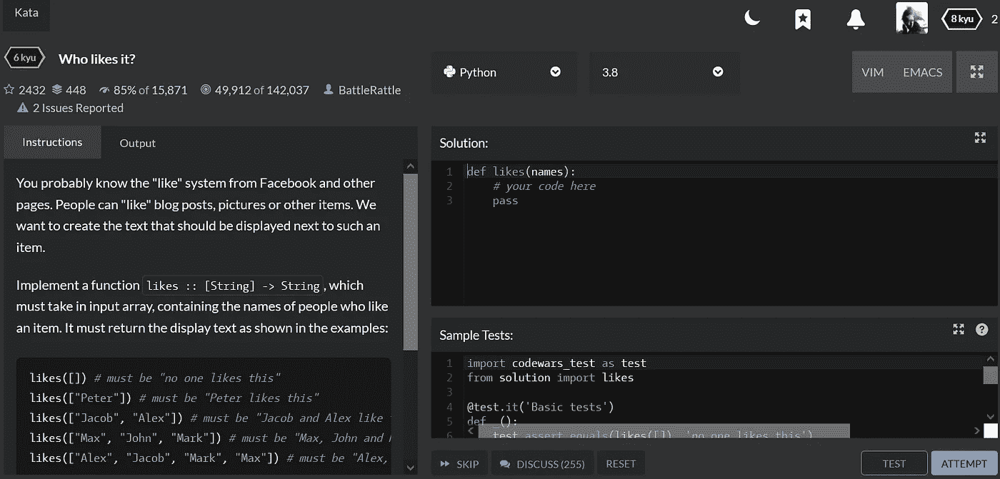
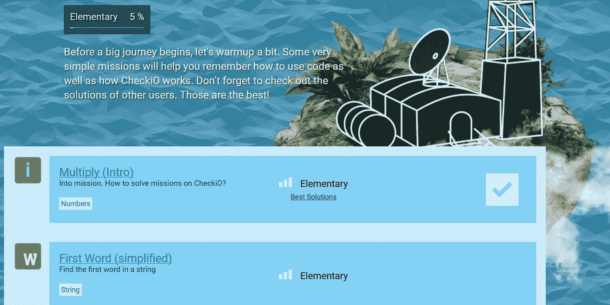
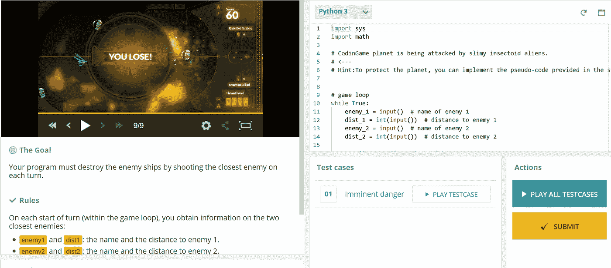

# 学习编程必须尝试的 5 个游戏

> 原文：<https://levelup.gitconnected.com/5-must-try-games-to-learn-programming-a18ee9dd75aa>

## 帮助你更快学习编程的游戏

[Axelle](https://unsplash.com/@axville?utm_source=medium&utm_medium=referral) 在 [Unsplash](https://unsplash.com?utm_source=medium&utm_medium=referral) 上拍摄的照片

谁说学编程不应该好玩？大家都爱玩游戏，边玩游戏边学习很好玩。这些游戏为你提供挑战、奖励和徽章来鼓励你学习。当有一个社区来竞争时，它使学习变得有趣和令人兴奋。以下是帮助学习不同编程语言的五大游戏。

# 1.代码战斗:

这个游戏在我的列表中名列前茅，因为它是玩和理解编程语言的最佳游戏之一。这个游戏中使用的图形用户界面(GUI)非常棒。在这个游戏中，当你完成一个关卡/程序时，会有奖励让你保持动力。是学习 Python 最好的游戏之一。

***链接:*** 这里是游戏的[链接](https://codecombat.com/)。

***语言:*** Python，JavaScript，CoffeeScript，C++，Java。

***订阅:*** 大部分级别完全免费，供学生学习和练习。要保存游戏进度，可以用邮箱登录。

作者代码战斗游戏截图

# 2.代码猴子:

Code Monkey 让用最好的图形用户界面教孩子编程成为可能。这是一个有趣的游戏，让孩子们尝试和学习编程。有了这个，你可以在这里只学习几种语言，要想完全进入所有游戏，你需要一个高级帐户

***链接:*** 这里是游戏代码猴子的链接

***语言*** : CoffeeScript 和 Python

***订阅:*** 它有 14 天的免费试用期，之后你需要升级为高级帐户。

作者代码猴子游戏截图

# 3.代码战争:

Code wars 是所有程序员最值得推荐的网站之一。这个网站支持程序员学习各种编程语言。有许多例子可以练习，有许多解决方案可以比较。有徽章，排名，和一个完整的用户档案，以保存他们的进展，并鼓励用户。

***链接:***Codewars 网站的链接在这里是。

***语言:*** 像 C、Java、Python、Go 等众多语言都支持。

***订阅:*** 除非选择包含一些特殊功能的代码战红，否则大部分都是免费的训练项目。

作者提供的 Codewars 游戏截图

# 4.检查:

这包括仅针对两种编程语言的编码游戏和编程挑战。有了这个网站，你可以尝试解决从初级到复杂的问题。解决一个问题后，你可以通过查看其他玩家给出的解决方案来比较或即兴发挥。

***链接:***check io 的链接就是这里的。

***语言:*** Python 和 JavaScript

***订阅:*** 这是一个免费的程序，您需要使用您的电子邮件创建一个帐户。

作者 CheckiO 游戏截图

# 5.编码游戏:

最后，也是学习不同编程语言的最佳网站。这个网站最大的特点之一就是将一个问题或一个待解决的问题以游戏的形式展示出来。它由许多游戏组成，这使得编程变得有趣。

***链接:*** 点击[此处](https://www.codingame.com/home)为编码游戏链接。

***语言:*** 它有很多语言像 C，C#，Python，Java，F#，Go。

***订阅:*** 这也是程序员的免费游戏。

作者编码游戏截图