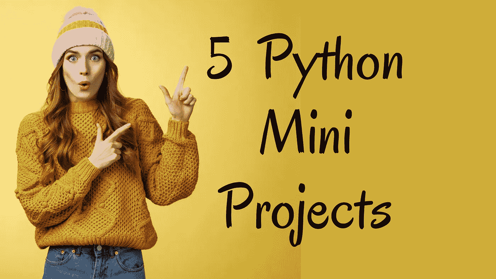

# 5 必须尝试 Python 迷你项目

> 原文：<https://levelup.gitconnected.com/5-must-try-python-mini-projects-d21492b5e890>

## 文本提取器、有声书、单词云等等



Python 编程一定会给不同的库带来惊喜。这些库提供的功能是惊人的。Python 库是如此的必不可少，可以用在我们的日常生活中。在本文中，让我们探索优秀的迷你项目及其功能。

# 1 .从图像中提取文本:

***一个从图像中提取文字的程序***

有时，您需要图像中的文本。我们可以使用 Python 和 tesseract 软件提取文本，而不是手动复制。这个库运行一个(。exe)文件来使用光学字符识别并作为输出提供给阅读器。

```
Requirements: pip install pytesseract
Application: Installation [link](https://github.com/UB-Mannheim/tesseract/wiki) for *tesseract.*
```

注意:

*   我们需要一个包含文本的图像(OCR =光学字符识别)来执行文本提取。
*   我们需要 PIL 模块打开包含文本的图片进行提取。
*   我们需要安装 tesseract 文件和文件的执行路径。
*   我们需要安装 pytesseract，它将运行我们安装的(*tesseract.exe*)。

使用的图像:


## Python 输出:


# 2.有声书

***一个创建你的图书阅读器(有声读物)的程序***

只需几行代码，您就可以创建一个迷你项目。这里我们在这个程序中使用了两个库。PyPDF2 用于读取打开的 PDF 文件，pyttsx3 库用作内容的扬声器。

```
Installation: pip install pyttsx3
              pip install PyPDF2
```

**注意:**在上面的程序中，我们已经使用了一个 PDF 文件，有声读物可以从你需要的任意页码开始阅读。

# 3.词云:

***一个使用提供的单词和图像遮罩*** 创建单词云的程序

Word Cloud 是你在创建迷你项目时能遇到的最好的库之一。这个库使得用你需要的单词和形状开发单词云变得简单。

```
pip install wordcloud
pip install PIL
```

## 输出:


**注:**

*   创建一个简单的 CSV 或文本文件，在 word cloud 中包含您需要的单词。
*   给出一个图像作为输入来选择单词云的颜色和形状。

# 4.将视频转录成文本

***录制视频并输出文本文件的程序***

下面的代码转录一个视频，并给出一个文本文件作为输出。首先，将 mp4 文件转换成 wave 格式。然后使用 speech_recognition 库，将语音转换成文本。

```
pip install SpeechRecognition
pip install pydub
```

输出


# 5.使用 Python 创建地图

***使用用户给定的经纬度生成地图的程序***

为了用 Python 生成地图，我们使用了称为 follow 的库。下面的代码返回一个包含坐标地图的 Html 文件。要了解关于叶库的更多信息，请查看此[链接](https://python-visualization.github.io/folium/)。

**安装:**

```
pip install folium
```

在代码中，我们试图用 leav 创建一个地图。注意，我们将纬度和经度作为属性传递给 map 函数。交互式地图保存在 Python 文件的源文件中。


这里有一个订阅链接，可以用 Medium 阅读数千篇文章。请考虑订阅并支持许多作者:

这里有一个订阅链接，可以用 Medium 阅读数千篇文章。请考虑订阅并支持许多作者:

[通过我的推荐链接加入 Medium—Swathi Arun](https://swathiarun63.medium.com/membership)

[](/10-interesting-python-programs-with-code-b676181a2d1a) [## 10 个有趣的 Python 程序及其代码

### Python 程序详解

levelup.gitconnected.com](/10-interesting-python-programs-with-code-b676181a2d1a) 

# 分级编码

感谢您成为我们社区的一员！在你离开之前:

*   👏为故事鼓掌，跟着作者走👉
*   📰更多内容请查看[升级编码刊物](https://levelup.gitconnected.com/?utm_source=pub&utm_medium=post)
*   🔔关注我们:[推特](https://twitter.com/gitconnected) | [LinkedIn](https://www.linkedin.com/company/gitconnected) | [时事通讯](https://newsletter.levelup.dev)

🚀👉 [**加入升级人才集体，找到一份神奇的工作**](https://jobs.levelup.dev/talent/welcome?referral=true)