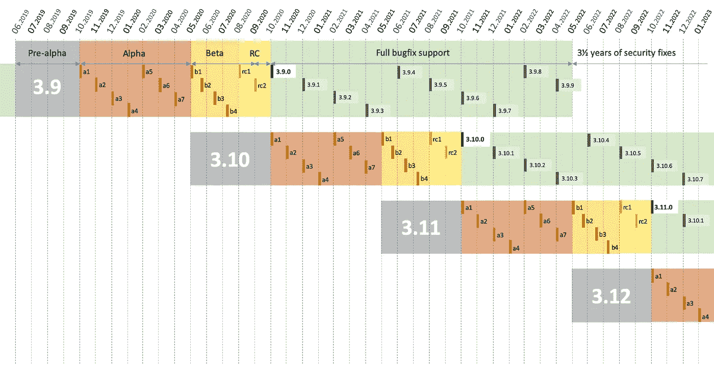

# Python 3.11 中的 5 个新特性使其成为 2022 年最酷的新版本

> 原文：<https://levelup.gitconnected.com/5-new-features-in-python-3-11-that-makes-it-the-coolest-new-release-in-2022-c9df658ef813>


在 [Unsplash](https://unsplash.com?utm_source=medium&utm_medium=referral) 上由 [Hitesh Choudhary](https://unsplash.com/@hiteshchoudhary?utm_source=medium&utm_medium=referral) 拍摄的照片

## 讨论 Python 3.11 中的新特性和更新，以及如何安装 3.11 Alpha 版本

# 介绍

每年 10 月份左右，都会发布 Python 的新版本。在每一个版本发布之前，都有一个 [**17 个月的开发生命周期**](https://peps.python.org/pep-0602/#seventeen-months-to-develop-a-major-version) ，在这里代码被广泛地开发和测试。在这个周期中，还有一个[阿尔法阶段](https://www.techopedia.com/definition/3740/alpha-version)，持续到四月底。接下来是[测试阶段](https://www.techtarget.com/whatis/definition/beta-test)，可能会持续到 9 月份，然后在 10 月份发布候选版本和最终试点。最新版本 **Python 3.11** 将于今年 10 月发布，alpha 阶段目前正在进行中，通常会持续到 2022 年 5 月。

我浏览了最新 alpha 版本的文档，发现了一些非常棒的新修复和更新，值得在 beta 测试之前讨论。我还将讨论如何访问 3.11 Alpha 版本，甚至是现有的 Python 安装。



Python 开发生命周期[3]

在接下来的部分，我将讨论对我来说真正突出的 5 个特性！

# 5.更好的错误消息

对于 Python 的每一个新版本，他们都在努力改进错误处理，特别是使用[回溯](https://www.geeksforgeeks.org/python-traceback/)显示的消息。在 [Python 3.10](https://builtin.com/software-engineering-perspectives/python-3.10) 中对该特性进行了大量更新，使得在遇到错误时更容易在标准输出中打印的回溯中找到错误。Python 3.11 有望在回溯中拥有更好的错误定位特性。这将清楚地表明是哪个语法或对象触发了所报告的错误。

从网站上的[例子可以更好地理解这一点。](https://docs.python.org/3.11/whatsnew/3.11.html#enhanced-error-locations-in-tracebacks)

当打印回溯时，解释器现在将指向导致错误的确切表达式，而不仅仅是如下所示的那一行。

先前版本的解释器将只指向导致错误的那一行，从而使哪个对象是`None`变得模糊不清。

当我们处理深度嵌套的字典对象和多个函数调用，甚至算术表达式[1]时，这些增强的错误消息会更加有用(见下文)。假设我们试图除以零，那么解释器会告诉我们问题到底出在哪里。

被零除错误被 ErrorHandler 捕获，并告诉我们问题出在哪里。

# 4.CPython 优化

[CPython](https://en.wikipedia.org/wiki/CPython) 是 Python 编程语言的参考实现。用 C 和 Python 编写的 CPython 是 Python 语言的默认和最广泛使用的实现。在 3.11 版本中，CPython 解释器比 3.10 版本优化得多，速度也快得多。**用 [pyperformance](https://github.com/python/pyperformance) 基准测试套件测量，在 Ubuntu Linux 上用 GCC 编译，CPython 3.11 比 CPython 3.10** 平均快[**1.22 倍**](https://github.com/faster-cpython/ideas/blob/main/main-vs-310.rst) **。根据您的工作负载，加速可能会快 10–60%。[1]**

在 Python 3.11 中，开发人员主要关注于**更快的启动**和**更快的运行时间**，正如在[文档](https://docs.python.org/3.11/whatsnew/3.11.html)中所述。

## 更快的启动[6]

在这个版本中，Python 会将字节码缓存在 [__pycache__](https://docs.python.org/3.11/tutorial/modules.html#tut-pycache) 目录中，以加快加载模块的过程。在 Python 3.11 中，解释器的启动速度预计会快 10-15%。这对使用 Python 的短期运行程序有很大的影响。

## 更快的运行时间[6]

在 Python 中，每当 Python 调用用户定义的函数时，就会创建帧。这个框架保存了关于函数执行的信息。以下是 3.11 版中的新帧优化，使其在运行时更快:

*   简化了框架创建过程，使其更快。
*   通过大量重用 C 堆栈上的帧空间来避免内存分配。
*   通过简化其内部框架减少了框架容纳的信息量`struct.`以前，框架容纳额外的调试和内存管理信息。旧式框架对象现在只在调试器需要时创建。
*   对于大多数用户代码，根本不会创建框架对象。因此，几乎所有的 Python 函数调用都显著加快了速度。这导致 pyperformance 的速度提高了近 3–7%。

# 3.添加新的输入特性:Self

在这个版本中，有一个`[Self](https://peps.python.org/pep-0673/)` [类型](https://peps.python.org/pep-0673/)，它是 Python 3 特性的一部分，允许用户[注释函数](https://www.geeksforgeeks.org/function-annotations-python/)。函数注释是一个特性，它允许你给函数参数和返回值添加元数据[4]。这样，您可以指定函数参数的输入类型和函数返回值的返回类型。

例如，假设我们有一个名为`School`的类，它有一个函数`get_school`，这个函数早先返回了类`School.`的一个实例，如果我们想要注释这个函数，我们将不得不使用非常冗长的`TypeVar`。

使用 TypeVar 的函数注释

在 3.11 版本中，我们可以只使用`Self`类型，它看起来更加直观和易于编码。

使用`Self` 类型的注释

# 2.用`except*`处理多个异常

这个版本中引入的另一个很酷的特性是处理多个异常。[这个特性](https://peps.python.org/pep-0654/)将允许我们使用`**except***`关键字和`**ExceptionGroup**`类同时引发多个异常。下面是一个例子:

Python 中的多重异常处理

有了这个新功能，你可以实现的可能性是无限的。

# 1.AsyncIO 任务组

对于从 JavaScript 转到 Python 并且缺少 JS 的异步和等待功能的人来说，这是最有趣的特性。Python 还没有完全掌握它，但是它的基本概念非常相似，而且非常强大。

`TaskGroup`的思想是运行嵌套的任务，即使一个任务失败，也继续运行它们。错误是使用异常组(如上所述)引发的，因此没有错误会悄无声息地通过。事实上，前面提到的`ExceptionGroup`是实现`TaskGroup`特性所必需的。[5]

任务组的实现

在上面的例子中，即使`t1`失败，`t2`也会在错误处理发生之前作为任务执行。更详细的解释可以在 [@1st1](https://twitter.com/1st1) 的这条推文中找到！

任务组的详细说明

# 如何安装 Python 3.11 alpha 版(3.11.0a7)


[西格蒙德](https://unsplash.com/@sigmund?utm_source=medium&utm_medium=referral)在 [Unsplash](https://unsplash.com?utm_source=medium&utm_medium=referral) 上拍照

第七版`3.11.0a7`是目前最新的 alpha 版本，于 2022 年 4 月 17 日发布。

开发人员每月发布一个新的 alpha 版本，展示新特性，测试它们，并从社区获得早期反馈。beta 测试将在五月的第一周开始，所以这是生命周期中的最终 alpha 版本。

以下是如何以不同的方式安装 Python 3.11 alpha 版本:

## 码头设备

如果您已经可以在您的系统上访问 [Docker](https://docs.docker.com/get-docker/) ，那么您可以通过拉取并运行`**python:3.11-rc-slim**` [Docker 镜像](https://hub.docker.com/_/python)来下载最新版本的 Python 3.11:

```
docker pull python:3.11-rc-slim
```

然后你就可以运行它了

```
docker run -it --rm python:3.11-rc-slim
```

这会将您带入 Python 3.11 REPL。

## Windows 安装

要在 Windows 操作系统上安装 alpha 版本，可以使用`[pyenv-win](https://pyenv-win.github.io/pyenv-win/)`。首先，更新您的`pyenv`安装，确保您安装最新版本的 Python，然后安装 Python 3.11。

```
pyenv update 
pyenv install 3.11.0a7
```

安装完成后，您可以创建一个虚拟环境来试验这个版本。

```
pyenv local 3.11.0a7
python -m venv env
.\env\Scripts\activate
```

## **Ubuntu/MacOS 安装【2】**

Ubuntu 和 MacOS 获取 Python 3.11 Alpha 版本的方式和 Windows 几乎一样，只是命令有点不同。

```
$ pyenv update
$ pyenv install 3.11.0a7
$ pyenv virtualenv 3.11.0a7 311_preview
$ pyenv activate 311_preview
```

## 直接预发布安装

你也可以从官方 Python 网站上的一个版本中安装 alpha 版本。您可以选择[最新预发布](https://www.python.org/download/pre-releases/)，向下滚动到页面底部的*文件*部分。下载并安装与您的系统对应的文件。更多信息参见 [Python 3 安装&设置指南](https://realpython.com/installing-python/)。[2]

# 结论

这些是我发现 Python 3.11 中非常酷的一些特性，但是你可以使用[官方文档](https://docs.python.org/3.11/whatsnew/3.11.html)查看每个版本中的所有变化。将会有许多伟大的特性使 Python 的使用更加直观和用户友好。还有一些[不赞成](https://docs.python.org/3.11/whatsnew/3.11.html#deprecated)的观点值得一查。

如果我错过了什么有趣的东西，请在评论中补充！

# 参考

[1][https://docs.python.org/3.11/whatsnew/3.11.html](https://docs.python.org/3.11/whatsnew/3.11.html)

[2][https://real python . com/python 311-error-messages/# installation](https://realpython.com/python311-error-messages/#installation)

[3][https://peps . python . org/pep-0602/#十七个月开发一个主要版本](https://peps.python.org/pep-0602/#seventeen-months-to-develop-a-major-version)

[4][https://www . tutorialspoint . com/function-annotations-in-python](https://www.tutorialspoint.com/function-annotations-in-python)

[5][https://bas . codes/posts/new-features-python-3-11](https://bas.codes/posts/new-features-python-3-11)

[6][https://docs . python . org/3.11/whats new/3.11 . html # faster-cpython](https://docs.python.org/3.11/whatsnew/3.11.html#faster-cpython)