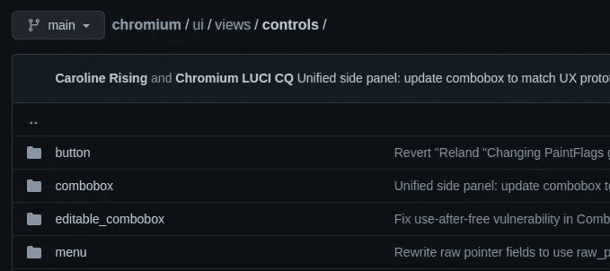
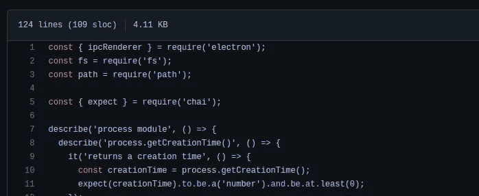
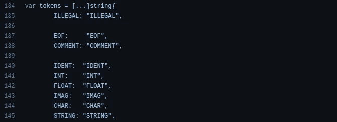
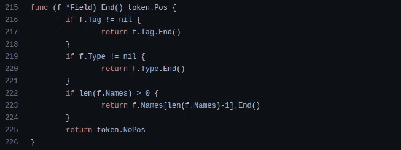

# 提高编程技能的 5 个开源代码库

> 原文：<https://levelup.gitconnected.com/5-open-source-codebases-that-improve-your-programming-skills-e09c022d30e2>

## 浏览开源项目是掌握计算机编程技能的好方法

Joshua Aragon 在 [Unsplash](https://unsplash.com/s/photos/coding?utm_source=unsplash&utm_medium=referral&utm_content=creditCopyText) 上拍摄的照片，由 Canva 编辑

程序员做各种活动，通过提高编程技能来实现自己的职业目标。一些程序员学习教程，并获得知名认证。同时，一些程序员做实验，建立爱好项目，并为开源项目做贡献。我经常浏览流行的开源项目源文件，学习软件开发模式、工程实践和架构设计技术。

程序员不仅仅是编码员，他们还设计、开发和维护软件系统。因此，要成为一名成功的程序员，你需要掌握软件架构、DevOps、解决问题之类的主题以及编码。高级开发人员通常根据他们的编程经验启动开源项目。他们的开源项目经常收到来自开发人员社区的各种贡献，所以浏览流行的开源代码库是一个很好的学习方式！

在这个故事中，我将向您展示几个流行的开源项目，并让您知道为什么您应该研究每个项目的源代码。这些项目帮助我提高了编程技能，由于这些项目，我启动了几个流行的开源项目。

# 铬——构建一个广泛的程序

我们通常使用各种复杂程度不同的软件系统。然而，我们经常不得不从事具有复杂需求的软件项目，并且不得不面对软件设计的挑战。然后，我们应该使用最佳的架构模式来构建高质量的软件，而不会增加不必要的复杂性。

所以，作为优秀的程序员，掌握软件架构是必须的。根据[维基百科](https://en.wikipedia.org/wiki/Chromium_(web_browser)#cite_note-source_code_language_percentages-4:~:text=.%5B12%5D-,Development,-%5Bedit%5D)，Chromium 在 2020 年有大约 3500 万行代码。代码库组织得很好，即使它包含所有平台特定的代码，包括 Android、iOS 和 Fuchsia 特定的代码。例如，看看他们如何将特定于桌面 UI 的代码分离到一个可重用的最小框架中，这个框架叫做 [Chrome Views](https://github.com/chromium/chromium/tree/main/ui/views) :

Chrome 视图控制源代码结构，作者截图。

Chromium 代码库只实现了浏览器应用程序的特性——所以您必须查看 Blink 浏览器引擎[代码库](https://chromium.googlesource.com/chromium/src/+/HEAD/third_party/blink)(WebKit 的一个分支)来查看 web API 实现，查看 V8 源代码来查看 JavaScript 实现，以及查看 Skia 源代码来理解呈现过程。

# 电子—掌握 DevOps 技能

DevOps 原则帮助我们通过自动化来促进整个软件开发生命周期( [SDLC](https://en.wikipedia.org/wiki/Systems_development_life_cycle) )。几乎所有的软件开发团队都在 DevOps 上投入时间，通过交付高质量的产品来保持在软件开发市场上的竞争力。因此，掌握 DevOps 不仅限于 DevOps 工程师——程序员也需要学习 DevOps 原理。

电子框架的代码库教授各种 DevOps 原则——所以我们可以在我们的软件开发项目中使用它们。例如，看看它如何包含一个结构良好的测试套件来识别代码中的缺陷:

来自 Electron 的测试套件的一个测试案例，作者截图。

开发团队使用一个名为 [SudoWoodo](https://github.com/electron/governance/blob/main/wg-releases/sudowoodo.md#releasing-electron) 的 GitHub 机器人来处理发布。根据电子开发者文档，他们可以通过 Slack 调用发布机器人来触发新的发布。Electron 通过来自其[脚本目录](https://github.com/electron/electron/tree/main/script)的许多 Python、JavaScript 和 Bash DevOps 脚本，自动化了几乎所有的手工活动。

同样，我们还可以通过使用您喜欢的脚本语言的脚本来自动化手动任务，从而节省时间。

# 颤振——选择解决问题的最佳方式

一个工程问题可能有多个解决方案。例如，您可以通过在前端编写大部分应用程序逻辑来构建特定的 web 应用程序。此外，您可以通过在后端编写大部分应用程序逻辑来开发相同的应用程序。同时，您可以仔细研究性能需求、开发人员体验和交付时间，以最佳方式在前端和后端之间划分应用程序逻辑。同样，努力寻找软件开发需求的最优解决方案。

Flutter 无疑为众所周知的跨平台应用程序开发问题提供了最佳解决方案。大多数框架使用基于 Chromium(或基于 webview)的跨平台开发方法。但是，由于浏览器实现中的性能开销，它不适合构建大型跨平台应用程序。Flutter 使用了最佳的方式，开发了自己的 GUI 工具包，并提供了高性能的二进制信使协议，以便从 Dart 环境中与本机平台特定的 API 进行通信。

我在下面的故事中解释了更多关于 Flutter 的优点:

 [## 再见电子，你好颤振

### 原生跨平台应用程序开发并不容易，但现在我们有了更好的解决方案。

medium.com](https://medium.com/swlh/goodbye-electron-welcome-flutter-22b3dc10d2f3) 

浏览颤振引擎源代码，了解颤振架构如何解决跨平台开发问题。在我们的软件开发活动中，我们可以使用相同的方法并选择最优的解决方案。

# 反作用与反作用——软件系统中的本机代码可重用性和灵活性

干燥、YAGNI、亲吻和 SOC 原则激励程序员用干净的代码编写可管理的和最优的软件。DRY 原则指导我们通过避免代码重复来构建干净的代码库。如果您掌握了 DRY 原则，您就可以构建易于修改、移植和集成到其他系统中的软件模块。下面的故事进一步解释了编程原则:

 [## 帮助你写出更好代码的 5 条编程原则

### 用这些编程原则编写更好的代码，给编译器和你的队友留下深刻印象

levelup.gitconnected.com](/5-programming-principles-that-help-you-to-write-better-code-5d96197725cc) 

React 和 React 本机实现展示了如何通过代码重用使软件系统变得灵活。例如，Meta 最初创建 React.js 用于呈现 DOM 元素，但后来他们通过引入 React renderers 概念引入了 React Native。因此，现在我们有各种基于社区的 React 渲染器来创建 pdf、交互式 CLI 应用和嵌入式系统，这要归功于 React 的架构灵活性。React 本机代码库也很灵活。于是，微软创建了 RN Windows 和 RN macOS 项目。

我们可以使用这个概念来构建平台无关或基础设施无关的软件系统——这样软件组件或基础设施迁移就不会成为软件开发团队的噩梦。

# 去吧——掌握 YAGNI 原理

如果这些特性能解决用户的问题，那么向特定的软件模块添加特性是非常好的。但是，我们只需要引入所需的特性，因为过多的特性会使软件系统变得复杂，并使软件变得臃肿。YAGNI 原则激励我们开发简单的解决方案，即使是复杂的需求，通过添加最佳设计决策的强制功能。

C 语言是编写高性能软件的最小语言。但是，C 没有提供大多数现代开发人员所寻求的特性，例如自动内存管理、内置数据结构支持和开发人员友好的字符串操作。Golang 项目引入了一种具有现代特征的类似 C 语言的快速、简洁的语言。

Go 代码库和架构告诉我们如何使用 YAGNI 原理来引入复杂问题的简单解决方案。例如，Go 只有 25 个保留关键字，定义在以下词汇标记映射中:

围棋的[令牌地图定义](https://github.com/golang/go/blob/bf2ef26be3593d24487311576d85ec601185fbf4/src/go/token/token.go#L134)，作者截图

整个 Go 实现也是最小的，核心开发团队甚至倾向于用单个字母变量将源代码分解成最小的片段:

一个最小的 Go 函数(在 [Go AST](https://github.com/golang/go/blob/913d05133c7fb3adfd2b1a34a47d635d8e072fa2/src/go/ast/ast.go#L215) 中)使用了单字母变量，作者截图

# 结论

以上开源代码库帮助我们改进软件架构、DevOps、自动化、问题解决和一般编程技能。深入研究这些开源项目，学习它们的编程实践，并在我们的项目中测试它们，这是亲自教授软件开发概念的好方法。

学习永无止境，所以当我们今天考察一个新的 GitHub 库时，我们可以学到以前没有想到的关于编程的新概念。也许，在浏览开源仓库时，您可能会发现一个新的想法，为整个开源生态系统提供支持。

看看开源开发者在做什么——检查、学习、实验和创新。

感谢阅读。

# 分级编码

感谢您成为我们社区的一员！在你离开之前:

*   👏为故事鼓掌，跟着作者走👉
*   📰查看[升级编码出版物](https://levelup.gitconnected.com/)中的更多内容
*   🔔关注我们:[Twitter](https://twitter.com/gitconnected)|[LinkedIn](https://www.linkedin.com/company/gitconnected)|[时事通讯](https://newsletter.levelup.dev)
*   🚀👉 [**软件工程师的热门工作**](https://jobs.levelup.dev/)