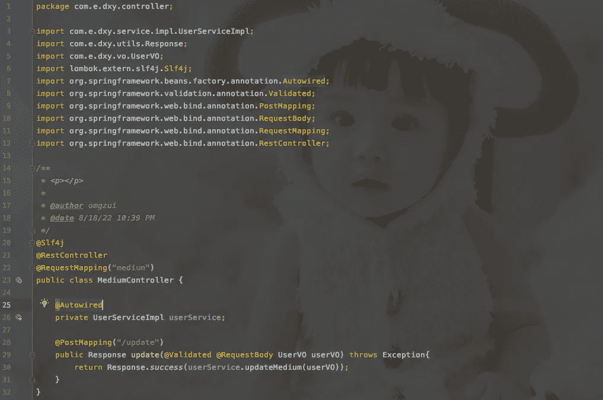
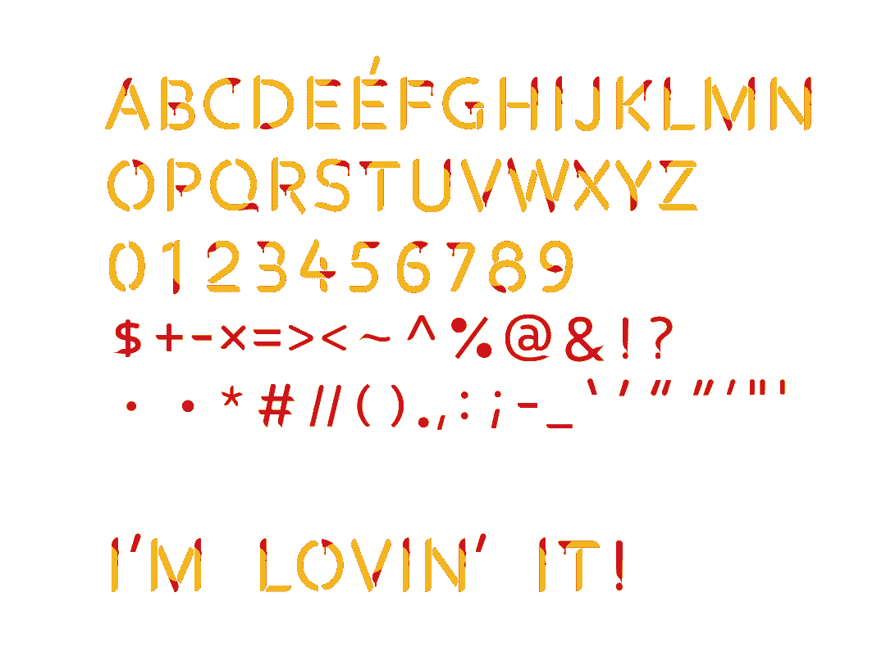
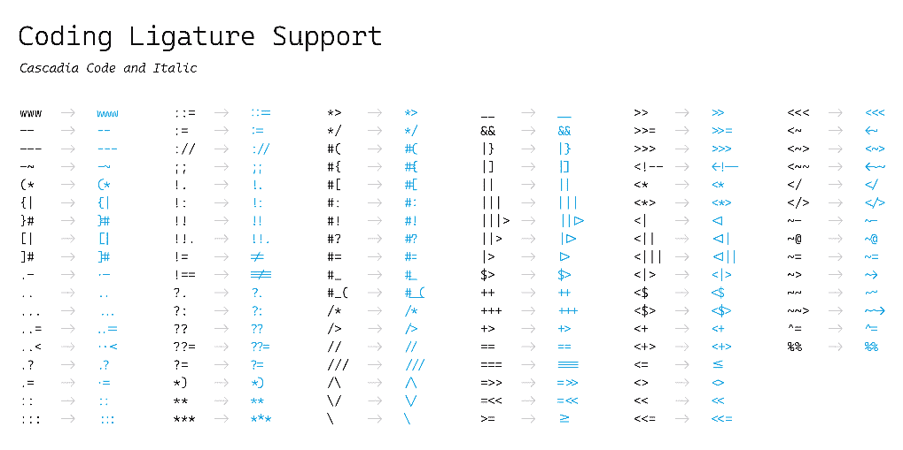
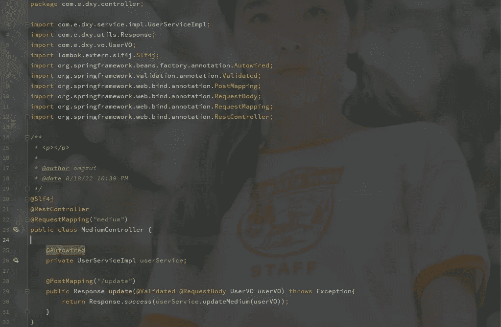
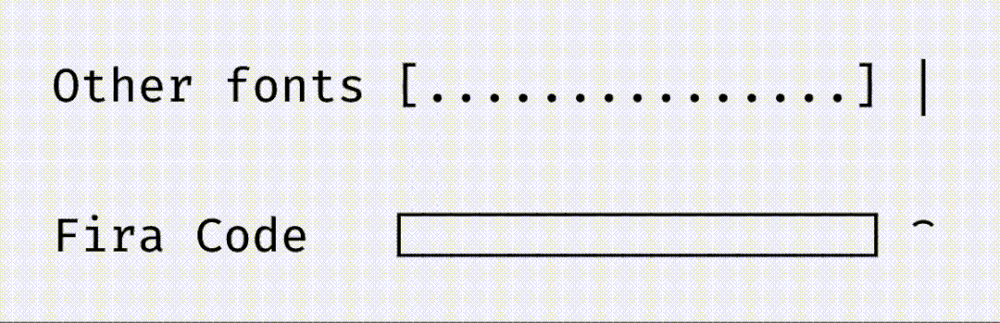

# 程序员应该知道的 5 种开源字体

> 原文：<https://levelup.gitconnected.com/5-open-source-fonts-you-should-know-as-a-programmer-fd50f1e48a0b>

工作多年，用过很多字体，正常的，搞笑的等等。所以这篇文章记录了 5 种优秀的编程字体。

# 1 麦当劳薯条字体

官网:[https://github.com/mcdtaiwan/McDonalds_Fries_Font](https://github.com/mcdtaiwan/McDonalds_Fries_Font)

顾名思义，这是一种受麦当劳薯条启发的字体，以薯条和番茄酱为建筑元素，很有创意，很有特色。

显示效果。

## 和睦相处

*   支持的软件和操作系统:Illustrator CC 2018 及以上/ Photoshop CC 2017 及以上/ InDesign CC 2019 及以上/QuarkXPress 2018 Pages(MAC OS)/Keynote(MAC OS)/Sketch(MAC OS)/Paint.NET(Windows)
*   支持的浏览器:Chrome / Safari / Firefox (26+) /微软 Edge (38+，Win 10)

目前这种字体是可以免费下载的，你可以自由使用，包括商业使用，只要你用`#McDonald’s French Fries`标记。

# 2 卡斯卡迪亚码

许可证:SIL 开放字体许可证 1.1
官网:[https://github.com/microsoft/cascadia-code](https://github.com/microsoft/cascadia-code)
开发商:微软

`Cascadia Code`是由`Microsoft`创造的等宽编程字体。这个字体的字体风格比较特别。除了优化代码的可读性，让字母数字和符号更容易识别之外，最大的特点就是支持**编程连字**，即在打字的时候，可以通过组合字符来组合字符。创建新的字形。

显示效果。

# 3 源代码 Pro

许可证:SIL 开放字体许可证 1.1
官网:[https://adobe-fonts.github.io/source-code-pro/](https://adobe-fonts.github.io/source-code-pro/)
开发商:Adobe

`Source Code Pro`是 Adobe 打造的等宽编程字体，非常适合编程场景。支持 Linux、macOS、Windows 等操作系统，提供超淡、淡、常规、中、半粗体、粗体、黑色等 7 种字体粗细。

`Source Code Pro`使用开源字体许可证 SIL Open Font License，这是一个免费的商业软件。

显示效果。

# 4 Fira 代码

许可证:SIL 开放字体许可证 1.1
官网:[https://github.com/tonsky/FiraCode](https://github.com/tonsky/FiraCode)

`Fira Code`是专门为程序员打造的编程字体。除了等宽等基本属性之外，它还添加了编程连字。

作为一款编程字体，`Fira Code`对 **ASCII、框绘、电力线、**等多种形式的控制台 UI 有着出色的支持。

显示效果。

# 5 JetBrains Mono

许可证:SIL 开放字体许可证 1.1
官网:[https://www.jetbrains.com/lp/mono/](https://www.jetbrains.com/lp/mono/)
开发者:JetBrains

`JetBrains Mono`是 JetBrains 为开发者打造的编程字体——甚至被称为**“最美编程字体”**。

字体考虑了长时间看代码可能导致的眼睛疲劳，以及与之相关的因素，如字母的大小和形状、字形之间的间距、自然的等轴平衡、不必要的细节以及难以区分的符号或字母(l 和 I)和连字等。

`JetBrains Mono`共提供细、超轻、轻、正、中、半粗、粗、超粗 8 种字体粗细，包括英文数字字符，支持 147 种语言。

`JetBrains Mono`使用开源字体许可证 SIL Open Font License，免费商用。

显示效果。

# 最后

`JetBrains Mono`是我用的最舒服的字体，推荐它。

**感谢阅读。**我期待着您的关注和阅读更多高质量的文章。

[omgzui](https://medium.com/@omgzui?source=post_page-----fd50f1e48a0b--------------------------------)

## 更好的编程

[View list](https://medium.com/@omgzui/list/better-programing-9b4c9bb174aa?source=post_page-----fd50f1e48a0b--------------------------------)108 stories

[omgzui](https://medium.com/@omgzui?source=post_page-----fd50f1e48a0b--------------------------------)

## 新闻

[View list](https://medium.com/@omgzui/list/news-67ec0a972660?source=post_page-----fd50f1e48a0b--------------------------------)23 stories