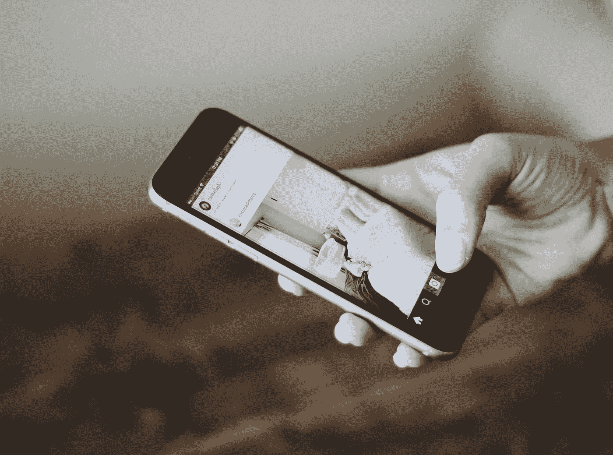
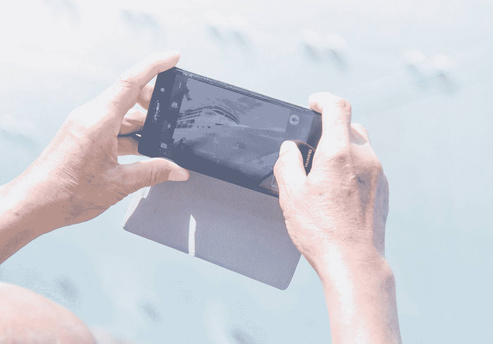
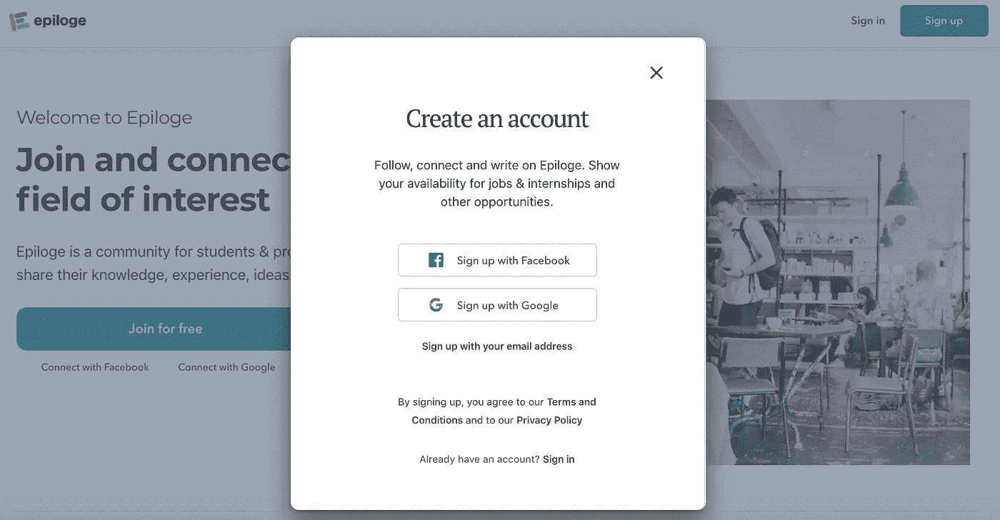
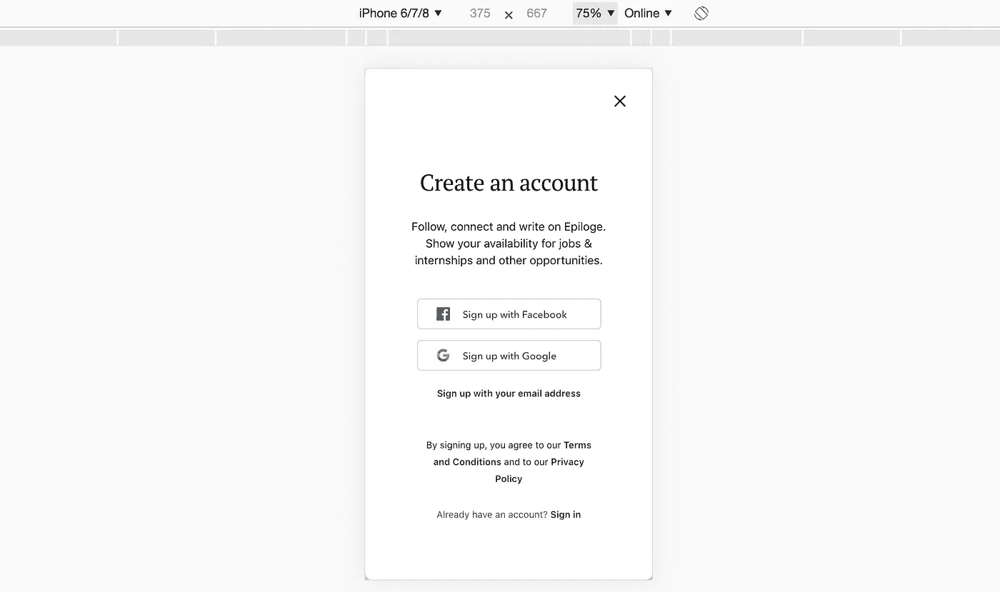

# 提高用户留存率的 5 个优化移动网络应用的技巧

> 原文：<https://levelup.gitconnected.com/5-optimization-tips-for-your-mobile-web-app-for-higher-user-retention-3d6d158aadb7>



照片由 [Jaelynn Castillo](https://unsplash.com/@jaelynnalexis?utm_source=medium&utm_medium=referral) 在 [Unsplash](https://unsplash.com?utm_source=medium&utm_medium=referral) 上拍摄

## 通过超越 css 样式优化，你的移动网站可以对移动用户更有吸引力

截至 2020 年，互联网流量大约一半是移动流量，一半是桌面流量。谷歌查看您的移动网站版本，以确定在索引时将您的页面排在什么位置。很大一部分年轻用户甚至不再使用桌面设备。

这三个事实说明了为什么优化你的网站以适应移动应用比以往任何时候都重要。更重要的是:移动用户比桌面用户更挑剔，而且下意识地对移动设备上的 UX 问题感到恼火。如果你的网站在移动设备上的表现存在问题，很有可能你的移动用户保持率正在下降。

这里有一些优化你的移动网站的技巧，不仅仅是为低于 600 像素宽度的设备使用不同的 CSS 样式。

# 1.移除移动鬼影点击效果

原生应用没有，手机浏览器有。当你点击任何按钮或任何可点击的东西如图标时，浏览器如 Safari 或 Chrome 上的用户会看到阴影点击效果。

被点击的`<div>`、`<button>`或其他元素将具有短暂的潜在阴影效果。这个效果应该是给用户反馈，告诉他们某个东西被点击了，结果应该会发生什么。这对于网站上的许多互动来说是有意义的。

但是，如果你的网站实际上已经有足够的响应能力，并且包含加载数据的效果，那该怎么办呢？或者使用 Angular、React 或 Vue，许多 UX 交互都是即时的？很可能，阴影点击效应会影响你的用户体验。

您可以在样式表中使用以下代码来消除这种阴影点击效果。不要担心，它不会破坏其他任何东西，尽管您需要将其作为全局样式包含在内。

```
* { 
  /*prevents tabing highlight issue in mobile */
    -webkit-tap-highlight-color: rgba(0, 0, 0, 0);
    -moz-tap-highlight-color: rgba(0, 0, 0, 0);
}
```

# 2.使用用户代理来检测用户是否从移动设备进行访问

我不是说要为 600 像素以下的设备放弃特定于样式表的@media 代码。恰恰相反。你应该总是使用你的样式表使你的网站移动友好。

但是，如果您希望根据用户是否在移动设备上显示附加效果，该怎么办呢？并且您希望将它包含在您的 JavaScript 函数中——如果用户改变其智能手机方向(将宽度增加到 600 像素以上),您不希望这种情况发生变化。

对于这种情况，我的建议是使用全局可访问的助手功能，该功能根据浏览器的用户代理来确定用户设备是否是移动设备。

```
$_HelperFunctions_deviceIsMobile: function() {
  if (/Mobi/i.test(navigator.userAgent)) {
     return true;
  } else 
     {return false;
  }      
}
```



照片由 [Unsplash](https://unsplash.com?utm_source=medium&utm_medium=referral) 上的[霍尔格链接](https://unsplash.com/@photoholgic?utm_source=medium&utm_medium=referral)

# 3.加载较大图像的移动版本

如果您使用大型图像，并希望确保移动设备上的加载时间对于您的移动用户来说仍然足够，请始终加载不同版本的图像。

你甚至不需要 JavaScript 来实现它(好吧，你也可以用 JavaScript 来实现……)。对于这个策略的 css 版本，请看下面的代码。

```
<!-- ===== LARGER VERSION OF FILE ========== -->
<div class="generalcontainer nomobile">
    <div class="aboutus-picture" id="blend-in-cover" v-bind:style="{ 'background-image': 'url(' + image1 + ')' }"></div>
</div><!-- ===== MOBILE VERSION OF FILE ========== -->
<div class="generalcontainer mobile-only">
    <div class="aboutus-picture" id="blend-in-cover" v-bind:style="{ 'background-image': 'url(' + image1-mobile + ')' }"></div>
</div>
```

在你的 CSS 文件中，定义 mobile-only 和 nomobile。

```
.mobile-only {   display: none; }[@media](http://twitter.com/media) (max-width: 599px) {
  ...
  .nomobile {display: none;}
  .mobile-only {display: initial;}
}
```

# 4.尝试无休止的滚动和惰性加载数据

如果你有一个大的列表，比如用户或者任务有几十个或者几百个，你应该考虑在用户向下滚动的时候延迟加载更多的用户，而不是显示一个`load more`或者`show more`按钮。本机应用程序通常包括这样一个懒惰加载的无限滚动功能。

在 Javascript 框架中，在移动网络中做到这一点并不困难。

你可以在你的模板中添加一个引用($ref)到一个元素中，或者仅仅依赖于你的窗口的绝对滚动位置。

以下代码显示了如何在 Vue 应用程序中实现这种效果。类似的代码可以添加到 Angular 或 React 等其他框架中。

```
mounted() {
  this.$nextTick(function() {
     window.addEventListener('scroll', this.onScroll);
     this.onScroll(); // needed for initial loading on page
  });        
},
beforeDestroy() {
   window.removeEventListener('scroll', this.onScroll);
}
```

如果用户滚动到某个元素或页面底部，onScroll 函数将加载数据:

```
onScroll() {    
   var users = this.$refs["users"];
   if (users) {
      var marginTopUsers = usersHeading.getBoundingClientRect().top;
      var innerHeight = window.innerHeight;
      if ((marginTopUsers - innerHeight) < 0) {
          this.loadMoreUsersFromAPI();
      }                               
   }  
}
```

# 5.让你的模态和弹出窗口全幅或全屏

手机屏幕空间有限。有时开发人员会忘记这一点，使用他们在桌面版本中使用的相同类型的界面。尤其是模态窗口，如果没有正确实现，对移动用户来说是一个障碍。

模式窗口是覆盖在页面上其他内容之上的窗口。对于桌面用户来说，他们可以工作得很好。用户经常想要点击背景内容来再次离开模式窗口——通常是当用户决定不执行模式窗口建议的动作时。



网站和模态的移动使用代表了不同的挑战。由于屏幕空间有限，拥有精心设计的移动网络应用程序(如 Youtube 或 Instagram)的大公司会制作全幅或全屏的模态，并在模态顶部画一个“X”来关闭它。

对于注册模态来说尤其如此，在桌面版本中是普通模态窗口，而在移动版本中是全屏。