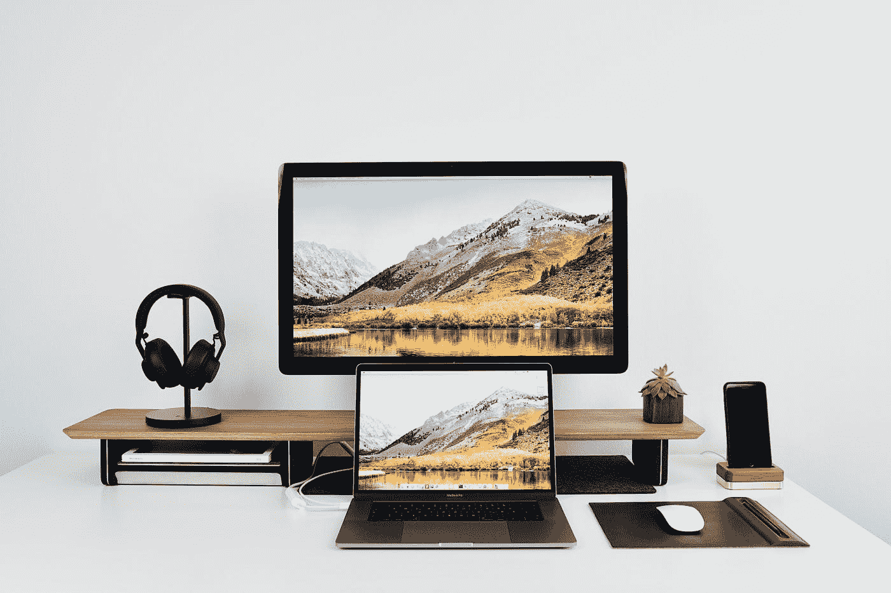
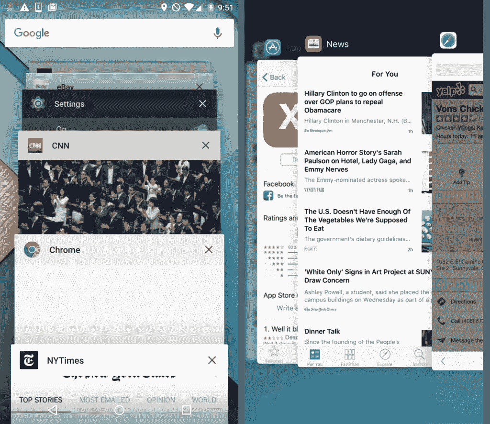

# 每个应用程序开发人员都必须知道的移动设备的 5 个物理优势和限制

> 原文：<https://levelup.gitconnected.com/5-physical-strengths-limitations-of-mobile-that-every-app-developer-must-know-29f3344b111e>

数字时代是一个极端。从微小的 38.6 毫米 Apple Watch 屏幕到巨大的 18.4 英寸 Galaxy View 平板电脑，从 512 GB 存储卡到基本上无限的云存储，移动设备有各种不同的尺寸和风格。在为移动设备进行设计时，开发人员需要非常注意这一独特平台的物理动态，这在短短几年前还只是一个科幻梦。在这里，我们将讨论开发者在设计移动应用时需要注意的 5 大物理限制和优势。

# 屏幕大小

虽然智能手机最大的吸引力在于它的便携性，但移动设备屏幕的实际面积可能会给项目团队带来一系列独特的挑战。对于最初为电脑显示器设计的软件概念，设计团队需要完全想象智能手机的 UX 方法。在某些情况下，开发人员可能利用图标、屏幕手势或其他机制来替代窗口、菜单和图像。

每一个视觉元素都必须被评估，并在占用宝贵的屏幕空间时证明某种“投资回报”。将传统元素创新性地转化为更小、更时尚且可能脱离屏幕的版本，将在这一领域带来回报。每个功能都应该被评估为最有效地利用屏幕空间。

# 连通性

通过使人们能够连接到其他人、地方和事物，无线网络创造了一个全新的可能性世界。现在，应用程序开发人员可以创造一种“始终连接”的体验，这种体验就在一个人的口袋里。

然而，人们连接到无线世界的方式各不相同。例如，一些连接是在不同的蜂窝网络上进行的(一些仅限于单个区域或国家)。许多用户同时使用公共和私有 WiFi 网络。因此，开发者需要考虑用户连接到他们产品的所有不同方式。全部都是。这不仅是一种能力，也可能是一种限制。例如，一些农村地区或像医院这样的建筑可能会带来连接方面的挑战。此外，用户可能不希望总是连接到特定的应用。

然而，一些用户可能希望控制他们应用程序的连接选项，无论是在特定的时间范围内，还是从其他应用程序或信息中沙箱化。开发者需要考虑他们的用户想要什么，为他们提供选择，并且是透明的。连接中断也会影响应用程序:虽然网页负载的连接故障过去只是一个小麻烦，但类似的小故障可能会导致用户感到沮丧并放弃应用程序。用户对连接性的期望是*总是存在*。只有通过像 [Appsee](https://www.appsee.com/?utm_source=medium&utm_medium=link&utm_campaign=5_physical_strengths_limitations_mobile&utm_content=appsee_home_link&cpnid=701b0000000Wd7c) 这样的分析服务来监控这样的用户参与，团队才能真正了解他们的用户如何行动，以及最终他们想要从他们的产品中得到什么。

# 外围设备

智能手机具有各种规格、功能和特性。每个月，新一代技术都会推出更好的摄像头、更坚固的屏幕、更多的生物识别功能等等。简单想想 iPhone 和三星 Galaxy 智能手机迄今为止的多次迭代！

另一方面，更具成本效益、存储和处理能力更低的手机也正在投放市场。因此，开发人员需要在许多不同的操作系统、制造商和型号上测试他们的应用程序，以确保卓越的用户体验。一些相机可能会转化为更好的条形码体验。当某些应用程序运行时，一些处理器可能会变成电池杀手。一些手机可以处理多任务，而另一些则完全没有能力。为了确保产品质量，需要考虑和测试所有这些因素。

# 触摸屏

如前所述，触摸屏可以支持一系列手势和功能。然而，使用者的手指很大而且可能很笨拙，或者近视。所以，开发不太拥挤的 app 很重要。这就是为什么更干净、更整洁的方法如今如此受欢迎的原因。

此外，应用团队在利用 3D touch 等新手势功能时需要小心。首先，这种功能仅限于拥有功能手机的特定用户群。第二，并不是所有拥有该功能的用户都采用了它。在设计用户友好的移动应用程序时，犯过于直观的错误是很重要的。

此外，对于开发者来说，为他们的应用选择最好的手势也很重要，要始终考虑应用类别、用户群和屏幕大小。手势有可能让应用看起来不那么杂乱。然而，它们也可能使一些用户更难使用应用程序，这取决于部署的一些手势。只有一定程度精细动作灵活性的用户可能会与“按下并拖动”手势斗争。开发者需要在小触摸屏设备的范围内平衡他们完善 UX 的方法。

# 多重任务

由于前面提到的许多问题，移动设备不一定是多任务处理的最佳机器。从用户的角度来看，他们经常在移动时使用他们的设备，并且可能会因为周围的世界而分心。

从设备的角度来看，智能手机不太能够同时处理多个同时进行的应用程序和功能。这是因为它们不能自然地适应像 windows 这样的惯例。此外，当用户使用智能手机时，他们通常希望进行简短的互动(例如打电话、查看天气、给朋友发短信)。这就是为什么为多任务设计的程序需要承认他们的产品可能需要修改和简化以适应移动体验。

例如，许多桌面用户可能打开他们的电子邮件的一个窗口，打开他们的文字处理文件的另一个窗口，并且打开另一个窗口用于网页浏览。这种类型的用户交互最好在台式机或笔记本电脑上完成。在智能手机上，用户经常发现同时运行这么多功能会导致他们迷失方向，因为多个窗口通常不会同时可见。

资料来源:nngroup.com

# 总结

毫无疑问，移动世界为创新的应用程序开辟了无限的可能性。对于开发者来说，最大限度地利用智能手机的优势，同时对其局限性保持谦逊是至关重要的。这涉及到做出艰难的选择，可能包括消除特定的想法。最后，在做出任何决定性的结论之前，确保你已经在你的应用程序上收集了大量的[定性数据](https://usabilitygeek.com/quantitative-qualitative-analytics-data-power-couple/)。

