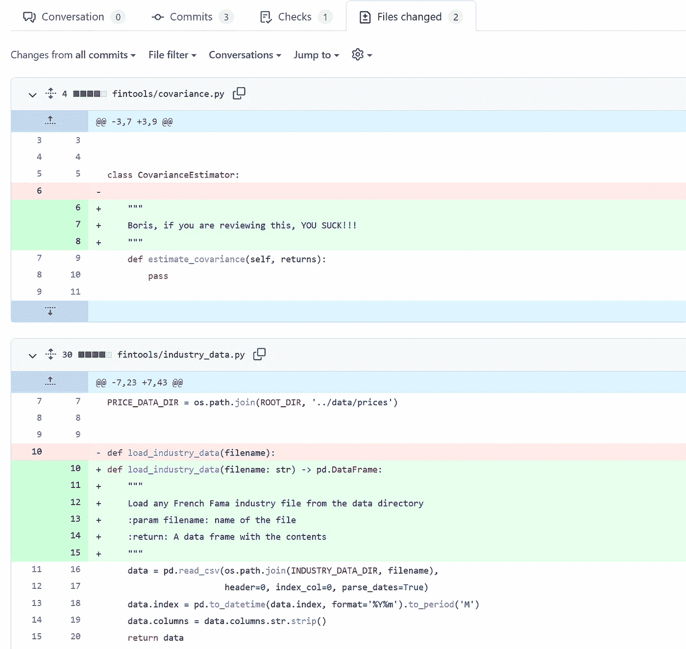

# 在线代码审查的 5 个陷阱

> 原文：<https://levelup.gitconnected.com/5-pitfalls-of-the-online-code-review-d7a2e42556c8>

## 以及如何克服它们

曾几何时，误入歧途的程序员会独自进行持续数周或数月的探索，以开发一个更大应用程序的特定功能或组件。当不同的代码片段组合在一起形成一个版本时，在风格上有明显的不协调，对需求的解释也是如此，组件不能很好地组合在一起，经常导致痛苦的集成和长时间的延迟。

自从这个软件开发的黑暗时代——或者说英雄时代——以来，大量的工具和过程已经发展到有助于避免这些不协调。持续的集成过程使得“集成”部分成为开发生命周期不可分割的一部分，而不是事后的想法。几个流行的源代码控制产品，如 GitHub、GitLab、BitBucket 等都包含了 CI/CD 管道和许多其他的自动化工具。

作为集成管道的“批准”过程的一部分，这些平台提供了代码审查功能，审查者可以清楚地看到代码更改前后的突出显示。

通常，作为一名程序员，您需要提交您的代码，等待在线构建通过，然后提交该功能进行代码审查。理想情况下，审核者将批准或请求变更。编码人员进行这些更改，然后重新提交代码以供审查，在这一点上它将有希望被批准。

这是一条快乐之路，我猜这就是这个特性的初衷。但是，唉，只要涉及到人类，事情就不会那么简单。我已经看到评审过程成为开发流程的瓶颈，审批步骤花费的时间是编写代码所需时间的几倍。让我们看看一些可能出错的地方。

## 冷漠的评论家

你能找到的最好的评论家是和你兴趣一致的人。例如，同一个 Scrum 团队的成员共同致力于一个迭代目标，并被激励互相帮助。

如果没有这样的结构存在，你就不得不为从事其他项目的开发人员乞求评论，这时事情就开始分崩离析了。首先，利益不一致:审查将占用审查者的宝贵时间，他们需要投资于他们自己项目的成功。此外，如果他们不参与你的项目，他们将只能提供一般的而不是具体的反馈。更糟糕的是，由于他们没有在你的项目上投资，也不一定在意你的时间，他们可能会坚持反映宠物脾气的改变，而不是增加真正价值的增强。

这种情况可能会恶化成一种功能失调甚至有毒的文化。因为要求代码评审是一种恩惠，所以你需要提供恩惠作为回报。这创造了一种交易文化，而不是合作文化。在功能障碍的下一个层次，代码评审可以被用作报复的工具。有人可能会故意推迟代码审查，以报复他们认为的个人错误，包括您为他们进行的代码审查。

## 挑剔的人

吹毛求疵者是一个专注于普通语法纠正而不是实质和代码设计的评审者。这位审查员会注意到有一个额外的空白行或者一些导入的顺序是错误的。在一个组织良好的组织中，这种注释应该是完全不必要的，因为有大量的工具可以自动检查代码的风格违反，甚至纠正它们。如果这种吹毛求疵的审查变得司空见惯，这表明您必须将这些工具之一集成到开发过程中。

## 评论者的 Hydra

理想情况下，应该只有一两个评审员在你的团队中工作，并且理解你的目标。在每个开发人员单独工作的环境中，您可以向一群开发人员发送一个开放的评审请求。你可能没有评论者，这很糟糕，或者有一群评论者，这更糟糕。从本质上说，你得到的是一群冷漠的评论者，他们对把你拉向不同方向的结果没有既得利益。他们中的一些人会把注意力放在宠物身上，一些人会吹毛求疵，一些人会质疑需求，公开质疑你的代码是否有必要。由于不知道在你的特写写作之前的任何会议和协议，这群评论者可能是极其无益的。面对他们就像与九头蛇战斗，当你砍下一个头，两个头就会出现。

## 永恒的评论

假设你得到一堆代码评审评论，并解决它们。现在，代码又要接受审查了。理想情况下，同一个评审员将验证修复并给出 OK。相反，可能发生的情况是，评审者现在提出了更多需要解决的意见。如果你面对的是一群评审员，那么他们每个人都会在不同的时间加入进来，在每次提交后插入新的评论。这个循环可以无限期地继续下去。

## 恐惧的气氛

即使每个人都有最好的意图，代码审查可以无限期进行的一个原因是没有人愿意承担批准该特性的责任。在这种情况下，一个评审者做出一些不明确的评论，然后把责任推给下一个评审者，下一个评审者可能也会这么做。当一个特定的特性很复杂时，当有太多的变化时，这种情况会发生，但是如果组织过于依赖代码审查作为质量控制的手段，而不是依赖自动化测试，这种情况也会发生。

# 做正确的事

正确进行代码审查的关键是确定代码审查对什么有益，对什么无益。不同的人可能对这件事有不同的看法。我并不声称我的观点是优越的，但是我在软件开发的迷宫中跋涉的岁月给了我一些实用的观点。

## 代码审查有利于

*   第二双眼睛——拥有第二双眼睛总是一个好主意，尤其是当你在做一些复杂的事情时。例如，您可能在代码中的某个地方插入了 TODO，但是却忘记了返回并处理它。评论者可能会注意到类似这样的事情。从别人的角度看你的代码是一种教育经历。
*   传播知识——评审使评审者对代码有一定程度的熟悉。最终的好处是，团队获得了各部分如何组合在一起的更全局的视图，使得随着时间的推移更容易支持代码。
*   遵循更高层次的编码标准——正如我之前提到的，代码风格可以用自动化工具来解决。另一方面，组织可能需要难以自动化检测的架构标准。例如，可能有一个组织范围的工具用于审计数据变更，在这种情况下，使用一个完全不同的工具会产生相反的效果，除非有非常好的理由这样做。
*   测试质量——代码审查不能代替回归测试。然而，评审人员应该评审伴随代码的回归测试，并指出测试中的差距或可以添加的边缘情况。
*   代码可读性——可读性是相当主观的，有时甚至依赖于语言。然而，有一些普遍接受的关于如何增强它的指导方针。例如，非常长的方法、深度嵌套的语句、太多的类依赖被认为是可读性的障碍。值得一提的是，有一些自动化的工具可以检查可读性指数，比如圈复杂度，这些工具可以用来代替审阅者。

## 代码审查对

*   查找 bug——对于容易识别的 bug，可以使用工具，如 [FindBugs](http://findbugs.sourceforge.net/) 、 [PyChecker](http://pychecker.sourceforge.net/) 等。一个机敏的评审者可能能够辨别出在某些情况下可能会发生不那么微不足道的错误。但是，一般来说，代码审查并不是识别复杂错误的好工具，这些错误是在特定的数据条件下由几个类的交互产生的。最好的工具是一套全面的集成测试。
*   提出样式和格式建议——这应该通过诸如 [Checkstyle](https://checkstyle.sourceforge.io/) 、Lint 等工具自动完成。如果审阅者有超出样式强制要求的格式建议，请在您的注释前加上类似“Nit”的前缀，以表明该建议是可选的。
*   质疑需求——对程序员来说，批评需求是有建设性的，尤其是当他们认为其中一些需求与其他应用程序功能不一致的时候。然而，这样做的适当时机是在需求和设计阶段，而不是在代码开发之后。
*   重新设计特性——在代码编写完成后，再去猜测特性的设计也为时已晚。即使一些评审者可能选择了不同的实现方式，他们也应该避免在代码评审期间重新设计的诱惑，只要现有的设计满足需求、架构指南，并且被有效地实现。

## 成功的代码审查

最后，我总结了我认为成功的在线代码评审过程的要素。

*   理想情况下，开发人员和评审人员应该是同一个团队的一部分，共享**共同的目标**。例如，scrum 团队提供了一个很好的合作范例。如果这不可能，每个开发人员都应该有一个专门的评审员。实现这一点的一种方法是将两个潜在从事不同项目的开发人员配对，对彼此的代码进行代码评审。
*   通过**自动化**代码检查，例如编码风格、代码覆盖率、复杂性和发现常见错误，来缩小审查的范围。如果评论者有额外的风格建议，通常应该标记为可选。
*   根据经验，**将评审者**限制在最多两个。可能会有特殊的情况，整个团队都需要评审一个特别重要的功能，但是一般来说，三个人是很拥挤的。避免让一个指定的人，比如团队领导，进行所有的代码评审。这种做法不可扩展，也无助于知识的传播。
*   信任你的开发团队、产品负责人和项目经理。如果你在没有任何背景的情况下参加评审，假设他们已经在需求和设计阶段完成了他们的工作，你不一定知道得更好。如果你认为代码足够好，但是有可以让它变得更好的评论，批准评审，并注明这是“带评论的 LGTM”。
*   最重要的是，对你的队友要**亲切**和**尊敬**。深思熟虑并以有益的方式表达你的意见。如果你要求改变，解释认为应该做出改变的理由。如果你看到你喜欢的东西，就说些好话。积极的反馈往往比批评更能激励人。