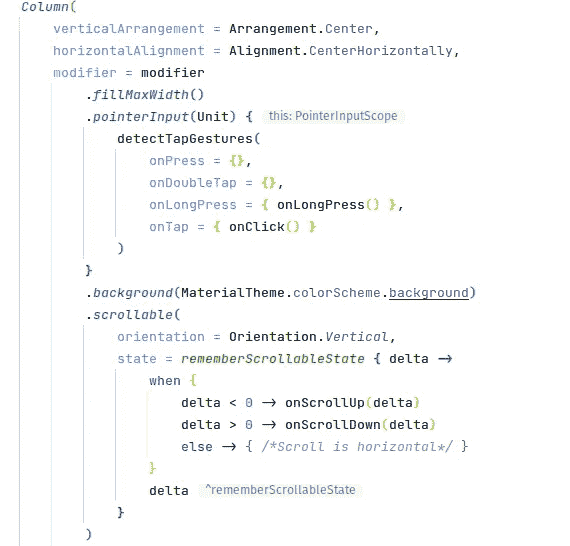

# Android Studio 的 5 个插件节省了我的时间和精力

> 原文：<https://levelup.gitconnected.com/5-plugins-for-android-studio-that-saved-me-time-and-effort-3772d4a58193>

托尼·佩佩在 [Unsplash](https://unsplash.com?utm_source=medium&utm_medium=referral) 上的照片

> 在这篇文章中，我将向你展示我在 Android 开发生涯中使用的插件，这些插件在过去的几年里节省了我大量的时间和精力。

Android Studio 是为 Android 设备开发应用程序的一个很好的工具。它已经包含了许多使软件开发变得更容易的特性，但正如它发生在所有事情上一样，它还可以改进。今天我要讲的是我三年前学习 Android 开发以来一直在用的 Android Studio 插件。

# 亚行理念

这是最有用的工具之一，我认为几乎每个人每天都会用到它。它基本上带有预定义的 ADB 命令，如卸载应用程序、删除其数据、授予权限…它基本上消除了在仿真器上手动访问应用程序设置以在您正在使用的已安装应用程序中执行更改的需要。

一旦安装，一个新的标签出现在 IDE 的上部工具栏中，你可以通过该菜单选择任何动作，甚至更好，这就是这个插件的真正力量所在，你可以在 Android Studio 设置中为键盘快捷键分配不同的 ADB 动作。我向你保证，你会用这个插件节省很多时间。

了解更多:【https://plugins.jetbrains.com/plugin/7380-adb-idea】T4

# 彩虹括号

作为一名开发人员，意味着你要花大部分时间阅读代码，而不是写代码。如何才能让这种体验变得更加愉快？用彩虹括号插件。这个想法很简单，它只是给你的代码中的括号分配不同的颜色，这样它变得更可读，即使你正在阅读的文件的格式不是很好。

如果您使用 Jetpack Compose，这将非常方便，如果您不喜欢默认颜色，您可以设置自己的颜色或使用插件附带的随机生成器。

彩虹支架与喷气背包组成

你可以从这里下载:[https://plugins.jetbrains.com/plugin/10080-rainbow-brackets](https://plugins.jetbrains.com/plugin/10080-rainbow-brackets)

# JSON 到 Kotlin 类

这个名字很有描述性。如果您需要解析来自后端的 JSON 响应，并且不想手动完成，只需使用这个插件，它将生成您所需要的 Kotlin 类。这不是你每天都要用到的东西，但是在我的例子中，我讨厌手动生成这个类，这让我免于麻烦。

在这里可以得到:[https://plugins . jetbrains . com/plugin/9960-JSON-to-kotlin-class-jsontoktlinclass-](https://plugins.jetbrains.com/plugin/9960-json-to-kotlin-class-jsontokotlinclass-)

# 关键启动子 X

这个很棒，如果你和我一样，我记不住新的快捷键。每次你做一个映射到快捷键的动作，它都会显示一个弹出窗口，里面有你可能用过的键盘快捷键，这样下次你就记住了。如果一个不断重复的动作没有快捷方式，它会提示你创建新的快捷方式。

在这里下载:【https://plugins.jetbrains.com/plugin/9792-key-promoter-x 

# 位桶拉取请求

我知道，大部分人都用 GitHub 而不是 Bitbucket，而且这个插件不是免费的，试用一个月就要付费，但是超级屈指可数。就我个人而言，我不喜欢在浏览器中阅读拉请求，即使知道我有一个很棒的 IDE，肯定会使理解代码更改变得更容易。有了这个插件，你可以阅读拉请求，批准，请求更改和拒绝，离开和阅读评论…等等。

在这里获取:[https://plugins . jetbrains . com/plugin/13538-bit bucket-pull-requests](https://plugins.jetbrains.com/plugin/13538-bitbucket-pull-requests)

作为这篇文章的结尾，我想推荐一个我非常喜欢的有用的工具，它不完全是一个插件，但你可以从集成的终端启动它，甚至可以指定快捷方式来使用它，所以没什么大不了的。这个工具是 ScrCpy，它可以用来在真实的设备上工作，可以说是 Android 模拟器。它将镜像计算机中的设备显示，您可以用鼠标像模拟器一样控制和导航手机，录制屏幕，将内容从计算机复制并粘贴到手机，反之亦然…如果您需要一个真实的设备来进行测试，并且您不希望您的手不断离开鼠标和键盘来做手机中的某些事情，它将非常有用。而且，它兼容 Windows、Linux 和 Mac，所以每个人都可以使用它。

 [## GitHub - Genymobile/scrcpy:显示和控制您的 Android 设备

### 用另一种语言阅读这个应用程序可以显示和控制通过 USB 或其他方式连接的 Android 设备…

github.com](https://github.com/Genymobile/scrcpy.git) 

仅此而已，有成千上万的插件会让你的生活变得更容易，但这些是我从开始与 Android Studio 合作以来一直坚持使用的插件。

如果你有任何插件推荐想分享，请在评论区留下，我会试一试的！

如果你想阅读更多这样的内容，并支持我，不要忘记检查我的个人资料，或给媒体一个机会，成为会员，以获得我和其他作家的无限故事。一个月只要 5 美元，如果你使用这个链接，我会得到一小笔佣金。

 [## 通过我的推荐链接加入 Medium—Miguel

### 阅读米格尔的每一个故事(以及媒体上成千上万的其他作家)。你的会员费直接支持米盖尔…

medium.com](https://medium.com/@molidev8/membership)