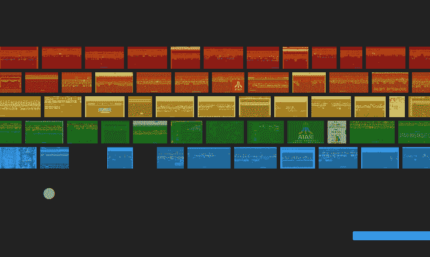
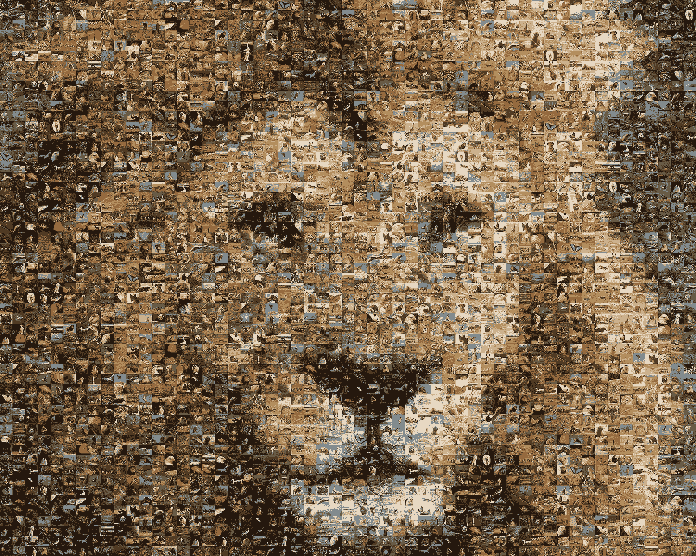

# 你今天就可以开始工作的 5 个编程想法

> 原文：<https://levelup.gitconnected.com/5-programming-ideas-you-could-start-working-on-today-5b229e78e221>

克里斯里德在 [Unsplash](https://unsplash.com?utm_source=medium&utm_medium=referral) 上的照片

在打造自己真正喜欢的东西的同时挑战自己，还有什么比这更有趣的呢？从事副业项目的问题通常不是项目的复杂性。大多数人发现最难的是找到一个他们可以从事的很酷的兼职项目。

作为一名程序员，从事你真正喜欢的副业是提升自己的最好方法之一。你可以通过使用新技术来扩展你的技能，你甚至可以尝试一种你从未使用过的编程语言。

为了帮助你开始做一个兼职项目，我列出了 5 个你可以从今天开始做的兼职项目。

# 1.强化学习

[来源](https://www.pinterest.ie/pin/562035228473674843/#:~:text=Article%20from%20thejournal.ie)

强化学习是训练机器学习模型做出一系列决策。如果你喜欢机器学习，这款绝对适合你！如果你以前没有任何机器学习的经验，你可以试试这个项目，尽管它可能很有挑战性。

你可以开始学习更多关于强化学习的方法是创建你自己的突破游戏。目标很简单:努力想出一个胜过游戏的模型。

您将学到的内容:

*   实现一个模型；使用奖励和惩罚
*   你会掌握强化学习和机器学习

# 2.迷因生成器

谁不喜欢模因？建造你自己的热图生成器将会非常有趣。尽管这是这个列表中较小的项目之一，但是这个项目对于缺乏经验的开发人员来说是完美的。

上传一张图片，输入文字，让用户能够下载迷因。如果你愿意的话，你可以通过添加一些默认的 meme 图片来扩展这个项目。这样，用户就不必为标准迷因上传图片。

如果您想尝试流行的 JavaScript 库(React、Vue 或 Angular)，这个项目非常适合您。

您将学到的内容:

*   处理文件上传
*   动态生成图像
*   将迷因作为下载提供给用户

# 3.温度计应用程序

jaros aw kwoczaa 在 [Unsplash](https://unsplash.com?utm_source=medium&utm_medium=referral) 上拍摄的照片

创建一个显示温度计的应用程序，根据您的位置显示温度。或者，您可以为用户添加一种方式来查找任何城市或国家的温度。

为了使这个项目成功，你应该使用一个 API 来检索某个位置的温度。如果你是制作应用程序的新手，这个项目非常适合你，因为它相对较小，也不复杂。

如果你想给自己一个额外的挑战，尝试创建一个令人惊叹的用户界面。

您将学到的内容:

*   非常适合学习应用程序开发
*   从 API 获取数据

# 4.感光镶嵌幕

[来源](https://www.picturemosaics.com/photomosaics/id/92#:~:text=SHARE%20MOSAIC)

这个想法很简单。上传一张图片，然后用这张图片制作一个马赛克照片。您可以使用图像 API 来获取马赛克图像。

这个项目让你创造美丽的艺术作品，非常适合经验更少的开发人员。你必须想出一个解决方案来放置瓷砖。如果你想要更多的挑战，你也可以允许用户指定马赛克瓷砖的尺寸。

您将学到的内容:

*   编写一个算法来放置所有的马赛克瓷砖
*   从 API 获取数据
*   如果你想更进一步，你可以缓存图像，这样你就不必向 API 发送不必要的请求

# 5.3D 骰子滚动

由[布雷特·乔丹](https://unsplash.com/@brett_jordan?utm_source=medium&utm_medium=referral)在 [Unsplash](https://unsplash.com?utm_source=medium&utm_medium=referral) 上拍摄的照片

有什么比摆弄 3D 更酷的呢？如果你从来没有用 3D 编程过，我可以强烈推荐它，因为它非常有趣。最棒的是，你不必从头开始。

看看 D3 或者巴比伦，都是 WebGL 项目。巴比伦有一个游乐场，你可以在那里摆弄 API，边玩边学。你不需要做任何事情来让它运行，因为 IDE 是在线的，就像 CodePen 一样。

有很多很酷的东西你可以用 3D 制作——其中一个就是掷骰模拟器。

您将学到的内容:

*   你会对 3D 的工作原理有所了解。
*   了解向量、相机和场景。

# 你做决定了吗？

在这个列表中，有没有哪个副业对你来说听起来有趣又有挑战性？太棒了。时间去工作，开始建设。在做你真正喜欢的事情时，你会提高很多技能。尝试不同的编程语言或框架，以最大化学习体验。

我很期待看到结果。

编码快乐！