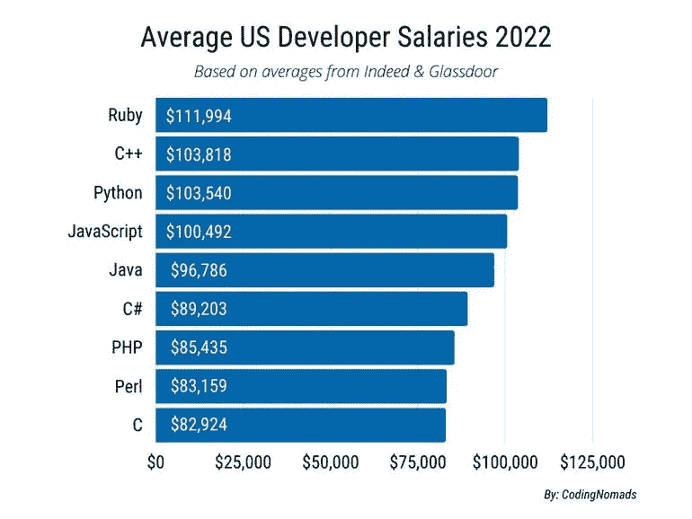

# 竞争最少但薪水最高的 5 种编程语言

> 原文：<https://levelup.gitconnected.com/5-programming-languages-with-the-least-competition-yet-command-the-highest-salaries-852ee2f1bd79>

## 你会比其他语言的人更快找到工作

照片来源:[像素](https://pixabay.com/photos/code-coding-computer-data-1839406/)

编程语言通常与他们最适合的工作相关联，所以很自然地认为学习一门语言将有助于你在特定领域找到工作。

如果你找不到工作，至少你可以利用这项技能从事自由职业或建立个人项目。

这是典型的自然想法，但也有另一面。编程丑陋的一面。失业、没有自由职业、项目受阻、抑郁，以及其他不愉快的事情。

# 排名中的偏差

以下是截至 2022 年 1 月的 [TIOBE 指数排名](https://www.tiobe.com/tiobe-index/)。编程语言根据其受欢迎程度进行排名。

图片来源:TIOBE

受欢迎就一定意味着好吗？答案是否定的，在选择学习一门编程语言时，除了流行度，还有更重要的因素需要考虑。

在我看来，受欢迎程度是一个衡量标准。当你想到你能从学习过去五年一直排名前列的流行语言中获得多少时，这个指标可以低调地为负。

我想象每个程序员都冲向他们，制造不健康的竞争。更糟糕的是，这些语言是通用的，因为其他语言可以实现与这些语言相同的结果，有时甚至更好。

那么，为什么你要继续学习这些相同的语言，而当事情不像你预期的那样发展时，你又会崩溃呢？

> “每个人包括他们的祖母都知道 Javascript”

如果你一直在编码平台附近徘徊，你可能会遇到上面的短语。在生活的各个领域，不健康的竞争让每个人都不愉快。

下面是一些你可以根据就业市场、就业和薪水期望来学习的最好的编程语言。

# 1.迅速发生的

在我们所处的时代，大多数人将大部分时间花在移动设备上，而不是其他任何小工具上。

大部分时间花在应用程序上，而不是网络浏览器上。应用程序已经发展了很多，给用户带来了更好的用户体验。

行业领导者意识到了这一点，他们正在将注意力转移到移动应用上，以使用户体验更好。

作为一名程序员，你不希望在这一转变中被遗漏。Swift 是 IOS 应用开发的首选语言。它的开发者是一些收入最高的人，他们并不常见。

更有趣的是，技术协会现在意识到了影响跨平台应用程序的问题，并且现在优先考虑本地应用程序。

# 2.科特林

智能手机市场的另一个巨头是 android。它是世界上使用最多的智能手机操作系统。

谷歌宣布 Kotlin 是 2019 年 android 应用程序上的首选语言。他们正在普及 Kotlin，并慢慢放弃 java。

随着越来越多的人采用智能手机，并且比任何其他设备更经常地使用智能手机，对原生 android 应用程序的需求正在稳步增长。

Kotlin 开发人员是收入最高的，与流行语言相比并不常见。

# 3.斯卡拉

根据[商业内幕](https://www.businessinsider.com/highest-paying-programming-languages-stack-overflow-developer-survey-2020-5?r=US&IR=T#1-scala-9)、[蜜罐](https://cult.honeypot.io/reads/highest-paying-programming-languages/)、[lvity](https://lvivity.com/top-highly-paid-programming-languages)的说法，Scala 是收入最高的编程语言。它占据了第一的位置。

在 [Octoparse](https://www.octoparse.com/blog/15-highest-paying-programming-languages-in-2017) 中，Scala 排名第二高的付费编程语言。这一点不容忽视。

在这个名单上，我把它排在第三位，这是有原因的。智能手机的日益普及和对优秀移动应用的需求是无可争议的。

Scala 是一种高级编程语言，融合了函数式编程和面向对象编程的各个方面。它非常精确，因为它解决了 java 的缺点。

# 4.去

在 [Octoparse](https://www.octoparse.com/blog/15-highest-paying-programming-languages-in-2017) 中，Go 被评为收入最高的编程语言。它占据了第一的位置。

在[商业内幕](https://www.businessinsider.com/highest-paying-programming-languages-stack-overflow-developer-survey-2020-5?r=US&IR=T#1-scala-9)和[蜜罐](https://cult.honeypot.io/reads/highest-paying-programming-languages/)上，它位居第二。在这两种情况下，它都仅次于 Scala。

Go 由谷歌开发，于 2009 年发布。它是模仿 C 语言的。它应该和 C++一样快，但语法简单，类似于 javascript 和 python 这样的语言。

Go 是目前发展最快的语言之一。开发人员正在快速采用它，并将其用于不同的项目。它是开源的，因其多线程功能、快速启动时间、内存效率、简单性和可靠性而受到欢迎。

# 5.红宝石

Ruby 是收入最高的编程语言之一。[根据 TechRepublic](https://www.techrepublic.com/article/the-best-programming-languages-to-learn-in-2022/) 和 According 游牧民的说法，他们把 Ruby 列为薪资最高的编程语言。

统计数据来自 Indeed 和 Glassdoor，下面是来自 coding 游牧民的截图。

图片来源:coding 游牧民

这些统计数据很容易有偏差，但可以肯定的是，Ruby 开发人员的工资并不低。与 Javascript 和 python 等语言相比，它们也不常见。

# 奖励:Rust & Perl

Rust 和 Perl 与上面的列表相差不远。他们的视角也很独特，使用这些语言的开发人员并不常见。

这两种语言的薪水也很高。 [Business Insider](https://www.businessinsider.com/highest-paying-programming-languages-stack-overflow-developer-survey-2020-5?r=US&IR=T#5-perl-5) 将 Perl 列为收入最高的编程语言的第五名。

根据 [The Next Web](https://thenextweb.com/news/move-over-python-rust-highest-paid-programming-language-2021) 、 [TechGig](https://content.techgig.com/this-is-the-highest-paying-coding-language-and-its-not-python/articleshow/87619661.cms) 、印度[Times](https://timesofindia.indiatimes.com/gadgets-news/this-is-the-highest-paid-programming-language-of-2021/articleshow/87597279.cms)的统计，Rust 是开发者中平均工资最高的编程语言。这是奥赖利技术培训机构最近发表的一项研究。该研究将 Rust 列为第一，Go 第二，Scala 第三。

下面是来自[堆栈溢出](https://insights.stackoverflow.com/survey/2021#overview)的截图。它显示了编程语言根据其受欢迎程度的排名。

图像来源:堆栈溢出

这里提到的语言是最不受欢迎的，但它们的薪水却是最高的。

图片来源:TIOBE

在 TIOBE 排行榜上，它们也是最不受欢迎的。受欢迎不一定代表好。编码快乐！