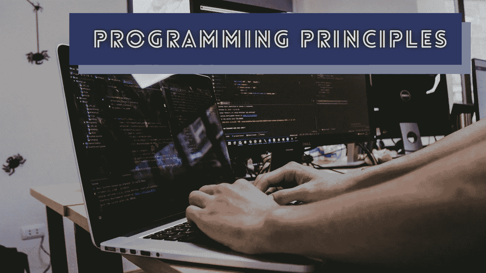
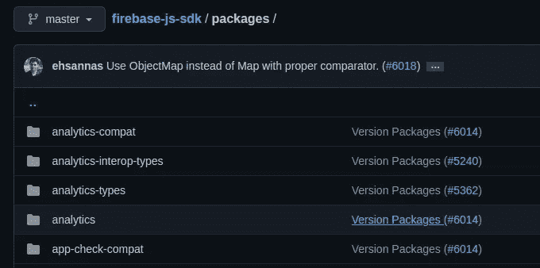

# 帮助你写出更好代码的 5 条编程原则

> 原文：<https://levelup.gitconnected.com/5-programming-principles-that-help-you-to-write-better-code-5d96197725cc>

## 用这些编程原则编写更好的代码，给编译器和你的队友留下深刻印象



沙敏·哈基在 [Unsplash](https://unsplash.com/s/photos/programming?utm_source=unsplash&utm_medium=referral&utm_content=creditCopyText) 上拍摄的照片，由 Canva 编辑

编程是指通过解决各种技术或商业问题来设计和开发计算机程序。程序员通常设计、开发、测试、发布和维护软件系统。他们始终通过编写源代码为软件开发项目做出贡献，因此他们总是努力编写干净且可维护的源代码，以提高整个团队的生产力。

编程原则帮助我们为构建高质量的软件系统编写更好的代码。编程原则是被广泛接受的基本真理，我们可以在任何软件开发项目中使用，不管技术堆栈如何。有时，我们可以使用这些原则作为规则来保持我们软件系统的质量在一个良好的状态。

在这个故事中，我将解释设计、开发和维护高质量软件系统的几个编程原则。毫无疑问，您可以在任何软件项目中使用这些原则，因为这些是基本的通用概念。

# 即使问题很复杂，也要尽量保持实现简单

作为程序员，我们通过设计技术架构和编写源代码来解决各种编程挑战。有时，我们用简单的解决方案解决简单的技术或业务问题。但是，有时，我们必须解决复杂的问题，包括复杂的算法、复杂的技术实现和复杂的架构组件。

[YAGNI](https://en.wikipedia.org/wiki/You_aren%27t_gonna_need_it) 原则激励我们只实现软件开发项目所需的要素和组件。换句话说，您不需要担心不存在的特性和需求——或者您不需要。KISS 原则激励我们为软件系统设计/开发简单、易管理、易理解的架构和代码。这个原则还有助于我们避免过度使用最小的、不言自明的代码库。

然而，YAGNI 和 KISS 原则并没有真正影响程序员通过简单的解决方案来减少特性和需求，从而实现简单性。但是，这些概念有助于程序员通过更好的设计和非过度工程化的代码库来实现简单性。Go 编程语言仅用 [25 个关键字](https://go.dev/ref/spec)就提供了几乎所有的现代语言特性，因此学习 Golang 设计规范是更深入学习 YAGNI 和 KISS 原则的实用方法:

[](/5-lessons-that-golang-teaches-to-all-programmers-71b332504cf2) [## Golang 教给所有程序员的 5 条经验

### 你可能不会用 Go 编程，但是这些经验对你喜欢的编程语言是有效的。

levelup.gitconnected.com](/5-lessons-that-golang-teaches-to-all-programmers-71b332504cf2) 

# 避免重复，但不要过度提高

重复的代码使你的代码库和软件系统变得复杂，不容易维护，而且臃肿。 [DRY](https://en.wikipedia.org/wiki/Don%27t_repeat_yourself) 原则激励程序员通过创建共享代码段来避免重复代码。例如，如果您正在实现两个操作，并且每个操作都包含相似的代码语句，那么您可以将相似的语句放入一个共享过程或类中。

毫无疑问，您也可以将 DRY 原则应用到单个软件项目之外。例如，如果您使用微服务架构，并且多个微服务包含重复的代码(即一些业务逻辑)，您可以开发一个共享的微服务或一个共享的动态链接库来删除重复的代码。像反射这样的元编程概念通过检查特定于语言的数据结构来帮助避免代码重复。例如，Python Fire 项目使用反射将下面的简单代码转换为功能全面的 CLI 程序:

```
import firedef add(a, b):
  return a + bif __name__ == '__main__':
  fire.Fire()
```

尝试在初始实现期间防止代码重复，以防止后期的重构任务。 *Ctrl + C* 快捷键事件是预测可能的代码重复的好方法。在复制和编辑代码片段之前要三思——也许，你会写一些重复的代码。在某些场景中，过度应用 DRY 原则会导致一些带有许多条件语句的复杂代码，所以要小心应用 DRY 原则。

# 与特性一样优先考虑重构

即使我们遵循所有的编程原则，包括 YAGNI、KISS 和 DRY，代码重构在不断增长的代码库中也是不可避免的。原因是我们经常与快速变化的敏捷软件项目一起工作。换句话说，由于敏捷周期中不断变化的特性规范和用户反馈，最新的需求可能与初始需求不兼容。

当我们检测到可维护性差、可读性差的源文件时，我们可以确定重构的需求。重构通常在不添加任何功能或错误修复的情况下重新构建代码，因此程序员往往倾向于推迟重构需求，因为没有可见的面向功能的结果。

因此，程序员不得不进行耗时的后期重构，甚至重写代码来恢复降级的代码库质量。因此，给自己定一个规则，在不推迟重构的情况下，保持源代码比你发现的更好——有一天它会节省你的时间。

# 用多个模块构建您的项目

如今，由于各种缺陷，大多数 web 开发人员构建基于微服务的 web 应用后端时没有遵循老式的整体架构。类似地，您可以用单独的模块、库或源文件来构建您的软件项目，而不是用一个项目/模块来维护所有的东西。例如，Flutter 框架主要有两个子项目:基于 Dart 的[框架](https://github.com/flutter/flutter)和特定于平台的 Flutter [引擎](https://github.com/flutter/engine)——Flutter 团队为这些子项目管理两个独立的存储库。

此外，大多数 JavaScript 库开发人员倾向于将他们的库分解成单独的模块，以实现更好的可维护性和捆绑特性，如[树摇动](https://webpack.js.org/guides/tree-shaking/)。例如，查看 Firebase JavaScript SDK 如何维护多个模块:



Firebase JavaScript SDK 的模块，由作者截图

关注点分离( [SoC](https://en.wikipedia.org/wiki/Separation_of_concerns) )原则教导我们通过将整个项目分成几个模块或子项目来实现可维护性、可重用性、易于升级和独立部署。所有分层计算组件(如互联网协议套件、操作系统和框架)都遵循 SoC 模式，以降低复杂性并提高可维护性。为了更好的可维护性，考虑模块化你的下一个软件系统。与其他原则类似，理解 SoC 最佳边界，因为过度模块化的项目会因过度工程化而变得复杂。

# 通过防止过早优化来编写优化的代码

几十年前，由于硬件资源有限且昂贵，程序员总是倾向于编写优化的程序。例如，阿波罗导航计算机(AGC)帮助过去的太空科学家在只有 4 千字节物理内存的情况下将宇航员送上月球。但是，如今，即使在我们的智能手机里，我们也有数十亿字节的物理内存。因此，现代程序员通常优先考虑快速的特性交付和漂亮的 GUI，而不是性能因素。

软件开发仍然需要性能，因为非优化软件的多处理会降低任何强大计算机的速度。除此之外，计算机用户仍然使用低端和中端计算设备。因此，编写性能第一的应用程序有助于您以非常好的用户满意度获得更广泛的受众。例如，大多数 Linux 发行版仍然运行在甚至不到 1gb 的物理内存上，并且受到许多程序员和通用计算机用户的信任。

我们可以用高效的算法、最佳的数据结构和良好的依赖库来编写优化的代码。近似分析时间和空间复杂度有助于我们用最佳的数据结构和算法来提高源代码的效率。但是，过度优化和优化不需要的代码段不会带来任何好处——这种情况称为过早优化。

过早的优化也可能发生在软件系统架构中。例如，大多数现代基于云的利基创业公司优先考虑复杂微服务模式的扩展需求，而不是专注于功能特性。编写良好的硬件友好的优化代码，但不要试图通过过度优化来使其完美，除非存在严重的性能缺陷。下面的故事指导您编写优化的代码:

[](/5-things-to-know-before-you-write-optimized-code-3ca424110db1) [## 写优化代码前要知道的 5 件事

### 这些事实有助于你用优化的代码打动硬件和程序员。

levelup.gitconnected.com](/5-things-to-know-before-you-write-optimized-code-3ca424110db1) 

感谢阅读。