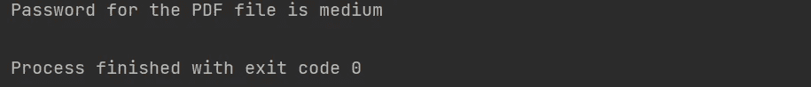
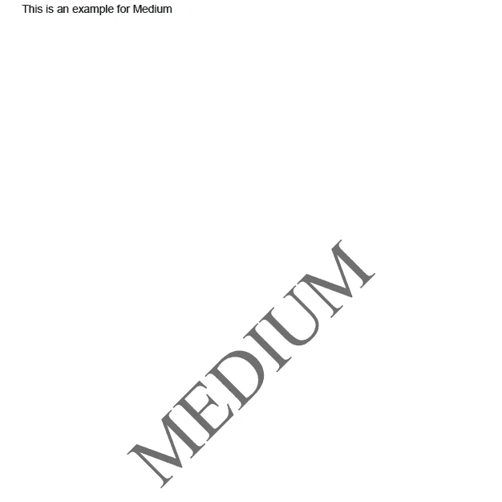

# 用 Python 处理 PDF 文件的 5 个程序

> 原文：<https://levelup.gitconnected.com/5-programs-for-processing-pdf-file-with-python-54ce9bb7ef67>

## 用代码解释创建、合并、锁定、解锁和水印

作者使用 Canva.com[创建的图像](http://Canva.com)

PDF 文件广泛应用于许多领域，学习处理 PDF 文件非常重要。在本文中，我们尝试使用 python 脚本对 PDF 文件进行不同的操作，如锁定、解锁、合并、创建和添加水印。

# 1.锁定或加密 PDF 文件:

> **用 Python 锁定给定密码的 PDF 文件的程序。**

一些包含重要信息的 PDF 文件需要保护。让我们试着用 python 脚本来做这件事。用`pip install PyPDF2`语法安装这个程序中使用的 python 包。

**注意:**使用了 PdfFileReader 和 PdfFileWriter 两种方法来读写 PDF 文件。您可以设置任何密码并将其传递给 encrypt 函数。

**输出:**将在 python 文件的源文件中创建一个带有密码锁的新的加密 PDF 文件。

# 2.解锁或解密 PDF 文件:

> **用 python 创建一个解密 PDF 文件的程序。**

在这个程序中，我们尝试用 python 解锁加密的 PDF 文件。第一个 Python 包可以使用`pip install pikepdf` 安装，另一个 Python 包可以使用`pip install tqdm` 语法安装。

注意:注意文本文件被传递给了名为 password 的变量。使用这种方法的缺点是必须将最常用的密码列表创建为文本文件，这是不实际的。但是这个脚本有助于根据一大串密码检查密码，这对于手动操作来说是很困难的。

## 输出:

作者图片

# 3.使用 Python 创建 PDF 文件:

> **用 python 创建 PDF 文件的简单程序。**

在这个程序中，我们使用 python 来创建一个 PDF 文件。为了创建一个新的 PDF 文件，使用了一个 python 包，可以使用`pip install reportlab`语法安装该包。

**注意:**默认 A4 大小的 PDF 将使用 canvas 方法创建。对于 canvas 对象，文本从左下角开始，以改变一些值被传递给 drawstring 的情况。在本例中，左边距 50 磅，从 PDF 页面底部向上 800 磅。

**输出:**将在 python 文件的源文件处创建一个新的 PDF 文件。

# 4.合并多个 PDF 文件:

> **用 Python 合并多个 PDF 文件的程序。**

在这个程序中，我们尝试用 Python 合并两个 PDF 文件。合并几个 PDF 文件很容易，但是如果有很多 python 文件要合并，编写一个 python 脚本就很容易了。使用`pip install PyPDF2`语法来安装所用的包。

**注意:**两个 PDF 文件被传递给 PdfFileMerger 方法。使用 write 方法创建一个新的 PDF，它将存储在 python 文件中。

**输出:**一个新的合并 PDF 文件将在 python 文件的源文件中创建。

# 5.向 PDF 文件添加水印:

> **一个用 python 在 PDF 文件上添加水印的程序。**

在这个程序中，我们试图给 PDF 文件添加一个水印。为此我们使用 PyPDF2 python 包，使用`pip install PyPDF2` 语法来安装它。

**注意:**对于这个程序，我们需要两个 PDF 文件。一个是文本 PDF 文件，另一个是带水印的 PDF 样本文件。在这个程序中，我们合并这两个页面来创建输出文件。

**输出:**

作者图片