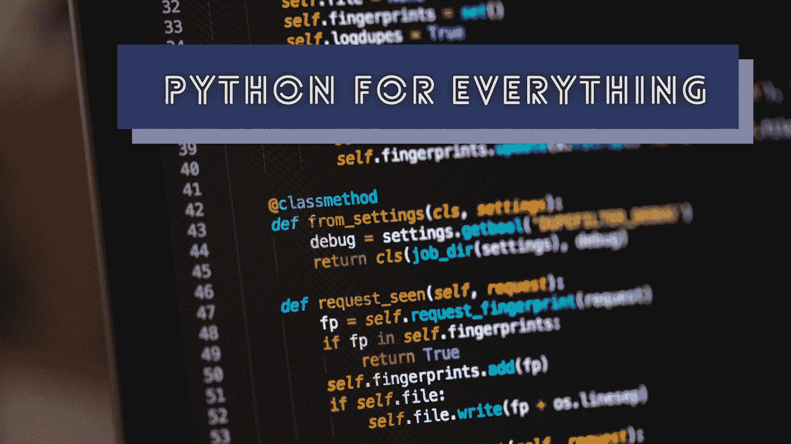

# 只有少数程序员知道的 5 个 Python 用例

> 原文：<https://levelup.gitconnected.com/5-python-use-cases-that-only-a-few-programmers-know-35e25ddf13d4>

## Python 不仅仅用于数据科学和 web 后端——你可以做更多的事情。



克里斯里德在 [Unsplash](https://unsplash.com/s/photos/programmer-python?utm_source=unsplash&utm_medium=referral&utm_content=creditCopyText) 上的照片，由 Canva 编辑。

Python 是一种简单的、开发人员友好的、经过解释的通用编程语言。Python 因为其简单的语法、丰富的库生态系统和高效的开发人员环境而日益受到欢迎。程序员使用 Python 构建 web 后端、实用程序脚本和本地桌面应用程序。如今，Python 在科学工程师、数据分析师、机器学习工程师和数据科学家中非常流行。

当编程语言到达不同的开发者社区时，它们通常会变得更受欢迎。例如，JavaScript 因为电子框架而变得更受欢迎，电子框架允许开发者用 web 前端构建桌面应用。Python 还试图通过 Python 开发者社区所做的令人印象深刻的创新进入新的开发者社区。

现在我们可以使用 Python 来构建任何类似 JavaScript 的东西。然而，大多数开发人员仍然没有意识到这些令人印象深刻的基于 Python 的创新。在这个故事中，我将解释几个鲜为人知的 Python 用例。尝试将 Python 用于这些用例之一，并帮助 Python 更受欢迎。

# 用于创建移动应用的 Python

现在 Dart 和 JavaScript 语言最受青睐于构建跨平台的移动应用程序。换句话说，Flutter 和 React Native 主导了移动应用开发市场。但是，是不是所有 Python 程序员都要学 Dart 或者 JavaScript 才能写移动应用呢？不——Kivy GUI 框架已经可以为 Android 和 iOS 平台开发本地应用了。因此，您可以使用 Python 构建跨平台的移动应用程序。

Kivy 自带了类似于 Flutter 的 widgets 工具包。Kivy 使用 [SDL](https://github.com/libsdl-org/SDL) (简单的 Directmedia 层)在 Android 和 iOS 上渲染 2D 元素，就像 Flutter 使用 Google [Skia](https://github.com/google/skia) 。Kivy 通过 Android 上的 JNI/Cython 和 iOS 上的 Objective-C/Cython 与原生移动 API 进行通信。

像其他移动框架一样，Kivy 也提供工具链来制作特定于平台的应用程序包。此外，你可以在桌面操作系统上运行 Kivy 应用程序。Google Play 和苹果 AppStore 接受基于 Kivy 的[应用](https://github.com/kivy/kivy/wiki/List-of-Kivy-Projects)。如果许多开发人员开始用 Kivy 构建他们的应用程序，它无疑可以与 Flutter 和 React Native 竞争。

# 在浏览器上运行 Python

Python 解释器通常运行在操作系统上。如果需要在 web 浏览器上运行 Python 怎么办？您可能认为我们必须在远程服务器上托管一个 Python 解释器实例，并通过 WebSocket 协议进行通信。是的——大多数在线 Python 解释器都是这么做的。但是现在，你可以通过带有 [Pyodide](https://github.com/pyodide/pyodide) 的浏览器从客户端运行任何 Python 模块。Pyodide 通过 Emscripten 运行 CPython 的 WebAssembly 版本。浏览器的 WebAssembly 实现通常提供一个类似虚拟 CPU 的执行环境。

Emscripten WebAssembly 编译器也支持虚拟内存文件系统。因此，我们也可以在浏览器上运行 Python 文件系统 API 模块。请参见下面的代码片段——它将在浏览器上运行。

```
console.log(pyodide.runPython(`
     import os
     os.makedirs('dir/test')
     print(os.listdir('dir'))
`));
```

上面的代码将与 Emscripten 的虚拟文件系统实现一起工作，并打印以下输出。

```
['test']
```

现在，您可以在 web 浏览器上直接运行科学 Python 代码。Pyodide 支持流行的科学编程库，如 NumPy、pandas、SciPy、Matplotlib 和 scikit-learn。Pydiode Python 实现还提供了一种访问 web APIs 的方法。例如，您可以使用以下 Python 代码显示浏览器警报。

```
import js
js.alert('Hello JavaScript!') # js module refers to window :)
```

现在，如果一个 Python 开发人员用 Python 编写了一个 React 应用程序，这并不神奇。

# 用于编写 Shell 脚本的 Python

系统管理员通常为各种系统维护任务编写 Bash 脚本。开发人员也倾向于使用 Shell 脚本来自动化他们重复且耗时的手动任务，以提高他们的工作效率。一些程序员也使用 Python 编写 Shell 脚本，因为 Bash 没有提供我们需要的现代脚本语言的所有语言特性。

然而，您必须编写比 Bash 更多的代码来处理 Python 中的流程。T4 ShellPy T5 项目为这个问题提供了一个令人印象深刻的解决方案。ShellPy 允许您用 Python 编写类似 Bash 的自动化脚本。看下面这个例子。

```
#!/usr/bin/env shellpyprint('Hello ShellPy')
`
echo "Hello" > test.txt
cat test.txt
`
```

正如您已经注意到的，您可以在同一个 ShellPy 脚本文件中运行 Bash 命令和 Python 片段。您可以使用 Python 处理数据，同时仍然使用 Bash 生成流程。最棒的是，您可以直接将 Bash 命令输出到 Python 变量中。尝试使用 ShellPy 用干净简单的 Python 代码编写下一个自动化脚本。

# 构建 Pythonic 混合桌面应用

原生桌面应用程序开发在技术上很棒，但是我们必须为每个平台维护单独的代码库。所以现在开发者倾向于用跨平台的 app 框架和 GUI 工具包来构建桌面应用。像 Electron 这样的框架提供了一种用 web 前端创建跨平台桌面应用的方法。这些应用程序被称为混合应用程序，因为我们将本地功能嵌入到 web 应用程序中。

基于电子的应用程序通常在后端使用 Node.js 代码。但是，Python 程序员可以通过这两个项目为电子应用后端编写 Python 代码: [python-gui-electron](https://github.com/keybraker/python-gui-electron) 和 [electron-python-example](https://github.com/fyears/electron-python-example) 。

然而，我们都知道，由于嵌入式 Chromium 和 Node.js 的开销，Electron 经常会产生臃肿的软件。作为一种替代方法，您可以使用 [Eel](https://github.com/ChrisKnott/Eel) 框架编写基于 Python 的混合应用程序，并将其作为 Chrome/Chromium 应用程序运行。Eel 通过 WebSocket 连接在 Python 和 Chrome 之间创建了一个通信通道——允许你为应用后端编写 Python 代码。

此外，通过使用 Python 后端，您可以使用 Neutralinojs 构建轻量级和可移植的混合桌面应用程序。

# 以创纪录的时间创建 CLI 程序

当我们为框架和库开发工具时，我们必须构建 CLI 应用程序。例如，Flutter 团队创建了 Flutter CLI 来管理和配置 Flutter 应用程序。我还为我维护的框架创建了一个基于节点的 CLI 程序。此外，我们可以将自动化脚本转换成 CLI 程序来增强可用性。例如，当您向脚本发送特定命令时，可以触发特定的操作或过程。

大多数程序员使用 Node.js 来构建带有 commander.js、ink、oclif 和 chalk 等流行节点模块的 CLI 程序。像 commander.js 这样的库提供了高效的可链接方法 API 来更快地构建 CLI 程序。

Google 开源的 [PythonFire](https://github.com/google/python-fire) 项目为你提供了一种更高效的用 Python 开发 CLI 程序的方法。PythonFire 根据函数定义和参数自动生成 CLI 结构。此外，您可以使用这个库以创纪录的速度将现有的自动化脚本转换为 CLI 程序。一旦您编写了以下代码:

```
import firedef add(a, b):
  return a + bdef sub(a, b):
  return a - bif __name__ == '__main__':
  fire.Fire()
```

您可以使用以下命令来调用这两个函数。

```
./cli.py add 10 5
./cli.py sub 5 2
```

# 结论

现在，每种编程语言都致力于成为 WORA(编写一次，在任何地方运行)。JavaScript 通过覆盖每一个开发者社区而成为头号 WORA 语言。我在下面的故事中进一步解释了这一点:

[](https://medium.com/swlh/sorry-java-write-once-run-anywhere-wora-is-now-javascript-92641161a73f) [## 抱歉 Java，一次编写随处运行(WORA)现在是 JavaScript

### Java 以这样的口号开始了它的旅程:一次编写，随处运行。但是现在，是 JavaScript——不是你，是 Java。

medium.com](https://medium.com/swlh/sorry-java-write-once-run-anywhere-wora-is-now-javascript-92641161a73f) 

Python 是编程世界下一个最大的游戏改变者。它是一种简单的通用语言，更适合处理数据。现在，Python 慢慢进入移动 app 和混合 app 开发。我们还不能预测哪一个会在 WORA 的比赛中表现得更好。2022 年见！

感谢阅读。